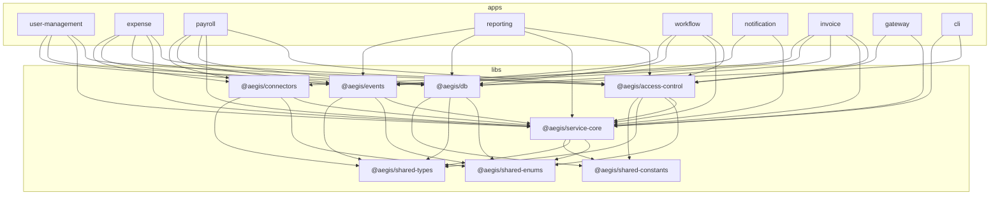
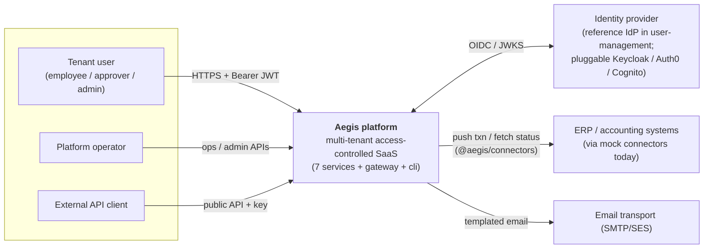
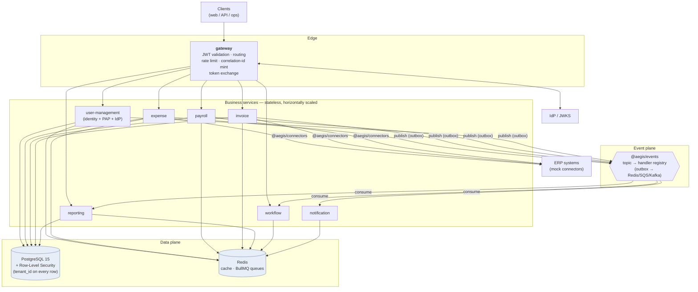
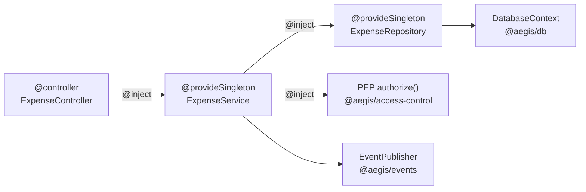
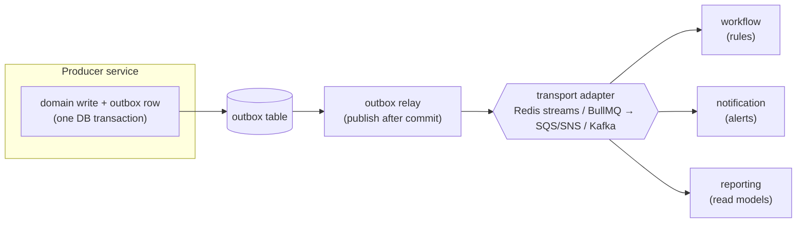
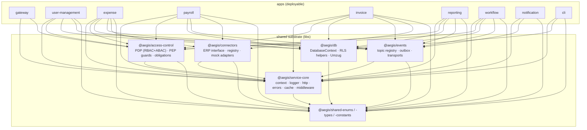

# 01 — Architecture

> Authoritative spec: [`../SPEC.md`](../SPEC.md) (read §10 Amendments first). Conventions and
> provenance: [`../AGENTS.md`](../AGENTS.md). This document gives the high-level shape of the
> platform — the monorepo, the runtime topology, per-service internals, the request lifecycle,
> and the data/event planes. Deeper treatments are cross-linked from each section.

Aegis is an **enterprise access-control system for a multi-tenant, microservices SaaS platform**.
Seven business services share one centralized authorization substrate, one identity system of
record, and one database-enforced tenant-isolation mechanism. The architecture exists to make a
single claim true everywhere: **no request reaches data it is not entitled to**, enforced
independently at the edge, in application code, and in the database.

---

## 1. Design goals (what the architecture optimizes for)

| Goal | Architectural consequence |
|---|---|
| **One access-control story across every service** | A single shared `@aegis/access-control` PDP + PEP guards; no service re-invents authorization. |
| **Tenant isolation that survives application bugs** | PostgreSQL **Row-Level Security** as a backstop under compiled query predicates (defense-in-depth). |
| **Dynamic, runtime-administered policy** | Roles, permissions, and ABAC rules are *data* (PAP CRUD), not redeploys. |
| **Code sharing without coupling** | Nx monorepo: business services are leaves; cross-cutting concerns are libraries with stable contracts. |
| **Distributed-systems soundness** | Explicit request context, correlation-id propagation, signed internal JWTs, transactional outbox eventing. |
| **Scale to thousands of tenants / millions of users** | Stateless services, cacheable fail-closed decisions, connection pooling, horizontal replicas behind the gateway. |
| **Pluggable integrations** | ERP/accounting sync is a `@aegis/connectors` adapter framework with mock connectors, not ad-hoc per-service code. |

---

## 2. The Nx monorepo (apps vs libs)

Aegis is a single **Nx** workspace (`npmScope: aegis`, affected base `main`). Two kinds of
projects live in it:

- **`apps/*`** — deployable units (the seven services + `gateway` + `cli`). Apps may depend on
  libs but **never on each other**; cross-service interaction happens only over HTTP (gateway) or
  the event bus.
- **`libs/*`** — versioned, importable contracts (`@aegis/*`). Libs may depend on other libs in a
  strict acyclic order. Every shared concern (auth, context, DB access, events, enums) lives in a
  lib so all seven services behave identically.

```
aegis/
├── apps/
│   ├── user-management/   # Identity + PAP: tenants, users, memberships, roles, permissions, org hierarchy, teams, invites, sessions, reference IdP
│   ├── expense/           # Expense reports, categories, multi-level approval (header-level; no GL codes / line items)
│   ├── payroll/           # Employees, pay runs, payslips, disbursement ledger, tax config — highest-sensitivity PII
│   ├── reporting/         # CQRS-lite read models, report definitions, scheduling, async export
│   ├── workflow/          # Rules-as-data engine (conditions + actions) triggered by domain events
│   ├── notification/      # In-app + email, templated, idempotent
│   ├── invoice/           # Invoice lifecycle/state machine + header-level reconciliation (duplicate detection, threshold/variance, approval routing)
│   ├── gateway/           # Edge: JWT validation, routing, rate limit, correlation-id minting, token exchange
│   └── cli/               # Migrations / seeders / ops (PROCESS_TYPE=migration)
│
├── libs/
│   ├── service-core/      # @aegis/service-core — RequestContext (AsyncLocalStorage), Logger, ErrorUtils + envelope,
│   │                      #   context-propagating HttpClient, Config/Secrets, CacheAdapter, middleware, bootstrap helpers
│   ├── access-control/    # @aegis/access-control — PDP (RBAC engine + ABAC eval + permission catalog),
│   │                      #   PEP guards (authorize), obligations (column masking)
│   ├── connectors/        # @aegis/connectors — pluggable ERP/accounting framework: connector interface + registry
│   │                      #   + mock adapters (LedgerOne / Finovo / AcctBridge). Consumed by expense/invoice/payroll.
│   ├── shared/
│   │   ├── enums/         # @aegis/shared-enums — <domain>.enum.ts + barrel, HttpHeaderKey, TableName
│   │   ├── types/         # @aegis/shared-types — <domain>.shape.ts namespaces
│   │   └── constants/     # @aegis/shared-constants — per-area Constants classes
│   ├── db/                # @aegis/db — Sequelize connection/adapter, DatabaseContext registry,
│   │                      #   Umzug migrations + seeders, RLS helpers (SET LOCAL), transaction helper
│   ├── events/            # @aegis/events — publish/consume registry, topic enums, transactional outbox, transport adapters
│   └── testing/           # @aegis/testing — context stubs, PDP stubs, fixtures
│
├── docs/                  # this document + siblings (model, multi-tenancy, s2s, deployment, per-service)
├── scripts/start.sh       # PROCESS_TYPE switch: api | worker | migration
├── Dockerfile             # single multi-purpose image
├── docker-compose.yml     # local: postgres (RLS non-owner role) + redis
└── nx.json tsconfig.base.json package.json
```

### Library dependency rules

Path aliases are defined in [`../tsconfig.base.json`](../tsconfig.base.json). The intended
dependency direction is strictly downward — no lib imports an app, and the dependency graph is
acyclic:



> `nx affected` uses this graph: a change to `@aegis/access-control` rebuilds and re-tests every
> dependent service; a change to one app rebuilds only that app. CI gates on the affected set.

---

## 3. System context (C4 Level 1)



Trust boundaries: the **gateway** is the only ingress; the IdP issues tokens; ERPs are reached
only outbound through the connector framework with per-connector credentials. Everything inside
Aegis re-validates tokens (defense-in-depth) rather than trusting the edge alone.

---

## 4. Container view (C4 Level 2 — runtime topology)



Key topology facts:

- **gateway is the single front door.** It validates the user JWT, mints/propagates
  `X-Correlation-Id`, routes to the addressed service, and can perform RFC 8693 token exchange to
  downscope a token for an internal hop.
- **Services are stateless.** All durable state is in PostgreSQL; transient state (cache, queues)
  is in Redis. Any service scales by adding replicas behind the gateway.
- **Writes flow through the event plane asynchronously.** A domain write commits to PostgreSQL and
  enqueues an outbox row in the same transaction; the bus delivers it to `workflow` (rules),
  `notification` (alerts), and `reporting` (read models) — none of which re-derive authority.
- **reporting is read-optimized** (CQRS-lite): it consumes events into denormalized read models
  and never bypasses RLS or the access scope.

---

## 5. Per-service internal layering

Every business service follows the same layered shape (`Controller → Service → Repository →
Model`), wired by **InversifyJS** dependency injection. This uniformity is what lets the
access-control story stay identical across services.

```
apps/<svc>/src/
├── index.ts            # thin entry: reflect-metadata, env, telemetry → bootstrap
├── bootstrap.ts        # composition root: build app, middleware chain, connect DB/cache/bus
├── ioc/                # Inversify container + provideSingleton helper + loader
├── controllers/        # @controller + @httpGet/Post (inversify-express-utils); HTTP boundary only
├── services/           # @provideSingleton business logic; extends BaseService
├── repositories/       # @provideSingleton DALs; Sequelize via DatabaseContext + tenant from RequestContext
├── models/             # Sequelize model definitions (registered into @aegis/db context)
├── interfaces/         # pure TS contracts (typing only — NOT DI tokens)
├── validators/         # Joi request schemas
└── constants/          # service-local Constants classes
```

### Responsibilities by layer

| Layer | Owns | Must NOT |
|---|---|---|
| **Controller** | HTTP shape: validate (Joi), call one service method, serialize a DTO. Wrapped `authenticate → authorize(permission) → handler`. | Contain business logic or touch Sequelize. |
| **Service** | Business rules, orchestration, transactions, event publication, audit emission. | Parse HTTP or build SQL by hand. |
| **Repository** | Data access via `@aegis/db` `DatabaseContext`; reads tenant from `RequestContext`; compiles scope predicates. | Make authorization decisions (that is the PDP's job). |
| **Model** | Sequelize table definition (`tenant_id`, UUID PKs, `underscored`, money in minor units). | Hold behavior. |

### Dependency injection

The DI idiom is a `provideSingleton(Class)` decorator (Inversify + `inversify-binding-decorators`)
plus `inversify-express-utils` `@controller`. DI tokens are **concrete classes**, not interface
symbols; `interfaces/` is typing-only. Each service has its own container built in `bootstrap.ts`;
controllers are auto-discovered, services and repositories self-register by decorator.



> See [`05-service-internals.md`](05-service-internals.md) for the bootstrap sequence, container
> wiring, and base classes; [`03-access-control.md`](03-access-control.md) for the PDP/PEP detail.

---

## 6. Request lifecycle (gateway → service → PDP → RLS → handler)

A read of a single expense report illustrates every cross-cutting layer firing in order. The
verdict is enforced **three** times: at the edge (authentication), in the PEP (authorization +
obligations), and in the database (RLS).

```mermaid
sequenceDiagram
    autonumber
    participant Client
    participant GW as gateway
    participant CtxMW as Context middleware<br/>(@aegis/service-core)
    participant PEP as PEP authorize()<br/>(@aegis/access-control)
    participant PDP as PDP decide()<br/>(@aegis/access-control)
    participant PIP as PIP (attrs, cached)
    participant H as Controller→Service
    participant Repo as Repository
    participant DB as PostgreSQL (RLS)

    Client->>GW: GET /expense/reports/:id  (Bearer JWT)
    GW->>GW: validate JWT (JWKS) · mint X-Correlation-Id · route
    GW->>CtxMW: forward + X-Tenant-Id, X-Correlation-Id, X-Trace-Id, X-Caller, internal JWT
    CtxMW->>CtxMW: re-validate token (aud) · STRICT header validation (fail-closed)
    CtxMW->>CtxMW: populate RequestContext (AsyncLocalStorage):<br/>tenantId, userId, roles, correlationId, traceId, sourceService
    CtxMW->>PEP: authenticate ✓ → authorize("expense.report.read", {resourceLoader})
    PEP->>PIP: fetch principal + resource attributes
    PIP-->>PEP: role, memberships, hierarchy, resource owner/amount/status
    PEP->>PDP: decide(principal, action, resource, context)
    PDP-->>PEP: { allow:true, obligations:[mask:bank_account], scope:OwnAndTeam }
    PEP->>H: pass (attach obligations + scope predicate)
    H->>Repo: getReport(id) with scope predicate
    Repo->>DB: BEGIN; SET LOCAL app.current_tenant = $tenantId
    Repo->>DB: SELECT ... WHERE id=$id AND (scope predicate)
    DB-->>Repo: row(s) — RLS RESTRICTIVE policy filters by app.current_tenant
    Repo-->>H: model
    H->>H: apply obligations (mask masked columns) · serialize DTO
    H-->>Client: 200 { data } (+ audit entry emitted, correlationId stamped)
```

What each enforcement point guarantees:

1. **Gateway / context middleware (authn):** the token is genuine, unexpired, audience-correct;
   required headers are present and well-formed — missing/malformed values are **rejected
   fail-closed**, never defaulted to `"UNKNOWN"`. There is no `entryContext`.
2. **PEP + PDP (authz):** RBAC answers "does the role grant `expense.report.read`?"; ABAC refines
   with conditions (own/team scope, amount/status); the PDP returns a fail-closed verdict plus
   **obligations** (column masking) and the **row-level scope** to compile into the query.
3. **PostgreSQL RLS (isolation backstop):** even if a query predicate were wrong, the
   `RESTRICTIVE` policy keyed on `app.current_tenant` (set via `SET LOCAL` inside the transaction;
   the app role is a non-owner without `BYPASSRLS`) makes cross-tenant rows invisible.

> Full propagation contract (`X-Correlation-Id` vs `X-Trace-Id`, internal JWT, `X-Source-Service`,
> token exchange) is in [`06-service-to-service.md`](06-service-to-service.md). RLS mechanics are
> in [`04-multi-tenancy.md`](04-multi-tenancy.md).

---

## 7. Data plane

- **PostgreSQL 15** is the single relational store, accessed through `@aegis/db` (Sequelize 6 +
  `pg`). One `DatabaseContext` registry instantiates every model and its associations; repositories
  reach data only through it.
- **Tenant isolation** is shared-DB pooled: every tenant-scoped table carries `tenant_id NOT NULL`
  and an RLS policy. The application connects as a **non-owner role without `BYPASSRLS`**;
  `FORCE ROW LEVEL SECURITY` + a `RESTRICTIVE` policy mean even the table owner's app role cannot
  read across tenants. Each request transaction issues `SET LOCAL app.current_tenant = <id>`.
- **Migrations** are **Umzug** code-first numbered files (`NNNN_subject.ts` with `{name, up,
  down}`), run as a one-shot task (`PROCESS_TYPE=migration`) — never `sequelize.sync()` at runtime.
- **Redis** backs the decision/attribute cache and **BullMQ** queues (reporting exports, workflow,
  scheduled jobs). Cache keys for reporting include the access scope so authorization never leaks
  across users.
- **Conventions:** UUID v4 PKs; money in integer minor units; `created_at`/`updated_at` with
  `underscored: true`; table names from the `TableName` enum.

> Schema detail: [`07-data-models.md`](07-data-models.md). Isolation detail:
> [`04-multi-tenancy.md`](04-multi-tenancy.md).

---

## 8. Event plane

`@aegis/events` is a transport-abstracted publish/consume registry: a **topic enum** maps to
handlers, with an inline-when-sync / queue-when-async toggle and **transactional outbox**
semantics so a domain write and its event are committed atomically.



- **Producers** (expense, invoice, payroll, user-management) write a domain change and an outbox
  row in the same transaction; the relay publishes only after commit (no lost or phantom events).
- **Consumers** (workflow, notification, reporting) handle **already-authorized** events and never
  re-derive authority — this closes the ambient-authority gap (notification in particular only
  reacts to events that were already permitted upstream).
- The transport is swappable behind one adapter interface: Redis/BullMQ locally, SQS/SNS or Kafka
  in production, with no change to producer/consumer code.

---

## 9. Tech stack

| Concern | Choice | Notes |
|---|---|---|
| Language / runtime | **TypeScript 5.x** on **Node 20+ (LTS)**, strict mode | `target es2021`, CommonJS, decorators enabled |
| Monorepo / build | **Nx 19** (affected builds + cache) | `npmScope: aegis`, affected base `main` |
| HTTP framework | **Express 4** via `inversify-express-utils` | controllers as `@controller` classes |
| Dependency injection | **InversifyJS 6** + `inversify-binding-decorators` | `provideSingleton(Class)`; concrete-class tokens |
| ORM / database | **Sequelize 6** + `pg` → **PostgreSQL 15+** | RLS for tenant isolation |
| Migrations | **Umzug 3** (code-first) | one-shot task, not runtime sync |
| Cache / queue | **Redis** (`ioredis`) + **BullMQ** | decision cache, async/scheduled jobs |
| Validation | **Joi** (request) | shape validators where helpful |
| AuthN | `jsonwebtoken` + **JWKS** (`jwks-rsa`), RS256/ES256 | pluggable IdP adapters |
| AuthZ | in-house **`@aegis/access-control`** (RBAC + ABAC, PDP/PEP) | OPA/Cerbos (stateless PDP), OpenFGA/SpiceDB (ReBAC), CASL documented as alternatives |
| Eventing | abstracted **`@aegis/events`** bus | Redis/BullMQ local; SQS/SNS or Kafka in prod |
| ERP connectors | **`@aegis/connectors`** (adapter + registry) | mock connectors: `LedgerOne` / `Finovo` / `AcctBridge` |
| Observability | **OpenTelemetry** (traces/metrics/logs), **pino** structured logs | correlation-id stitched, health endpoints |
| Security | helmet, CORS, signed internal JWT, field encryption (AES-256, payroll) | mTLS/SPIFFE-ready s2s |
| Testing | **Jest** + `ts-jest`, **supertest** for HTTP | per-lib unit tests + coverage gates |
| Packaging / deploy | multi-stage **Docker** single image, `PROCESS_TYPE` switch, GitLab CI | immutable SHA-image promotion; ECS/K8s target |

> Build/deploy specifics (single image, `PROCESS_TYPE` entrypoint, SHA promotion, health/readiness)
> are in [`08-deployment.md`](08-deployment.md).

---

## 10. Component view — shared substrate (C4 Level 3)

All seven services plus the gateway and cli consume the same libraries. This is the diagram that
makes the "one access-control substrate" claim concrete: the boxes on the left differ only in
domain logic; everything load-bearing for security and isolation is shared.



| Lib | Provides | Consumed by |
|---|---|---|
| **`@aegis/service-core`** | RequestContext (AsyncLocalStorage), Logger, ErrorUtils + error envelope, context-propagating HttpClient, Config/Secrets, CacheAdapter, context/auth/error/audit middleware, bootstrap helpers | all apps |
| **`@aegis/access-control`** | PDP `decide()` (RBAC engine + ABAC eval + permission catalog), PEP `authorize()` guards, obligations (masking) | gateway + all 6 data-bearing services |
| **`@aegis/connectors`** | ERP connector interface, adapter/strategy registry, per-connector config, mock connectors (LedgerOne/Finovo/AcctBridge) | expense, invoice, payroll |
| **`@aegis/db`** | DatabaseContext model registry, connection/adapter, RLS helpers (`SET LOCAL`), transaction helper, Umzug migrations/seeders | services that own tables + cli |
| **`@aegis/events`** | publish/consume registry, topic enums, transactional outbox, transport adapters | producers + consumers |
| **`@aegis/shared-*`** | enums (`HttpHeaderKey`, `TableName`, domain enums), shape types, per-area Constants | everything |

---

## 11. Non-functional posture (scale, security, reliability)

Aegis targets **thousands of tenants and millions of users** on a shared pooled database. The
architecture meets that through the following postures:

- **Scalability.** Services are stateless and horizontally replicated behind the gateway. PDP
  decisions are pure and **cacheable** (keyed by principal + action + resource attributes, with
  fail-closed defaults), so the common path is a cache hit, not a policy recompute. PostgreSQL is
  reached through pooled connections; read-heavy reporting runs off CQRS-lite read models and
  materialized rollups rather than hitting transactional tables.
- **Tenant isolation at scale.** `tenant_id` + RLS scales to many tenants in one database without
  per-tenant schemas; a silo tier (schema/DB-per-tenant) is offered as a premium option, with
  payroll the first candidate given its PII sensitivity.
- **Security.** Three independent enforcement layers (edge authn, PEP authz, DB RLS); short-lived
  RS256/ES256 tokens re-validated per service; signed internal JWTs + origin gate + typed
  `X-Source-Service` for service-to-service calls; AES-256 field encryption and maker-checker
  segregation of duties in payroll; hybrid hash-chained tamper-evident audit capturing actor,
  tenant, intent, decision, and permissions-at-time-of-action.
- **Reliability & consistency.** Transactional outbox guarantees a domain write and its event
  commit together; idempotency keys on connector pushes and notification sends prevent duplicate
  side effects; readiness probes gate traffic until DB/cache/bus are ready.
- **Observability.** Every log/trace/audit entry carries `X-Correlation-Id`, so one business
  request is reconstructable across all service hops and async messages; OpenTelemetry exports
  traces/metrics/logs to a collector.

---

## 12. Where to go next

| Topic | Document |
|---|---|
| Access-control model (PDP/PEP/PAP/PIP, RBAC + ABAC + scope) | [`03-access-control.md`](03-access-control.md) |
| Multi-tenancy & Row-Level Security mechanics | [`04-multi-tenancy.md`](04-multi-tenancy.md) |
| Per-service internals (bootstrap, DI, base classes) | [`05-service-internals.md`](05-service-internals.md) |
| Service-to-service & context propagation | [`06-service-to-service.md`](06-service-to-service.md) |
| Data models | [`07-data-models.md`](07-data-models.md) |
| Deployment & ops | [`08-deployment.md`](08-deployment.md) |
| ERP connector framework | [`services/`](services/) + [`../SPEC.md`](../SPEC.md) §10.3 |
