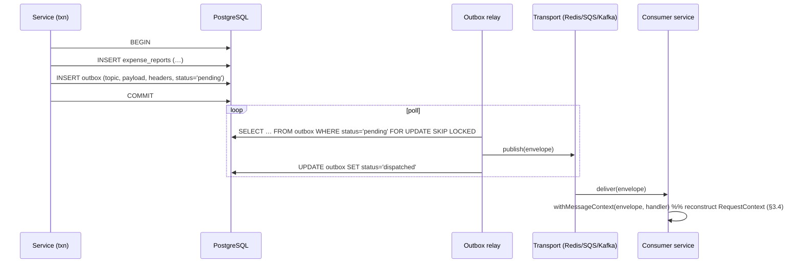

# 02 — Engineering Patterns

> The concrete, code-level conventions every Aegis service follows. This document is the
> "how we build a service" companion to [`ARCHITECTURE.md`](ARCHITECTURE.md) (the *what*)
> and [`03-access-control.md`](03-access-control.md) (the PDP/PEP model). It is normative: a
> service that does not follow these patterns is not "done" (see
> [`SPEC.md`](../SPEC.md) §8 and [`AGENTS.md`](../AGENTS.md) §8).

Every business service (`user-management`, `expense`, `payroll`, `reporting`, `workflow`,
`notification`, `invoice`) plus the `gateway` and `cli` share **one** internal anatomy, **one**
cross-cutting library (`@aegis/service-core`), **one** access-control library
(`@aegis/access-control`), and the **same** flat enums/types/constants libraries. The result is
that a developer who knows one service knows all of them, and a cross-cutting concern
(context, errors, audit, RLS) is fixed in exactly one place.

The patterns below are distilled from two internal references — a layered Express+InversifyJS
service skeleton and an Nx monorepo with a flat enum/shape/factory organization — re-implemented
from scratch under the `@aegis/*` scope with their proprietary, branded infrastructure replaced
by clean open primitives (notably **AsyncLocalStorage** in place of `cls-hooked`, and a
**fail-closed header validator** in place of the reference's permissive `'UNKNOWN'` defaulting).

---

## Table of contents

1. [Dependency injection — InversifyJS](#1-dependency-injection--inversifyjs)
2. [Layering — Controller / Service / Repository / Interface](#2-layering--controller--service--repository--interface)
3. [Request context — AsyncLocalStorage + strict header validation](#3-request-context--asynclocalstorage--strict-header-validation)
4. [Typed errors + single error middleware + envelope](#4-typed-errors--single-error-middleware--envelope)
5. [`@aegis/service-core` — module list](#5-aegisservice-core--module-list)
6. [Enum organization](#6-enum-organization)
7. [Shape / type namespaces](#7-shape--type-namespaces)
8. [Constants classes](#8-constants-classes)
9. [Event bus — publish/consume + transactional outbox](#9-event-bus--publishconsume--transactional-outbox)
10. [Migrations — Umzug code-first](#10-migrations--umzug-code-first)
11. [Adapter / strategy — `@aegis/connectors`](#11-adapter--strategy--aegisconnectors)
12. [Per-service images + `PROCESS_TYPE`](#12-per-service-images--process_type)

---

## 1. Dependency injection — InversifyJS

Aegis uses **InversifyJS** with **`inversify-binding-decorators`** and **`inversify-express-utils`**.
Three rules make the whole graph predictable:

1. **The class is its own DI token** (class-as-token). We do not maintain a parallel set of
   `Symbol` identifiers. `@inject(ExpenseService)` resolves the `ExpenseService` class.
2. **Everything is a singleton** via a project-wide `provideSingleton` helper. Services and
   repositories are stateless (all per-request state lives in the request context, §3), so a
   single instance is safe and avoids per-request construction.
3. **Interfaces are typing-only** — they are TypeScript contracts (`interfaces/`), never DI
   tokens. Erased types cannot be injected; bind the concrete class.

### 1.1 The container and `provideSingleton`

```typescript
// apps/<svc>/src/ioc/ioc.ts
import { Container } from 'inversify';
import { fluentProvide } from 'inversify-binding-decorators';

export const container = new Container({ defaultScope: 'Singleton' });

/**
 * Decorator that registers a class as a singleton bound to *itself*.
 * Usage: @provideSingleton(ExpenseService) export class ExpenseService { … }
 */
export function provideSingleton<T>(identifier: new (...args: never[]) => T) {
  return fluentProvide(identifier).inSingletonScope().done();
}
```

```typescript
// apps/<svc>/src/ioc/loader.ts — the IoC loader, imported once from bootstrap
import { buildProviderModule } from 'inversify-binding-decorators';
import { container } from './ioc';

import '../controllers';   // side-effect: @controller decorators self-register
import '../services';      // side-effect: @provideSingleton decorators register bindings
import '../repositories';

container.load(buildProviderModule()); // collect every fluentProvide(...) binding
```

### 1.2 Controllers via `inversify-express-utils`

Controllers are thin: they validate input (Joi, §8), call a service, and serialize a DTO. The
PEP guard `authorize(...)` (from `@aegis/access-control`) sits on **every** route between
`authenticate` and the handler.

```typescript
// apps/expense/src/controllers/expense-report.controller.ts
import { controller, httpGet, httpPost, requestBody, requestParam } from 'inversify-express-utils';
import { inject } from 'inversify';
import { authenticate, authorize } from '@aegis/access-control';
import { Permission } from '@aegis/shared-enums';
import { ExpenseReportService } from '../services/expense-report.service';
import { createReportSchema } from '../validators/expense-report.validator';
import { validate } from '@aegis/service-core';

@controller('/v1/expense-reports')
export class ExpenseReportController {
  constructor(
    @inject(ExpenseReportService) private readonly reports: ExpenseReportService,
  ) {}

  @httpPost('/', authenticate, authorize(Permission.ExpenseReportCreate), validate(createReportSchema))
  async create(@requestBody() body: unknown) {
    const dto = await this.reports.create(body); // tenantId/userId come from context, never the body
    return { data: dto };
  }

  @httpGet('/:id', authenticate, authorize(Permission.ExpenseReportRead))
  async getOne(@requestParam('id') id: string) {
    return { data: await this.reports.findById(id) };
  }
}
```

The `@aegis/access-control` PEP, the request-context middleware, and the error middleware are
registered in `bootstrap.ts` (the composition root) in a fixed order — see §3.3 and §4.2. The DI
container is handed to `InversifyExpressServer(container)` there.

---

## 2. Layering — Controller / Service / Repository / Interface

Each service is four layers with strict, one-directional dependencies:

```mermaid
flowchart LR
  HTTP[HTTP route] --> C[Controller<br/>inversify-express-utils]
  C --> S[Service<br/>business logic, extends BaseService]
  S --> R[Repository / DAL<br/>Sequelize via DatabaseContext]
  R --> DB[(PostgreSQL + RLS)]
  S -. reads .-> CTX[RequestContext<br/>tenantId / userId / roles]
  R -. SET LOCAL app.current_tenant .-> DB
  S --> PDP[PDP decide&#40;&#41;<br/>@aegis/access-control]
  classDef iface fill:#eef,stroke:#88a;
  I[Interfaces<br/>typing only]:::iface
  C -.-> I
  S -.-> I
  R -.-> I
```

| Layer | Folder | Responsibility | Rules |
|---|---|---|---|
| **Controller** | `controllers/` | HTTP shape only: bind route, run guard, validate, serialize DTO. | No business logic, no SQL. One `@controller` class per resource. |
| **Service** | `services/` | Business logic, orchestration, ABAC checks, audit emission, events. | `@provideSingleton`, extends `BaseService`. Never touches Sequelize directly. |
| **Repository (DAL)** | `repositories/` | Data access via `DatabaseContext`; tenant comes from context. | `@provideSingleton`. Returns models/rows; no HTTP concepts. |
| **Interface** | `interfaces/` | Pure TS contracts (DTOs, kwargs, service shapes). | Typing only — never a DI token. |
| **Models** | `models/` | Sequelize model definitions, registered into `@aegis/db`. | `tenant_id NOT NULL` on tenant-scoped tables; `underscored: true`. |
| **Validators** | `validators/` | Joi schemas. | One schema per write endpoint. |
| **Constants** | `constants/` | Service-local `Constants` classes (§8). | Cross-service constants go in `@aegis/shared-constants`. |

```typescript
// services/expense-report.service.ts — extends a shared BaseService from @aegis/service-core
import { inject } from 'inversify';
import { provideSingleton } from '../ioc/ioc';
import { BaseService, RequestContext } from '@aegis/service-core';
import { decide } from '@aegis/access-control';
import { ResourceType, Permission } from '@aegis/shared-enums';
import { ExpenseReportRepository } from '../repositories/expense-report.repository';

@provideSingleton(ExpenseReportService)
export class ExpenseReportService extends BaseService {
  constructor(
    @inject(ExpenseReportRepository) private readonly repo: ExpenseReportRepository,
  ) { super(); }

  async approve(reportId: string): Promise<void> {
    const ctx = RequestContext.get();              // tenantId, userId, roles — never function args
    const report = await this.repo.findById(reportId);

    // ABAC: approver in own tenant, within approval limit — evaluated by the PDP
    const verdict = await decide({
      principal: { userId: ctx.userId, roles: ctx.roles, tenantId: ctx.tenantId },
      action: Permission.ExpenseReportApprove,
      resource: { type: ResourceType.ExpenseReport, ownerId: report.ownerId, amount: report.totalMinor },
    });
    if (!verdict.allow) this.forbidden(verdict.reason); // BaseService → typed ForbiddenError

    await this.repo.setStatus(reportId, 'approved');
    await this.audit('expense.report.approve', { reportId }); // hash-chained audit
    await this.publish('expense.report.approved', { reportId, tenantId: ctx.tenantId });
  }
}
```

```typescript
// repositories/expense-report.repository.ts — tenant is implicit, taken from context
import { provideSingleton } from '../ioc/ioc';
import { DatabaseContext, RequestContext } from '@aegis/service-core';
import { TableName } from '@aegis/shared-enums';

@provideSingleton(ExpenseReportRepository)
export class ExpenseReportRepository {
  async findById(id: string) {
    const { tenantId } = RequestContext.get();
    // runInTenant issues SET LOCAL app.current_tenant within the txn → RLS is enforced even
    // if this predicate were forgotten (defense in depth). See 04-multi-tenancy.md.
    return DatabaseContext.runInTenant(tenantId, (models) =>
      models[TableName.ExpenseReports].findOne({ where: { id, tenantId } }),
    );
  }
}
```

The repository never receives `tenantId` as an argument and never trusts a body field for it —
**the tenant is always derived from the request context**, and Postgres RLS backstops it.

---

## 3. Request context — AsyncLocalStorage + strict header validation

A per-request store carries the ambient identity of the call so that services and repositories
do not have to thread `tenantId` / `userId` through every signature. The reference implementations
used `cls-hooked`; Aegis re-implements the *same getter surface* over Node's built-in
**`AsyncLocalStorage`** (faster, no monkey-patching, native to current LTS).

### 3.1 The context shape

Per [`SPEC.md`](../SPEC.md) §6, the context carries exactly these fields — and **no `entryContext`**
(a donor-domain concept, deliberately dropped):

```typescript
// @aegis/service-core — context/request-context.ts
export interface AegisRequestContext {
  tenantId: string;       // organization / isolation boundary (UUID)
  userId: string;         // acting principal (UUID); the system principal for internal calls
  roles: string[];        // role names resolved for (userId, tenantId)
  correlationId: string;  // business-request id, minted at the gateway, propagated unchanged
  traceId: string;        // OpenTelemetry trace/span id (distinct from correlationId)
  caller: string;         // immediate upstream (e.g. 'gateway', 'expense')
  sourceService: SourceService; // typed enum: which service *originated* the chain (audit attribution)
}
```

> **`correlationId` vs `traceId`.** `X-Correlation-Id` is one id per inbound *business* request,
> minted at the **gateway** and forwarded unchanged across every service hop and async message so
> all logs/traces/audit rows for one logical operation stitch together. `X-Trace-Id` is the OTel
> span id. There is **no** `X-Trend` / `X-Tracker` header in Aegis.

### 3.2 The store

```typescript
// @aegis/service-core — context/request-context.ts
import { AsyncLocalStorage } from 'node:async_hooks';

const als = new AsyncLocalStorage<AegisRequestContext>();

export const RequestContext = {
  /** Run `fn` with `ctx` as the ambient context for the whole async subtree. */
  run<T>(ctx: AegisRequestContext, fn: () => T): T {
    return als.run(ctx, fn);
  },
  /** Get the current context, or throw — callers must run inside a context. */
  get(): AegisRequestContext {
    const ctx = als.getStore();
    if (!ctx) throw new ContextNotInitializedError(); // fail-closed: never invent a tenant
    return ctx;
  },
  /** Convenience accessors used in hot paths. */
  tenantId(): string { return RequestContext.get().tenantId; },
  correlationId(): string { return RequestContext.get().correlationId; },
};
```

### 3.3 HTTP ingress + STRICT HEADER VALIDATION (fail-closed)

The context middleware reads the propagated headers (centralized in `HttpHeaderKey`, §6), and —
unlike the permissive reference, which defaulted missing values to the string `'UNKNOWN'` —
Aegis **asserts every required header and rejects the request `fail-closed`** if any is missing or
malformed. A request that cannot prove its tenant/user **never enters the application** with a
guessed identity.

```typescript
// @aegis/service-core — middleware/context.middleware.ts
import { RequestHandler } from 'express';
import { RequestContext } from '../context/request-context';
import { HttpHeaderKey } from '@aegis/shared-enums';
import { ContextValidationError } from '../errors';
import { isUuid } from '../validation';

/** Required propagated headers for an authenticated, tenant-scoped request. */
const REQUIRED = [HttpHeaderKey.TenantId, HttpHeaderKey.UserId, HttpHeaderKey.CorrelationId] as const;

export const contextMiddleware: RequestHandler = (req, _res, next) => {
  // 1. Assert presence — fail-closed. No defaulting to 'UNKNOWN'.
  for (const key of REQUIRED) {
    const value = req.header(key);
    if (!value || !value.trim()) {
      return next(new ContextValidationError(`missing required header: ${key}`));
    }
  }
  // 2. Assert shape — malformed ids are rejected, not coerced.
  const tenantId = req.header(HttpHeaderKey.TenantId)!;
  const userId = req.header(HttpHeaderKey.UserId)!;
  if (!isUuid(tenantId) || !isUuid(userId)) {
    return next(new ContextValidationError('malformed tenant or user id'));
  }

  const ctx: AegisRequestContext = {
    tenantId,
    userId,
    roles: parseCsv(req.header(HttpHeaderKey.Roles)),
    correlationId: req.header(HttpHeaderKey.CorrelationId)!,
    traceId: req.header(HttpHeaderKey.TraceId) ?? newTraceId(),
    caller: req.header(HttpHeaderKey.Caller) ?? 'unknown',
    sourceService: parseSourceService(req.header(HttpHeaderKey.SourceService)),
  };

  // 3. Bind the context for the rest of the async subtree.
  RequestContext.run(ctx, () => next());
};
```

`ContextValidationError` is a typed error (§4) that the single error middleware renders as a
`401`/`400` envelope — there is no code path that lets an under-specified request reach a handler.

### 3.4 Worker / event ingress — the same context, populated differently

Background workers (BullMQ jobs, event-bus consumers, scheduled report runs) have **no Express
request** — but they must run under the **identical** `RequestContext` so that repositories enforce
the right tenant and audit rows attribute the right actor. Instead of reading HTTP headers, the
worker reconstructs the context from the **message envelope headers** (which the publisher stamped
from *its* context, §9), and validates them with the same fail-closed rules.

```typescript
// @aegis/service-core — context/worker-context.ts
import { RequestContext } from './request-context';
import { ContextValidationError } from '../errors';

/** Wrap a consumer handler so it runs inside a reconstructed RequestContext. */
export function withMessageContext<T>(envelope: MessageEnvelope, handler: () => Promise<T>): Promise<T> {
  const h = envelope.headers;
  if (!h.tenantId || !h.userId || !h.correlationId) {
    // Same fail-closed contract as HTTP: a message that cannot prove its tenant is dead-lettered.
    throw new ContextValidationError('message envelope missing required context headers');
  }
  return RequestContext.run(
    {
      tenantId: h.tenantId,
      userId: h.userId,                       // the original actor, propagated for attribution
      roles: h.roles ?? [],
      correlationId: h.correlationId,         // same business-request id as the originating HTTP call
      traceId: h.traceId ?? newTraceId(),
      caller: h.sourceService,
      sourceService: h.sourceService,
    },
    handler,
  );
}
```

The contract is symmetric: **every entrypoint** (HTTP, worker, migration task, cron) establishes a
fully-validated `RequestContext` before any business code runs, and **no** code path defaults a
missing tenant/user. Logger child-bindings (`correlationId`, `tenantId`) read from the same store,
so every log line for one business request is greppable by `correlationId`.

---

## 4. Typed errors + single error middleware + envelope

### 4.1 Typed errors via `ErrorUtils`

Errors are **typed**, created through an `ErrorUtils` factory (no `throw new Error('...')` in
business code). Each carries an HTTP status, a stable machine `code`, a `type`, optional structured
`details`, and the request's `traceId`.

```typescript
// @aegis/service-core — errors/index.ts
export class AegisError extends Error {
  constructor(
    readonly status: number,        // HTTP status
    readonly code: string,          // stable machine code, e.g. 'EXPENSE_REPORT_NOT_FOUND'
    readonly type: ErrorType,       // VALIDATION | NOT_FOUND | FORBIDDEN | CONFLICT | SYSTEM | ...
    message: string,
    readonly details?: unknown,
  ) { super(message); }
}

export const ErrorUtils = {
  validation: (msg: string, details?: unknown) => new AegisError(400, 'VALIDATION_ERROR', ErrorType.Validation, msg, details),
  unauthorized: (msg = 'Unauthenticated') => new AegisError(401, 'UNAUTHENTICATED', ErrorType.Unauthenticated, msg),
  forbidden: (msg: string, details?: unknown) => new AegisError(403, 'FORBIDDEN', ErrorType.Forbidden, msg, details),
  notFound: (msg: string, details?: unknown) => new AegisError(404, 'NOT_FOUND', ErrorType.NotFound, msg, details),
  conflict: (msg: string, details?: unknown) => new AegisError(409, 'CONFLICT', ErrorType.Conflict, msg, details),
  system: (msg = 'Internal error', details?: unknown) => new AegisError(500, 'SYSTEM_ERROR', ErrorType.System, msg, details),
};

// Specializations used by the context layer (§3) — same shape, narrower meaning:
export class ContextValidationError extends AegisError {
  constructor(msg: string) { super(401, 'CONTEXT_INVALID', ErrorType.Unauthenticated, msg); }
}
```

`BaseService` exposes thin helpers (`this.notFound(...)`, `this.forbidden(...)`) that throw these,
so service code reads declaratively. Repositories translate known Sequelize failures (unique
violation → `conflict`, etc.) into typed errors.

### 4.2 The single error middleware and the `{ errors: [...] }` envelope

There is exactly **one** Express error handler, registered **last** in the middleware chain. It is
the only place that turns a thrown error into an HTTP response, so the contract is uniform across
all nine apps.

```typescript
// @aegis/service-core — middleware/error.middleware.ts
import { ErrorRequestHandler } from 'express';
import { AegisError, ErrorType } from '../errors';
import { RequestContext } from '../context/request-context';
import { logger } from '../logging';

export const errorMiddleware: ErrorRequestHandler = (err, _req, res, _next) => {
  const e: AegisError = err instanceof AegisError ? err : ErrorUtils.system(err?.message);
  const traceId = safe(() => RequestContext.get().traceId);

  logger.error({ err: e, code: e.code, type: e.type, traceId }, e.message);

  res.status(e.status).json({
    errors: [
      {
        code: e.code,
        type: e.type,
        message: e.type === ErrorType.System ? 'Something went wrong.' : e.message, // never leak internals on 5xx
        details: e.type === ErrorType.Validation ? e.details : undefined,
        traceId,
      },
    ],
  });
};
```

The wire contract (also in [`SPEC.md`](../SPEC.md) §9) is a stable **array** envelope so multiple
validation failures can be returned together:

```json
{
  "errors": [
    {
      "code": "VALIDATION_ERROR",
      "type": "VALIDATION",
      "message": "amount must be a positive integer",
      "details": [{ "path": "amount", "message": "must be > 0" }],
      "traceId": "0af7651916cd43dd8448eb211c80319c"
    }
  ]
}
```

Middleware registration order in `bootstrap.ts` (the composition root):

```mermaid
flowchart LR
  A[request] --> B[context.middleware<br/>strict header validation]
  B --> C[authenticate<br/>JWKS / session]
  C --> D[authorize&#40;permission&#41;<br/>PEP → PDP]
  D --> E[validate&#40;schema&#41;<br/>Joi]
  E --> F[controller handler]
  F --> G[audit middleware]
  G --> H[error.middleware<br/>registered LAST]
```



---

## 5. `@aegis/service-core` — module list

`@aegis/service-core` is the de-branded re-implementation of the reference's proprietary
infrastructure package. It owns every cross-cutting concern so the nine apps stay thin. (Modeled
on the available cross-cutting reference's `utils/{context,middleware}` per [`SPEC.md`](../SPEC.md)
§10.2; re-implemented over AsyncLocalStorage with fail-closed header validation added.)

```
libs/service-core/src/
├── context/
│   ├── request-context.ts      # AegisRequestContext + AsyncLocalStorage store (§3)
│   ├── worker-context.ts       # withMessageContext for non-HTTP entrypoints (§3.4)
│   └── base-service.ts         # BaseService: ctx accessors, audit(), publish(), error helpers
├── middleware/
│   ├── context.middleware.ts   # strict header validation, fail-closed (§3.3)
│   ├── auth.middleware.ts       # authenticate: JWKS verify + aud check + session row check
│   ├── error.middleware.ts     # single error handler + {errors:[…]} envelope (§4.2)
│   ├── audit.middleware.ts      # request/response audit hooks → hash-chained audit feed
│   └── validate.ts              # validate(schema): Joi → ErrorUtils.validation
├── errors/
│   └── index.ts                 # AegisError, ErrorType, ErrorUtils factory (§4.1)
├── logging/
│   └── index.ts                 # structured pino logger + correlationId/tenantId child binding
├── http/
│   └── http-client.ts           # context-propagating HttpClient: stamps X-Tenant-Id /
│                                #   X-Correlation-Id / X-Trace-Id / X-Caller / X-Source-Service
│                                #   + signed internal JWT + X-Internal-Origin (s2s, see 06-s2s.md)
├── config/
│   ├── config.ts                # typed config store (env + param-store), no JSON-in-env blobs
│   └── secrets.ts               # secrets provider: param store keyed by /aegis/<env>/…
├── cache/
│   └── cache-adapter.ts         # CacheAdapter interface + Redis (ioredis) implementation
├── bootstrap/
│   └── create-server.ts         # InversifyExpressServer wiring + middleware order (§1, §4.2)
└── health/
    └── health.ts                # /health (+ ?details=true): DB + cache + bus probes
```

What it deliberately does **not** contain: business logic, the PDP/PEP (that is
`@aegis/access-control`), the ORM (that is `@aegis/db`), and the event transport registry (that is
`@aegis/events`). `service-core` is the *substrate* those build on.

---

## 6. Enum organization

Enums live in a single flat library, `@aegis/shared-enums`, with **one `<domain>.enum.ts` file
per domain** plus a hand-maintained **barrel** (`index.ts`). Names are PascalCase types with
string values; a file may co-locate related enums, derived `Map`/`List` consts, and the
**`*Display` map** idiom (a parallel human-readable label map).

```
libs/shared/enums/src/
├── permission.enum.ts          # dotted domain.action permission catalog (Permission)
├── resource-type.enum.ts       # ResourceType (referenced by PDP resources)
├── role.enum.ts                # system role names + RoleScope (AllRecords|OwnAndTeam|OwnOnly)
├── expense-status.enum.ts      # ExpenseReportStatus + ExpenseReportStatusDisplay + map
├── invoice-status.enum.ts      # InvoiceStatus (header-level state machine) + display map
├── approval.enum.ts            # ApprovalDecision, ApproverType (user|role|team|persona)
├── http-header-key.enum.ts     # HttpHeaderKey — every propagated header, one place
├── table-name.enum.ts          # TableName — every DB table name, one place
├── source-service.enum.ts      # SourceService — typed s2s attribution
├── event-topic.enum.ts         # EventTopic — bus topic registry keys (§9)
├── error-type.enum.ts          # ErrorType (§4)
└── index.ts                    # barrel: export * from every file above
```

### 6.1 The `*Display` map idiom

```typescript
// expense-status.enum.ts
export enum ExpenseReportStatus {
  Draft = 'draft',
  Submitted = 'submitted',
  Approved = 'approved',
  Rejected = 'rejected',
  Reimbursed = 'reimbursed',
}

export enum ExpenseReportStatusDisplay {
  Draft = 'Draft',
  Submitted = 'Pending approval',
  Approved = 'Approved',
  Rejected = 'Rejected',
  Reimbursed = 'Reimbursed',
}

/** Stored value → human label. Used by serializers and the reporting service. */
export const ExpenseReportStatusMap: Record<ExpenseReportStatus, ExpenseReportStatusDisplay> = {
  [ExpenseReportStatus.Draft]: ExpenseReportStatusDisplay.Draft,
  [ExpenseReportStatus.Submitted]: ExpenseReportStatusDisplay.Submitted,
  [ExpenseReportStatus.Approved]: ExpenseReportStatusDisplay.Approved,
  [ExpenseReportStatus.Rejected]: ExpenseReportStatusDisplay.Rejected,
  [ExpenseReportStatus.Reimbursed]: ExpenseReportStatusDisplay.Reimbursed,
};
```

### 6.2 `HttpHeaderKey` and `TableName` — single sources of truth

Centralizing header and table names means a rename is one line, and middleware/models reference the
enum rather than a string literal.

```typescript
// http-header-key.enum.ts
export enum HttpHeaderKey {
  TenantId = 'x-tenant-id',
  UserId = 'x-user-id',
  Roles = 'x-roles',
  CorrelationId = 'x-correlation-id',   // business-request id (NOT x-trend / x-tracker)
  TraceId = 'x-trace-id',
  Caller = 'x-caller',
  SourceService = 'x-source-service',
  InternalOrigin = 'x-internal-origin',  // s2s origin gate (see 06-s2s.md)
  Authorization = 'authorization',
}

// table-name.enum.ts — referenced by every Sequelize model and repository
export enum TableName {
  Tenants = 'tenants',
  Users = 'users',
  Memberships = 'memberships',
  Roles = 'roles',
  Permissions = 'permissions',
  RolePermissions = 'role_permissions',
  ExpenseReports = 'expense_reports',
  Invoices = 'invoices',
  AuditLog = 'audit_log',
  // …
}
```

`Permission` is the dotted `domain.action` catalog (`expense.report.approve`,
`payroll.payslip.read`, `role.assign`) — the authoritative vocabulary the PDP/PEP speak; see
[`03-access-control.md`](03-access-control.md).

---

## 7. Shape / type namespaces

Data shapes/DTOs/kwargs live in `@aegis/shared-types`, **one `<domain>.shape.ts` file per domain**,
each wrapping everything in a single exported **TS `namespace`**. The namespace holds the row
`Attributes`, `Create`/`Update` kwargs, and — importantly — the **function-type signatures** of the
service/repository operations, which become the typed contract between the type lib and the
implementation.

```typescript
// libs/shared/types/src/expense-report.shape.ts
import { ExpenseReportStatus } from '@aegis/shared-enums';

export namespace ExpenseReportShape {
  /** The row shape (mirrors the Sequelize model / DB columns). */
  export interface Attributes {
    id: string;
    tenantId: string;
    ownerId: string;
    status: ExpenseReportStatus;
    totalMinor: number;        // money in integer minor units
    createdAt: Date;
    updatedAt: Date;
  }

  export interface CreateKwargs {
    ownerId: string;
    title: string;
  }

  /** Public DTO returned by controllers (no internal-only fields). */
  export interface Dto {
    id: string;
    status: ExpenseReportStatus;
    totalMinor: number;
  }

  /** The typed contract a repository/service method must satisfy. */
  export type FindByIdFn = (id: string) => Promise<Attributes | null>;
  export type ApproveFn = (id: string) => Promise<void>;
}
```

Implementations reference the namespace (`ExpenseReportShape.Attributes`,
`ExpenseReportShape.ApproveFn`) so types and code never drift. A barrel `index.ts` re-exports every
shape. App-local DTOs are a rare escape hatch; the convention is **shared** shapes.

---

## 8. Constants classes

Non-enumerable constants (route prefixes, context keys, cache TTLs, default limits) live in
**per-area `Constants` classes** of `public static readonly` members — in `@aegis/shared-constants`
for cross-service constants, and in each service's local `constants/` for service-local ones. A
host/endpoint constant stores the **env-var name**, not the value, so the config layer resolves the
actual host per environment.

```typescript
// libs/shared/constants/src/context.constants.ts
export class ContextConstants {
  static readonly INTERNAL_API_PREFIX = '/internal/v1';
  static readonly HEALTH_PATH = '/health';
  static readonly DEFAULT_PAGE_SIZE = 25;
  static readonly MAX_PAGE_SIZE = 100;
}

// apps/expense/src/constants/expense.constants.ts
export class ExpenseConstants {
  static readonly ROUTE_PREFIX = '/v1/expense-reports';
  // host constant stores the ENV-VAR NAME; @aegis/service-core Config resolves the URL per env
  static readonly LEDGER_CONNECTOR_HOST_ENV = 'AEGIS_EXPENSE_LEDGER_CONNECTOR_HOST';
  static readonly APPROVAL_CACHE_TTL_SECONDS = 300;
}
```

Joi schemas (`validators/`) reference these constants (e.g. `MAX_PAGE_SIZE`) so limits are defined
once.

---

## 9. Event bus — publish/consume + transactional outbox

`@aegis/events` is a transport-swappable bus: a **registry** mapping an `EventTopic` enum to typed
publishers and consumer handlers, an **inline-when-sync / queue-when-async** toggle, and
**transactional-outbox** semantics so an event is never lost or double-published relative to the DB
write that produced it.

### 9.1 Topic registry and typed publish/consume

```typescript
// @aegis/events — registry.ts
import { EventTopic } from '@aegis/shared-enums';

export interface EventEnvelope<T = unknown> {
  topic: EventTopic;
  payload: T;
  headers: {           // stamped from the producer's RequestContext (§3) → reconstructed by consumers (§3.4)
    tenantId: string;
    userId: string;
    correlationId: string;
    traceId: string;
    sourceService: string;
  };
}

export type ConsumerHandler<T = unknown> = (env: EventEnvelope<T>) => Promise<void>;

const consumers = new Map<EventTopic, ConsumerHandler[]>();

export function consume<T>(topic: EventTopic, handler: ConsumerHandler<T>): void {
  const list = consumers.get(topic) ?? [];
  list.push(handler as ConsumerHandler);
  consumers.set(topic, list);
}
```

### 9.2 Transactional outbox

A producing service writes the **domain row and the outbox row in the same DB transaction**. A
relay polls the outbox and publishes to the transport, marking rows dispatched. Because the write
and the intent-to-publish are atomic, a crash between them cannot drop or duplicate the event.



```typescript
// publishing inside a service, atomic with the business write
async approve(reportId: string): Promise<void> {
  await DatabaseContext.transaction(async (tx) => {
    await this.repo.setStatus(reportId, 'approved', tx);
    await this.outbox.enqueue(tx, {
      topic: EventTopic.ExpenseReportApproved,
      payload: { reportId },
      headers: this.contextHeaders(), // tenantId/userId/correlationId from RequestContext
    });
  });
}
```

Consumers run the handler under a reconstructed `RequestContext` via `withMessageContext` (§3.4),
so tenant isolation and audit attribution hold across async hops. Idempotency keys on the consumer
side make redelivery safe.

---

## 10. Migrations — Umzug code-first

Schema changes are **Umzug code-first** numbered migrations — never `sequelize.sync()`, which is
unsafe in production. Each migration is `NNNN_subject.ts` exporting `{ name, up, down }`, run as a
**one-shot task** (`PROCESS_TYPE=migration`, §12) using the CLI image.

```
libs/db/src/migrations/
├── 0001_create_tenants.ts
├── 0002_create_users_memberships.ts
├── 0003_create_roles_permissions.ts
├── 0004_enable_rls_policies.ts
└── …
```

```typescript
// libs/db/src/migrations/0004_enable_rls_policies.ts
import { Migration } from '../umzug';
import { TableName } from '@aegis/shared-enums';

export const name = '0004_enable_rls_policies';

export const up: Migration = async ({ context: q }) => {
  // RLS keyed on app.current_tenant; app DB role is a non-owner WITHOUT BYPASSRLS.
  await q.sequelize.query(`
    ALTER TABLE ${TableName.ExpenseReports} ENABLE ROW LEVEL SECURITY;
    ALTER TABLE ${TableName.ExpenseReports} FORCE ROW LEVEL SECURITY;
    CREATE POLICY tenant_isolation ON ${TableName.ExpenseReports}
      AS RESTRICTIVE
      USING (tenant_id = current_setting('app.current_tenant')::uuid);
  `);
};

export const down: Migration = async ({ context: q }) => {
  await q.sequelize.query(`
    DROP POLICY IF EXISTS tenant_isolation ON ${TableName.ExpenseReports};
    ALTER TABLE ${TableName.ExpenseReports} NO FORCE ROW LEVEL SECURITY;
    ALTER TABLE ${TableName.ExpenseReports} DISABLE ROW LEVEL SECURITY;
  `);
};
```

Migrations are forward-numbered, reversible (`down`), and reference `TableName` so table renames
stay consistent. The RLS mechanics (non-owner role, `SET LOCAL app.current_tenant`, `RESTRICTIVE`
policy) are detailed in [`04-multi-tenancy.md`](04-multi-tenancy.md).

---

## 11. Adapter / strategy — `@aegis/connectors`

ERP/accounting reconciliation is an enterprise requirement, but Aegis does **not** hard-code any
one ERP. `@aegis/connectors` is a **pluggable connector framework**: a common interface
(`strategy`) + per-vendor `adapter` + a registry, so adding an ERP is *writing one adapter*. We
ship **mock** connectors with neutral names — `LedgerOne`, `Finovo`, `AcctBridge` — that emulate the
auth handshake, push, and status-fetch behavior **without calling any real ERP**, proving the infra
is production-ready and pluggable.

```typescript
// libs/connectors/src/connector.interface.ts — the strategy contract every adapter implements
export interface ErpConnector {
  readonly name: string;                       // 'LedgerOne' | 'Finovo' | 'AcctBridge' | …
  authenticate(config: ConnectorConfig): Promise<ConnectorSession>;
  pushTransaction(session: ConnectorSession, txn: ErpTransaction): Promise<PushResult>; // idempotencyKey required
  fetchStatus(session: ConnectorSession, externalRef: string): Promise<ErpStatus>;
}
```

```typescript
// libs/connectors/src/adapters/ledger-one.adapter.ts — a MOCK adapter (no real ERP calls)
import { provideSingleton } from '../ioc';
import { ErpConnector, ConnectorConfig, ErpTransaction } from '../connector.interface';

@provideSingleton(LedgerOneConnector)
export class LedgerOneConnector implements ErpConnector {
  readonly name = 'LedgerOne';

  async authenticate(config: ConnectorConfig) {
    // emulate an auth handshake; outbound auth is per-connector (its configured scheme) — no X-Trend header
    return { token: `mock-${config.tenantId}-${Date.now()}`, expiresAt: Date.now() + 3_600_000 };
  }

  async pushTransaction(session, txn: ErpTransaction) {
    // idempotency key makes redelivery safe; mock returns a deterministic external ref
    return { externalRef: `LO-${txn.idempotencyKey}`, accepted: true };
  }

  async fetchStatus(_session, externalRef: string) {
    return { externalRef, state: 'posted' as const };
  }
}
```

```typescript
// libs/connectors/src/registry.ts — strategy selection by configured connector name
export class ConnectorRegistry {
  private readonly byName = new Map<string, ErpConnector>();
  register(c: ErpConnector) { this.byName.set(c.name, c); }
  resolve(name: string): ErpConnector {
    const c = this.byName.get(name);
    if (!c) throw ErrorUtils.notFound(`no ERP connector registered: ${name}`);
    return c;
  }
}
```

`expense`, `invoice`, and `payroll` consume `@aegis/connectors` to reconcile with the tenant's
configured system of record. All connector calls go through the service-to-service auth + context
propagation + secret-proxy patterns, with an idempotency key on every push. See
[`06-service-to-service.md`](06-service-to-service.md) for the s2s mechanics.

---

## 12. Per-service images + `PROCESS_TYPE`

The whole monorepo builds into **one** Docker image. `scripts/start.sh` switches on the
`PROCESS_TYPE` env var to decide which role the container plays — `api`, `worker`, or `migration` —
so the same immutable SHA-tagged image runs the API, the background workers, and the one-shot
migration task. This keeps build/promotion trivial (build once, re-tag across envs) and guarantees
the migration task runs the exact code the services will run.

```mermaid
flowchart TD
  IMG["service image :GIT_SHA<br/>(dist/apps/service)"] --> START[scripts/start.sh]
  START -->|PROCESS_TYPE=api| API["node dist/apps/&#36;SERVICE_NAME<br/>HTTP server"]
  START -->|PROCESS_TYPE=worker| WORKER["node dist/worker<br/>bus consumers + BullMQ jobs"]
  START -->|PROCESS_TYPE=migration| MIG["node dist/cli migrate<br/>one-shot Umzug task"]
```



```bash
# scripts/start.sh — shared entrypoint, per-service images, many roles
set -euo pipefail
case "${PROCESS_TYPE:-api}" in
  api)       exec node "dist/apps/${SERVICE_NAME}/main.js" ;;   # the selected service's HTTP API
  worker)    exec node "dist/apps/worker/main.js" ;;            # event-bus consumers + scheduled jobs
  migration) exec node "dist/apps/cli/main.js" migrate ;;       # one-shot Umzug migrations, then exit
  *) echo "unknown PROCESS_TYPE: ${PROCESS_TYPE}" >&2; exit 1 ;;
esac
```

`SERVICE_NAME` selects which app's API to run when `PROCESS_TYPE=api`. Runtime secrets come from a
parameter store keyed by env prefix (`/aegis/<env>/…`) — never baked into the image — and the
readiness probe gates traffic until DB/cache/bus are reachable. Full deployment/CI detail lives in
[`08-deployment.md`](08-deployment.md).

### Transactional outbox + relay

Producers (expense / invoice / payroll) do **not** publish domain events with a post-commit
`getBus().publish` — that is a dual-write (a crash between the DB commit and the publish loses the
event). Instead each approve/submit/etc. path **stages** the event into the `event_outbox` table via
`stageOutboxEvent(envelope, t)` **inside the same `withTenantTransaction`** as the business write, so
the event is persisted atomically with the write (it commits with the work or rolls back with it). The
row carries the full `EventEnvelope` (correlation id + source service intact) so the relay republishes
exactly what the producer authored. The table has FORCE + RESTRICTIVE RLS on `tenant_id` like every
tenant-scoped table, plus a relay-bypass OR-clause keyed on the `app.outbox_relay` session var.

The **outbox relay** (`OutboxRelay` / `initOutboxRelay()`) drains pending rows to the bus
at-least-once: it opens a transaction, sets `app.outbox_relay='on'` (so RLS admits every tenant's
rows), selects pending rows oldest-first with `FOR UPDATE SKIP LOCKED` (so concurrent relay instances
never double-send), publishes each to `getBus()`, and marks it `published` **only after** publish
resolves — so a mid-pass crash re-drains it next pass (consumers are idempotent on the envelope id).
Rows that exhaust `OUTBOX_RELAY_MAX_ATTEMPTS` are parked `failed` for inspection.

Where it runs: it starts **in-process** in each producer bootstrap (so single-process local dev, with
the in-process bus and same-process consumers, still delivers). For distributed deployments run it as a
dedicated **`PROCESS_TYPE=relay`** role (or fold it into a `worker`); set `OUTBOX_RELAY_ENABLED=false`
on pods that should not relay. Tunables: `OUTBOX_RELAY_BATCH` (100), `OUTBOX_RELAY_INTERVAL_MS` (1000),
`OUTBOX_RELAY_MAX_ATTEMPTS` (5).

---

## See also

- [`ARCHITECTURE.md`](ARCHITECTURE.md) — system topology, services, libraries.
- [`03-access-control.md`](03-access-control.md) — PDP/PEP/PAP/PIP, RBAC+ABAC, permission catalog.
- [`04-multi-tenancy.md`](04-multi-tenancy.md) — `tenant_id` + Postgres RLS mechanics.
- [`06-service-to-service.md`](06-service-to-service.md) — context propagation, internal JWT, token exchange.
- [`07-data-models.md`](07-data-models.md) — full schema per service.
- [`08-deployment.md`](08-deployment.md) — per-service images, `PROCESS_TYPE`, CI, secrets, health.
