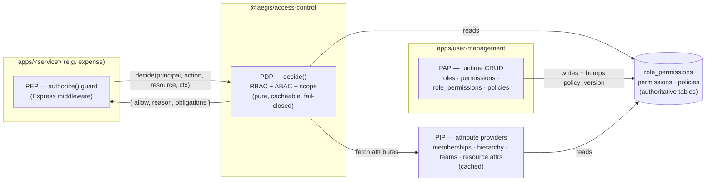

# 03 — Access-Control Model

> The heart of Aegis. This document specifies the authorization model — **RBAC core +
> ABAC conditions + row-level scope** — and the engine that evaluates it: the PDP, the PEPs
> embedded in every service, the PAP that administers policy at runtime, and the PIP that
> feeds attributes in. It is the canonical companion to [`SPEC.md`](../SPEC.md) §2 and §10.
>
> Related docs: [`01-architecture`](01-architecture.md) ·
> [`04-multi-tenancy`](04-multi-tenancy.md) ·
> [`05-authn-authz-flow`](05-authn-authz-flow.md) ·
> [`06-service-to-service`](06-service-to-service.md) ·
> [`07-data-models`](07-data-models.md) ·
> [`10-auditability-and-compliance`](10-auditability-and-compliance.md)

---

## 1. Design principles

Aegis externalizes authorization behind a single library — `@aegis/access-control` — that
every one of the seven business services consumes. We do **not** scatter bespoke permission
checks across services. The model is layered and additive:

1. **RBAC core** answers *"does the principal's role grant this `domain.action`?"* — a fast,
   cacheable table lookup over an explicit `role_permissions` join.
2. **ABAC conditions** refine the RBAC verdict with attributes of the subject, resource, and
   environment — *"an approver may approve expenses **in their own tenant up to $X**"*. Conditions
   are **data**, not code, evaluated by the PDP.
3. **Row-level scope** decides *which rows* a permitted action may touch
   (`AllRecords | OwnAndTeam | OwnOnly`, plus team/hierarchy membership). Scope compiles to a
   **query predicate** in the repository **and** is backstopped by **PostgreSQL Row-Level Security**
   keyed on the current tenant — belt-and-suspenders.

Four invariants hold everywhere:

- **Fail-closed.** Absence of an explicit allow is a deny. A PDP error, a cache miss with an
  unreachable PDP, or a missing attribute denies the request.
- **Tenant isolation is in the engine.** Every decision is evaluated *within a tenant*. There is
  no global escape hatch; the engine never sees `dom='*'`. (This is the single most important
  correction relative to the donor design — see §12.)
- **Dynamic, not migration-only.** Roles, permissions, role→permission mappings, and ABAC
  policies are administered at runtime through the PAP. Schema migrations seed *system* defaults;
  they are not the only way to change authorization.
- **Single source of truth.** The role→permission graph lives in one relational table
  (`role_permissions`), readable by SQL, joinable, and auditable — never hidden inside a policy
  engine's grouping rules.

---

## 2. Vocabulary

| Term | Meaning |
|---|---|
| **Tenant** | An organization; the isolation boundary. Every tenant-scoped row carries `tenant_id`. |
| **User** | A principal. Joins a tenant via a **Membership** (`unique(user_id, tenant_id)`) with an `active_workspace` flag → a deterministic *current tenant + current role* per request. |
| **Role** | A named bundle of permissions. **System roles** are seeded (`tenant_id` null); **custom roles** are tenant-defined (`tenant_id` non-null). Runtime CRUD via the PAP. |
| **Permission** | A dotted `domain.action[.sub]` string (e.g. `expense.report.approve`). Stored in a `permissions` catalog; bound to roles via the explicit `role_permissions` join. |
| **Policy (ABAC rule)** | A declarative condition over subject/resource/environment attributes, stored as JSON in `policies`, evaluated by the PDP. |
| **Scope (row-level)** | The breadth of rows an action may touch: `AllRecords`, `OwnAndTeam`, or `OwnOnly`, resolved against team membership and the manager→report hierarchy. |
| **Obligation** | A side condition the PEP must apply to *let the action through in a constrained form* — e.g. mask columns, redact fields. Returned alongside an allow. |

### 2.1 The `domain.action` permission vocabulary

Permissions are **lower-case, dotted, grep-able** strings. The grammar is
`domain . action [ . sub ]`:

```
expense.report.create
expense.report.submit
expense.report.approve
expense.report.read
payroll.payslip.read
payroll.payrun.approve
invoice.invoice.approve
invoice.duplicate.review
report.definition.create
report.run.export
workflow.rule.create
role.create
role.assign
permission.grant
policy.write
```

The resource and the action are fused into one opaque permission string — this keeps the catalog
flat and the route annotations readable. There is no separate `action` entity to keep in sync. The
HTTP-facing subset is referenced through enums in `@aegis/shared-enums`; the full catalog lives in
the `permissions` table (see [`07-data-models`](07-data-models.md)).

> **Convention** (from [`AGENTS.md`](../AGENTS.md) §6): every route is wrapped
> `authenticate → authorize(permission, …) → handler`. Only `/health` and docs are
> unauthenticated.

---

## 3. The four standard points — PDP / PEP / PAP / PIP

Aegis uses the canonical XACML-style separation of concerns. Each point has a precise home in the
monorepo.



| Point | What it does | Where it lives |
|---|---|---|
| **PDP** — Policy Decision Point | Pure function `decide(principal, action, resource, context) → { allow, reason, obligations }`. Combines RBAC lookup, ABAC condition eval, and scope resolution. Cacheable, fail-closed, side-effect-free. | **`@aegis/access-control`** |
| **PEP** — Policy Enforcement Point | Express guard `authorize(permission, { resourceLoader? })`. Loads the resource, calls the PDP, enforces the verdict (allow/deny/obligations), emits the audit entry, and compiles scope into the query the repository runs. | A thin guard in **`@aegis/access-control`**, mounted by **every `apps/<service>`** route |
| **PAP** — Policy Administration Point | Runtime CRUD for roles, permissions, `role_permissions`, and ABAC `policies`; bumps a `policy_version` used for cache invalidation. | **`apps/user-management`** (the identity + access system of record) |
| **PIP** — Policy Information Point | Supplies the attributes the PDP needs but doesn't carry in the principal: memberships, role bundle, team membership, manager→report hierarchy, approval limits, and resource attributes. Cached. | **`@aegis/access-control`** (provider interfaces), backed by **`user-management`** data |

The PEP/PDP split matters: the PEP is *impure* (it does I/O, loads resources, writes audit), while
the PDP is *pure* (given the same inputs it returns the same verdict). Purity is what makes the PDP
testable in isolation and safe to cache.

---

## 4. RBAC core — the explicit `role_permissions` join

The RBAC layer is a relational join, not a policy-engine trick. Three tables:

```sql
-- Permission catalog (one row per dotted action)
CREATE TABLE permissions (
  id           UUID PRIMARY KEY DEFAULT gen_random_uuid(),
  name         TEXT NOT NULL UNIQUE,            -- e.g. 'expense.report.approve'
  domain       TEXT NOT NULL,                   -- 'expense'
  display_name TEXT NOT NULL,
  created_at   TIMESTAMPTZ NOT NULL DEFAULT now(),
  updated_at   TIMESTAMPTZ NOT NULL DEFAULT now()
);

-- Roles: system (tenant_id NULL) or tenant-custom (tenant_id NOT NULL)
CREATE TABLE roles (
  id          UUID PRIMARY KEY DEFAULT gen_random_uuid(),
  tenant_id   UUID NULL REFERENCES tenants(id),  -- NULL => system/global role template
  name        TEXT NOT NULL,
  description  TEXT,
  is_system   BOOLEAN NOT NULL DEFAULT false,
  created_at  TIMESTAMPTZ NOT NULL DEFAULT now(),
  updated_at  TIMESTAMPTZ NOT NULL DEFAULT now(),
  UNIQUE (tenant_id, name)
);

-- THE single source of truth for role -> permission
CREATE TABLE role_permissions (
  role_id        UUID NOT NULL REFERENCES roles(id) ON DELETE CASCADE,
  permission_id  UUID NOT NULL REFERENCES permissions(id) ON DELETE CASCADE,
  granted_by     UUID NULL REFERENCES users(id),     -- PAP attribution
  created_at     TIMESTAMPTZ NOT NULL DEFAULT now(),
  PRIMARY KEY (role_id, permission_id)
);

-- A user's role(s) within a tenant, with the user's row-level scope on that grant
CREATE TABLE user_roles (
  id          UUID PRIMARY KEY DEFAULT gen_random_uuid(),
  user_id     UUID NOT NULL REFERENCES users(id),
  tenant_id   UUID NOT NULL REFERENCES tenants(id),
  role_id     UUID NOT NULL REFERENCES roles(id),
  scope       TEXT NOT NULL DEFAULT 'OwnOnly',      -- AllRecords | OwnAndTeam | OwnOnly
  created_at  TIMESTAMPTZ NOT NULL DEFAULT now(),
  UNIQUE (user_id, tenant_id, role_id)
);
```

The RBAC question — *"does this role grant `expense.report.approve`?"* — is a single indexed join:

```sql
SELECT 1
FROM   user_roles ur
JOIN   role_permissions rp ON rp.role_id = ur.role_id
JOIN   permissions      p  ON p.id       = rp.permission_id
WHERE  ur.user_id   = $userId
  AND  ur.tenant_id = $tenantId          -- tenant scoping IS in the query
  AND  p.name       = 'expense.report.approve'
LIMIT  1;
```

In the hot path the PDP does not re-issue this query per request: the PIP materializes the
principal's **permission set for the tenant** once and caches it (see §9).

### 4.1 Why a join table — and not a policy-engine grouping hack

A common shortcut is to store role→permission edges *inside* a general policy engine's grouping
rules (e.g. a Casbin `g` table seeded as `[role, permission, '*']`) while user→role lives in a
separate SQL table. Aegis rejects this. The grouping-hack approach produces:

- **Two sources of truth for one graph.** user→role in SQL, role→permission in the engine's
  rule store. They drift; reconciling them is bug-bait.
- **Opaque, un-joinable data.** "Which roles can approve invoices?" becomes an engine-specific
  query against a JSONB rule blob instead of `JOIN role_permissions`.
- **A dead tenant dimension.** The engine's domain field gets hardcoded to `'*'`, so tenant
  isolation silently leaves the engine and relies entirely on query construction.
- **Migration-only edits.** Granting a permission to a role becomes a code deploy + DB migration,
  because there's no runtime CRUD over the engine's seeded rules.

By contrast, an explicit `role_permissions` table is **the** authority: SQL-native, joinable,
RLS-protected, attributable (`granted_by`), and mutable at runtime by the PAP. RBAC is a join, full
stop. We reserve a real policy engine concept (ABAC) for the thing it's actually good at:
attribute conditions (§6) — not for storing a role→permission edge list.

---

## 5. Dynamic roles & permissions — the PAP at runtime

Authorization in Aegis is **administered as data at runtime**, not frozen into migrations.
`user-management` exposes the PAP as authenticated, audited, permission-gated endpoints:

| Operation | Endpoint | Guarded by |
|---|---|---|
| Create custom role | `POST /roles` | `role.create` |
| Update / delete role | `PATCH/DELETE /roles/:id` | `role.update` / `role.delete` |
| Grant permission to role | `POST /roles/:id/permissions` | `permission.grant` |
| Revoke permission from role | `DELETE /roles/:id/permissions/:permId` | `permission.revoke` |
| Assign role to user | `POST /users/:id/roles` | `role.assign` |
| Create / update ABAC policy | `POST/PATCH /policies` | `policy.write` |

Example — a tenant admin defines a narrow custom role and grants it two permissions, entirely at
runtime:

```http
POST /roles
X-Tenant-Id: 7c1e…              # tenant scoping is implicit & enforced
Authorization: Bearer <jwt>     # must carry permission role.create

{ "name": "Travel Approver", "description": "Approves travel expenses only" }
→ 201 { "id": "a91f…", "tenantId": "7c1e…", "name": "Travel Approver" }

POST /roles/a91f…/permissions
{ "permissions": ["expense.report.read", "expense.report.approve"] }
→ 200 { "added": 2 }
```

Each PAP write:

1. is **tenant-scoped** — a custom role's `tenant_id` is taken from the request context, never a
   body field; a tenant cannot touch another tenant's roles (RLS enforces this beneath the app);
2. emits a **hash-chained audit entry** capturing actor, intent, and the before/after of the graph
   (see [`10-auditability-and-compliance`](10-auditability-and-compliance.md));
3. **bumps `policy_version`** for the tenant, which invalidates the relevant PDP/PIP cache keys
   (§9) so the change propagates within one short TTL.

### 5.1 Why dynamic beats migration-only

| | Migration-only (donor model) | Dynamic PAP (Aegis) |
|---|---|---|
| Add a permission to a role | Code change + DB migration + deploy | One authenticated, audited API call |
| Tenant-defined custom roles | Effectively impossible | First-class (`roles.tenant_id`) |
| Time to change | Hours–days (release cycle) | Seconds |
| Auditability of the change | Git history, detached from runtime | In-platform, hash-chained, attributable |
| Blast radius of a mistake | Global, ships to all tenants | Tenant-scoped, reversible via API |

Migrations still **seed system roles and the base permission catalog** (Phase 1) — they establish
defaults. They are not the mechanism for everyday authorization change. This is exactly the rigidity
we remove relative to the reference design (see §12).

---

## 6. ABAC conditions — policy as JSON

RBAC decides *can this role do this action at all*. ABAC narrows it with **conditions** evaluated
against attributes:

- **subject** — `role`, `team`, `ownership`, `managerOf`, `approvalLimit`
- **resource** — `ownerId`, `tenantId`, `amount`, `status`, `sensitivity`, `costCenter`
- **environment** — `now`, `ip`, `mfa`

Policies are stored as JSON in the `policies` table and evaluated by the PDP. The condition DSL is a
small, safe boolean tree (no arbitrary code) — operators `eq`, `ne`, `lt`, `lte`, `gt`, `gte`, `in`,
`contains`, combined with `allOf` / `anyOf` / `not`. Attribute references use a `subject.*`,
`resource.*`, `env.*` namespace.

**Example A — "an approver can approve expenses in their own tenant up to $X":**

```json
{
  "id": "pol_expense_approve_limit",
  "tenantId": "7c1e…",
  "description": "Approvers may approve expense reports in their own tenant up to their approval limit.",
  "effect": "allow",
  "action": "expense.report.approve",
  "condition": {
    "allOf": [
      { "eq":  ["resource.tenantId", "subject.tenantId"] },
      { "lte": ["resource.amount",   "subject.approvalLimit"] },
      { "in":  ["resource.status",   ["submitted", "pending_approval"]] }
    ]
  }
}
```

Here `subject.approvalLimit` is supplied by the PIP from `user_hierarchy.approval_limit`, and
`resource.amount` / `resource.status` come from the resource the PEP loaded. A $4,000 report
approved by someone whose limit is $2,500 is denied with
`reason: "amount 4000 exceeds approval limit 2500"`.

**Example B — "a manager sees their cost-center" (read + scope):**

```json
{
  "id": "pol_report_costcenter_visibility",
  "tenantId": "7c1e…",
  "description": "Managers may read expense data for their own cost-center only.",
  "effect": "allow",
  "action": "expense.report.read",
  "condition": {
    "allOf": [
      { "eq": ["resource.tenantId",  "subject.tenantId"] },
      { "eq": ["resource.costCenter", "subject.costCenter"] }
    ]
  }
}
```

**Example C — a `deny` policy wins (deny-overrides combining):**

```json
{
  "id": "pol_payslip_self_block",
  "tenantId": "7c1e…",
  "description": "Payroll admins may not read their OWN payslip (segregation of duties).",
  "effect": "deny",
  "action": "payroll.payslip.read",
  "condition": { "eq": ["resource.employeeUserId", "subject.userId"] }
}
```

**Combining algorithm.** Aegis uses **deny-overrides**: if any applicable `deny` policy matches,
the result is deny, regardless of allows. Otherwise, an explicit `allow` (RBAC permission present
**and** every applicable allow-condition satisfied) is required. No applicable allow ⇒ deny
(fail-closed). This makes prohibitions (segregation of duties, sensitivity ceilings) authoritative.

> ABAC conditions are **data**: a tenant admin adds, edits, or disables a policy through the PAP
> (`policy.write`) without a deploy. The policy's `tenantId` scopes it; system policies
> (`tenantId` null) apply as platform defaults.

---

## 7. Row-level scope — `AllRecords | OwnAndTeam | OwnOnly`

RBAC + ABAC decide *whether* an action is allowed; **row-level scope** decides *which rows* it may
touch. Scope is carried on the user's role grant (`user_roles.scope`) and resolved against team
membership and the manager→report hierarchy.

| Scope | Meaning | Predicate (conceptually) |
|---|---|---|
| `AllRecords` | All rows in the tenant | `tenant_id = :tenant` |
| `OwnAndTeam` | Rows the user owns **or** that belong to teams/reports they manage | `tenant_id = :tenant AND (owner_id = :user OR owner_id IN (team_members ∪ reports))` |
| `OwnOnly` | Only rows the user owns | `tenant_id = :tenant AND owner_id = :user` |

### 7.1 Scope compiles to a query predicate

The PDP returns a **scope descriptor**; the repository compiles it into a `WHERE` fragment so the
database returns only authorized rows. Tenant scoping is always the leading predicate (and indexed
— see [`04-multi-tenancy`](04-multi-tenancy.md)):

```ts
// In @aegis/access-control: compile a resolved scope to a Sequelize where-clause.
export function scopeToPredicate(
  scope: ScopeDescriptor,            // { kind, userId, teamMemberIds, reportUserIds }
  ctx: { tenantId: string },
): WhereOptions {
  const base = { tenant_id: ctx.tenantId };          // always tenant-scoped
  switch (scope.kind) {
    case 'AllRecords':
      return base;
    case 'OwnAndTeam':
      return { ...base, owner_id: { [Op.in]: [scope.userId, ...scope.teamMemberIds, ...scope.reportUserIds] } };
    case 'OwnOnly':
      return { ...base, owner_id: scope.userId };
  }
}
```

### 7.2 …and is backstopped by RLS

The query predicate is the *first* line. The *second* line is PostgreSQL Row-Level Security: every
tenant-scoped table has `FORCE ROW LEVEL SECURITY` and a `RESTRICTIVE` policy keyed on
`app.current_tenant`. The app connects as a **non-owner role without `BYPASSRLS`**, and each
transaction sets the tenant with `SET LOCAL` (never `SET`, which would leak under transaction-mode
pooling):

```sql
-- Per tenant-scoped table:
ALTER TABLE expense_reports ENABLE ROW LEVEL SECURITY;
ALTER TABLE expense_reports FORCE ROW LEVEL SECURITY;

CREATE POLICY tenant_isolation ON expense_reports
  AS RESTRICTIVE
  USING (tenant_id = current_setting('app.current_tenant')::uuid);

-- Optional per-user policy for OwnOnly enforcement at the DB level:
CREATE POLICY own_rows ON expense_reports
  AS RESTRICTIVE
  USING (
    current_setting('app.scope', true) <> 'OwnOnly'
    OR owner_id = current_setting('app.current_user', true)::uuid
  );
```

```ts
// db transaction helper — set context with SET LOCAL inside the txn
await sequelize.transaction(async (t) => {
  await t.query(`SET LOCAL app.current_tenant = :tenant`, { replacements: { tenant: tenantId } });
  await t.query(`SET LOCAL app.current_user   = :user`,   { replacements: { user: userId } });
  // ...repository work runs under RLS...
});
```

If an application bug ever omits the scope predicate, RLS still prevents cross-tenant leakage. The
two layers are independent on purpose — see [`04-multi-tenancy`](04-multi-tenancy.md) for the full
RLS treatment.

---

## 8. `decide()` — signature, verdict, and obligations

The PDP's whole surface is one pure function:

```ts
// @aegis/access-control

export interface Principal {
  userId: string;
  tenantId: string;
  roleIds: string[];
  permissions: ReadonlySet<string>;   // materialized by the PIP for this tenant
  scope: 'AllRecords' | 'OwnAndTeam' | 'OwnOnly';
  attributes: {                       // PIP-supplied subject attributes
    teamMemberIds: string[];
    reportUserIds: string[];
    approvalLimit?: number;           // minor units
    costCenter?: string;
    mfa?: boolean;
  };
}

export interface Resource {
  type: string;                       // 'expense.report'
  id?: string;
  attributes: Record<string, unknown>;// { tenantId, ownerId, amount, status, costCenter, sensitivity, ... }
}

export interface DecisionContext {
  now: Date;
  ip?: string;
  correlationId: string;              // X-Correlation-Id, propagated for audit stitching
}

export type Obligation =
  | { kind: 'maskColumns'; columns: string[] }      // e.g. ['salary_enc', 'bank_account_enc']
  | { kind: 'rowScope';    scope: ScopeDescriptor }; // predicate the repository must apply

export interface Decision {
  allow: boolean;
  reason: string;                     // human-readable, logged + returned in deny envelope
  obligations: Obligation[];          // applied by the PEP on allow
  policyVersion: number;              // for cache keying / staleness checks
}

export function decide(
  principal: Principal,
  action: string,                     // 'expense.report.approve'
  resource: Resource,
  context: DecisionContext,
): Decision;
```

### 8.1 Obligations — column masking (and scope)

An **obligation** lets the PDP say *"allow, but only in this constrained form."* The two Aegis
obligations:

- **`maskColumns`** — the PEP must null/redact the named columns in the response DTO. This is how
  payroll's field-level control works: a role may `payroll.payslip.read` for its team, but the
  policy attaches `maskColumns: ['bank_account_enc', 'national_id_enc']` unless the principal also
  holds `payroll.sensitive.read`. The PDP decides; the serializer enforces.
- **`rowScope`** — carries the resolved `ScopeDescriptor` (§7) so the repository applies the right
  predicate. This keeps scope resolution *inside* the decision rather than re-derived in each
  service.

```json
{
  "allow": true,
  "reason": "role grants payroll.payslip.read; team scope; sensitive columns masked",
  "obligations": [
    { "kind": "maskColumns", "columns": ["bank_account_enc", "national_id_enc"] },
    { "kind": "rowScope", "scope": { "kind": "OwnAndTeam", "userId": "u-1", "teamMemberIds": ["u-2","u-3"], "reportUserIds": [] } }
  ],
  "policyVersion": 41
}
```

---

## 9. Decision caching & fail-closed

Authorization is on the hot path of every request, so the PEP caches decisions — carefully.

- **What is cached.** Two things, separately: (a) the PIP's **principal permission set + attributes**
  per `(userId, tenantId)`; (b) the PDP's **verdict** per a context-bound key.
- **Cache key.** `tenant:user:action:resourceType:resourceId:policyVersion`. Including
  `policyVersion` means a PAP write (which bumps the version) instantly invalidates stale verdicts
  without scanning the cache.
- **TTL.** Short and explicit (seconds, e.g. 5–30s). Caching trades a small freshness window for
  latency; the `policyVersion` bump makes permission/role changes propagate within that window.
- **Fail-closed.** If the cache entry expired **and** the PDP/PIP is unreachable, the PEP **denies**.
  We never default a missing decision to allow. Likewise a missing required attribute denies.
- **Pool shape.** Run the PDP/PIP backing store (Redis + Postgres) as a small pool of
  high-capacity instances co-located with the data to maximize cache-hit ratios (research §
  "Scalability"). Target sub-5ms hot-path decisions.
- **Revocation.** Server-side session invalidation and the `policyVersion` bump together bound how
  long a revoked permission can linger to one TTL. When per-request session introspection is enabled,
  the auth layer rejects revoked session tokens before JWT expiry (see
  [`05-authn-authz-flow`](05-authn-authz-flow.md)).

```ts
async function cachedDecide(p: Principal, action: string, r: Resource, ctx: DecisionContext) {
  const key = `pdp:${p.tenantId}:${p.userId}:${action}:${r.type}:${r.id ?? '-'}:${ctx.policyVersion}`;
  const hit = await cache.get<Decision>(key);
  if (hit) return hit;
  try {
    const decision = decide(p, action, r, ctx);
    await cache.set(key, decision, { ttlSeconds: 15 });
    return decision;
  } catch (err) {
    log.error({ err, key }, 'PDP error — failing closed');
    return { allow: false, reason: 'authorization_unavailable', obligations: [], policyVersion: ctx.policyVersion };
  }
}
```

---

## 10. Worked example — the PEP `authorize()` guard end-to-end

The PEP is an Express middleware that every route mounts. It loads the resource, calls the (cached)
PDP, enforces the verdict, applies obligations, and emits audit.

```ts
// @aegis/access-control — Policy Enforcement Point
import { RequestContext } from '@aegis/service-core';

interface AuthorizeOpts {
  resourceLoader?: (req: Request) => Promise<Resource>; // optional: load the target resource
}

export function authorize(permission: string, opts: AuthorizeOpts = {}) {
  return async (req: Request, res: Response, next: NextFunction) => {
    const ctx = RequestContext.current();                 // tenantId, userId, correlationId, traceId
    // 1) Build the principal from the verified token + PIP (cached).
    const principal = await pip.loadPrincipal(ctx.userId, ctx.tenantId);

    // 2) Coarse RBAC short-circuit: no permission at all => deny before any I/O.
    if (!principal.permissions.has(permission)) {
      await audit.deny(ctx, permission, 'permission_not_granted');
      return next(new ForbiddenError('E_FORBIDDEN', `missing permission ${permission}`));
    }

    // 3) Load the resource (for ABAC conditions + scope), if the route targets one.
    const resource = opts.resourceLoader
      ? await opts.resourceLoader(req)
      : { type: permission.split('.').slice(0, 2).join('.'), attributes: { tenantId: ctx.tenantId } };

    // 4) Ask the PDP. Pure + cached + fail-closed.
    const decision = await cachedDecide(principal, permission, resource, {
      now: new Date(), ip: req.ip, correlationId: ctx.correlationId, policyVersion: principal.policyVersion,
    });

    // 5) Enforce.
    if (!decision.allow) {
      await audit.deny(ctx, permission, decision.reason, resource.id);
      return next(new ForbiddenError('E_FORBIDDEN', decision.reason));
    }

    // 6) Apply obligations: stash row-scope predicate + column masks for the handler/serializer.
    for (const ob of decision.obligations) {
      if (ob.kind === 'rowScope')    res.locals.rowScope  = ob.scope;
      if (ob.kind === 'maskColumns') res.locals.maskColumns = ob.columns;
    }

    await audit.allow(ctx, permission, resource.id, principal.permissions);  // permissions-at-time-of-action
    return next();
  };
}
```

A controller mounts it declaratively:

```ts
@httpPost('/:id/approve',
  authenticate,
  authorize('expense.report.approve', { resourceLoader: loadExpenseReport }))
public async approve(@request() req: Request) {
  // res.locals.rowScope already reflects the PDP's scope decision;
  // the repository applies scopeToPredicate(res.locals.rowScope, ctx).
  return this.expenseService.approve(req.params.id);
}
```

### 10.1 End-to-end decision sequence

```mermaid
sequenceDiagram
  autonumber
  participant C as Client
  participant GW as gateway (edge)
  participant SVC as expense service
  participant PEP as PEP authorize()
  participant PIP as PIP (cached)
  participant PDP as PDP decide()
  participant DB as Postgres (RLS)
  participant AUD as audit (hash-chained)

  C->>GW: POST /expense/reports/42/approve  (Bearer JWT)
  GW->>GW: validate JWT (sig, exp), mint X-Correlation-Id
  GW->>SVC: forward + X-Tenant-Id, X-Correlation-Id, token
  SVC->>SVC: re-validate JWT via JWKS, check aud; build RequestContext
  SVC->>PEP: authorize('expense.report.approve')
  PEP->>PIP: loadPrincipal(user, tenant)
  PIP-->>PEP: roles, permission set, scope, approvalLimit (cached)
  alt permission not in set
    PEP->>AUD: deny (permission_not_granted)
    PEP-->>C: 403 fail-closed
  else permission present
    PEP->>SVC: resourceLoader → load report 42 (under SET LOCAL tenant)
    SVC->>DB: SELECT … (RLS-scoped)
    DB-->>SVC: report {amount, status, ownerId, tenantId}
    PEP->>PDP: decide(principal, action, resource, ctx)
    PDP->>PDP: RBAC ok → ABAC (amount ≤ limit, same tenant, status ok) → scope
    PDP-->>PEP: { allow:true, obligations:[rowScope], policyVersion }
    PEP->>AUD: allow (actor, intent, permissions-at-time)
    PEP->>SVC: next() with res.locals.rowScope
    SVC->>DB: UPDATE expense_reports … WHERE scope predicate (under RLS)
    SVC-->>C: 200 { report: approved }
  end
```

---

## 11. Per-service application of the model

The same engine serves every service; what differs is the policy and scope shape (see
[`SPEC.md`](../SPEC.md) §2.5 and each [`docs/services/<svc>.md`](services/)):

- **expense / invoice** — predominantly RBAC + ABAC: *role + ownership + amount threshold + tenant +
  status*. Approval routing uses approval limits (ABAC) and scope. Invoice is **header-level**:
  authorization governs duplicate review, threshold/variance checks vs an optional PO reference, and
  approval routing — there are no line-item or GL-code permissions.
- **payroll** — highest-sensitivity PII. Field-level RBAC + **column-masking obligations**;
  **segregation of duties / maker-checker** expressed as `deny` policies (the pay-run approver must
  differ from the input editor); every sensitive-field read is audited.
- **reporting** — row + column-level on report output. The principal's scope and masked columns are
  part of **every cache key**, so one user's cached report can never leak to another. Reporting
  **never** bypasses RLS.
- **workflow / approvals** — relationship-shaped (approval chains). Handled today as RBAC + ABAC over
  the approval hierarchy; the **first candidate for a ReBAC extension** (§12.2). Delegated tokens
  (`sub` + `act`) preserve the audit trail.
- **notification** — consumes **already-authorized** events and never re-derives authority; it
  requires propagated, verified tenant/user context (guards against ambient authority — see
  [`06-service-to-service`](06-service-to-service.md)).

---

## 12. Model choice & alternatives

### 12.1 Why in-house RBAC + ABAC (and why not the donor's policy engine)

Aegis builds a clean **in-house RBAC + ABAC engine** with an explicit PDP/PEP split rather than
adopting a general policy engine wholesale. The reference design we studied wired a full policy
engine but neutralized its two strongest features — the tenant/domain dimension was permanently
`'*'`, and deny-effects were vestigial — so it paid all the complexity (per-request enforcer build,
full-policy reload on every check, a JSONB rule table, and *abused grouping semantics* that stored
role→permission while user→role lived in SQL) for what amounted to a static role→permission lookup.
Worse, it was **migration-only**: every authorization change was a code deploy. Aegis keeps the one
genuinely good pattern from that design — a **flat catalog of dotted `domain.action` strings
annotated declaratively on each route** — and discards the engine, re-modeling role→permission as an
explicit join (§4) with **runtime CRUD** (§5) and **tenant scoping inside the engine** (§7–§8).

### 12.2 Alternatives considered

| Option | Model | Strengths | Why not the default for Aegis |
|---|---|---|---|
| **In-house RBAC + ABAC** (chosen) | RBAC + ABAC + row-scope | Full control of the model; explicit `role_permissions` SoT; tenant scoping in-engine; runtime PAP; obligations; trivially co-located + cached | None for our access patterns; we own audit + tenant semantics directly |
| **Casbin** (in-process) | ACL/RBAC/ABAC/ReBAC | Fast (no IPC), Node bindings, model-file flexibility | No built-in audit; grouping-rule storage invites the role→perm hack we reject; the donor's neutered usage is a cautionary tale |
| **CASL** (in-process) | RBAC/ABAC ability model | One ability model shared FE+BE; ergonomic in TS | Language-bound; weak centralized policy/audit; fine for a v1 coarse check, but sensitive finance authz needs an auditable PDP |
| **OPA / Rego** (out-of-process) | General policy | Infra-wide policy (also mesh/K8s); battle-tested | Rego learning curve; ~26–44ms typical RBAC latency; overkill when decisions are role+attribute |
| **Cerbos** (stateless PDP) | RBAC/ABAC/PBAC | YAML policies, deny-overrides out of the box, no relationship store to sync | Strong fit; a valid alternative. We keep policy *in our own tables* for one PAP + one audit chain rather than a separate policy service to operate |
| **Cedar / AWS Verified Permissions** | RBAC + ABAC | Human-readable policy language, formal-ish analysis | Smaller / AWS-leaning ecosystem; adds an external dependency for what our in-house engine covers |
| **OpenFGA / SpiceDB** (Zanzibar ReBAC) | ReBAC graph | Models hierarchical sharing/delegation at scale (p95 < 10ms at billions of tuples) | Requires a **stateful relationship store synced via outbox/CDC** — drift is the top failure mode. Unjustified when most decisions are role + ownership + threshold + tenant |

The decision rule (from the research): **choose the model by your actual access patterns, not the
engine first.** Aegis's finance services hinge on *role + ownership + amount threshold + tenant +
status* — squarely RBAC + ABAC. Cerbos/Cedar are the closest external alternatives and are
documented as drop-in PDPs; we keep the PDP in-house so there is one PAP, one audit chain, and one
tenant model.

### 12.3 When to add ReBAC

Reach for a Zanzibar-style ReBAC store (OpenFGA / SpiceDB, both with TS clients) **only** when an
access pattern is genuinely relationship-shaped:

- **workflow** approval/delegation chains (who can approve depends on org relationships + delegation);
- **reporting** report/folder sharing and delegated viewing;
- the **org graph** itself (`user → team → tenant`, `manager → report`) owned by `user-management`.

If adopted, build an **outbox/CDC sync** from `user-management` to the relationship store from day
one — the recurring, well-documented failure mode is authorization data drifting from application
data. Until those relationship patterns are real, expressing approval chains as RBAC + ABAC over the
`approval_hierarchy` tables (see [`07-data-models`](07-data-models.md)) is simpler and avoids the
sync burden. ReBAC is an **extension**, not the foundation.

---

## 13. Summary

- **RBAC core** is an explicit `role_permissions` join — the single source of truth — not a
  policy-engine grouping hack.
- **ABAC conditions** are JSON data evaluated by the PDP, with **deny-overrides** so prohibitions
  (segregation of duties) are authoritative.
- **Row-level scope** (`AllRecords | OwnAndTeam | OwnOnly`) compiles to a query predicate **and** is
  backstopped by Postgres RLS.
- **PDP** (`@aegis/access-control`) is pure, cacheable, fail-closed; **PEPs** in every service apply
  the verdict and its **obligations** (column masking, row scope); the **PAP** (`user-management`)
  administers it all at runtime; the **PIP** feeds attributes, cached.
- **Tenant scoping lives inside the engine**, and **authorization is dynamic** — the two corrections
  that distinguish Aegis from the reference design.
- Add **ReBAC** only where relationships truly demand it (workflow chains, report sharing, the org
  graph), with an outbox/CDC sync.
