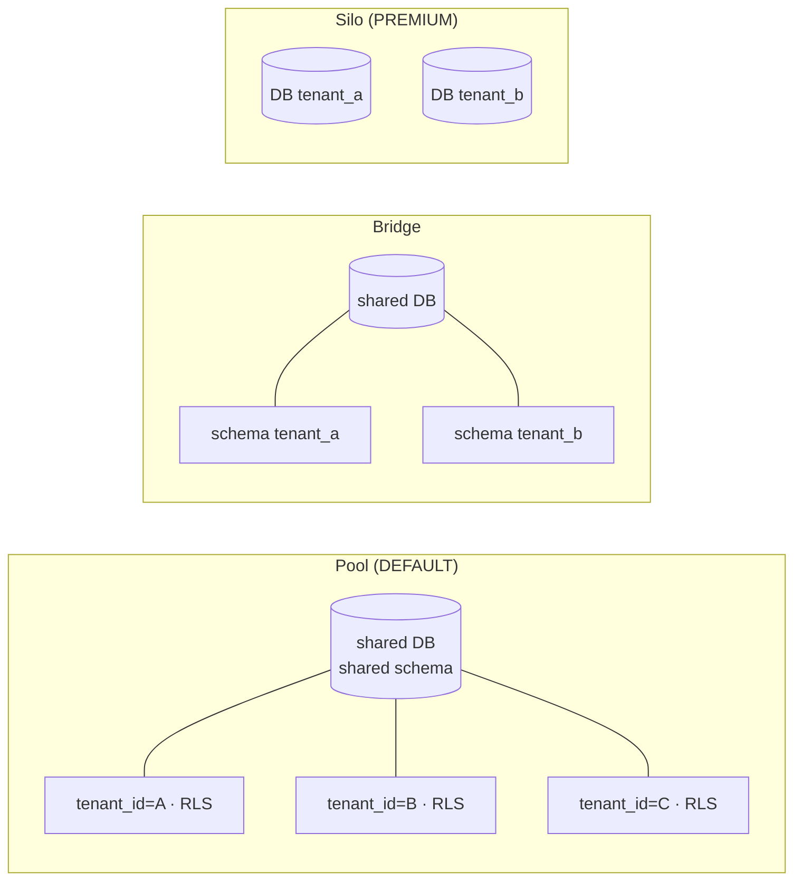
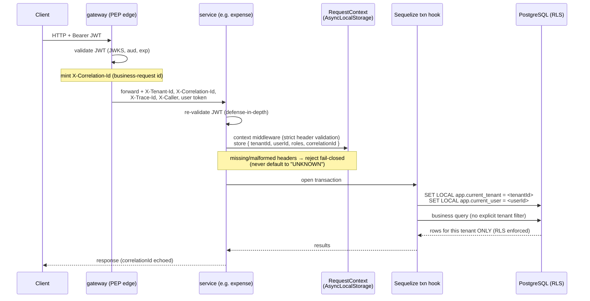
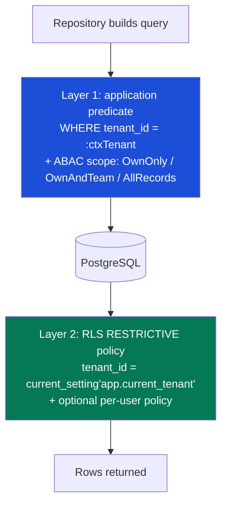

# 04 — Multi-Tenancy & Database-Enforced Tenant Isolation

> **Scope.** This document specifies how Aegis isolates one tenant's data from
> another's. Tenant isolation is the *load-bearing* property of an access-control
> platform: every other guarantee (RBAC, ABAC, audit) is meaningless if Tenant A
> can read Tenant B's rows. We enforce isolation **twice** — once in the
> application query layer and once, independently, in the database with
> **PostgreSQL Row-Level Security (RLS)** — so that a bug in one layer cannot
> leak cross-tenant data.
>
> **Authoritative spec:** [`../SPEC.md`](../SPEC.md) §1 (Locked decisions),
> §2.3 (row-level scope), §6 (context propagation), §10 (amendments).
> Related docs: [`03-access-control-model.md`](./03-access-control-model.md) ·
> [`05-service-to-service.md`](./05-service-to-service.md) ·
> [`07-data-models.md`](./07-data-models.md).

---

## 1. The three isolation models — silo / bridge / pool

Multi-tenant SaaS data isolation falls on a well-known spectrum that trades
**cost and operational scalability** against **strength of isolation and
compliance ergonomics**:

| Model | Shape | Isolation | Scaling | Cost | Compliance (residency / erasure) |
|-------|-------|-----------|---------|------|-----------------------------------|
| **Pool** | Shared schema, every row carries `tenant_id`, RLS guards reads/writes | Soft (DB + app logic) | Excellent (thousands of tenants) | Lowest | Hardest (data co-mingled) |
| **Bridge** | Schema-per-tenant in a shared database | Medium | Good (schema sprawl at extreme counts) | Medium | Medium |
| **Silo** | Database-per-tenant (separate process / storage / connection) | Hard (physical) | Poor operationally | Highest | Easiest (drop the DB to erase) |



### 1.1 Aegis decision: **pool by default, silo as a premium tier**

Aegis runs the **pool model** (shared schema + `tenant_id` + RLS) as the default
for all services. It scales to thousands of tenants with no per-tenant
operational overhead, and — critically for an access-control showcase — it lets
us push isolation *down into the database* with RLS, so the demonstration of
"an app bug cannot leak across tenants" is concrete and testable.

We offer the **silo tier** (database-per-tenant) as a **premium add-on** for
regulated or very large customers with hard data-residency / erasure
requirements. **Payroll is the first candidate** for siloing: it holds the
highest-sensitivity PII (compensation, bank details, national IDs) and is the
service most likely to attract GDPR data-residency and "right to erasure"
clauses, which a dedicated database satisfies cleanly (region-pin the instance,
`DROP DATABASE` to erase).

The two tiers share **one codebase**. A tenant's tier is a routing decision in
[`@aegis/db`](../libs/db): the connection registry resolves a pooled tenant to
the shared cluster and a siloed tenant to its dedicated instance, then applies
the *same* RLS + `SET LOCAL` discipline on top. Siloing is therefore additive
defense-in-depth — even a siloed tenant's tables carry `tenant_id` and RLS, so
the isolation logic is identical and never branches on tier in business code.

> The bridge (schema-per-tenant) model is **not** part of the Aegis roadmap: it
> combines the operational sprawl of many schemas with weaker isolation than a
> true silo. We jump straight from pool to silo when isolation needs to harden.

---

## 2. The pooled model in detail — `tenant_id` + RLS

Every tenant-scoped table obeys two invariants (see
[`07-data-models.md`](./07-data-models.md) for the full schema):

1. `tenant_id UUID NOT NULL` — no row exists without an owning tenant.
2. A **RESTRICTIVE** RLS policy keyed on the per-transaction session variable
   `app.current_tenant`.

### 2.1 Table shape

```sql
CREATE TABLE expense_reports (
  id          UUID PRIMARY KEY DEFAULT gen_random_uuid(),
  tenant_id   UUID NOT NULL,
  owner_id    UUID NOT NULL,           -- the user who created the report
  status      TEXT NOT NULL,           -- state machine; see expense service doc
  amount_minor BIGINT NOT NULL,        -- money in integer minor units
  created_at  TIMESTAMPTZ NOT NULL DEFAULT now(),
  updated_at  TIMESTAMPTZ NOT NULL DEFAULT now()
);
```

### 2.2 Composite index — `tenant_id` **leading**

The single largest RLS performance killer is a missing composite index whose
**leading column is `tenant_id`**. With it, properly indexed RLS shows no
measurable degradation versus hand-written `WHERE tenant_id = …` filtering, even
at hundreds of concurrent connections; without it, queries can be two orders of
magnitude slower because the planner cannot prune by tenant before evaluating
the rest of the predicate.

```sql
-- Tenant-leading composite indexes for the hot access paths.
CREATE INDEX idx_expense_reports_tenant_status
  ON expense_reports (tenant_id, status);

CREATE INDEX idx_expense_reports_tenant_owner
  ON expense_reports (tenant_id, owner_id);

-- Rule: every index on a tenant-scoped table starts with tenant_id, because
-- the RLS predicate (tenant_id = current_setting('app.current_tenant')) is
-- ANDed into *every* query the table ever sees.
```

---

## 3. The RLS policy — the database backstop

This is the heart of database-enforced isolation. Four properties must **all**
hold or RLS is silently bypassed.

```sql
-- ─────────────────────────────────────────────────────────────────────────
-- 1) Turn RLS on, and FORCE it so even the table owner is subject to it.
--    Without FORCE, the owning role bypasses RLS — a common, silent foot-gun.
-- ─────────────────────────────────────────────────────────────────────────
ALTER TABLE expense_reports ENABLE  ROW LEVEL SECURITY;
ALTER TABLE expense_reports FORCE   ROW LEVEL SECURITY;

-- ─────────────────────────────────────────────────────────────────────────
-- 2) A RESTRICTIVE tenant policy.
--    PostgreSQL merges multiple PERMISSIVE policies with OR, but RESTRICTIVE
--    policies combine with AND — so a per-user or per-feature permissive
--    policy can never OR away the tenant guard. The tenant boundary is
--    therefore non-negotiable: it is ANDed into every row decision.
-- ─────────────────────────────────────────────────────────────────────────
CREATE POLICY tenant_isolation ON expense_reports
  AS RESTRICTIVE
  USING        (tenant_id = current_setting('app.current_tenant')::uuid)
  WITH CHECK   (tenant_id = current_setting('app.current_tenant')::uuid);
```

- `USING` filters which existing rows are **visible** to `SELECT` / `UPDATE` /
  `DELETE`.
- `WITH CHECK` validates rows being **written** by `INSERT` / `UPDATE`, so a
  service cannot insert a row stamped with someone else's `tenant_id`.
- `current_setting('app.current_tenant')` reads a session/transaction variable
  (set in §5). The `::uuid` cast both validates the value and lets the planner
  use the tenant-leading index.

> **Fail-closed by construction.** `current_setting('app.current_tenant')` with
> no second argument **raises** if the variable is unset, so a query that forgot
> to establish tenant context errors out rather than returning *all* tenants'
> rows. This is deliberate — see §5.3.

### 3.1 The app role: **non-owner, no `BYPASSRLS`**

RLS is *completely ignored* for the table-owning role and for any role with the
`BYPASSRLS` attribute (and for superusers). If the application connects as the
role that owns the tables, every policy above is dead weight.

Aegis therefore runs every service under a dedicated **non-owner** application
role:

```sql
-- Owned-by / migrated-by role (runs migrations, owns the tables).
CREATE ROLE aegis_migrator LOGIN PASSWORD :'migrator_pw';

-- The application role the services actually connect as.
-- Note: NO BYPASSRLS, NOT a superuser, does NOT own the tables.
CREATE ROLE aegis_app LOGIN PASSWORD :'app_pw' NOBYPASSRLS;

-- Grant DML but never ownership.
GRANT SELECT, INSERT, UPDATE, DELETE ON ALL TABLES IN SCHEMA public TO aegis_app;
ALTER DEFAULT PRIVILEGES FOR ROLE aegis_migrator IN SCHEMA public
  GRANT SELECT, INSERT, UPDATE, DELETE ON TABLES TO aegis_app;

-- Belt-and-suspenders: even if aegis_app were ever made an owner by accident,
-- FORCE ROW LEVEL SECURITY (set in §3) keeps the policy in effect.
```

The local Docker environment pre-seeds `aegis_app` (the RLS non-owner role) and
the databases as part of `scripts/dev-up.sh`, so isolation is in force on a
fresh machine with zero manual setup (see [`SPEC.md`](../SPEC.md) §10.4).

---

## 4. THE pooling pitfall — `SET LOCAL`, never session `SET`

This is the most important operational rule in this document, and the most
common way RLS isolation breaks in production.

Aegis runs behind a transaction-mode connection pool (PgBouncer-style). In that
mode a backend connection is handed to a different logical request at every
transaction boundary. A plain **session** `SET` persists for the *physical
connection's* lifetime:

```sql
-- ❌ WRONG — leaks across tenants under transaction pooling.
SET app.current_tenant = 'aaaaaaaa-...';   -- Tenant A's request
-- ... transaction ends, connection returns to the pool ...
-- Tenant B's request is handed the SAME connection — and inherits
-- app.current_tenant = Tenant A. RLS now happily serves A's rows to B.
```

The fix is to scope the variable to the **transaction**, so it rolls back the
instant the transaction ends and can never bleed into the next borrower:

```sql
BEGIN;
  -- ✅ CORRECT — rolled back at COMMIT/ROLLBACK, never outlives the txn.
  SET LOCAL app.current_tenant = 'aaaaaaaa-...';
  --   ... all queries here are tenant-scoped by RLS ...
COMMIT;
```

Equivalently, the function form with the third argument `is_local = true`:

```sql
-- set_config(setting, value, is_local) — is_local=true == SET LOCAL.
SELECT set_config('app.current_tenant', 'aaaaaaaa-...', true);
```

We prefer `set_config(..., true)` in the ORM hook because it is a normal
parameterized statement (no string interpolation into DDL-style `SET`), which
removes any injection surface when the tenant id flows from context.

> **Rule, enforced in code review and by a runtime guard:** every tenant
> tenant-variable binding in Aegis uses `SET LOCAL` / `set_config(..., true)` inside
> the same transaction as the queries it guards. A bare session `SET` of
> `app.current_tenant` or `app.current_user` anywhere in the codebase is a
> ship-blocking defect.

---

## 5. The `tenantId` flow — JWT → request context → transaction hook

Tenant context originates in the verified JWT, lives in the per-request
[`RequestContext`](../libs/service-core), and is pushed into PostgreSQL via a
Sequelize transaction hook. No business query ever names a tenant explicitly;
isolation is ambient *to the request* but never ambient *to the connection*.

### 5.1 Propagation diagram



### 5.2 JWT claim → request context

The central IdP issues short-lived RS256/ES256 JWTs whose claims carry the
tenant. The gateway validates at the edge and forwards `X-Tenant-Id`; each
service **re-validates** the token (it never trusts the header alone) and the
context middleware populates `RequestContext` with **strict header validation** —
required headers are asserted and missing/malformed values are rejected
fail-closed, never defaulted (see [`SPEC.md`](../SPEC.md) §6). The request
context carries no donor-domain entry-context field, and the propagated
business-request id is `X-Correlation-Id` (the only business-request header;
Aegis defines no alternate tracking header).

```ts
// libs/service-core — context middleware (de-branded, AsyncLocalStorage).
// Runs AFTER auth middleware has verified the JWT signature, aud and exp.
export function contextMiddleware(req: Request, res: Response, next: NextFunction) {
  const claims = req.auth; // populated by the verified-JWT auth middleware

  // Strict header validation: assert presence, fail closed on absence.
  const tenantId = requireUuid(claims.tenant_id, 'tenant_id');
  const userId   = requireUuid(claims.sub,        'sub');

  // X-Tenant-Id (edge) must agree with the re-validated token claim.
  assertHeaderMatchesClaim(req, HttpHeaderKey.TenantId, tenantId);

  RequestContext.run(
    {
      tenantId,
      userId,
      roles:         claims.roles ?? [],
      correlationId: req.header(HttpHeaderKey.CorrelationId) ?? mintCorrelationId(),
      traceId:       req.header(HttpHeaderKey.TraceId),
      caller:        req.header(HttpHeaderKey.Caller),
      sourceService: req.header(HttpHeaderKey.SourceService),
    },
    () => next(),
  );
}
```

### 5.3 Request context → Sequelize transaction hook

Every tenant-scoped transaction begins by stamping the Postgres session
variables from `RequestContext`. This is the single chokepoint where
application identity becomes database identity. In Aegis it lives in
[`@aegis/db`](../libs/db) as a transaction helper, so no repository ever opens a
raw transaction.

```ts
// libs/db — runTenantTransaction: the ONLY sanctioned way to open a
// tenant-scoped transaction. It guarantees SET LOCAL is issued first.
import { RequestContext } from '@aegis/service-core';

export async function runTenantTransaction<T>(
  sequelize: Sequelize,
  work: (tx: Transaction) => Promise<T>,
): Promise<T> {
  const { tenantId, userId } = RequestContext.current();

  // Fail closed: a tenant-scoped txn with no tenant in context is a bug,
  // not a "query everything" license.
  if (!tenantId) {
    throw new ForbiddenError('TENANT_CONTEXT_MISSING', 'No tenant in request context');
  }

  return sequelize.transaction(async (tx) => {
    // is_local = true  ==  SET LOCAL  ==  scoped to THIS transaction only.
    // Parameterized — no interpolation of context values into SQL text.
    await sequelize.query(
      `SELECT set_config('app.current_tenant', :tenantId, true),
              set_config('app.current_user',   :userId,   true)`,
      { transaction: tx, replacements: { tenantId, userId: userId ?? '' } },
    );

    return work(tx);
  });
}
```

Because the helper uses `set_config(..., true)` (the `SET LOCAL` form), the
variables are torn down at `COMMIT`/`ROLLBACK` and can never leak onto the next
request that borrows the pooled connection (§4).

> **Why a hook and not a per-query `WHERE`?** Pushing the tenant into a session
> variable means RLS enforces isolation on *every* statement the transaction
> issues — including ones a developer forgets, raw SQL, bulk operations, and ORM
> escape hatches. The database becomes the backstop that does not depend on
> developer discipline.

---

## 6. Belt-and-suspenders — app predicates **AND** RLS

Aegis enforces row-level scope **twice**, deliberately. This is the core
security posture of the platform: *defense-in-depth so a single-layer bug cannot
leak data.*



1. **Layer 1 — application query predicates.** The repository, driven by the PDP
   verdict and the compiled row-level *scope* (`AllRecords | OwnAndTeam |
   OwnOnly`; see [`03-access-control-model.md`](./03-access-control-model.md)),
   adds explicit predicates. This is where *intra-tenant* access control lives
   (an employee sees own expenses; a manager sees their cost-center).
2. **Layer 2 — RLS.** The RESTRICTIVE policy from §3 re-checks the tenant
   boundary in the database regardless of what Layer 1 did. If a repository ever
   forgets its `WHERE tenant_id`, builds a raw query, or has an ABAC bug, RLS
   still clamps the result set to the current tenant.

Neither layer is "redundant." Layer 1 expresses *who, within a tenant, may see
which rows*; Layer 2 guarantees *no query, however buggy, escapes the tenant*.
The reporting service is explicitly forbidden from holding a `BYPASSRLS` path —
its caches key on access-scope and it never bypasses RLS (see
[`SPEC.md`](../SPEC.md) §2.5).

### 6.1 Per-user policies — `app.current_user`

For intra-tenant row scoping that we also want backstopped in the database
(notably Payroll, where a leak of one employee's payslip to another is a
reportable incident), we set a **second** transaction-local variable,
`app.current_user`, and add a per-user RLS policy *on top of* the tenant policy.

```sql
-- Payroll: a payslip is visible to its owner and to payroll administrators.
-- The tenant RESTRICTIVE policy from §3 still applies (ANDed); this PERMISSIVE
-- policy refines WITHIN the tenant.
ALTER TABLE payslips ENABLE ROW LEVEL SECURITY;
ALTER TABLE payslips FORCE  ROW LEVEL SECURITY;

CREATE POLICY tenant_isolation ON payslips
  AS RESTRICTIVE
  USING (tenant_id = current_setting('app.current_tenant')::uuid);

CREATE POLICY payslip_owner_or_admin ON payslips
  AS PERMISSIVE
  USING (
    employee_user_id = current_setting('app.current_user')::uuid
    OR current_setting('app.current_user')::uuid = ANY (
         -- payroll admins for this tenant, supplied by the PIP via a
         -- tenant-scoped helper view that is itself RLS-protected
         SELECT user_id FROM payroll_admins
         WHERE tenant_id = current_setting('app.current_tenant')::uuid
       )
  );
```

`app.current_user` is set by the same `runTenantTransaction` helper (§5.3), so
it follows the identical `SET LOCAL` discipline and tears down with the
transaction. Per-user policies are **opt-in per table** — most tables only need
the tenant RESTRICTIVE policy; we reserve per-user RLS for the highest-blast-
radius tables (payroll payslips, ledger entries, sensitive reporting facts).

---

## 7. Cross-tenant-leak test (the regression that must never pass silently)

The whole point of pushing isolation into the database is that we can *prove* it
with a test the application cannot cheat. This integration test asserts that
even a query with **no tenant predicate at all** sees only the in-context
tenant's rows — i.e. RLS, not the app, is doing the work. It must run in CI and
against the connection-pooled configuration so it also catches the §4 leak.

```ts
// libs/db/test/rls-cross-tenant.int.test.ts
import { Sequelize } from 'sequelize';
import { runTenantTransaction } from '@aegis/db';
import { RequestContext } from '@aegis/service-core';

describe('RLS cross-tenant isolation (pooled, non-owner app role)', () => {
  const TENANT_A = '11111111-1111-1111-1111-111111111111';
  const TENANT_B = '22222222-2222-2222-2222-222222222222';
  let sequelize: Sequelize; // connected as aegis_app (NOBYPASSRLS, non-owner)

  beforeAll(async () => {
    sequelize = makeAppRoleConnection(); // NOT the migrator/owner role
    // Seed one report per tenant via the owner role / migrator.
    await seedAsOwner(`
      INSERT INTO expense_reports (id, tenant_id, owner_id, status, amount_minor)
      VALUES (gen_random_uuid(), '${TENANT_A}', '${TENANT_A}', 'draft', 100),
             (gen_random_uuid(), '${TENANT_B}', '${TENANT_B}', 'draft', 200);
    `);
  });

  it('returns ONLY tenant A rows even with NO tenant filter in the query', async () => {
    const rows = await RequestContext.run({ tenantId: TENANT_A, userId: TENANT_A }, () =>
      runTenantTransaction(sequelize, async (tx) =>
        // Deliberately omit WHERE tenant_id — RLS must clamp this.
        sequelize.query('SELECT tenant_id FROM expense_reports', {
          transaction: tx, type: 'SELECT',
        }),
      ),
    );

    expect(rows).toHaveLength(1);
    expect(rows[0].tenant_id).toBe(TENANT_A);
    expect(rows.some((r: any) => r.tenant_id === TENANT_B)).toBe(false);
  });

  it('cannot INSERT a row stamped with another tenant (WITH CHECK)', async () => {
    await expect(
      RequestContext.run({ tenantId: TENANT_A, userId: TENANT_A }, () =>
        runTenantTransaction(sequelize, async (tx) =>
          sequelize.query(
            `INSERT INTO expense_reports (id, tenant_id, owner_id, status, amount_minor)
             VALUES (gen_random_uuid(), '${TENANT_B}', '${TENANT_A}', 'draft', 1)`,
            { transaction: tx },
          ),
        ),
      ),
    ).rejects.toThrow(/row-level security|new row violates/i);
  });

  it('fails closed when no tenant context is set (no app.current_tenant)', async () => {
    await expect(
      sequelize.query('SELECT * FROM expense_reports') // no SET LOCAL first
    ).rejects.toThrow(/current_tenant|unrecognized configuration parameter/i);
  });

  it('does NOT leak tenant context across pooled connections', async () => {
    // Borrow → set A → release; next borrow must NOT inherit A.
    await RequestContext.run({ tenantId: TENANT_A, userId: TENANT_A }, () =>
      runTenantTransaction(sequelize, async () => undefined),
    );

    // A fresh transaction with NO context must fail closed, proving the
    // previous SET LOCAL did not persist on the reused physical connection.
    await expect(
      sequelize.query('SELECT * FROM expense_reports')
    ).rejects.toThrow(/current_tenant|unrecognized configuration parameter/i);
  });
});
```

What each assertion proves:

| Test | Proves |
|------|--------|
| no-filter SELECT returns only A | RLS, not the app predicate, enforces the boundary |
| cross-tenant INSERT rejected | `WITH CHECK` blocks writing another tenant's `tenant_id` |
| unset context fails closed | a forgotten `SET LOCAL` errors, never returns all tenants |
| no cross-connection leak | `SET LOCAL` does not survive into the next pooled borrower (§4) |

---

## 8. Checklist — adding a new tenant-scoped table

When you add a table that holds tenant data, all of the following are required
(enforced in code review; the migration is incomplete otherwise):

- [ ] Column `tenant_id UUID NOT NULL`.
- [ ] At least one composite index with **`tenant_id` as the leading column**
      covering the hot query paths.
- [ ] `ALTER TABLE … ENABLE ROW LEVEL SECURITY;`
- [ ] `ALTER TABLE … FORCE ROW LEVEL SECURITY;`
- [ ] A **RESTRICTIVE** `tenant_isolation` policy with `USING` **and**
      `WITH CHECK` on `app.current_tenant`.
- [ ] (If intra-tenant per-user backstop is needed) a PERMISSIVE per-user policy
      on `app.current_user`.
- [ ] Table owned by `aegis_migrator`; DML granted to the non-owner
      `aegis_app`; `aegis_app` has **no** `BYPASSRLS`.
- [ ] All access goes through `runTenantTransaction` (`SET LOCAL`) —
      **never** a bare session `SET`.
- [ ] A cross-tenant-leak assertion added to the service's integration suite.

---

## 9. Summary

- **Default = pool**: shared schema + `tenant_id` + PostgreSQL RLS — scales to
  thousands of tenants and lets the database itself enforce isolation.
- **Premium = silo**: database-per-tenant for regulated/large customers,
  **Payroll first**; same codebase, same RLS discipline layered on top.
- **RLS done right**: `ENABLE` **and** `FORCE` ROW LEVEL SECURITY, a
  **RESTRICTIVE** policy on `app.current_tenant`, app runs as a **non-owner role
  without `BYPASSRLS`**.
- **The pooling pitfall**: always `SET LOCAL` / `set_config(..., true)`
  **per-transaction**; a session `SET` leaks across pooled connections and is a
  ship-blocking defect.
- **Performance**: composite indexes with **`tenant_id` leading**.
- **Flow**: JWT claim → `RequestContext` (strict header validation, fail-closed)
  → Sequelize `runTenantTransaction` hook sets `app.current_tenant`
  (+ `app.current_user`).
- **Belt-and-suspenders**: application predicates **AND** RLS; per-user policies
  for the highest-sensitivity tables.
- **Provable**: a cross-tenant-leak test asserts RLS clamps even an unfiltered
  query and fails closed when context is missing.
