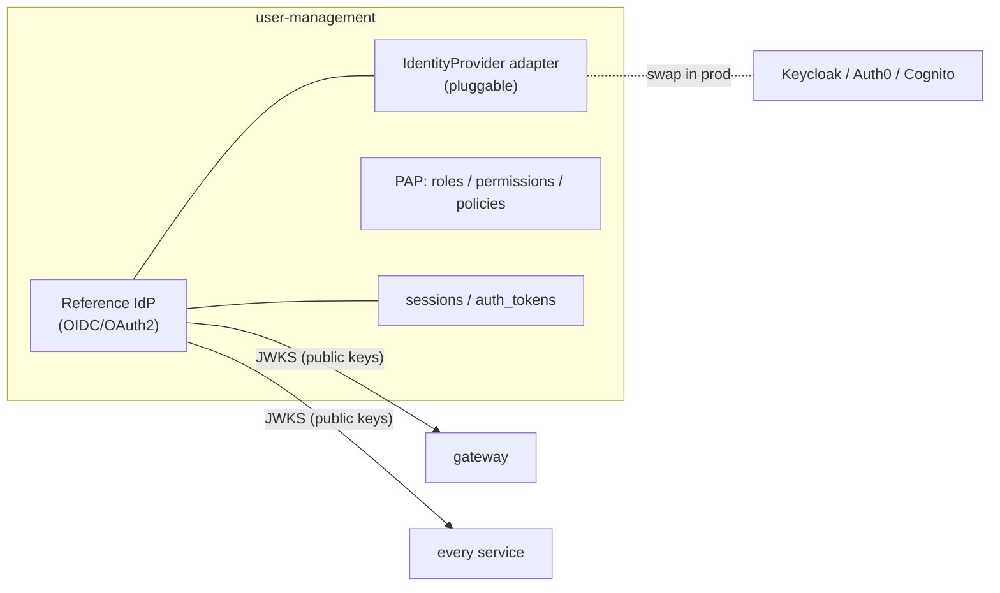
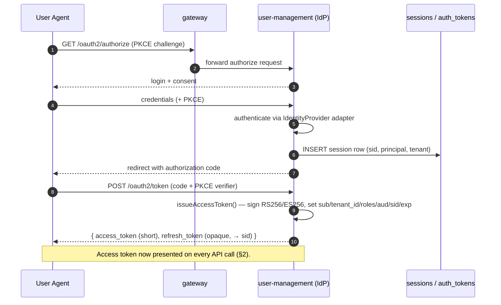

# 05 — Authentication & Authorization Flow

> How a request proves **who it is** (authentication) and **what it may do**
> (authorization) across the Aegis platform. This document is the request-path
> companion to the access-control model in
> [`03-access-control-model.md`](03-access-control-model.md) and the
> service-to-service trust layer in
> [`06-service-to-service.md`](06-service-to-service.md). Tenant isolation in
> the database is covered in [`04-multi-tenancy.md`](04-multi-tenancy.md).

Aegis separates the two concerns deliberately:

| Concern | Question | Where it lives |
|---|---|---|
| **Authentication (AuthN)** | *Who is calling?* | Reference IdP in **user-management**; verified by **gateway** and re-verified in **every service** |
| **Authorization (AuthZ)** | *May this principal perform this action on this resource?* | `@aegis/access-control` **PDP**, invoked by per-service **PEP** guards, backstopped by **PostgreSQL RLS** |

The guiding principle is **defense in depth**: the gateway validates tokens at
the edge, but no downstream service ever trusts a header blindly — each one
re-validates the signed JWT, re-derives the principal, calls the PDP, and lets
the database enforce tenant scope a second time. An app bug, a forged header, or
a compromised internal hop cannot, on its own, leak data or escalate privilege.

---

## 1. Authentication

### 1.1 Reference IdP inside user-management (pluggable adapters)

`user-management` is the platform's identity **system of record** and ships a
**reference Identity Provider** so Aegis runs end-to-end out of the box (see
[`SPEC.md`](../SPEC.md) §2.4). The IdP is intentionally thin and sits behind a
**pluggable adapter interface** so an operator can swap it for a managed IdP
(Keycloak / Auth0 / Cognito) without touching any business service — every
service only ever depends on the **OIDC discovery document** and the **JWKS**
endpoint, never on the IdP's internals.



```typescript
// libs/service-core (shared contract) — the only surface a service depends on.
// Concrete adapters live in user-management; business services never import them.
export interface IdentityProvider {
  /** OIDC discovery — issuer, jwks_uri, supported algs, endpoints. */
  discovery(): Promise<OidcDiscoveryDocument>;
  /** Public verification keys (rotated); served at jwks_uri. */
  jwks(): Promise<JwkSet>;
  /** Exchange an OIDC authorization code for tokens (Authorization Code + PKCE). */
  exchangeCode(code: string, pkceVerifier: string): Promise<TokenSet>;
  /** Mint a short-lived access token for an authenticated principal. */
  issueAccessToken(principal: AuthenticatedPrincipal): Promise<SignedJwt>;
  /** Rotate a refresh token (server-side session row consulted). */
  refresh(refreshToken: string): Promise<TokenSet>;
  /** Revoke a session/token row (authoritative revocation source). */
  revoke(sessionId: string): Promise<void>;
}
```

Adapters are selected by configuration and registered in the InversifyJS
container, mirroring the rest of the codebase's `@provideSingleton` DI pattern.

### 1.2 OIDC / OAuth2

Authentication uses **OpenID Connect** over **OAuth 2.0** with the
**Authorization Code flow + PKCE** for interactive logins and the
**Client Credentials** / **Token Exchange** grants for machine and internal
flows (the latter is detailed in
[`06-service-to-service.md`](06-service-to-service.md)). The reference IdP
exposes a standard OIDC surface:

| Endpoint | Purpose |
|---|---|
| `/.well-known/openid-configuration` | OIDC discovery document |
| `/oauth2/authorize` | Authorization Code + PKCE entry point |
| `/oauth2/token` | Code → token, refresh, client-credentials, token-exchange grants |
| `/oauth2/jwks` | JWKS (public keys for signature verification) |
| `/oauth2/revoke` | Token / session revocation |

Provider claims (whatever a managed IdP returns) are **mapped to internal
claims** by the adapter, so the rest of the platform sees a single, stable claim
shape regardless of which IdP is plugged in.

### 1.3 Short-lived RS256 / ES256 JWTs

Access tokens are **short-lived** (default 10 minutes) and signed with an
**asymmetric** algorithm — **RS256** or **ES256** — so that the private signing
key never leaves the IdP and every consumer verifies with a **public** key only.
Symmetric (HS256) signing is deliberately avoided: a shared secret distributed
to nine services is nine times the leak surface and gives any holder the power
to *mint* tokens, not merely verify them.

- **Access token** — short TTL, asymmetric signature, carries authorization-
  relevant claims (below). This is the token presented on every API call.
- **Refresh token** — opaque, longer-lived, bound to a **server-side session
  row** (`sessions` / `auth_tokens`) so it can be revoked instantly (§1.6).

Short TTLs bound the blast radius of a leaked access token without a per-request
revocation lookup; the refresh path is where revocation is actually enforced.

### 1.4 JWKS validation

Every verifier (the gateway and each service) fetches the IdP's **JWKS** from
`jwks_uri`, caches it keyed by **`kid`**, and refreshes on cache miss or on a
periodic interval so **key rotation** is transparent. Verification is fully
**local** — no network round-trip to the IdP on the hot path:

1. Read the JWT header `kid`; select the matching public key from cached JWKS
   (fetch + cache on miss).
2. Verify the signature with **RS256/ES256 only** — the accepted-algorithms list
   is pinned, defeating `alg: none` and algorithm-confusion (e.g. RS→HS)
   attacks.
3. Validate registered claims: `iss` (expected issuer), `exp`/`nbf` (with small
   clock skew), and `aud` (§1.5).

```typescript
// libs/service-core — shared, used identically by gateway and every service.
import { createRemoteJWKSet, jwtVerify, type JWTPayload } from 'jose';

export function makeJwksVerifier(opts: { issuer: string; jwksUri: string }) {
  // Cached, auto-rotating remote JWKS keyed by `kid`.
  const jwks = createRemoteJWKSet(new URL(opts.jwksUri));

  return async function verify(token: string, audience: string): Promise<JWTPayload> {
    const { payload } = await jwtVerify(token, jwks, {
      issuer: opts.issuer,
      audience,                       // per-service `aud` check (§1.5)
      algorithms: ['RS256', 'ES256'], // pin algs: no `none`, no HS confusion
      clockTolerance: 5,              // seconds of allowed skew
    });
    return payload;
  };
}
```

### 1.5 Per-service `aud` check

Each service is its own **OAuth audience**. A token minted for `expense`
(`aud: "aegis:expense"`) **must be rejected** by `payroll`, even though both
trust the same issuer and JWKS. This is what makes a leaked or over-scoped token
harmless outside its intended service, and it is the foundation for the
**downscope-and-re-audience** token-exchange pattern on internal hops
([`06-service-to-service.md`](06-service-to-service.md)).

| Service | Expected `aud` |
|---|---|
| gateway | `aegis:gateway` (or the per-service `aud` it is forwarding) |
| user-management | `aegis:user-management` |
| expense | `aegis:expense` |
| payroll | `aegis:payroll` |
| invoice | `aegis:invoice` |
| reporting | `aegis:reporting` |
| workflow | `aegis:workflow` |
| notification | `aegis:notification` |

The `audience` argument in `makeJwksVerifier` above is the service's own
identifier; `jose` rejects any token whose `aud` does not include it.

### 1.6 Claims and optional server-side session validation (revocation)

The internal access-token claim set is small and stable:

| Claim | Meaning |
|---|---|
| `sub` | Stable principal id (the user) — never an email or mutable handle |
| `tenant_id` | The active tenant (isolation boundary) for this request |
| `roles` | Role names granted to the principal in `tenant_id` |
| `aud` | Intended service audience (§1.5) |
| `exp` / `iat` / `nbf` | Lifetime window (short) |
| `iss` | The Aegis IdP issuer URL |
| `sid` | Session id → the `sessions` row (enables revocation, §1.6) |
| `act` *(optional)* | Acting service, on delegated internal tokens (`sub`+`act`) |

**Example access-token payload:**

```json
{
  "iss": "https://idp.aegis.internal/",
  "sub": "9f1c2e7a-3b44-4c8e-9a2d-7e5b1c0a6f31",
  "tenant_id": "b3d8a1f0-12c4-4e9a-8f77-2a6c9d4e1b55",
  "roles": ["expense.approver", "member"],
  "aud": "aegis:expense",
  "sid": "5e2b9c44-7a10-4d3f-bd61-0c8e2f9a1d77",
  "scope": "expense.report.read expense.report.approve",
  "iat": 1782489600,
  "nbf": 1782489600,
  "exp": 1782490200
}
```

Stateless verification (signature + `aud` + `exp`) is the fast path. Because
access tokens are short-lived, that alone is usually enough. For
**revocation before JWT expiry** — a fired employee, a stolen device, a forced logout —
Aegis supports **optional server-side session validation**: the verifier looks
up `sid` in the `sessions` / `auth_tokens` table and rejects the request if the
row is missing, inactive, or expired. This trades a cache/DB read for immediate
kill-switch semantics and is enabled selectively (always-on for `payroll`, which
holds the highest-sensitivity PII; opt-in elsewhere), with a short TTL cache to
keep the hot path fast and **fail-closed** if the store is unreachable.



---

## 2. Authorization

Authentication establishes *who*. Authorization decides *what they may do*, and
it is enforced **twice on the request path plus once in the database**:

1. **Gateway (edge):** validate the token, reject anything unauthenticated or
   for the wrong audience, mint/propagate the correlation id, route.
2. **Service (PEP):** **re-validate** the token via JWKS (never trust the edge
   blindly), rebuild the request context, then call the **PDP** through an
   `authorize(permission, …)` guard before the handler runs.
3. **Database (RLS):** the query runs as a non-owner role with
   `SET LOCAL app.current_tenant`, so even a logic bug cannot cross tenants
   (see [`04-multi-tenancy.md`](04-multi-tenancy.md)).

The PDP / PEP / PAP / PIP split, the RBAC + ABAC model, and the
`domain.action` permission vocabulary are defined in
[`03-access-control-model.md`](03-access-control-model.md); this section shows
how they are wired into the request path.

### 2.1 Authorized call — gateway → service → PDP → RLS

```mermaid
sequenceDiagram
  autonumber
  participant U as User Agent
  participant GW as gateway (edge)
  participant SVC as expense (PEP)
  participant PDP as @aegis/access-control (PDP)
  participant PIP as PIP (attributes)
  participant DB as PostgreSQL (RLS)

  U->>GW: POST /expense/reports/{id}/approve  (Bearer access_token)
  Note over GW: Edge validation
  GW->>GW: JWKS verify sig + iss + exp; check aud
  alt invalid / wrong aud
    GW-->>U: 401 Unauthorized (fail-closed)
  else valid
    GW->>GW: mint X-Correlation-Id (per business request)
    GW->>SVC: forward + Bearer token + X-Correlation-Id / X-Trace-Id
  end

  Note over SVC: Defense in depth — re-validate, do NOT trust headers
  SVC->>SVC: JWKS re-verify (aud = aegis:expense); strict header validation
  SVC->>SVC: build RequestContext { tenantId, userId, roles, correlationId }
  SVC->>SVC: PEP guard authorize('expense.report.approve', { resourceLoader })

  SVC->>PDP: decide(principal, action, resource, context)
  PDP->>PIP: fetch attributes (role grants, ownership, approval limit)
  PIP-->>PDP: principal + resource attributes
  PDP->>PDP: RBAC (role grants action?) + ABAC (amount ≤ limit, own tenant, status)
  PDP-->>SVC: { allow: true, obligations: [maskColumns?] }

  alt deny
    SVC-->>U: 403 Forbidden  (audit: decision + permissions-at-time)
  else allow
    SVC->>DB: BEGIN; SET LOCAL app.current_tenant = tenantId
    SVC->>DB: UPDATE expense_reports ... (RLS predicate auto-applied)
    DB-->>SVC: rows (tenant-scoped; cross-tenant impossible)
    SVC->>DB: COMMIT
    SVC-->>U: 200 OK  (audit: actor, intent, decision, permissions-at-time)
  end
```

Key properties visible in the flow:

- **Two independent token validations** — the edge check is a fast reject; the
  service check is authoritative and re-derives the principal from the *token*,
  not from forwarded headers. Headers carry **context** (correlation id, trace
  id), never **authority**.
- **Strict header validation** — required context headers are asserted by the
  context middleware and **fail closed** if missing or malformed; nothing is
  defaulted to `UNKNOWN` (see [`SPEC.md`](../SPEC.md) §6).
- **The PDP is fail-closed and cacheable** — `decide(...)` is pure; the PEP may
  cache verdicts with a short, context-bound TTL and **denies if the cache
  expires or the PDP is unreachable**.
- **`X-Correlation-Id`** is the single business-request id minted at the edge and
  propagated unchanged through every hop and async message so logs, traces, and
  audit entries stitch together. It is distinct from `X-Trace-Id` (the
  OpenTelemetry span id); there is **no** `X-Trend`/`X-Tracker` header.

### 2.2 The `authenticate → authorize` chain (TypeScript)

Every route is wrapped `authenticate → authorize(permission, …) → handler`
([`SPEC.md`](../SPEC.md) §9; only `/health` and docs are exempt). The middleware
below lives in `@aegis/service-core` (`authenticate`) and `@aegis/access-control`
(`authorize` / the PEP), so every service composes the identical chain.

```typescript
// @aegis/service-core — authenticate: re-validate the token, build RequestContext.
import type { RequestHandler } from 'express';
import { makeJwksVerifier } from './jwks';
import { runWithContext } from './request-context';
import { Unauthorized } from './errors';

export function authenticate(audience: string): RequestHandler {
  const verify = makeJwksVerifier({
    issuer: config.idp.issuer,
    jwksUri: config.idp.jwksUri,
  });

  return async (req, _res, next) => {
    const bearer = req.header('Authorization');
    if (!bearer?.startsWith('Bearer ')) throw new Unauthorized('missing bearer token');

    // Defense in depth: re-verify the signed token; do NOT trust gateway headers.
    const claims = await verify(bearer.slice(7), audience); // sig + iss + exp + aud

    // Optional server-side session check for revocation-before-expiry.
    if (config.session.validate) {
      const active = await sessions.isActive(claims.sid as string);
      if (!active) throw new Unauthorized('session revoked'); // fail-closed
    }

    // Strict header validation happens in the context middleware; here we seed
    // the principal from the *token*, the correlation id from the verified header.
    runWithContext(
      {
        tenantId: claims.tenant_id as string,
        userId: claims.sub as string,
        roles: (claims.roles as string[]) ?? [],
        correlationId: req.header('X-Correlation-Id')!, // asserted upstream, fail-closed
      },
      () => next(),
    );
  };
}
```

```typescript
// @aegis/access-control — authorize (the PEP): load the resource, call the PDP,
// enforce the verdict, apply obligations, and audit the decision.
import type { RequestHandler } from 'express';
import { getContext } from '@aegis/service-core';
import { pdp } from './pdp';          // decide(principal, action, resource, context)
import { audit } from './audit';
import { Forbidden } from '@aegis/service-core';

type AuthorizeOpts<R> = { resourceLoader?: (req) => Promise<R> };

export function authorize<R = unknown>(
  permission: string,                  // dotted domain.action, e.g. 'expense.report.approve'
  opts: AuthorizeOpts<R> = {},
): RequestHandler {
  return async (req, res, next) => {
    const ctx = getContext();
    const principal = {
      userId: ctx.userId,
      tenantId: ctx.tenantId,
      roles: ctx.roles,
    };
    const resource = opts.resourceLoader ? await opts.resourceLoader(req) : undefined;

    // PDP: pure, cacheable, fail-closed. RBAC (role → permission) + ABAC conditions.
    const verdict = await pdp.decide(principal, permission, resource, {
      ip: req.ip,
      now: new Date(),
      correlationId: ctx.correlationId,
    });

    await audit.record({                // permissions-at-time-of-action, tamper-evident
      actor: principal.userId,
      tenantId: principal.tenantId,
      intent: permission,
      decision: verdict.allow ? 'ALLOW' : 'DENY',
      reason: verdict.reason,
      correlationId: ctx.correlationId,
    });

    if (!verdict.allow) throw new Forbidden(verdict.reason ?? permission);

    // Obligations (e.g. column masking) ride downstream on the context.
    res.locals.obligations = verdict.obligations ?? [];
    next();
  };
}
```

```typescript
// apps/expense/src/controllers — the composed chain on a route.
// authenticate → authorize(permission) → handler. Tenant scope is then enforced
// AGAIN by RLS inside the repository transaction (SET LOCAL app.current_tenant).
router.post(
  '/reports/:id/approve',
  authenticate('aegis:expense'),
  authorize('expense.report.approve', {
    resourceLoader: (req) => expenseReports.loadHeader(req.params.id),
  }),
  expenseController.approve, // handler runs only on ALLOW; query is tenant-scoped by RLS
);
```

> **Scope note.** In Aegis the expense domain is **header-level**: an expense
> report carries a status state machine and an approval binding, but there are
> **no GL codes and no document-extracted line items** (see
> [`SPEC.md`](../SPEC.md) §10 and [`07-data-models.md`](07-data-models.md)).
> Authorization therefore reasons over the report **header** — owner, tenant,
> status, and the approver's **approval limit** — not over line-item data. The
> ABAC condition `amount ≤ approval_limit` reads the header total.

### 2.3 Refresh and revocation

The access token is short-lived; the **refresh token** is the long-lived,
revocable credential, and it is always checked against the **server-side session
row**. Revocation (logout, admin kill, credential rotation) flips the session row
inactive — the next refresh fails, and (where session validation is enabled) the
*current* access token is rejected on its next call too.

```mermaid
sequenceDiagram
  autonumber
  participant U as User Agent
  participant GW as gateway
  participant UM as user-management (IdP)
  participant DB as sessions / auth_tokens
  participant SVC as any service

  Note over U,UM: Refresh — exchange a refresh token for a fresh short-lived access token
  U->>GW: POST /oauth2/token (grant_type=refresh_token)
  GW->>UM: forward
  UM->>DB: SELECT session WHERE sid = ... AND active = true
  alt session inactive / missing
    DB-->>UM: none
    UM-->>U: 401 invalid_grant (must re-authenticate)
  else session active
    DB-->>UM: row
    UM->>UM: rotate refresh token; issueAccessToken() (new exp)
    UM->>DB: UPDATE session (rotate, last_used_at)
    UM-->>U: { access_token (new, short), refresh_token (rotated) }
  end

  Note over U,SVC: Revocation — instant kill switch
  U->>GW: POST /oauth2/revoke (sid)  %% or admin-initiated
  GW->>UM: forward
  UM->>DB: UPDATE session SET active = false WHERE sid = ...
  UM-->>U: 200 OK
  Note over SVC,DB: Next call with the old access token —
  SVC->>DB: session validation lookup (sid)
  DB-->>SVC: inactive
  SVC-->>U: 401 Unauthorized (revoked; fail-closed)
```

**Why this shape:**

- **Short access TTL + refresh rotation** keeps the common path stateless and
  fast while bounding a leaked access token to minutes.
- **Refresh tokens are rotated** on every use; a replayed (already-rotated)
  refresh token signals theft and invalidates the session family.
- **Revocation is authoritative at the session row**, so it works regardless of
  the access token's remaining lifetime when server-side validation is enabled —
  the mandatory mode for `payroll`.

---

## 3. Defense-in-depth summary

| Layer | Enforces | Failure mode |
|---|---|---|
| **gateway (edge)** | Token signature, `iss`, `exp`, `aud`; correlation id | Reject `401` before routing |
| **service `authenticate`** | Re-verify token via JWKS; per-service `aud`; optional session lookup | Reject `401`; **never** trust forwarded auth headers |
| **context middleware** | Required headers present + well-formed | **Fail-closed**, no `UNKNOWN` defaults |
| **service `authorize` (PEP)** | PDP verdict on `domain.action` + resource | Reject `403`; **fail-closed** on cache miss / PDP down |
| **PDP** | RBAC role→permission + ABAC conditions; obligations | Pure, cacheable, deny by default |
| **PostgreSQL RLS** | `tenant_id` scope via `SET LOCAL app.current_tenant` | Cross-tenant rows physically invisible |

No single layer is trusted to be sufficient. The token can be forged at the
edge and the service still rejects it; the PEP can be bypassed by a code bug and
RLS still confines the query to one tenant; the PDP can be unreachable and the
PEP **fails closed**. That redundancy — and the discipline that **headers carry
context, tokens carry authority** — is the core of the Aegis authn/authz story.

---

## Related documents

- [`03-access-control-model.md`](03-access-control-model.md) — RBAC + ABAC engine, PDP/PEP/PAP/PIP, permission vocabulary.
- [`04-multi-tenancy.md`](04-multi-tenancy.md) — `tenant_id` + PostgreSQL RLS (`SET LOCAL`, non-owner role, `FORCE ROW LEVEL SECURITY`).
- [`06-service-to-service.md`](06-service-to-service.md) — internal JWTs, context propagation, RFC 8693 token exchange, delegation (`sub`+`act`).
- [`08-api-conventions.md`](08-api-conventions.md) — route wrapping, error envelope, DTOs.
- [`10-auditability-and-compliance.md`](10-auditability-and-compliance.md) — hash-chained, tenant-scoped audit of every decision.
