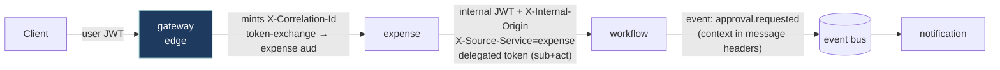

# 06 — Service-to-Service Security & Context Propagation

> **Scope.** How Aegis services authenticate *each other*, prove *on whose behalf*
> they act, and carry tenant/correlation context across HTTP hops **and** async
> event messages — without ever falling back to ambient authority.
>
> **Authoritative source:** [`SPEC.md`](../SPEC.md) §6 (Service-to-service & context
> propagation) and §10 (Amendments — 2026-06-26). If anything here conflicts with
> `SPEC.md`, the spec wins.
>
> **Related docs:**
> [`02-access-control-model.md`](02-access-control-model.md) (PDP/PEP/PAP/PIP) ·
> [`03-authn-and-tokens.md`](03-authn-and-tokens.md) (edge JWT + JWKS) ·
> [`04-multi-tenancy-rls.md`](04-multi-tenancy-rls.md) (tenant isolation) ·
> [`05-event-bus.md`](05-event-bus.md) (`@aegis/events`) ·
> [`08-audit.md`](08-audit.md) (tamper-evident audit) ·
> [`09-deployment-and-ops.md`](09-deployment-and-ops.md) (mTLS/SPIFFE rollout).

---

## 1. The two questions every internal call must answer

Aegis is a multi-tenant microservices platform: a single inbound business request
(e.g. *"submit expense report X"*) fans out into a chain of internal calls
(`expense → workflow → notification`) and async events. Each hop must answer two
**independent** questions, with two **independent** mechanisms:

| Question | Mechanism | Header / claim |
|---|---|---|
| **Which service is calling?** (transport identity) | mTLS + SPIFFE SVID *(infra)* and a signed **internal JWT** *(app)* gated by `X-Internal-Origin` + `X-Source-Service` | `X-Internal-Origin`, `X-Source-Service`, internal `Authorization` |
| **On whose behalf?** (principal identity) | the **propagated end-user / delegation token** + request-context headers | `Authorization` (user/delegated), `X-Tenant-Id`, `X-Caller` |

The cardinal rule, repeated throughout this doc: **mTLS answers *which service*, the
propagated token answers *on whose behalf*, and token exchange bounds *what that hop
may do*.** A service is never trusted merely because the call "came from inside the
network" (see [§8, Ambient authority](#8-the-ambient-authority-anti-pattern-and-how-aegis-avoids-it)).



---

## 2. The header contract

All header names live in the centralized **`HttpHeaderKey`** enum
(`@aegis/shared-enums`) — never as string literals — so a rename is a one-line
change and ingress validation can iterate a single authoritative list.

```ts
// libs/shared/enums/src/http-header-key.enum.ts
export enum HttpHeaderKey {
  // ── principal / context (propagated unchanged across hops) ──
  Authorization   = 'authorization',      // user JWT, delegated token, OR internal JWT
  TenantId        = 'x-tenant-id',         // active tenant (isolation boundary)
  CorrelationId   = 'x-correlation-id',    // business-request id (see §3)
  TraceId         = 'x-trace-id',          // OpenTelemetry trace id (distinct from above)
  Caller          = 'x-caller',            // immediate upstream caller label (audit/debug)

  // ── service-to-service auth (NOT propagated to the public edge) ──
  InternalOrigin  = 'x-internal-origin',   // origin gate: marks a call as internal
  SourceService   = 'x-source-service',    // typed enum: which service initiated the hop
}
```

> **There is no `X-Trend` and no `X-Tracker` header in Aegis.** Those were
> donor-domain concepts and are intentionally absent. Correlation is carried by
> **`X-Correlation-Id`** alone (see §3). There is also **no `entryContext`** field
> on the request context — strict header validation replaces it (§6).

### 2.1 `X-Source-Service` is a typed enum

`X-Source-Service` carries the *initiating* service identity for audit attribution.
Its value is constrained to a typed enum, so audit records and access decisions can
never be polluted by an arbitrary string:

```ts
// libs/shared/enums/src/source-service.enum.ts
export enum SourceService {
  Gateway        = 'gateway',
  UserManagement = 'user-management',
  Expense        = 'expense',
  Payroll        = 'payroll',
  Reporting      = 'reporting',
  Workflow       = 'workflow',
  Notification   = 'notification',
  Invoice        = 'invoice',
}
```

Ingress asserts `X-Source-Service ∈ SourceService`; anything else is rejected
fail-closed. This is the de-branded successor to the donor's source-service header
(no `core`/`engine`/`auditor` values, no self-attribution special-casing).

---

## 3. `X-Correlation-Id` — definition (read this once)

**`X-Correlation-Id` is the business-request id.** It is:

- **Minted once, at the edge.** The **gateway** generates exactly one
  `X-Correlation-Id` (a UUID v4) per inbound business request, immediately after
  authenticating the caller and before routing to any service.
- **Propagated unchanged** through *every* downstream HTTP hop **and** copied onto
  *every* async event message published while handling that request. It is never
  regenerated mid-chain. If an inbound internal request already carries one, the
  context middleware *adopts* it rather than minting a new one.
- **The stitching key.** All logs, traces, audit entries, and notifications for one
  logical operation share the same `X-Correlation-Id`, so an operator (or the audit
  reader) can reconstruct the entire fan-out — across services and across the
  event bus — from a single id.

**`X-Correlation-Id` is distinct from `X-Trace-Id`:**

| | `X-Correlation-Id` | `X-Trace-Id` |
|---|---|---|
| Identifies | the **business request** (one logical operation) | the **OpenTelemetry trace** (a span tree) |
| Minted by | the gateway, at the edge | the OTel SDK / propagated `traceparent` |
| Lifetime | the whole user-visible operation, incl. async hops | one trace; child spans get new span ids |
| Audience | audit, support, business log stitching | distributed-tracing backend (latency/topology) |
| Survives queue hops | **yes** — copied onto event headers | yes, via OTel context propagation |

A request can have one correlation id spanning multiple traces (e.g. a deferred
worker re-creates a trace but keeps the correlation id), which is exactly why we
keep them separate.

> Reminder: **no `X-Trend` / `X-Tracker`.** Correlation = `X-Correlation-Id`;
> tracing = `X-Trace-Id`.

---

## 4. The request context

`@aegis/service-core` exposes an **AsyncLocalStorage**-backed `RequestContext`,
populated identically whether the request arrived over HTTP or as an event message.
It carries exactly these fields (no `entryContext`):

```ts
// libs/service-core/src/context/request-context.ts
export interface RequestContext {
  tenantId:      string;          // X-Tenant-Id      (isolation boundary)
  userId:        string | null;   // sub of the principal token
  roles:         string[];        // roles claim (for fast RBAC short-circuits)
  correlationId: string;          // X-Correlation-Id (business-request id)
  traceId:       string;          // X-Trace-Id       (OTel)
  caller:        string | null;   // X-Caller         (immediate upstream label)
  sourceService: SourceService | null; // X-Source-Service (audit attribution)
  isInternal:    boolean;         // true iff X-Internal-Origin gate passed
  actor:         { sub: string; act?: string } | null; // delegation: who + acting-svc
}
```

Anything that needs context (the logger, the outbound `HttpClient`, the event
publisher, the audit writer, RLS `SET LOCAL app.current_tenant`) reads it from
`RequestContext.current()` rather than threading parameters by hand. This is how
the same `correlationId` and `tenantId` reach an outbound call or a published event
**without the business code touching headers at all**.

---

## 5. Internal authentication (the "which service" half)

### 5.1 Signed internal JWT — *not* an empty-payload token

Internal calls carry a **signed internal JWT** with real, verifiable claims:

```jsonc
// decoded internal JWT
{
  "iss": "aegis-internal",            // issuer — minted by an Aegis service
  "aud": "workflow",                  // audience — the TARGET service (re-audienced)
  "sub": "svc:expense",              // the calling workload identity
  "iat": 1782700000,
  "exp": 1782700060,                  // short-lived (≈60s); NEVER allow-expired
  "tenant_id": "5f0c…",              // tenant the call operates within
  "scope": "workflow.approval.request" // least-privilege scope for this hop
}
```

This is a deliberate upgrade over the donor pattern (an *empty* payload signed with
a shared secret, verified with `allowExpired=true` — i.e. "possession of the secret
is the only proof"). Aegis tokens are **issuer/audience/exp-bearing**, short-lived,
and **never accepted past `exp`**, so a leaked token has a tiny blast radius and the
audience claim stops it being replayed at a different service.

### 5.2 Two-part gate: origin header + verified token

A call is treated as internal **only if both** hold:

1. `X-Internal-Origin` is present and equal to the expected origin marker
   (`aegis-internal`) — a cheap, fail-fast gate that lets us short-circuit before
   crypto; and
2. the internal `Authorization` JWT verifies (signature via the internal JWKS,
   `iss === 'aegis-internal'`, `aud === <this service>`, `exp` in the future).

`X-Internal-Origin` alone proves nothing (a header is trivially forged) — it is a
*router/short-circuit* hint, **not** a trust decision. Trust comes from the verified
JWT (and, at the transport layer, from mTLS — §7). `X-Source-Service` is then
recorded for audit attribution but is *also* never a trust input.

### 5.3 Internal-auth + strict-header middleware (TypeScript)

```ts
// libs/service-core/src/middleware/internal-auth.middleware.ts
import { Request, Response, NextFunction } from 'express';
import { HttpHeaderKey, SourceService } from '@aegis/shared-enums';
import { ErrorUtils } from '@aegis/service-core';
import { verifyInternalToken } from '../auth/internal-jwt';
import { RequestContext } from '../context/request-context';

const INTERNAL_ORIGIN = 'aegis-internal';

/**
 * STRICT HEADER VALIDATION at ingress — fail-closed.
 * Required context headers are asserted for EVERY request; missing/malformed
 * values are rejected (never defaulted to "UNKNOWN").
 */
export function validateRequiredHeaders(req: Request, _res: Response, next: NextFunction) {
  const required = [HttpHeaderKey.TenantId, HttpHeaderKey.CorrelationId];
  for (const key of required) {
    const value = req.get(key);
    if (!value || !value.trim()) {
      // 400, fail-closed: we do NOT invent a tenant or a correlation id here.
      return next(ErrorUtils.badRequest('MISSING_HEADER', `Required header ${key} is absent`));
    }
  }

  // X-Source-Service, when present, MUST be a known service (typed enum).
  const src = req.get(HttpHeaderKey.SourceService);
  if (src && !Object.values(SourceService).includes(src as SourceService)) {
    return next(ErrorUtils.badRequest('BAD_SOURCE_SERVICE', `Unknown source service "${src}"`));
  }
  next();
}

/**
 * Internal-auth gate: origin header + verified signed internal JWT.
 * Marks the request internal ONLY when the token verifies for THIS audience.
 */
export function internalAuth(thisService: SourceService) {
  return async (req: Request, _res: Response, next: NextFunction) => {
    const origin = req.get(HttpHeaderKey.InternalOrigin);
    if (origin !== INTERNAL_ORIGIN) {
      // Not an internal call → fall through to the normal end-user auth chain.
      return next();
    }

    const authz = req.get(HttpHeaderKey.Authorization) ?? '';
    const token = authz.startsWith('Bearer ') ? authz.slice(7) : '';
    try {
      // Verifies signature (internal JWKS), iss=aegis-internal, aud=thisService, exp.
      const claims = await verifyInternalToken(token, { audience: thisService });

      const ctx = RequestContext.current();
      ctx.isInternal = true;
      ctx.sourceService = (req.get(HttpHeaderKey.SourceService) as SourceService) ?? null;
      ctx.actor = { sub: claims.sub, act: claims.act }; // delegation: who + acting-svc
      // tenantId/correlationId already set by the context middleware from headers.
      return next();
    } catch (err) {
      // Fail-closed: a present-but-invalid internal token is a hard 401.
      return next(ErrorUtils.unauthorized('BAD_INTERNAL_TOKEN', 'Internal token rejected'));
    }
  };
}
```

Wired into every service's middleware chain **before** the PEP `authorize(...)`
guard:

```
context → validateRequiredHeaders → internalAuth(thisSvc) → authenticate → authorize(permission) → handler
```

`validateRequiredHeaders` runs first so a malformed request is rejected before any
auth crypto; `internalAuth` either marks the request internal (delegation context
populated) or defers to the normal end-user `authenticate` path.

---

## 6. Strict header validation at ingress (fail-closed)

Per [`SPEC.md`](../SPEC.md) §6 and §10.2, the context middleware **asserts required
headers and fails closed** — it never defaults a missing tenant or correlation id to
`"UNKNOWN"`. Concretely, on HTTP **and** event ingress:

- `X-Tenant-Id` **must** be present and non-empty → else `400 MISSING_HEADER`. A
  request with no tenant cannot be safely authorized *or* used to `SET LOCAL
  app.current_tenant` for RLS, so it is rejected rather than guessed.
- `X-Correlation-Id` **must** be present on internal hops (the gateway guarantees it
  on edge ingress; see §3). If somehow absent at the edge, the gateway mints it; if
  absent on an *internal* hop, that is a contract violation → `400`.
- `X-Source-Service`, if present, **must** be a member of the `SourceService` enum.
- The internal `Authorization` token, if `X-Internal-Origin` is set, **must** verify
  (§5). Present-but-invalid → `401`, never "treat as anonymous".

Fail-closed is the whole point: a defaulted/blank tenant or a silently-dropped
correlation id is a tenant-isolation and audit hole. We make the missing-context
case *loud and terminal*.

---

## 7. The outbound call — context-propagating `HttpClient`

`@aegis/service-core` ships a `HttpClient` that reads `RequestContext.current()` and
**automatically** stamps every outbound request with the propagation headers + a
freshly-minted, audience-scoped internal token. Business code calls
`http.post(service, path, body)` and never touches a header.

```ts
// libs/service-core/src/http/http-client.ts
import axios, { AxiosRequestConfig } from 'axios';
import { HttpHeaderKey, SourceService } from '@aegis/shared-enums';
import { RequestContext } from '../context/request-context';
import { mintInternalToken } from '../auth/internal-jwt';

const INTERNAL_ORIGIN = 'aegis-internal';

export class HttpClient {
  constructor(private readonly thisService: SourceService) {}

  /** Internal POST to a sibling service, carrying full context + internal token. */
  async post<T>(target: SourceService, baseUrl: string, path: string, body: unknown): Promise<T> {
    const ctx = RequestContext.current();

    // Token exchange (RFC 8693): downscope + re-audience for THIS hop only.
    const internalToken = await mintInternalToken({
      audience: target,                 // re-audience to the callee
      tenantId: ctx.tenantId,
      // delegation: original user (sub) + acting service (act) — never impersonation
      subject:  ctx.actor?.sub ?? ctx.userId ?? `svc:${this.thisService}`,
      actor:    this.thisService,
      scope:    scopeForHop(this.thisService, target, path), // least privilege
    });

    const config: AxiosRequestConfig = {
      baseURL: baseUrl,
      headers: {
        // ── context propagated UNCHANGED ──
        [HttpHeaderKey.TenantId]:      ctx.tenantId,
        [HttpHeaderKey.CorrelationId]: ctx.correlationId,   // business-request id
        [HttpHeaderKey.TraceId]:       ctx.traceId,         // OTel trace id
        [HttpHeaderKey.Caller]:        this.thisService,    // immediate upstream
        // ── internal-auth (the "which service" half) ──
        [HttpHeaderKey.InternalOrigin]: INTERNAL_ORIGIN,
        [HttpHeaderKey.SourceService]:  ctx.sourceService ?? this.thisService,
        [HttpHeaderKey.Authorization]: `Bearer ${internalToken}`,
      },
    };
    const res = await axios.post<T>(path, body, config);
    return res.data;
  }
}
```

Notes:

- **`X-Correlation-Id` and `X-Tenant-Id` are copied verbatim** from context — the
  business-request id is preserved across the hop (§3), and the tenant boundary
  travels with the call so the callee's RLS can re-assert it.
- **`X-Source-Service`** keeps the *initiating* service when set (so a 3-hop chain
  still attributes to the originator), defaulting to `this.thisService` on the first
  internal hop. **`X-Caller`** is always the *immediate* upstream — the two differ on
  hop ≥ 2, which is exactly what audit wants.
- The internal token is **re-audienced and downscoped per hop** (§9) — `expense`
  does not hand `workflow` a token that also works against `payroll`.

---

## 8. The ambient-authority anti-pattern (and how Aegis avoids it)

**Ambient authority** is a service acting on *implicit, positional* authority:

- *"any call that reached me from inside the cluster is trusted"* (network position
  as authority), or
- a service using its **own broad credentials** to act for *any* user, without
  carrying explicit, verified end-user/tenant context.

This collapses zero-trust: one compromised pod, or one SSRF that reaches an internal
URL, becomes "act as anyone, in any tenant." Aegis structurally forbids it:

| Ambient-authority temptation | Aegis countermeasure |
|---|---|
| Trust the call because it's "internal" | `X-Internal-Origin` is a **router hint only**; trust requires a **verified, audience-scoped internal JWT** (§5) and, at transport, an **mTLS SVID** (§7-mTLS below). |
| Service acts as a god-user for everyone | Calls carry a **delegated token** (`sub`+`act`, §9) — authority is scoped to *the verified principal*, per request. No god-credential. |
| Downstream re-derives "who's allowed" from network trust | The **PEP `authorize(...)`** still runs on every internal route against the PDP using the *propagated* principal/tenant. Internal-ness is never an authorization bypass. |
| `notification` decides for itself who may be notified | `notification` **consumes already-authorized events** and the verified propagated context; it **never re-derives authority** (matches [`SPEC.md`](../SPEC.md) §2.5). |
| Broad token reused across all hops | **Token exchange** re-audiences + downscopes per hop (§9) — a leaked hop-token can't be replayed elsewhere. |
| Static shared secret in env/config ("Secret Zero") | mTLS via **SPIFFE/SPIRE** issues short-lived, auto-rotated SVIDs — no long-lived baked secret (§7-mTLS). |

The slogan, again: **mTLS = which service · propagated token = on whose behalf ·
token-exchange downscope = what this hop may do.** All three are required; none is
implied by network position.

### 7-mTLS. mTLS + SPIFFE/SPIRE

Below the application JWT, Aegis terminates **mutual TLS** between every service:

- **SPIFFE** gives each workload a stable identity — a SPIFFE ID like
  `spiffe://aegis/ns/prod/sa/workflow`.
- **SPIRE** is the runtime that *attests* a workload (verifies it really is the
  workflow service, by node + process selectors) and issues a **short-lived X.509
  SVID**. SVIDs auto-rotate, so there is no long-lived secret to steal — this is the
  answer to the "Secret Zero" problem.
- mTLS proves **which service** is on the other end of the socket and encrypts the
  hop. The application-layer internal JWT (§5) and the propagated user/delegation
  token (§9) then prove **on whose behalf**.

In a service mesh (Istio/Linkerd) the sidecar enforces mTLS transparently; the
internal JWT and context headers ride *inside* the mTLS tunnel. mTLS is an
operational/infra concern (rollout in
[`09-deployment-and-ops.md`](09-deployment-and-ops.md)); the app code above is
mesh-agnostic and works with or without it, because Aegis never *depends* on network
position for authorization.

---

## 9. Token exchange (RFC 8693): downscope, re-audience, delegate

Internal hops use **OAuth 2.0 Token Exchange (RFC 8693)** to swap the inbound token
for a *narrower* one bound to the next callee. Two invariants:

1. **Never broader than the original** — downscope only. `expense → workflow` gets a
   token scoped to `workflow.approval.request`, not "everything expense could do".
2. **Re-audience** — set `aud` to the *target* service so the new token is useless
   against any other service if leaked.

And we **prefer delegation over impersonation**:

- **Delegation** — the exchanged token carries **`sub`** (the original end user)
  *and* **`act`** (the acting service): *"workflow is acting **on behalf of** user U,
  invoked **by** expense"*. The audit trail reads cleanly: *who* did it and *which
  service* carried it out.
- **Impersonation** — `sub` only, no `act`. The actor identity is *lost*. Aegis
  uses delegation everywhere a user principal exists; pure service-to-service jobs
  (e.g. a scheduled reporting export with no user) use a workload subject
  (`svc:reporting`) with the same downscope/re-audience rules.

```jsonc
// RFC 8693 token-exchange request (gateway or service → IdP/token endpoint)
{
  "grant_type":           "urn:ietf:params:oauth:grant-type:token-exchange",
  "subject_token":        "<inbound user JWT>",
  "subject_token_type":   "urn:ietf:params:oauth:token-type:jwt",
  "actor_token":          "<this service's SVID-backed assertion>",
  "actor_token_type":     "urn:ietf:params:oauth:token-type:jwt",
  "audience":             "workflow",                  // re-audience to the callee
  "scope":                "workflow.approval.request"  // downscope (least privilege)
}
```

```jsonc
// resulting delegated token (decoded) — sub + act = clean audit
{
  "iss": "aegis-internal",
  "aud": "workflow",
  "sub": "user-7c2…",           // the ORIGINAL end user
  "act": { "sub": "svc:expense" }, // the ACTING service
  "tenant_id": "5f0c…",
  "scope": "workflow.approval.request",
  "exp": 1782700060
}
```

This is the same downscope/re-audience discipline used by the **`@aegis/connectors`**
ERP framework: each connector hop pushes through service-to-service auth + context
propagation with idempotency keys, and each connector's outbound auth uses *its own*
configured scheme — there is no global `X-Trend`-style header (see
[`SPEC.md`](../SPEC.md) §10.3 and [`services/connectors.md`](services/connectors.md)).

---

## 10. Context propagation over the event bus

Async hops must preserve the same guarantees as HTTP hops. The **`@aegis/events`**
bus copies the propagation context onto **message headers** at publish time and
re-hydrates the `RequestContext` at consume time — so a notification produced by a
queue worker shares the originating request's `X-Correlation-Id` and `X-Tenant-Id`,
and the consumer still runs strict header validation + fail-closed.

```ts
// libs/events/src/publish.ts (sketch)
import { RequestContext } from '@aegis/service-core';
import { HttpHeaderKey } from '@aegis/shared-enums';

export async function publish<T>(topic: EventTopic, payload: T): Promise<void> {
  const ctx = RequestContext.current();
  const message = {
    topic,
    payload,
    headers: {                                   // context travels with the message
      [HttpHeaderKey.TenantId]:      ctx.tenantId,
      [HttpHeaderKey.CorrelationId]: ctx.correlationId, // SAME business-request id
      [HttpHeaderKey.TraceId]:       ctx.traceId,
      [HttpHeaderKey.SourceService]: ctx.sourceService ?? null,
    },
    idempotencyKey: deriveIdempotencyKey(topic, payload),
  };
  await transactionalOutbox.enqueue(message); // see §10.2
}
```

On the consumer side, the event runtime re-hydrates context from `message.headers`
and runs the *same* `validateRequiredHeaders` assertions before invoking the
handler. A message missing `tenantId` is dead-lettered, **not** processed under a
guessed tenant.

### 10.1 Topic contracts

Every topic is a typed contract: a member of the `EventTopic` enum bound to a
versioned payload shape in `@aegis/shared-types`. Publishers and consumers share the
type, so a payload change is a compile-time break, not a runtime surprise.

```ts
// libs/shared/enums/src/event-topic.enum.ts
export enum EventTopic {
  ExpenseReportSubmitted = 'expense.report.submitted',
  ApprovalRequested      = 'approval.requested',
  ApprovalDecided        = 'approval.decided',
  NotificationRequested  = 'notification.requested',
}
```

```ts
// libs/shared/types/src/event.shape.ts
export namespace EventShape {
  export interface ApprovalRequested {
    version: 1;
    tenantId: string;            // mirrored in headers; the handler asserts they match
    approvalId: string;
    subjectType: 'expense_report' | 'invoice';
    subjectId: string;
    requestedBy: string;         // the original principal (sub)
  }
}
```

The handler registry maps **topic → typed handler**; an unknown topic or a payload
that fails its shape validator is rejected before any business logic runs. Full bus
mechanics live in [`05-event-bus.md`](05-event-bus.md).

### 10.2 Transactional outbox

We **never** publish to the bus and write the DB as two independent operations — that
risks a "phantom event" (published, then the txn rolls back) or a "lost event"
(committed, then the publish fails). Instead, the publish is an **outbox row written
in the same transaction** as the domain change; a relay drains the outbox to the
transport with at-least-once delivery, and consumers are **idempotent** (keyed on
`idempotencyKey`).

```mermaid
sequenceDiagram
  participant SVC as expense (handler)
  participant DB as Postgres (same txn)
  participant OBX as outbox table
  participant RLY as outbox relay
  participant BUS as event bus
  participant CON as workflow (consumer)

  SVC->>DB: BEGIN; SET LOCAL app.current_tenant
  SVC->>DB: INSERT expense_report (status=submitted)
  SVC->>OBX: INSERT outbox(topic=approval.requested, headers{correlationId,tenantId})
  SVC->>DB: COMMIT
  RLY->>OBX: poll unsent rows
  RLY->>BUS: publish(message)  %% at-least-once
  RLY->>OBX: mark sent
  BUS->>CON: deliver
  CON->>CON: validate headers (fail-closed) + dedupe on idempotencyKey
```

The outbox row carries the **same `correlationId` and `tenantId`** that were on the
originating request, so the eventual notification is stitched to the original
business operation, and the consumer transaction re-asserts the tenant for RLS.
Details: [`05-event-bus.md`](05-event-bus.md) and [`04-multi-tenancy-rls.md`](04-multi-tenancy-rls.md).

---

## 11. Worked example — `expense → workflow → notification`

A user submits an expense report. The gateway authenticates, mints the
`X-Correlation-Id`, token-exchanges to an `expense`-audience token, and routes in.
`expense` then calls `workflow` (sync, internal JWT) which emits an
`approval.requested` event that `notification` consumes (async, outbox) — all
carrying the *same* correlation id and tenant.

```mermaid
sequenceDiagram
  autonumber
  participant U as User
  participant GW as gateway
  participant EX as expense
  participant WF as workflow
  participant BUS as event bus (outbox)
  participant NO as notification

  U->>GW: POST /expense-reports/{id}/submit  (user JWT)
  Note over GW: validate JWT (aud=expense, JWKS)<br/>mint X-Correlation-Id = CID<br/>token-exchange → aud=expense (sub=U, act=gateway)
  GW->>EX: POST /…/submit<br/>X-Tenant-Id, X-Correlation-Id=CID, X-Trace-Id,<br/>X-Caller=gateway, Authorization: delegated

  Note over EX: validateRequiredHeaders (fail-closed)<br/>authenticate + authorize(expense.report.submit)
  EX->>EX: SET LOCAL app.current_tenant; persist status=submitted

  Note over EX: mint internal JWT (aud=workflow, scope=workflow.approval.request,<br/>sub=U, act=svc:expense)
  EX->>WF: POST /approvals  (HttpClient)<br/>X-Internal-Origin=aegis-internal, X-Source-Service=expense,<br/>X-Caller=expense, X-Correlation-Id=CID, X-Tenant-Id,<br/>Authorization: Bearer <internal JWT>

  Note over WF: internalAuth: origin gate + verify token (aud=workflow, exp)<br/>authorize(workflow.approval.request)
  WF->>BUS: publish(approval.requested)  [outbox, same txn]<br/>headers{ X-Correlation-Id=CID, X-Tenant-Id, X-Source-Service=expense }

  BUS->>NO: deliver approval.requested
  Note over NO: re-hydrate context from message headers<br/>validateRequiredHeaders (fail-closed)<br/>CONSUMES authorized event — never re-derives authority
  NO->>NO: SET LOCAL app.current_tenant; send in-app + email (idempotent)
```

Observations:

- **One `CID` end to end.** Every span — the user's POST, the internal call, the
  event, the email log — shares `X-Correlation-Id = CID` (§3). Support can pull the
  entire operation by that id.
- **`X-Caller` vs `X-Source-Service` diverge correctly.** At `workflow`,
  `X-Caller = expense` (immediate) and `X-Source-Service = expense` (initiator
  too, here). If `workflow` made a further hop, `X-Caller` would become `workflow`
  while `X-Source-Service` would still attribute to `expense`.
- **`notification` never re-derives authority.** It consumes an already-authorized
  event with verified, propagated context — the ambient-authority guard (§8) made
  concrete.
- **Tenant travels and is re-asserted.** `X-Tenant-Id` rides every hop and every
  message; each service re-applies `SET LOCAL app.current_tenant` so RLS backstops
  the whole chain ([`04-multi-tenancy-rls.md`](04-multi-tenancy-rls.md)).

---

## 12. Checklist (Definition of Done for an internal call)

- [ ] Outbound made via the context-propagating `HttpClient` (or `@aegis/events`
      publisher) — **no hand-rolled headers**.
- [ ] Carries `X-Tenant-Id`, `X-Correlation-Id`, `X-Trace-Id`, `X-Caller`,
      `X-Internal-Origin`, `X-Source-Service` from `HttpHeaderKey` (no literals;
      **no `X-Trend`/`X-Tracker`**).
- [ ] Internal `Authorization` JWT is **signed, audience-scoped to the callee,
      short-lived, and downscoped** (RFC 8693); delegation (`sub`+`act`), not
      impersonation.
- [ ] Ingress runs **strict header validation, fail-closed** (no `"UNKNOWN"`
      defaults; unknown `X-Source-Service` rejected).
- [ ] PEP `authorize(...)` still runs — internal-ness is **never** an authz bypass.
- [ ] Async hops use the **transactional outbox**; consumers are **idempotent** and
      re-hydrate + re-validate context.
- [ ] mTLS/SPIFFE in front of it where the mesh is deployed (transport identity);
      app code does not depend on network position.

---

*See also:* [`02-access-control-model.md`](02-access-control-model.md) ·
[`03-authn-and-tokens.md`](03-authn-and-tokens.md) ·
[`04-multi-tenancy-rls.md`](04-multi-tenancy-rls.md) ·
[`05-event-bus.md`](05-event-bus.md) ·
[`08-audit.md`](08-audit.md) ·
[`09-deployment-and-ops.md`](09-deployment-and-ops.md) ·
[`services/connectors.md`](services/connectors.md).
