# 07 — Data Models

> Authoritative model reference for the Aegis platform. This document expands
> [`SPEC.md`](../SPEC.md) §5 ("Data model — high level") into the full physical schema, one
> Mermaid `erDiagram` per area. Where this file and `SPEC.md` disagree, **`SPEC.md` wins** —
> this document is kept consistent with it (including [`SPEC.md` §10 Amendments — 2026-06-26](../SPEC.md#10-amendments--2026-06-26)).
>
> Related docs: [`06-multi-tenancy.md`](06-multi-tenancy.md) (RLS / tenant isolation),
> [`05-access-control.md`](05-access-control.md) (PDP/PEP, RBAC+ABAC), [`08-services-overview.md`](08-services-overview.md),
> per-service docs under [`services/`](services/).

---

## 0. Conventions (apply to every table)

These conventions are enforced platform-wide and are **not** repeated in each table description.

| Concern | Rule |
|---|---|
| **Primary key** | `id UUID PRIMARY KEY DEFAULT gen_random_uuid()` (UUID v4). No serial/bigint PKs. |
| **Tenancy** | Every business table carries `tenant_id UUID NOT NULL` and is governed by a Row-Level Security policy keyed on `current_setting('app.current_tenant')`. The few **platform-global** catalog tables (system roles, the permission catalog, system report templates, mock connector type registry) are explicitly noted; everything else is tenant-scoped. |
| **Money** | Integer **minor units** (`amount_minor BIGINT`) plus an ISO-4217 `currency CHAR(3)`. Never floats. Rates/percentages use `NUMERIC(precision, scale)` and are labelled. |
| **Timestamps** | `created_at TIMESTAMPTZ NOT NULL DEFAULT now()` and `updated_at TIMESTAMPTZ NOT NULL DEFAULT now()` on mutable tables; Sequelize `underscored: true`, `timestamps: true`. Append-only tables (audit, ledger, activity feeds) carry only `created_at`. |
| **Soft delete** | `deleted_at TIMESTAMPTZ NULL` where a soft delete is meaningful; partial unique indexes use `WHERE deleted_at IS NULL`. |
| **Enums** | Stored as `TEXT` constrained by a `CHECK` (or a Postgres enum where stable), mirroring a `@aegis/shared-enums` `<domain>.enum.ts`. The string value is the source of truth; the TS enum is the typed projection. |
| **JSON** | Free-form structured fields use `JSONB`. |
| **FKs** | All foreign keys are UUID and `ON DELETE` is `RESTRICT` by default (`CASCADE` only where a child has no independent meaning, noted inline). |
| **Naming** | Physical table names come from the `TableName` enum in `@aegis/shared-enums`; snake_case, plural. |

### RLS shape (every tenant-scoped table)

```sql
ALTER TABLE expenses ENABLE ROW LEVEL SECURITY;
ALTER TABLE expenses FORCE ROW LEVEL SECURITY;          -- owner is subject to RLS too

CREATE POLICY tenant_isolation ON expenses
  AS RESTRICTIVE                                         -- AND-combined; cannot be OR'd away
  USING      (tenant_id = current_setting('app.current_tenant')::uuid)
  WITH CHECK (tenant_id = current_setting('app.current_tenant')::uuid);
```

The application connects as a **non-owner role without `BYPASSRLS`**, and the tenant is bound
**per transaction** with `SET LOCAL app.current_tenant = '<uuid>'` (safe under transaction-pooled
PgBouncer). Per-user row scope (e.g. `OwnOnly`, `OwnAndTeam`) is applied as a second, optional
`app.current_user`-keyed policy plus compiled query predicates — see
[`06-multi-tenancy.md`](06-multi-tenancy.md) and [`05-access-control.md`](05-access-control.md).

### Sensitive-data legend

Throughout this document:

- 🔒 **`*_enc`** — column holds an **AES-256-GCM** ciphertext envelope (`{ kid, iv, tag, ct }`); the
  plaintext never lands in a row, a log, a backup, or a non-masked DTO. Decryption is a PEP
  obligation gated by a field-level permission (see payroll).
- 🛡️ **masked** — column is returned only to roles whose access policy lists it; otherwise the PDP
  emits a column-masking obligation and the serializer redacts it.
- 📝 **audited read** — every read of this field emits an `audit_log` entry (actor, tenant, field,
  correlation id).

---

## Table of contents

1. [Identity & access (user-management)](#1-identity--access-user-management)
2. [Approval (shared substrate)](#2-approval-shared-substrate)
3. [Expense](#3-expense)
4. [Invoice (header-level)](#4-invoice-header-level)
5. [Workflow (rules-as-data)](#5-workflow-rules-as-data)
6. [Payroll](#6-payroll)
7. [Notification](#7-notification)
8. [Reporting (CQRS-lite read side)](#8-reporting-cqrs-lite-read-side)
9. [Connectors (pluggable ERP framework)](#9-connectors-pluggable-erp-framework)
10. [Cross-area conventions recap](#10-cross-area-conventions-recap)

---

## 1. Identity & access (user-management)

`user-management` is the identity + access **system of record** and the Policy Administration
Point (PAP). It owns tenants, principals, the membership join that defines "current tenant +
current role", the dynamic RBAC catalog (roles, permissions, mappings), ABAC `policies`, the org
graph (teams, org units, manager hierarchy), invitations, sessions, and the tamper-evident
`audit_log`.

```mermaid
erDiagram
    tenants ||--o{ memberships : has
    tenants ||--o{ roles : "scopes (custom)"
    tenants ||--o{ teams : has
    tenants ||--o{ org_units : has
    tenants ||--o{ invites : issues
    tenants ||--o{ audit_log : records

    users ||--o{ memberships : joins
    users ||--o{ user_roles : "assigned"
    users ||--o{ team_members : "member of"
    users ||--o{ sessions : "authenticates"
    users ||--o{ user_hierarchy : "reports via"

    roles ||--o{ role_permissions : grants
    permissions ||--o{ role_permissions : "granted by"
    roles ||--o{ user_roles : "assigned via"

    policies }o--|| tenants : "scoped to"

    teams ||--o{ team_members : has
    org_units ||--o{ org_units : "parent of"
    org_units ||--o{ memberships : "placed in"

    tenants {
        uuid id PK
        string name
        string slug UK
        string status "active|suspended"
        string base_currency "ISO-4217"
        string default_locale
        string isolation_tier "pooled|silo"
        jsonb settings
        timestamptz created_at
        timestamptz updated_at
    }
    users {
        uuid id PK
        string email UK "citext, global"
        string display_name
        string status "active|disabled"
        string external_idp_subject "nullable; IdP sub"
        bool mfa_enabled
        timestamptz created_at
        timestamptz updated_at
    }
    memberships {
        uuid id PK
        uuid tenant_id FK
        uuid user_id FK
        uuid org_unit_id FK "nullable"
        bool active
        bool active_workspace "deterministic current tenant"
        string status "invited|active|suspended"
        timestamptz created_at
        timestamptz updated_at
    }
    roles {
        uuid id PK
        uuid tenant_id FK "NULL = system role (global)"
        string name
        string description
        bool is_system
        timestamptz created_at
        timestamptz updated_at
    }
    permissions {
        uuid id PK
        string name UK "domain.action[.sub], global catalog"
        string resource "TableName/Resource enum"
        string description
        timestamptz created_at
    }
    role_permissions {
        uuid id PK
        uuid role_id FK
        uuid permission_id FK
        timestamptz created_at
    }
    user_roles {
        uuid id PK
        uuid tenant_id FK
        uuid user_id FK
        uuid role_id FK
        string scope "AllRecords|OwnAndTeam|OwnOnly"
        timestamptz created_at
        timestamptz updated_at
    }
    policies {
        uuid id PK
        uuid tenant_id FK
        string name
        string effect "permit|deny"
        string action "domain.action target"
        jsonb condition "ABAC rule AST"
        int priority
        bool active
        timestamptz created_at
        timestamptz updated_at
    }
    teams {
        uuid id PK
        uuid tenant_id FK
        string name
        uuid lead_user_id FK "nullable"
        uuid org_unit_id FK "nullable"
        timestamptz created_at
        timestamptz updated_at
        timestamptz deleted_at
    }
    team_members {
        uuid id PK
        uuid tenant_id FK
        uuid team_id FK
        uuid user_id FK
        string team_role "lead|member"
        timestamptz created_at
    }
    org_units {
        uuid id PK
        uuid tenant_id FK
        uuid parent_id FK "nullable; self-ref tree"
        string name
        string kind "company|division|department|cost_center"
        string external_ref "nullable"
        timestamptz created_at
        timestamptz updated_at
    }
    user_hierarchy {
        uuid id PK
        uuid tenant_id FK
        uuid user_id FK
        uuid manager_id FK "self-ref to users; NULL = root"
        bigint approval_limit_minor "per-manager spend limit"
        string currency
        timestamptz created_at
        timestamptz updated_at
    }
    invites {
        uuid id PK
        uuid tenant_id FK
        string email
        uuid inviter_id FK
        uuid role_id FK "nullable; role to grant"
        uuid team_id FK "nullable"
        string token_hash "single-use; hashed"
        string status "pending|accepted|revoked|expired"
        timestamptz expires_at
        timestamptz created_at
        timestamptz updated_at
    }
    sessions {
        uuid id PK
        uuid tenant_id FK "active workspace at issue"
        uuid user_id FK
        string jti UK
        string status "active|revoked|expired"
        timestamptz revoked_at
        timestamptz expires_at
        timestamptz created_at
        timestamptz updated_at
    }
    audit_log {
        uuid id PK
        uuid tenant_id FK
        uuid actor_user_id FK "nullable for system"
        string action "domain.action"
        string resource "Resource enum"
        uuid resource_id "nullable"
        string decision "allow|deny"
        jsonb permissions_at_time "permissions held when acted"
        jsonb before "redacted"
        jsonb after "redacted"
        bool sensitive_read
        string correlation_id "X-Correlation-Id"
        string prev_hash "hash chain link"
        string entry_hash "sha-256(prev_hash || canonical(entry))"
        timestamptz created_at
    }
```

### Notes & invariants

- **`memberships`** is the tenancy join. Unique on `(user_id, tenant_id)`. Exactly one
  `active_workspace = true` per user across their memberships gives a deterministic *current
  tenant + current role* per request. `users.email` is globally unique (citext); a person is one
  `users` row across all tenants they belong to.
- **`roles.tenant_id`** is **nullable**: `NULL` ⇒ a seeded **system role** visible to all tenants;
  non-null ⇒ a **custom role** owned by one tenant (PAP runtime CRUD). `permissions` is a
  **platform-global** catalog (`name` unique, no `tenant_id`); roles bind to it via
  `role_permissions` — an explicit join, the single source of truth (never a policy-engine
  grouping hack).
- **`user_roles.scope`** captures the row-level scope for each role grant (`AllRecords | OwnAndTeam |
  OwnOnly`); it is compiled into query predicates and the optional per-user RLS policy.
- **`policies`** holds ABAC rules as a `condition` AST evaluated by the PDP over subject / resource /
  environment attributes (`effect`, `priority` resolve conflicts; deny overrides at equal priority).
- **`user_hierarchy`** is the management chain (self-ref `manager_id`) carrying a per-manager
  `approval_limit_minor` — it backs manager-based approval routing and spend gating. One manager
  edge per `(tenant_id, user_id)`; a single root has `manager_id IS NULL`.
- **`audit_log`** is **append-only and hash-chained**: `entry_hash = sha256(prev_hash ||
  canonical_json(entry))`, giving tamper-evidence (SPEC §1, Audit). It captures actor, tenant,
  intent, decision, and the **permissions held at the time of action**. `before`/`after` are
  redacted of 🔒 fields. No `updated_at` — entries are immutable.
- **`sessions`** records local reference-IdP token issuance and revocation state:
  `status = active|revoked|expired`, keyed by the JWT `jti`. Gateway/service-side session
  introspection can require an active row in addition to a valid JWT when that hardening hook is
  enabled.

---

## 2. Approval (shared substrate)

A **single** approval engine is shared by expense, invoice, and payroll (SPEC §5). A policy is a
set of **ordered levels** (`approval_hierarchy`); each level resolves to one or more
**approver groups**; a group's members are polymorphic (user / role / team / dynamic persona);
per-record threshold gating lives in `record_approvers`; individual votes are `approvals`; and
time-in-level progress is `approval_progress_log`. Records reference approval rows
**polymorphically** via `(record_type, record_id)` so no FK points back into a specific domain
service.

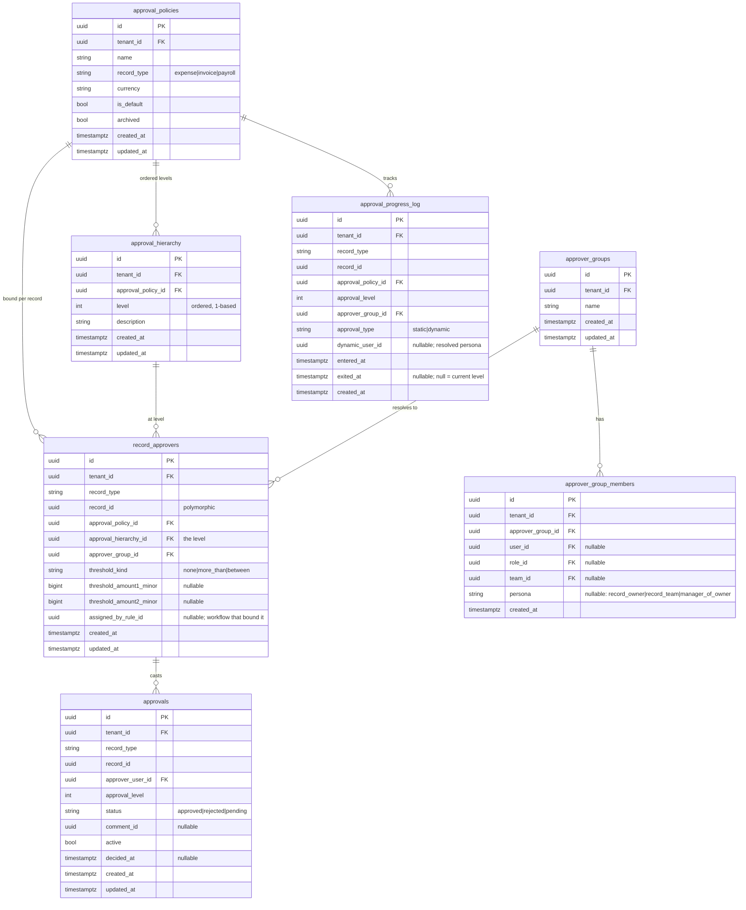

### Notes & invariants

- **Polymorphic binding**: `record_type ∈ {expense, invoice, payroll}` + `record_id` lets one
  engine serve every domain without a back-reference FK. The owning service snapshots which policy
  was applied via `record_approvers` (and records the `assigned_by_rule_id` when a
  [workflow](#5-workflow-rules-as-data) rule bound it).
- **Levels are ordered** by `approval_hierarchy.level`; the next-approver resolver walks levels in
  order, skips satisfied levels, and applies `threshold_kind` gating:
  `none` ⇒ always required; `more_than` ⇒ `amount > threshold_amount1`; `between` ⇒
  `threshold_amount1 ≤ amount ≤ threshold_amount2` (multi-currency comparisons go through the
  policy currency).
- **Dynamic personas** (`record_owner`, `record_team`, `manager_of_owner`) are resolved at runtime
  from the identity graph ([`user_hierarchy`](#1-identity--access-user-management), teams). The
  resolved principal is captured in `approval_progress_log.dynamic_user_id` for audit.
- **Maker-checker** for payroll is enforced here + in the payroll service: the approver
  (`approvals.approver_user_id`) must differ from the run's input editor (see
  [§6](#6-payroll)).
- `approvals` is the vote ledger; `approval_progress_log` adds `entered_at`/`exited_at`
  time-in-level tracking for SLA + audit. Both are tenant-scoped and RLS-guarded.

---

## 3. Expense

Ported from a Python/FastAPI reference into Node/TS. **Scope (SPEC §10.1): no GL codes and no
document-extracted line items.** An `expenses` row is a **user-entered item** under a report — not
an OCR'd line item. Approval reuses the shared [§2](#2-approval-shared-substrate) engine; ERP push
goes through [`@aegis/connectors`](#9-connectors-pluggable-erp-framework).

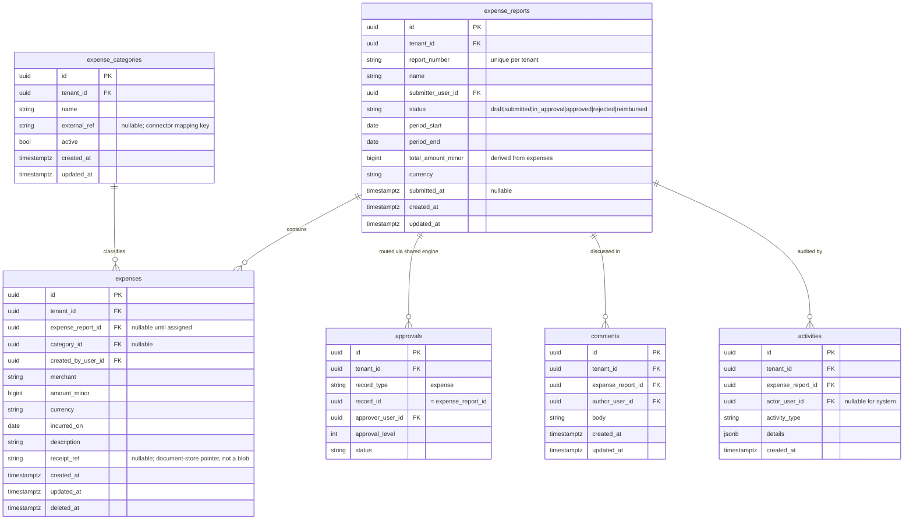

### Status state machine

`expense_reports.status` is an explicit, role-gated state machine (ported from the reference's
role-keyed transition maps):

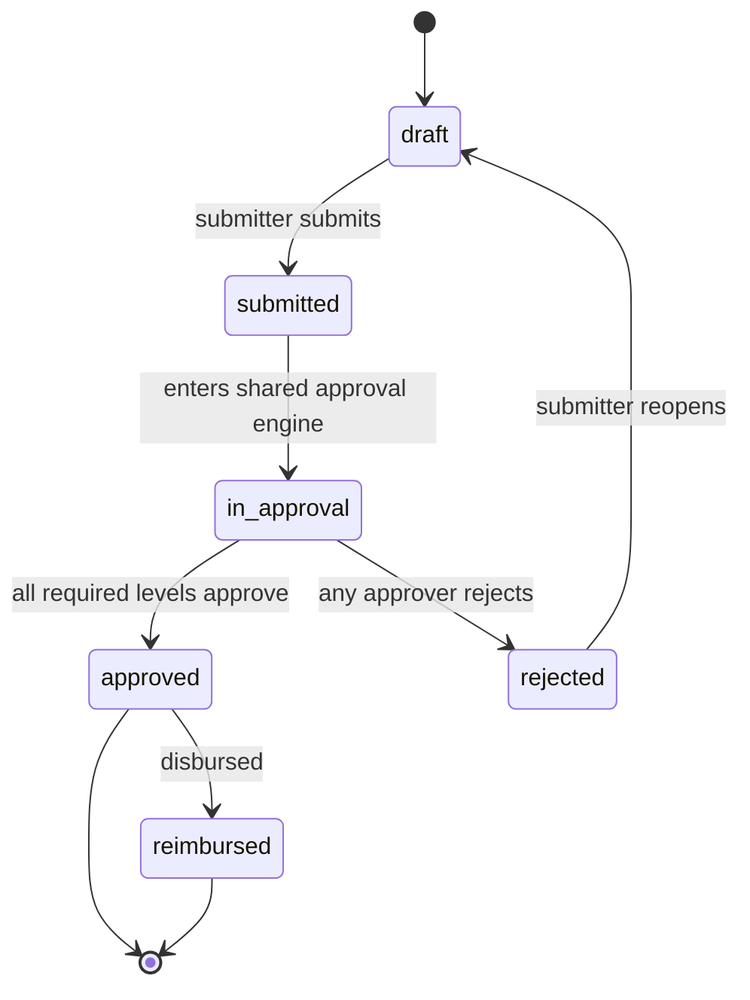

### Notes & invariants

- `report_number` is unique per tenant (per-tenant sequence). `expenses.amount_minor` rolls up into
  `expense_reports.total_amount_minor`.
- `activities` is the **append-only** per-report audit timeline (immutable; `created_at` only) —
  it complements the platform `audit_log`, not a replacement.
- `receipt_ref` points at the document store; **no binary** is stored in Postgres and there is **no
  extraction** of line items from receipts.
- `approvals` here is the same shared table as [§2](#2-approval-shared-substrate) (shown as a
  view-into-context); expense never owns its own approval schema.

---

## 4. Invoice (header-level)

**Header-level only (SPEC §10.1/§10.2): no line items, no line-item matching, no GL codes, no
match groups.** "Matching" is reframed as header-level reconciliation:

1. **Duplicate detection** — `(vendor_name, invoice_number, amount_minor)` collisions →
   `invoice_duplicates`.
2. **Threshold / variance** — header `amount_minor` vs an **optional PO reference**
   (`invoice_metadata.po_reference` + `po_amount_minor`) against per-tenant limits.
3. **Approval routing** — via the shared [§2](#2-approval-shared-substrate) engine.

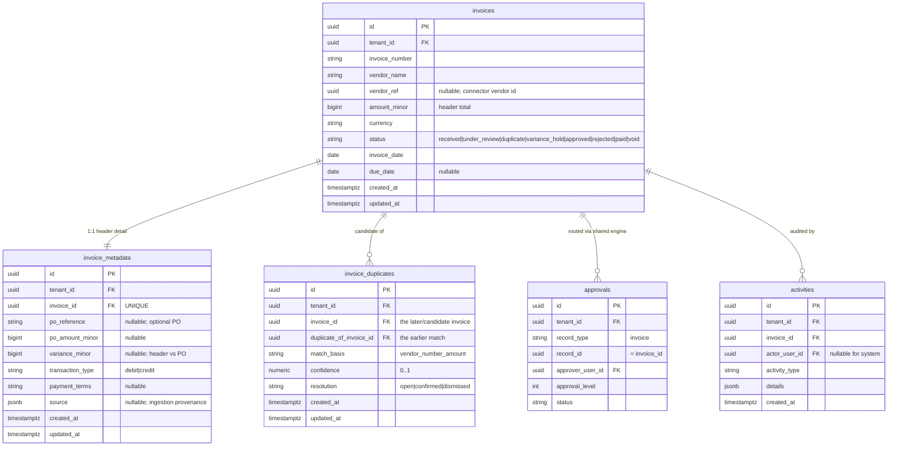

### Status state machine

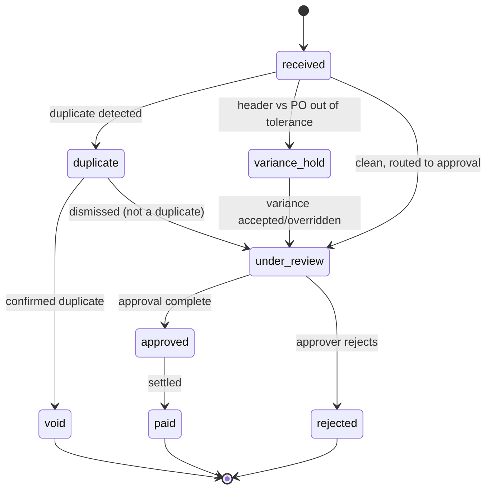

### Notes & invariants

- **No `invoice_line_items`, no `invoice_match_groups`, no GL codes** — explicitly out of scope.
  The header total is the unit of reconciliation.
- **Duplicate gate**: a partial unique-ish guard supports the check —
  `(tenant_id, vendor_name, invoice_number, amount_minor)` is indexed; a second matching header
  yields an `invoice_duplicates` candidate rather than a hard DB error (so the workflow can decide).
- **Variance** is computed as `amount_minor − po_amount_minor` (when a PO reference exists) and
  compared against per-tenant tolerance (a [workflow](#5-workflow-rules-as-data) rule or policy);
  out-of-tolerance ⇒ `variance_hold`.
- `activities` is the append-only invoice timeline (immutable). Approval reuses the shared engine.

---

## 5. Workflow (rules-as-data)

A **rules engine, not a state machine** (SPEC §5). A rule is a set of ordered **conditions**
(`rule_steps`, each carrying a JSONB `query` predicate array) plus typed **actions**
(`rule_actions`). Execution is audited in `rule_audit_logs`. Rules are triggered by domain events
(e.g. `expense.report.submitted`, `invoice.received`) over [`@aegis/events`](08-services-overview.md)
and dispatch through a field→validator registry and an action→handler registry, so new conditions
and actions are added by registering a function — not by changing the engine.

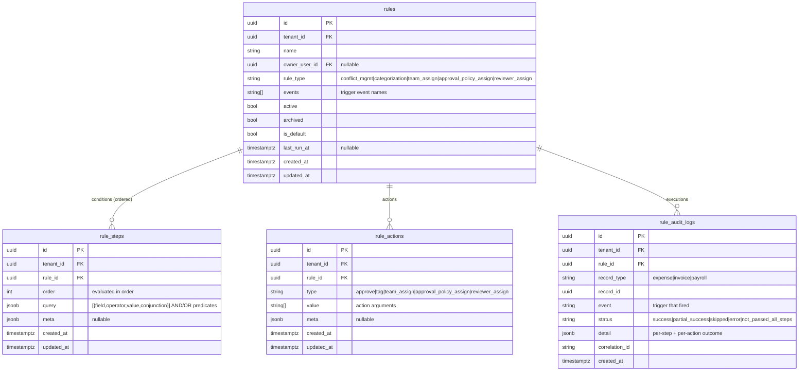

### Notes & invariants

- **Conditions as data**: each `rule_steps.query` entry is `{ field, operator, value, conjunction }`
  with `conjunction ∈ {AND, OR}`. Evaluation semantics:
  `andResults.every(true) && (orResults.length === 0 || orResults.some(true))`.
- **Numeric operators** (`equal | less_than | greater_than | between | …`) compare against
  integer minor units (and currency-convert when comparing money across currencies).
- **Actions as data**: `rule_actions.type` resolves to a registered handler; handlers return a typed
  status (`success | error | skip | no_update`) and the executor aggregates them into the single
  `rule_audit_logs.status` verdict.
- `rule_audit_logs` is **append-only** and carries the `correlation_id` so a rule firing is stitched
  to the originating business request. **No GL-code action** exists (scope removal).

---

## 6. Payroll

Highest-sensitivity PII in the platform. Greenfield design (Payroll-Engine-inspired): **config as
data** (calendars, earning/deduction codes, effective-dated tax rules), a **pay-run engine** with a
strict status lifecycle, an **idempotent inbound** lane for approved earning items (expense
reimbursements, bonuses), disbursement via **payment batches**, and an **append-only ledger**.
Field-level encryption (🔒 `*_enc`, AES-256-GCM) protects salary / bank / national-id; every read of
those is 📝 audited; the Draft→Approved transition enforces **maker-checker**.

```mermaid
erDiagram
    employees ||--o{ contracts : "effective-dated"
    employees ||--o{ employee_pay_items : "assigned codes"
    employees ||--o{ payslips : "paid by"
    employees ||--o{ payroll_input_items : "inbound for"
    pay_calendars ||--o{ pay_runs : drives
    earning_codes ||--o{ employee_pay_items : "referenced (earning)"
    deduction_codes ||--o{ employee_pay_items : "referenced (deduction)"
    earning_codes ||--o{ payslip_lines : "earning line"
    deduction_codes ||--o{ payslip_lines : "deduction line"
    tax_rules ||--o{ payslip_lines : "tax line"
    pay_runs ||--o{ payslips : produces
    payslips ||--o{ payslip_lines : "itemized"
    payslips ||--o{ payments : "disbursed by"
    pay_runs ||--o{ payment_batches : "batched into"
    payment_batches ||--o{ payments : aggregates
    pay_runs ||--o{ ledger_entries : "posts (append-only)"
    payroll_input_items ||--o{ payslip_lines : "consumed into"

    employees {
        uuid id PK
        uuid tenant_id FK
        uuid org_unit_id FK "legal entity / department"
        uuid user_id FK "nullable; link to platform user"
        string person_ref
        string employment_status "active|on_leave|terminated"
        string work_jurisdiction
        string residence_jurisdiction
        string bank_account_enc "encrypted, masked, audited"
        string national_id_enc "encrypted, masked, audited"
        string currency
        timestamptz created_at
        timestamptz updated_at
    }
    contracts {
        uuid id PK
        uuid tenant_id FK
        uuid employee_id FK
        string type "salaried|hourly"
        string base_amount_enc "encrypted, masked, audited"
        string currency
        numeric fte
        string pay_frequency "weekly|biweekly|semimonthly|monthly"
        date effective_from
        date effective_to "nullable"
        timestamptz created_at
        timestamptz updated_at
    }
    pay_calendars {
        uuid id PK
        uuid tenant_id FK
        string name
        string frequency
        string period_rule "jsonb-ish cron/rule"
        string cutoff_rule
        string pay_date_rule
        timestamptz created_at
        timestamptz updated_at
    }
    earning_codes {
        uuid id PK
        uuid tenant_id FK
        string name
        string code UK "per tenant"
        bool taxable
        bool recurring_default
        timestamptz created_at
        timestamptz updated_at
    }
    deduction_codes {
        uuid id PK
        uuid tenant_id FK
        string name
        string code UK "per tenant"
        bool pre_tax
        bool employer_contribution
        timestamptz created_at
        timestamptz updated_at
    }
    tax_rules {
        uuid id PK
        uuid tenant_id FK "NULL = platform-default jurisdiction rule"
        string jurisdiction
        string rule_type
        jsonb params
        int version
        date effective_from
        date effective_to "nullable"
        timestamptz created_at
        timestamptz updated_at
    }
    employee_pay_items {
        uuid id PK
        uuid tenant_id FK
        uuid employee_id FK
        uuid code_id FK "earning_codes|deduction_codes"
        string code_kind "earning|deduction"
        bigint amount_or_rate_minor
        string frequency "per_run|monthly|once"
        date effective_from
        date effective_to "nullable"
        timestamptz created_at
        timestamptz updated_at
    }
    pay_runs {
        uuid id PK
        uuid tenant_id FK
        uuid pay_calendar_id FK
        date period_start
        date period_end
        date pay_date
        string type "regular|off_cycle"
        string status "draft|calculated|approved|funding|paid|reversed|voided"
        uuid created_by_user_id FK
        uuid approved_by_user_id FK "nullable; MUST differ from editor"
        timestamptz approved_at "nullable"
        jsonb locked_snapshot "nullable; immutable calc at approval"
        timestamptz created_at
        timestamptz updated_at
    }
    payslips {
        uuid id PK
        uuid tenant_id FK
        uuid pay_run_id FK
        uuid employee_id FK
        bigint gross_minor
        bigint taxable_base_minor
        bigint total_tax_minor
        bigint total_deductions_minor
        string net_enc "encrypted, masked, audited"
        string currency
        string status "draft|finalized"
        timestamptz created_at
        timestamptz updated_at
    }
    payslip_lines {
        uuid id PK
        uuid tenant_id FK
        uuid payslip_id FK
        string kind "earning|deduction|tax|employer_contribution"
        uuid code_id "earning_codes|deduction_codes|tax_rules"
        string source "base|recurring|expense|bonus|adjustment"
        uuid source_ref "nullable; e.g. payroll_input_item"
        bigint amount_minor
        bool taxable
        timestamptz created_at
    }
    payroll_input_items {
        uuid id PK
        uuid tenant_id FK
        uuid employee_id FK
        string source "expense|bonus|adjustment"
        uuid source_ref
        string idempotency_key UK "exactly-once"
        bigint amount_minor
        bool taxable
        string settlement "cyclic|off_cycle"
        string status "pending|consumed"
        timestamptz created_at
        timestamptz updated_at
    }
    payments {
        uuid id PK
        uuid tenant_id FK
        uuid payslip_id FK
        uuid batch_id FK "nullable"
        bigint amount_minor
        string currency
        string status "pending|submitted|settled|failed|returned"
        string idempotency_key UK "exactly-once"
        string rail_ref "nullable; ACH/bank ref"
        timestamptz created_at
        timestamptz updated_at
    }
    payment_batches {
        uuid id PK
        uuid tenant_id FK
        uuid pay_run_id FK
        string file_ref "nullable; ACH/bank file"
        string status "building|submitted|settled|failed"
        timestamptz created_at
        timestamptz updated_at
    }
    ledger_entries {
        uuid id PK
        uuid tenant_id FK
        uuid pay_run_id FK
        string account "wage_expense|cash|tax_liability|deduction_liability|employer_tax_expense"
        bigint debit_minor
        bigint credit_minor
        string currency
        uuid reversal_of "nullable; points at reversed entry"
        timestamptz posted_at
        timestamptz created_at
    }
```

### Pay-run status state machine

```mermaid
stateDiagram-v2
    [*] --> draft
    draft --> calculated : calculate (gross/tax/net)
    calculated --> draft : revert (only if unpaid)
    calculated --> approved : approve (maker != checker; snapshots calc)
    approved --> funding : disburse (builds payment_batch)
    funding --> paid : settlement callback
    approved --> reversed : reverse (post negative ledger)
    paid --> reversed : clawback (reversal entry)
    draft --> voided : discard
    paid --> [*]
    reversed --> [*]
    voided --> [*]
```

### Notes & invariants

- 🔒 **Encryption**: `employees.bank_account_enc`, `employees.national_id_enc`,
  `contracts.base_amount_enc`, `payslips.net_enc` hold AES-256-GCM envelopes. Decryption is a PEP
  obligation gated by a field-level permission (e.g. `payroll.employee.bank.read`); roles without it
  receive 🛡️ masked DTOs. Every successful decrypt emits a 📝 `sensitive_read = true` `audit_log`
  entry.
- **Maker-checker (segregation of duties)**: `pay_runs.approved_by_user_id` MUST differ from the run's
  input editor / `created_by_user_id`. The constraint is enforced in the service + asserted by the
  shared [approval](#2-approval-shared-substrate) engine; violation is rejected fail-closed.
- **Approved is an immutable boundary**: the calculation is snapshotted into `locked_snapshot`.
  Corrections are **never in-place** — they are new `ledger_entries` reversals (`reversal_of`) and
  **off-cycle** `pay_runs`.
- **Idempotency / exactly-once**: `payroll_input_items.idempotency_key` and
  `payments.idempotency_key` are `UNIQUE` — inbound earning items and disbursements cannot
  double-apply. The inbound lane consumes **approved** items only (`source ∈ {expense, bonus,
  adjustment}` + `source_ref`), settling `cyclic` or `off_cycle` with a no-negative-net guard.
- **`ledger_entries`** is **append-only double-entry** (`created_at`/`posted_at` only, no
  `updated_at`): corrections post an explicit reversal row; the original is never edited.
- **`tax_rules`** are **effective-dated and versioned** (`jurisdiction`, `effective_from/to`,
  `version`); tax math is data, resolved by `(jurisdiction, effective_date)` — never hard-coded.
  `tenant_id NULL` ⇒ a platform-default rule shared across tenants (still RLS-readable).

---

## 7. Notification

Consumes **already-authorized** domain events; it never re-derives authority (guards ambient
authority — SPEC §2.5). In-app `notifications` + idempotent `email_notification_logs`.

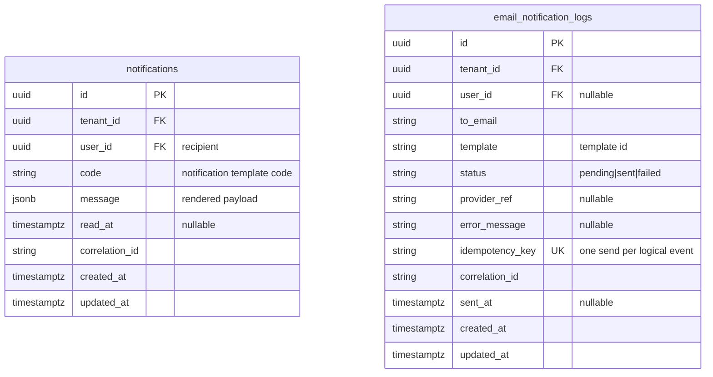

### Notes & invariants

- **Idempotent email send**: the worker locks the `email_notification_logs` row `FOR UPDATE`,
  short-circuits if already `sent`, and marks `failed` with `error_message` on exception.
  `idempotency_key` is `UNIQUE` so a redelivered event cannot double-send.
- Both tables carry `correlation_id` so a notification ties back to the originating business
  request. `notifications.read_at` drives the in-app unread badge.
- No provider credential is stored here; outbound email auth is brokered via the cloud key-proxy
  pattern (see [`SPEC.md`](../SPEC.md) §1 / cloud key proxy).

---

## 8. Reporting (CQRS-lite read side)

CQRS-lite read model (SPEC §5): transactional services stay the write side; reporting reads from
**denormalized fact tables** fed from source services, plus shared **dimensions** and materialized
**rollups**. Reports are **declarative definitions** (a semantic spec, not raw SQL); access is
controlled at **row** (RLS + `row_filter`) and **column** (`allowed_columns` / `masked_columns`)
level — and the **access scope is part of every cache key** so no cross-user leakage. RLS is never
bypassed.

```mermaid
erDiagram
    report_definitions ||--o{ report_schedules : "scheduled by"
    report_definitions ||--o{ report_runs : "executed as"
    report_definitions ||--o{ report_access_policies : "governed by"
    dim_date ||--o{ fact_expense : dates
    dim_date ||--o{ fact_invoice : dates
    dim_date ||--o{ fact_payroll : dates
    dim_date ||--o{ fact_approval : dates
    dim_user ||--o{ fact_expense : actor
    dim_org_unit ||--o{ fact_expense : org
    dim_vendor ||--o{ fact_invoice : vendor

    report_definitions {
        uuid id PK
        uuid tenant_id FK "NULL = system template (global)"
        string name
        jsonb spec "measures, dimensions, filters, grain"
        string required_permission "domain.action gate"
        uuid created_by_user_id FK "nullable"
        timestamptz created_at
        timestamptz updated_at
    }
    report_schedules {
        uuid id PK
        uuid tenant_id FK
        uuid definition_id FK
        string cron
        string timezone
        jsonb delivery "targets: email|signed_url|webhook"
        bool enabled
        timestamptz created_at
        timestamptz updated_at
    }
    report_runs {
        uuid id PK
        uuid tenant_id FK
        uuid definition_id FK
        uuid requested_by_user_id FK "nullable for scheduled"
        jsonb params
        string status "queued|running|succeeded|failed"
        string artifact_url "nullable; signed-url object ref"
        string format "json|csv|xlsx|pdf"
        string error "nullable"
        timestamptz data_as_of "freshness watermark"
        timestamptz started_at "nullable"
        timestamptz finished_at "nullable"
        timestamptz created_at
        timestamptz updated_at
    }
    report_access_policies {
        uuid id PK
        uuid tenant_id FK
        uuid definition_id FK "nullable; null = applies to all"
        string role "role this policy binds"
        string[] allowed_columns
        string[] masked_columns
        string row_filter "predicate expr injected before compile"
        timestamptz created_at
        timestamptz updated_at
    }
    fact_expense {
        uuid id PK
        uuid tenant_id FK
        uuid expense_report_id "business key"
        uuid submitter_user_id FK
        uuid org_unit_id FK
        date period_date FK
        bigint amount_minor
        string currency
        string status
        timestamptz ingested_at
    }
    fact_invoice {
        uuid id PK
        uuid tenant_id FK
        uuid invoice_id "business key"
        uuid vendor_id FK
        date invoice_date FK
        bigint amount_minor
        string currency
        string status
        timestamptz ingested_at
    }
    fact_payroll {
        uuid id PK
        uuid tenant_id FK
        uuid pay_run_id "business key"
        uuid employee_id
        date pay_date FK
        bigint gross_minor "masked column candidate"
        bigint net_minor "masked column candidate"
        string currency
        timestamptz ingested_at
    }
    fact_approval {
        uuid id PK
        uuid tenant_id FK
        string record_type
        uuid record_id "business key"
        uuid approver_user_id FK
        date decided_date FK
        int approval_level
        string status
        timestamptz ingested_at
    }
    dim_user {
        uuid id PK
        uuid tenant_id FK
        uuid user_id
        string display_name
        string team
    }
    dim_org_unit {
        uuid id PK
        uuid tenant_id FK
        uuid org_unit_id
        string name
        string kind
    }
    dim_vendor {
        uuid id PK
        uuid tenant_id FK
        uuid vendor_id "nullable"
        string vendor_name
    }
    dim_date {
        date id PK "the date"
        int year
        int quarter
        int month
        int week
    }
```

### Notes & invariants

- **Fact tables are denormalized projections** ingested from source services (read-replica + MV /
  rollups for v1; an outbox/CDC seam is the documented graduation trigger). Each fact carries
  `tenant_id` and is RLS-guarded; reporting **never** reaches into another service's DB at query
  time.
- **Two-tier access control on output**: (a) **row** — `report_access_policies.row_filter` plus
  RLS (employee sees own; manager sees cost-center); (b) **column** — `allowed_columns` /
  `masked_columns` applied by the definition compiler *before* SQL generation, so `fact_payroll`
  gross/net are dropped or masked for roles that lack the permission. The client is never trusted to
  omit columns.
- **Cache key includes access scope**: the Redis result cache is keyed by
  `hash{ tenant_id, user_access_scope/role, definition_id, params }`. Omitting the access scope
  would leak another user's rows — it is mandatory.
- **Eventual consistency surfaced**: `report_runs.data_as_of` is the freshness watermark shown on
  every report so finance users know the read model may lag the write side.
- `report_definitions.tenant_id NULL` ⇒ a **system template** available to all tenants; non-null ⇒
  tenant-custom. `required_permission` gates who may run it (checked by the PEP).

---

## 9. Connectors (pluggable ERP framework)

ERP/accounting sync is a **pluggable connector framework** (SPEC §10.3), shipped as the shared lib
[`@aegis/connectors`](08-services-overview.md) and consumed by expense / invoice / payroll. A new
ERP is added by writing **one adapter** against a common interface; the platform ships **mock**
connectors with neutral names (`LedgerOne`, `Finovo`, `AcctBridge`) that emulate ERP behaviour
(auth handshake, push transaction, fetch status) **without calling real ERPs**. Per-connector
config is tenant-scoped; every push is idempotent and routed through the service-to-service auth +
context-propagation + secret-proxy patterns.

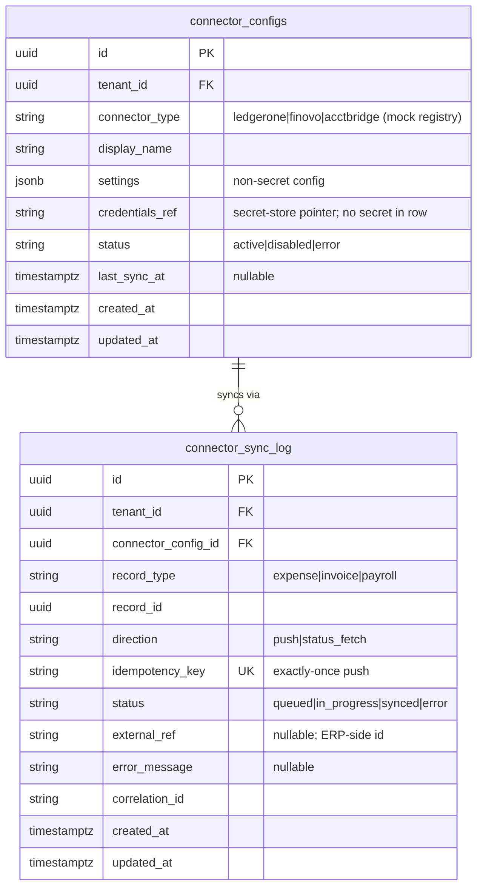

### Notes & invariants

- **`connector_type`** is drawn from a **platform-global** registry of available adapters (the mock
  connectors `ledgerone | finovo | acctbridge`). Adding a real ERP = registering one adapter; no
  schema change.
- **No secret in the row**: `connector_configs.credentials_ref` points at the parameter/secret store
  (`/aegis/<env>/...`); the connector's outbound auth uses its configured scheme. There is **no
  `X-Trend` header** — outbound connector auth is per-connector (SPEC §10.3).
- **Idempotent push**: `connector_sync_log.idempotency_key` is `UNIQUE`; a re-push of the same
  `(record_type, record_id)` is a no-op against the ERP. `correlation_id` ties a sync to the
  originating business request for audit. `connector_sync_log` is effectively append-then-finalize
  (status transitions queued → in_progress → synced/error).

---

## 10. Cross-area conventions recap

| Pattern | Where it appears | Why |
|---|---|---|
| **Append-only + immutable** | `audit_log`, expense/invoice `activities`, `rule_audit_logs`, `approval_progress_log`, `ledger_entries` | Tamper-evident audit + financial integrity; no `updated_at`. |
| **Hash chaining** | `audit_log` (`prev_hash`/`entry_hash`) | Tamper-evidence (SOC2/GDPR). |
| **Idempotency keys (UNIQUE)** | `payroll_input_items`, `payments`, `email_notification_logs`, `connector_sync_log` | Exactly-once for money movement, email, and ERP push. |
| **Field-level encryption (🔒 `*_enc`)** | payroll `employees`, `contracts`, `payslips` | Salary / bank / national-id never in plaintext at rest. |
| **Polymorphic record reference** | shared approval (`record_type`,`record_id`), `rule_audit_logs`, `connector_sync_log` | One shared engine/framework serves every domain without back-reference FKs. |
| **`tenant_id NULL` = platform-global** | `roles`, `permissions`, `tax_rules`, `report_definitions`, connector type registry | System-seeded rows shared across tenants; everything else is tenant-scoped. |
| **Access scope in cache key** | reporting result cache | Prevents cross-user row leakage. |
| **`correlation_id` on event-derived rows** | rule/approval/notification/connector logs | Stitches one logical business request across services (the propagated `X-Correlation-Id`). |

> Every tenant-scoped table in every diagram above is created with
> `ENABLE` + `FORCE ROW LEVEL SECURITY` and a `RESTRICTIVE` `tenant_isolation` policy keyed on
> `current_setting('app.current_tenant')`, under a non-owner app role without `BYPASSRLS`. See
> [`06-multi-tenancy.md`](06-multi-tenancy.md) for the full RLS + per-user-scope treatment and
> [`05-access-control.md`](05-access-control.md) for how the PDP compiles `user_roles.scope` and
> `policies` into query predicates and obligations.
