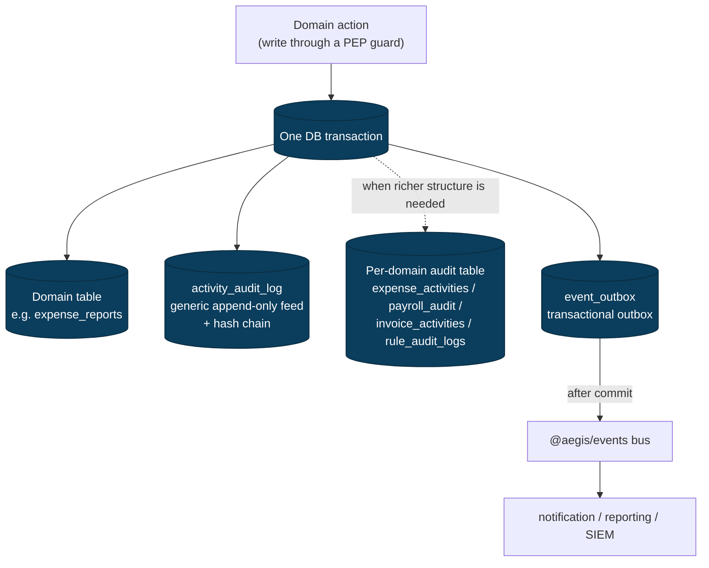
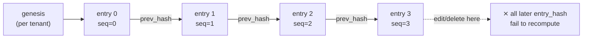

# 10 — Auditability, Security & Compliance

> How Aegis records **who did what, on whose behalf, under which permissions, and
> with what decision** — in a form that is tamper-evident, tenant-scoped, and
> sufficient for **SOC 2** and **GDPR**. This is the security-and-compliance
> companion to the access-control model in
> [`03-access-control-model.md`](03-access-control-model.md), the request path in
> [`05-authn-authz-flow.md`](05-authn-authz-flow.md), the tenant-isolation story in
> [`04-multi-tenancy.md`](04-multi-tenancy.md), and the internal-trust layer in
> [`06-service-to-service.md`](06-service-to-service.md). The full table catalogue
> lives in [`07-data-models.md`](07-data-models.md).

Audit is not a logging afterthought in Aegis — it is a **first-class output of the
access-control substrate**. Every write that flows through a PEP guard produces an
audit entry as part of the same transaction, so the audit trail can never diverge
from what actually happened to the data. The design follows the
[`SPEC.md`](../SPEC.md) §1 locked decision: a **hybrid** model — a generic
append-only **activity feed** for the who/what/when of every domain action, plus
**per-domain audit tables** where richer structured fields are needed — with
**hash-chained** tamper-evidence on top.

---

## 1. What a complete audit entry captures

An audit entry that satisfies SOC 2 (CC7.2 / CC6.x) and GDPR accountability
(Art. 5(2), 30) must answer six questions, not just "a row changed". Aegis fixes
this as the canonical shape every entry carries:

| Field | Question it answers | Source |
|---|---|---|
| `event` | **What** happened? | the typed `AuditAction` enum (e.g. `expense.report.approved`) |
| `intent` | **What was the triggering command/intent?** | the route + request payload digest that initiated it |
| `actor_at_time` | **Who** did it (identity as it was *then*)? | the resolved principal (`user_id`, `email`, `caller`, delegated `act`) snapshotted |
| `permissions_at_time` | **Under which authority?** | the role(s) + permission set + scope the PDP evaluated, snapshotted |
| `tenant_id` | **In which tenant?** | `RequestContext.tenantId` (RLS-scoped) |
| `decision` | **What did the policy decide?** | the PDP verdict `{ allow, reason, obligations }` |

The two "**…at time of action**" fields are the part teams most often get wrong.
Roles and permissions are *dynamic* in Aegis (the PAP supports runtime CRUD — see
[`03-access-control-model.md`](03-access-control-model.md)), so resolving "what
could this user do?" months later, from the *current* role tables, gives the wrong
answer. Aegis therefore **snapshots the actor identity and the effective
permission set into the audit row at write time**, denormalized as JSONB. The audit
trail is self-contained and survives later role edits, user deactivation, and
permission renames.

```typescript
// libs/shared/types/src/audit.shape.ts
export namespace AuditShape {
  /** The denormalized record written to the activity feed. */
  export interface Entry {
    id: string;                       // uuid v4
    tenant_id: string;                // RLS-scoped; null only for platform-level events
    sequence: number;                 // per-tenant monotonic position in the hash chain
    event: AuditAction;               // typed domain action (the "what")
    category: AuditCategory;          // authn | authz | data | admin | security
    actor_at_time: ActorSnapshot;     // who, as resolved then
    permissions_at_time: PermissionSnapshot; // roles + permissions + scope evaluated
    intent: IntentSnapshot;           // route, method, correlation id, payload digest
    decision: DecisionSnapshot;       // PDP verdict { allow, reason, obligations }
    resource: ResourceRef;            // { type, id } the action targeted
    sensitive_read: boolean;          // true when this entry records a sensitive-field read
    created_at: string;               // server time (UTC)
    prev_hash: string;                // hash of the previous entry in this tenant's chain
    entry_hash: string;               // SHA-256 over the canonicalized row + prev_hash
  }

  export interface ActorSnapshot {
    user_id: string | null;           // null for unauthenticated/system events
    email: string | null;
    caller: string;                   // X-Caller (user agent / service)
    source_service: SourceService | null; // X-Source-Service on internal hops
    on_behalf_of: string | null;      // delegated `sub` when an act-token is present
    acting_as: string | null;         // delegated `act` (the acting service/principal)
    ip: string | null;                // edge-observed client IP (authn events)
  }

  export interface PermissionSnapshot {
    roles: string[];                  // role names effective at the time
    permissions: string[];            // dotted domain.action grants evaluated
    scope: 'AllRecords' | 'OwnAndTeam' | 'OwnOnly';
    policy_ids: string[];             // ABAC policies that fired
  }

  export interface DecisionSnapshot {
    allow: boolean;
    reason: string;                   // human-readable cause (e.g. "amount over approval_limit")
    obligations: string[];            // applied obligations (e.g. "mask:bank_account_enc")
  }
}
```

`AuditAction`, `AuditCategory`, and the `SourceService` enum live in
`@aegis/shared-enums` (one `<domain>.enum.ts` per domain + barrel), so a rename is a
one-line change and table/header names are never hand-typed. The action vocabulary
mirrors the permission vocabulary — `expense.report.approve` (the permission) maps
to `expense.report.approved` (the audit event) — which keeps the trail legible
against the policy catalogue.

---

## 2. Hybrid model — activity feed + per-domain audit tables

There is **no single global "log everything" table that every service contends
on**, and there is **no purely decentralized scatter** either. Aegis runs both,
deliberately:



**(A) Generic activity feed — `activity_audit_log`.** One append-only row per
auditable action across *all* services, carrying the canonical six-field shape from
§1. This is the **single source of truth for tamper-evident compliance reporting**
and the table the hash chain runs over. An auditor can sample one tenant's entire
history from here without joining seven services.

**(B) Per-domain audit tables.** Where a domain needs richer, queryable, structured
fields beyond the generic feed, it keeps a domain table too:

| Table | Service | Why it exists beyond the feed |
|---|---|---|
| `expense_activities` | expense | per-report comment/approval timeline a user sees in the UI |
| `invoice_activities` | invoice | state-machine transitions + duplicate/variance flags on the invoice |
| `rule_audit_logs` | workflow | rule version, condition diff, enable/disable history (`detail` JSONB) |
| `payroll_audit` | payroll | sensitive-field read trail + maker-checker attribution (highest sensitivity) |
| `approval_progress_log` | approval (shared) | per-approver `entered_at` / `exited_at` lifecycle |
| `email_notification_logs` | notification | outbound email compliance trail (`status`, `template`, payload digest) |

The two stay consistent because **both are written inside the same transaction as
the domain change** — never in a fire-and-forget callback. If the domain write rolls
back, so does its audit. The per-domain tables are convenience/read-model surfaces;
`activity_audit_log` is the compliance backbone.

```typescript
// libs/service-core (audit middleware) — emitted from the PEP, inside the txn.
// The actor + permission snapshot come from the verdict the PDP already produced,
// so auditing adds no second policy evaluation.
export async function recordAudit(
  ctx: RequestContext,
  tx: Transaction,
  input: {
    event: AuditAction;
    category: AuditCategory;
    resource: ResourceRef;
    decision: DecisionSnapshot;     // the verdict the guard enforced
    sensitiveRead?: boolean;
  },
): Promise<void> {
  const prev = await auditRepo.lastEntryForTenant(ctx.tenantId, tx); // FOR UPDATE
  const entry = buildEntry(ctx, input, prev);   // fills actor/permissions/intent snapshots
  entry.entry_hash = hashEntry(entry);          // SHA-256 over canonical row + prev_hash
  await auditRepo.append(entry, tx);            // INSERT-only; no UPDATE/DELETE grant
}
```

---

## 3. Tamper-evidence — the hash chain

Append-only is necessary but not sufficient: a privileged operator (or a compromised
service account) could still rewrite history. Aegis makes the log **tamper-evident**
by hash-chaining entries **per tenant**, so any insertion, deletion, reordering, or
field edit breaks verification at a detectable position.

### 3.1 Chain construction

Each entry stores `prev_hash` (the previous entry's `entry_hash` for that tenant) and
its own `entry_hash = SHA-256(canonical_json(entry_without_hash) || prev_hash)`. The
first entry per tenant chains off a fixed **genesis** hash. `sequence` is a per-tenant
monotonic counter, taken under a row lock so concurrent writers cannot interleave the
chain.



The canonicalization is deterministic (sorted keys, normalized number/timestamp
formats, no whitespace) so the same logical row always hashes identically across
services and language runtimes. Hashing covers **every field except `entry_hash`
itself**, including `prev_hash`, so reordering is detected too.

### 3.2 Schema

```sql
-- The generic, append-only, hash-chained compliance feed (TableName.ActivityAuditLog).
CREATE TABLE activity_audit_log (
  id                   UUID PRIMARY KEY DEFAULT gen_random_uuid(),
  tenant_id            UUID NOT NULL,
  sequence             BIGINT NOT NULL,             -- per-tenant monotonic position
  event                TEXT  NOT NULL,              -- AuditAction (dotted domain.action)
  category             TEXT  NOT NULL,              -- authn|authz|data|admin|security
  actor_at_time        JSONB NOT NULL,              -- ActorSnapshot (denormalized)
  permissions_at_time  JSONB NOT NULL,              -- PermissionSnapshot (roles+perms+scope)
  intent               JSONB NOT NULL,              -- route, method, correlation id, payload digest
  decision             JSONB NOT NULL,              -- DecisionSnapshot { allow, reason, obligations }
  resource_type        TEXT  NOT NULL,
  resource_id          UUID,
  sensitive_read       BOOLEAN NOT NULL DEFAULT FALSE,
  correlation_id       TEXT  NOT NULL,              -- == X-Correlation-Id (stitches a business request)
  prev_hash            CHAR(64) NOT NULL,           -- previous entry_hash for this tenant
  entry_hash           CHAR(64) NOT NULL,           -- SHA-256 over canonical row || prev_hash
  created_at           TIMESTAMPTZ NOT NULL DEFAULT now(),
  CONSTRAINT uq_audit_tenant_sequence UNIQUE (tenant_id, sequence),
  CONSTRAINT uq_audit_tenant_hash     UNIQUE (tenant_id, entry_hash)
);

-- tenant_id leads every composite index so RLS-scoped scans stay fast.
CREATE INDEX ix_audit_tenant_created ON activity_audit_log (tenant_id, created_at DESC);
CREATE INDEX ix_audit_tenant_event   ON activity_audit_log (tenant_id, event);
CREATE INDEX ix_audit_correlation    ON activity_audit_log (tenant_id, correlation_id);

-- Tenant isolation (same FORCE + RESTRICTIVE pattern as every tenant-scoped table;
-- see 04-multi-tenancy.md). The app role is a non-owner without BYPASSRLS.
ALTER TABLE activity_audit_log ENABLE ROW LEVEL SECURITY;
ALTER TABLE activity_audit_log FORCE  ROW LEVEL SECURITY;
CREATE POLICY audit_tenant_isolation ON activity_audit_log
  AS RESTRICTIVE
  USING (tenant_id = current_setting('app.current_tenant')::uuid);

-- Append-only at the privilege layer: the app role may INSERT + SELECT, never
-- UPDATE or DELETE. Mutation is impossible even with a buggy/compromised service.
REVOKE UPDATE, DELETE ON activity_audit_log FROM aegis_app;
GRANT  INSERT, SELECT  ON activity_audit_log TO   aegis_app;
```

> **Why both `REVOKE UPDATE/DELETE` *and* a hash chain?** The privilege revoke stops
> the *application* from mutating history; the hash chain catches anyone who bypasses
> the application — a DBA with direct table access, a restored-from-backup tamper, or
> a compromised superuser. Defense in depth: one stops the easy path, the other makes
> the hard path detectable.

### 3.3 Verification sketch

Verification recomputes the chain for a tenant and asserts each link. It runs as a
scheduled job (per tenant, nightly) and on demand for an auditor; the **periodic
external anchoring** below bounds how far back a forge could reach.

```typescript
// libs/db (verifier) — read-only; runs under the tenant's RLS scope.
export async function verifyAuditChain(tenantId: string): Promise<VerifyResult> {
  const rows = await auditRepo.streamByTenantOrderedBySequence(tenantId); // seq ASC
  let prev = GENESIS_HASH;
  let expectedSeq = 0;

  for await (const row of rows) {
    if (row.sequence !== expectedSeq)                       // gap or reorder
      return broken(row, 'sequence-gap');
    if (row.prev_hash !== prev)                             // chain cut/spliced
      return broken(row, 'prev-hash-mismatch');
    if (hashEntry(stripHash(row)) !== row.entry_hash)       // field edited
      return broken(row, 'entry-hash-mismatch');
    prev = row.entry_hash;
    expectedSeq++;
  }
  return { ok: true, verified: expectedSeq, tip: prev };    // `tip` can be externally anchored
}
```

**External anchoring (optional, recommended for SOC 2 Type II).** Periodically the
current chain `tip` per tenant is written to **WORM storage** (an S3 Object-Lock
bucket or a notarized digest) and/or pushed to the SIEM. Because the tip commits to
the entire prior chain, an attacker who rewrites history must also rewrite every
anchor — which they cannot, since anchors are immutable and held outside the
database trust boundary.

---

## 4. What gets logged (and at what severity)

The PEP emits an audit entry on **every write**; selected reads are audited too. The
`category` partitions the feed for SIEM routing and retention policy.

| Category | Logged events | Notes |
|---|---|---|
| **authn** | login success **and failure**, token issue/refresh, **session revocation**, MFA challenge result | failures carry `actor_at_time.ip` + `caller`; brute-force/anomaly signal for the SIEM |
| **authz** | every PDP **decision** (allow *and* deny) on guarded routes, maker-checker rejections | `decision.reason` makes denials explainable; denies feed least-privilege reviews |
| **admin** | **role create/edit/delete**, **permission grant/revoke**, role-permission mapping changes, policy edits, user invite/deactivate (PAP changes) | the change-control trail SOC 2 CC6.1 wants; each carries before/after of the grant |
| **data** | create/update/delete/state-transition on domain rows (expense report approved, invoice routed, pay run approved, …) | the bulk of the feed; ties to the domain table in the same txn |
| **security** | **sensitive-field reads** (payroll salary/bank/national-id), bulk export, masking-obligation applications, RLS/quarantine alerts | `sensitive_read = true`; the GDPR/SoD-critical subset |

### 4.1 Sensitive-field reads (payroll)

Payroll holds the platform's highest-sensitivity PII. Per
[`services/payroll.md`](services/payroll.md), salary, bank account, and national-id
are **field-level encrypted (AES-256)** and exposed only to roles that need them,
with column **masking** applied as a PDP obligation for everyone else. Every *read*
that decrypts a sensitive field — not just writes — produces a `security`-category
entry with `sensitive_read = true`:

```jsonc
// activity_audit_log row (illustrative) — a payroll specialist views bank details
{
  "event": "payroll.employee.bank_account.read",
  "category": "security",
  "actor_at_time": { "user_id": "a1f3…", "email": "specialist@acme.example", "caller": "gateway" },
  "permissions_at_time": {
    "roles": ["PayrollProcessor"],
    "permissions": ["payroll.employee.read", "payroll.employee.bank_account.read"],
    "scope": "AllRecords"
  },
  "intent": { "route": "GET /payroll/v1/employees/:id", "fields": ["bank_account_enc"] },
  "decision": { "allow": true, "reason": "role grants sensitive read", "obligations": [] },
  "resource": { "type": "employee", "id": "9c0b…" },
  "sensitive_read": true
}
```

This is what lets a compliance officer answer "who has looked at this employee's bank
details, and were they entitled to?" — a question both SOC 2 and GDPR expect to be
answerable.

---

## 5. Action → audit + event (end-to-end)

The full path from an inbound request to a tamper-evident row and a downstream event,
showing where the PDP verdict, the snapshot, the hash chain, and the transactional
outbox sit:

```mermaid
sequenceDiagram
  autonumber
  participant C as Client
  participant GW as gateway
  participant PEP as PEP guard (service)
  participant PDP as @aegis/access-control (PDP)
  participant DB as PostgreSQL (RLS + txn)
  participant OB as event_outbox
  participant BUS as @aegis/events
  participant SIEM as SIEM / reporting

  C->>GW: request (user JWT)
  Note over GW: validate JWT, mint X-Correlation-Id
  GW->>PEP: forward + X-Tenant-Id, X-Correlation-Id, token
  PEP->>PDP: decide(principal, action, resource, ctx)
  PDP-->>PEP: { allow, reason, obligations }
  alt deny
    PEP-->>DB: BEGIN; SET LOCAL app.current_tenant
    PEP->>DB: append audit (category=authz, decision.allow=false)
    PEP-->>DB: COMMIT
    PEP-->>C: 403 (envelope { errors:[…] })
  else allow
    PEP->>DB: BEGIN; SET LOCAL app.current_tenant=:tenant
    PEP->>DB: write domain row (e.g. expense_reports → approved)
    PEP->>DB: append activity_audit_log (snapshot actor+perms+decision, link hash chain)
    PEP->>DB: write per-domain audit (e.g. expense_activities) [if applicable]
    PEP->>OB: enqueue domain event (same txn)
    PEP->>DB: COMMIT
    OB-->>BUS: publish after commit (transactional outbox)
    BUS-->>SIEM: stream audit/event for anomaly detection + reporting
    PEP-->>C: 200 (DTO)
  end
```

Three properties fall out of this shape:

1. **Audit can't drift from data** — domain write + audit row + per-domain audit +
   outbox event all commit or roll back together.
2. **Denials are audited too** — a `403` still writes an `authz` entry, so attempted
   privilege escalation is visible, not silent.
3. **The event bus is fed transactionally** — the outbox guarantees the SIEM and
   reporting see exactly the events that committed (no lost or phantom events), and
   `X-Correlation-Id` stitches the whole business request across services.

---

## 6. Per-tenant retention, archival & SIEM

Audit volume is dominated by high-traffic tenants and the `data` category, so
retention is **per-tenant configurable** rather than one global TTL — a regulated
tenant may need 7-year retention while a trial tenant needs 90 days.

- **Hot store** — `activity_audit_log` in PostgreSQL, partitioned by month
  (range partition on `created_at`), so old partitions detach cheaply. Composite
  indexes lead with `tenant_id` so RLS-scoped queries never scan another tenant's
  data.
- **Archival** — partitions older than a tenant's hot-window are exported to
  **WORM object storage** (S3 Object-Lock / immutable bucket) in canonical JSONL,
  **preserving the hash chain** so an archived span re-verifies independently.
  Restorable for an auditor sample.
- **Retention policy** — stored per tenant (`audit_retention_days`, `archive_tier`)
  and enforced by a `PROCESS_TYPE=worker` job; **deletion of in-window compliance
  entries is never permitted** (the `REVOKE DELETE` grant guarantees it), so
  retention only ever *archives* — it never silently drops a still-required trail.
- **SIEM feed** — every entry is streamed near-real-time (via the outbox → bus) to a
  SIEM for anomaly detection: repeated authn failures, off-hours sensitive reads,
  privilege-grant spikes, maker-checker rejection clusters. The chain `tip` is
  anchored there too (§3.3).

```typescript
// libs/shared/types — per-tenant retention config (set via the PAP, audited as `admin`).
export interface AuditRetentionConfig {
  tenant_id: string;
  hot_window_days: number;      // kept in Postgres (default 365)
  archive_tier: 'worm-s3' | 'siem-only' | 'none';
  total_retention_days: number; // legal minimum honored before archival expiry
  residency_region: string;     // pins archival storage region (GDPR data residency)
}
```

---

## 7. Compliance posture

### 7.1 SOC 2

| Trust-services criterion | How Aegis meets it |
|---|---|
| **CC6.1 logical access** | RBAC+ABAC PDP, least-privilege roles, per-route `authenticate → authorize` (no unauthenticated route but `/health` + docs) |
| **CC6.1 change control on access** | every role/permission/policy change is an `admin`-category audit entry with before/after (the PAP trail) |
| **CC6.6 / CC6.7 boundary + transit** | edge JWT validation + per-service JWKS re-validation, internal-JWT lane with origin gate, mTLS/SPIFFE-ready (see [`06-service-to-service.md`](06-service-to-service.md)) |
| **CC6.1 segregation of duties** | maker-checker enforced in code (§8); the approver ≠ the editor, audited |
| **CC7.2 monitoring** | near-real-time SIEM feed of authn/authz/security entries; anomaly detection |
| **CC7.x tamper-evidence** | append-only `REVOKE UPDATE/DELETE` + per-tenant hash chain + external anchoring of the chain tip |
| **A1.x availability** | health/readiness probes, autoscaling (see [`09-deployment-and-ops.md`](09-deployment-and-ops.md)) |

### 7.2 GDPR

| Requirement | How Aegis meets it |
|---|---|
| **Encryption (Art. 32)** | TLS in transit; AES-256 at rest; **field-level AES-256** for payroll salary/bank/national-id; secrets from a param store, never in images/CI |
| **Records of processing (Art. 30)** | the audit feed *is* the processing record — actor, intent, decision, tenant, timestamp per access |
| **Accountability (Art. 5(2))** | tamper-evident, attributable trail; `permissions_at_time` proves the access was authorized |
| **Data residency** | per-tenant `residency_region` pins archival storage; the **silo tier** (schema/DB-per-tenant) gives region-pinned hard isolation for regulated tenants (payroll first candidate — see [`04-multi-tenancy.md`](04-multi-tenancy.md)) |
| **Right to erasure (Art. 17)** | the **silo tier** makes per-tenant/per-subject deletion clean (drop the tenant's schema/DB); in the pooled tier, PII columns are crypto-shredded (destroy the field key) while the *audit fact* (that an action occurred) is retained pseudonymously — erasure of personal data without breaking the compliance chain |
| **SSO / MFA / SCIM** | OIDC SSO via the pluggable IdP adapter, MFA at the IdP, **SCIM** provisioning/deprovisioning so access is revoked on termination — every SCIM mutation audited as `admin` |

> **Erasure vs. tamper-evident audit — the apparent conflict.** GDPR erasure and an
> append-only hash chain seem to fight: you cannot delete a hashed row without
> breaking the chain. Aegis resolves it with **crypto-shredding** — the *personal
> data* a row references lives in encrypted domain columns; destroying that subject's
> field key renders the PII unrecoverable, while the audit row (a pseudonymous record
> that "an action occurred, authorized by these permissions") remains intact and the
> chain stays verifiable. Personal data is erased; the accountability fact is not.

---

## 8. Segregation of duties & maker-checker

The audit trail is what makes **segregation of duties (SoD)** enforceable and
provable. Aegis enforces it in two layers — a *preventive* code check and a
*detective* audit trail:

- **Preventive (maker-checker).** Sensitive state transitions require a **different
  principal** to approve than the one who created/edited the inputs. The canonical
  case is the payroll `Draft → Approved` boundary: the run **approver must differ
  from the input editor** (see [`services/payroll.md`](services/payroll.md)). The same
  pattern guards expense and invoice approvals through the shared approval engine.

```typescript
// payroll service — enforced at the Approve transition (raises CONFLICT/403 otherwise).
async function approvePayRun(ctx: RequestContext, runId: string, tx: Transaction) {
  const run = await payRunRepo.lockForApproval(runId, tx);
  const editors = await payrollInputRepo.distinctEditors(runId, tx); // who touched inputs

  if (editors.has(ctx.userId)) {
    // maker == checker → reject AND audit the violation (category=authz)
    await recordAudit(ctx, tx, {
      event: AuditAction.PayrollMakerCheckerViolation,
      category: AuditCategory.Authz,
      resource: { type: 'pay_run', id: runId },
      decision: { allow: false, reason: 'approver must differ from input editor', obligations: [] },
    });
    throw ErrorUtils.forbidden('SEGREGATION_OF_DUTIES', 'Approver may not be an input editor.');
  }
  // snapshot the calculation, advance state, audit the approval (category=data) …
}
```

- **Detective (audit).** Even where a transition is allowed, the `actor_at_time` of
  the *edit* and the `actor_at_time` of the *approval* are both in the chain, so an
  auditor can prove the two principals differ across the whole run history — and a
  maker-checker *rejection* is itself an `authz` entry, surfacing repeated attempts.

The SoD boundaries Aegis tracks:

| Boundary | Maker | Checker | Where |
|---|---|---|---|
| Pay run | input editor | run approver (`payroll.payrun.approve`) | payroll `Draft → Approved` |
| Expense report | submitter | approver(s) up the chain | expense approval engine |
| Invoice | creator / router | approver (`invoice.approve`) | invoice approval routing |
| Role/permission grant | requester | a second admin (where dual-control configured) | user-management PAP |

---

## 9. Implementation notes & cross-references

- **Where the code lives.** The audit middleware, `recordAudit`, the canonicalizer,
  and `hashEntry` live in `@aegis/service-core`; the append-only repository, the chain
  verifier, and the RLS/grant migration live in `@aegis/db`; `AuditAction` /
  `AuditCategory` / `SourceService` enums and the `AuditShape` namespace live in
  `@aegis/shared-enums` / `@aegis/shared-types`; the `event_outbox` and bus wiring live
  in `@aegis/events`.
- **No bypass.** No service may write `activity_audit_log` outside `recordAudit`
  (which always runs in the request transaction), and no role holds `UPDATE`/`DELETE`
  on it. The PEP, not the controller, decides when to audit — so audit coverage tracks
  authorization coverage automatically.
- **Definition of done.** Per [`../AGENTS.md`](../AGENTS.md) §8, a service is "done"
  only when it **emits audit entries on writes** — this doc defines what those entries
  must contain and how they are protected.

**See also:**
[`03-access-control-model.md`](03-access-control-model.md) (PDP verdict shape the
snapshot is built from) ·
[`04-multi-tenancy.md`](04-multi-tenancy.md) (the RLS + `SET LOCAL` pattern the audit
table reuses) ·
[`05-authn-authz-flow.md`](05-authn-authz-flow.md) (authn events + the PEP→PDP path) ·
[`06-service-to-service.md`](06-service-to-service.md) (delegation `sub`+`act` that
populates `on_behalf_of` / `acting_as`) ·
[`07-data-models.md`](07-data-models.md) (the full table catalogue) ·
[`08-api-conventions.md`](08-api-conventions.md) (`HttpHeaderKey`, `X-Correlation-Id`,
the error envelope `traceId`) ·
[`services/payroll.md`](services/payroll.md) (field encryption + maker-checker
specifics).
