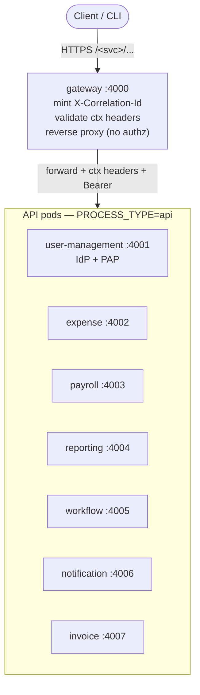
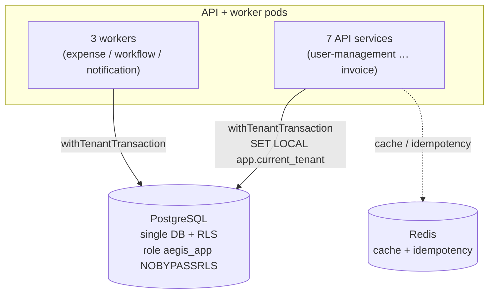
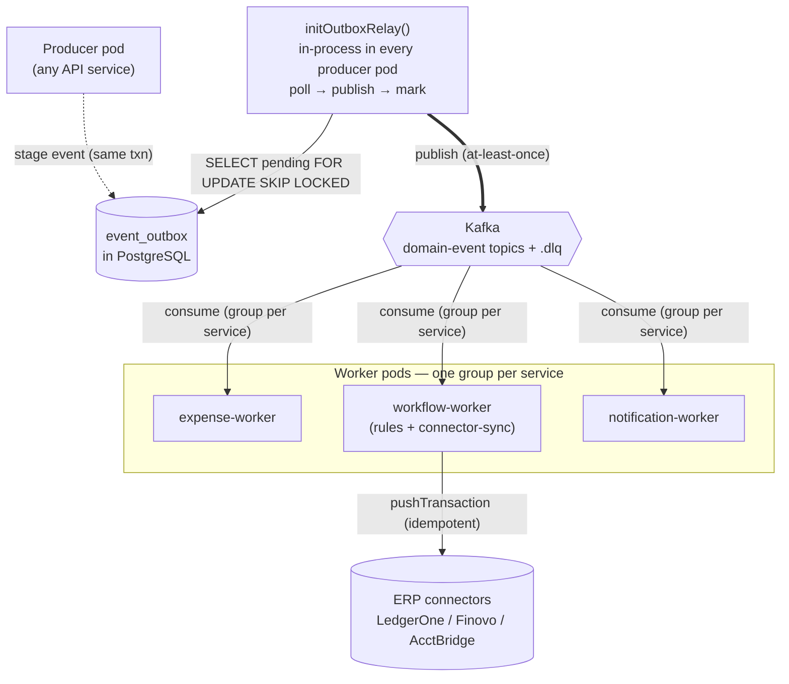
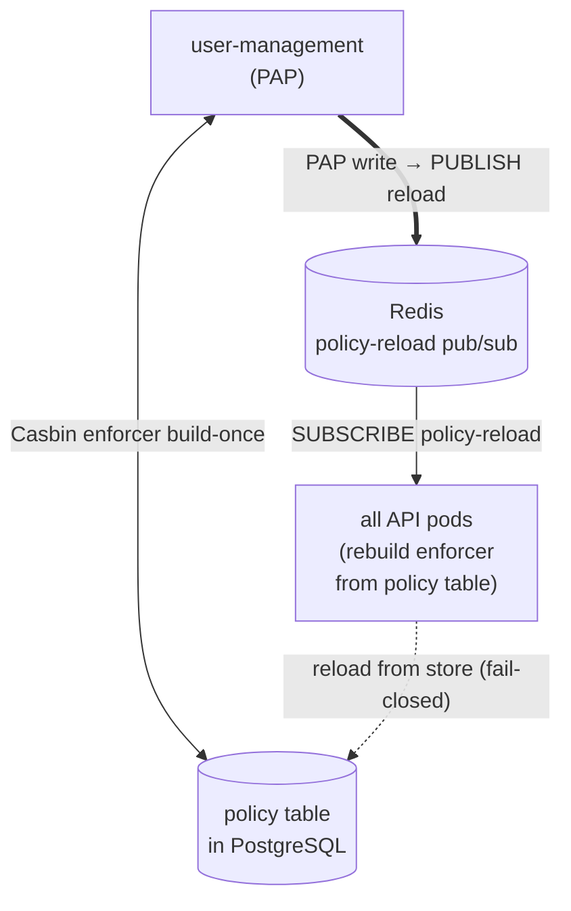
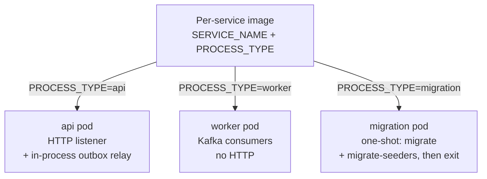
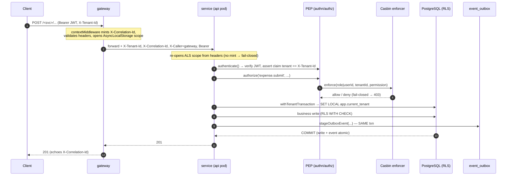
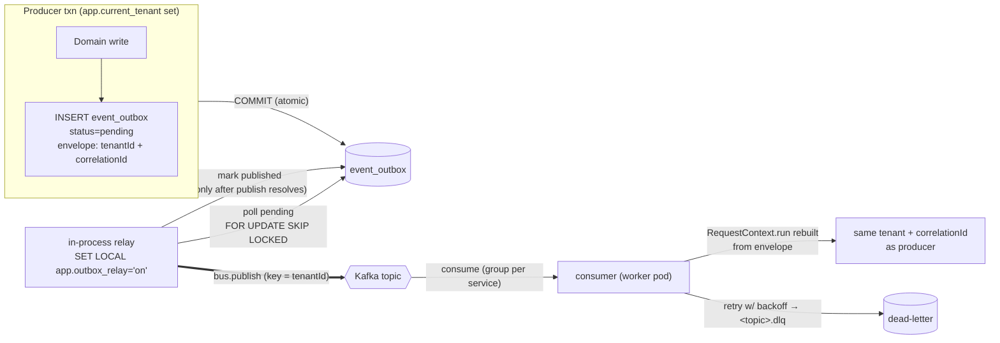

# Aegis — Architecture

> **Start here.** This is the single entry point a new engineer reads first. It ties together the five
> deep-dive chapters under [`docs/architecture/`](./architecture/), gives you the whole-system picture
> in one diagram, and points you at the rest of the docs. Every chapter it links is traced to real
> code; when a chapter and the code disagree, the code wins — fix the drift.

---

## What is Aegis

**Aegis is an enterprise, multi-tenant, microservices access-control platform** — a working reference
for getting authorization *right* across many services and many tenants at once. It is an Nx monorepo:
a **gateway** in front of **eight business services** plus a **cli**, all sharing one PostgreSQL
database with **Row-Level Security (RLS)** for database-enforced tenant isolation, **Casbin** (RBAC
with a tenant domain + ABAC conditions) for centralized authorization, **Redis** for cache and
cross-pod policy-reload fan-out, and **Kafka** for asynchronous cross-service domain events delivered
through a **transactional outbox**. On top of that substrate it demonstrates real finance workflows —
expense, invoice, payroll (maker-checker), a rules-as-data workflow engine, reporting, and
notification — with tamper-evident hash-chained auditing throughout. It is a **microservices
deployment**: each service builds its **own container image** from one shared `Dockerfile.service`,
and `PROCESS_TYPE` (api / worker / migration) selects the runtime role — so a service's api and its
worker run byte-identical bytes, while migrations run as a one-shot job from the `cli` image.

---

## Master system diagram

The whole system is one mental model, but a single flowchart that shows every edge at once is
unreadable. Below it is split into **five focused views**, each independently legible: the
north-south edge, the data plane, async eventing, the Casbin policy-reload bus, and the
`PROCESS_TYPE` pod roles. Read them in order for the full picture.

### (a) Edge — north-south request path

*Client always enters through the gateway, which proxies (but does not authorize) to the owning API service.*

### (b) Data plane — every service talks to one Postgres (RLS) + Redis

*All API and worker pods reach the same Postgres through `withTenantTransaction` (RLS enforced); Redis is cache + idempotency.*

### (c) Async eventing — producer → outbox → relay → Kafka → consumer

*No dual-write: the event is staged in `event_outbox` in the business txn, then drained at-least-once by the in-process relay.*

> Note: `expense` also pushes to ERP **synchronously** on approval (in addition to the
> connector-sync worker path), so the ERP seam is reachable from both the sync and async sides.

### (d) Casbin policy-reload bus — PAP write fans out via Redis pub/sub

*A PAP write in user-management projects into the policy table, then PUBLISHes a reload every pod SUBSCRIBEs to.*

### (e) PROCESS_TYPE pod roles — per-service images, three runtime roles

*Each service image can run as an `api`, `worker`, or one-shot `migration` pod, selected by env vars.*

**The invariants these diagrams encode:**

- **North-south is HTTP, always through the gateway.** The gateway mints `X-Correlation-Id` at the
  edge, validates context headers, and reverse-proxies the first path segment to the owning service —
  but it does **not** authorize. Every service re-runs `authenticate` + `authorize` (defense in
  depth; boot fails if any non-public route lacks a guard).
- **East-west is asynchronous via Kafka domain events**, never synchronous RPC for domain workflows.
- **No dual-write:** a domain event is staged into `event_outbox` *inside the same transaction* as
  the business write, then drained at-least-once by the in-process relay (`FOR UPDATE SKIP LOCKED`).
- **Tenant isolation is in the database.** Every access goes through `withTenantTransaction`, which
  sets `app.current_tenant` transaction-locally so the RESTRICTIVE/FORCE RLS policy is in force; the
  runtime DB role is `NOBYPASSRLS`.
- **Per-service images, many roles.** `PROCESS_TYPE` (`api` / `worker` / `migration`) + `SERVICE_NAME`
  select the role at runtime; the outbox relay runs in-process inside producer pods (no separate
  relay pod). APIs and workers are separate containers and scale independently.

---

## How to read this — the chapter index

Read the five chapters in order for the full picture, or jump to the one you need.

| # | Chapter | One-line summary |
|---|---|---|
| **01** | [System Overview](./architecture/01-system-overview.md) | The whole picture: the 8 services + cli, the Postgres/Redis/Kafka infra, the per-service image + `PROCESS_TYPE` model, inter-service topology, and request-context propagation end-to-end. |
| **02** | [Rules & Workflow](./architecture/02-rules-and-workflow.md) | The `workflow` service as a rules-as-data engine: the four rules tables, how a rule is authored and executed, the AND/OR step semantics, the six built-in actions, and the end-to-end auto-approval flow. |
| **03** | [Approvals & Expense](./architecture/03-approvals-and-expense.md) | The shared `@aegis/approvals` multi-level engine (policies, resolver, sequential/parallel quorum, the vote ledger) and the expense lifecycle that consumes it — plus how invoice & payroll reuse it (incl. payroll maker-checker SoD). |
| **04** | [Services](./architecture/04-services.md) | Each business service (user-management, payroll, invoice, reporting, notification) and the cross-cutting libs (connectors, audit, activity) — purpose, key tables, endpoints, and signature flows. |
| **05** | [Data Model](./architecture/05-data-model.md) | The single Postgres schema: the RLS policy pattern + its exceptions, column conventions, append-only/optimistic-lock tables, every domain's ER diagram, the outbox/casbin specifics, and enum-backed CHECKs. |

---

## Quick reference: a request's lifecycle

What happens on a single authenticated write (e.g. `POST /expense/reports`). Full detail in
[chapter 01 §4–5](./architecture/01-system-overview.md).

1. **Edge** — gateway mints the correlation id (the only place that mints), validates headers, opens
   the `RequestContext` (AsyncLocalStorage) scope, and proxies to the owning service.
2. **Re-validate** — the downstream service re-opens its own scope from the propagated headers;
   internal services never mint, so a hop missing a correlation id fails closed.
3. **Authn + Authz** — the PEP verifies the JWT, asserts the token tenant matches `X-Tenant-Id`,
   enriches the context with `userId`/`roles`, then Casbin enforces the permission (fail-closed).
4. **Tenant transaction** — `withTenantTransaction` issues `SET LOCAL app.current_tenant`, so RLS is
   in force for every statement.
5. **Atomic write + event** — the business row and its domain event (`event_outbox`) commit in one
   transaction. No dual-write window.

---

## Quick reference: an event's journey (outbox → relay → Kafka → consumer)

How a staged event reaches the rest of the system. Full detail in
[chapter 01 §4](./architecture/01-system-overview.md) and the outbox diagram in
[chapter 05 §3.10](./architecture/05-data-model.md).

1. **Stage** — the producer writes the event into `event_outbox` in the *same* transaction as the
   business write (`stageOutboxEvent`), so it commits or rolls back atomically.
2. **Relay** — the in-process relay (`initOutboxRelay()`, every producer pod) sets
   `app.outbox_relay='on'` so one poll can drain every tenant's backlog past RLS, selects pending rows
   with `FOR UPDATE SKIP LOCKED` (safe to run many relays), publishes, and marks the row `published`
   **only after** the publish resolves — **at-least-once**.
3. **Transport** — Kafka partitions by `tenantId` so a tenant's events keep ordering. (With
   `KAFKA_BROKERS` unset in single-process dev, an in-process bus is the drop-in transport.)
4. **Consume** — the consumer (worker pod, one group per service) rebuilds the `RequestContext` from
   the envelope, so it runs under the *same* tenant + correlation id the producer was authorized
   under. Handlers are idempotent (envelope `id`); bounded retries dead-letter to `<topic>.dlq` before
   the offset advances.

---

## Where to go next

| You want… | Go to |
|---|---|
| To run, test, and continue the platform with zero prior context | [`HANDOFF.md`](../HANDOFF.md) — the onboarding doc; **`SPEC.md` is the single source of truth** when docs disagree |
| An interactive, clickable map of every end-to-end flow | [`docs/flows.html`](./flows.html) — the Flow Coverage Dashboard |
| The HTTP API contract (every endpoint, schema, guard) | [`docs/api/`](./api/) — `openapi.yaml` + the rendered `index.html` |
| The original deep-dive set (access-control model, s2s, ops, compliance) | [`docs/README.md`](./README.md) and `docs/01-…` through `docs/10-…` |
| Deployment topology & the pod matrix | [`docs/deployment-topology.md`](./deployment-topology.md) and [chapter 01 §3](./architecture/01-system-overview.md) |
