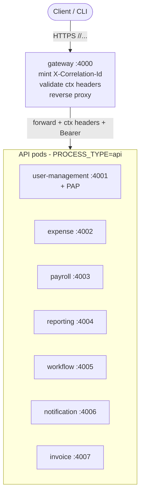
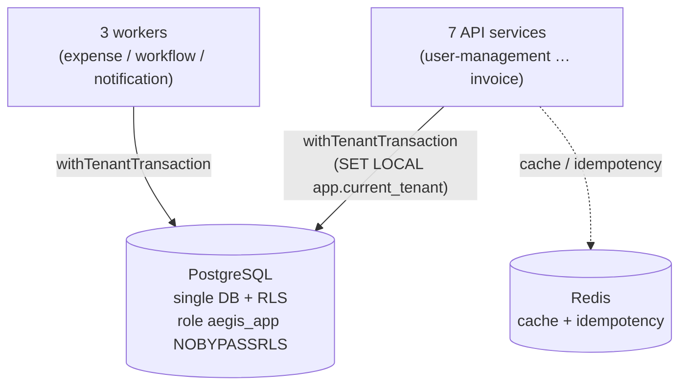
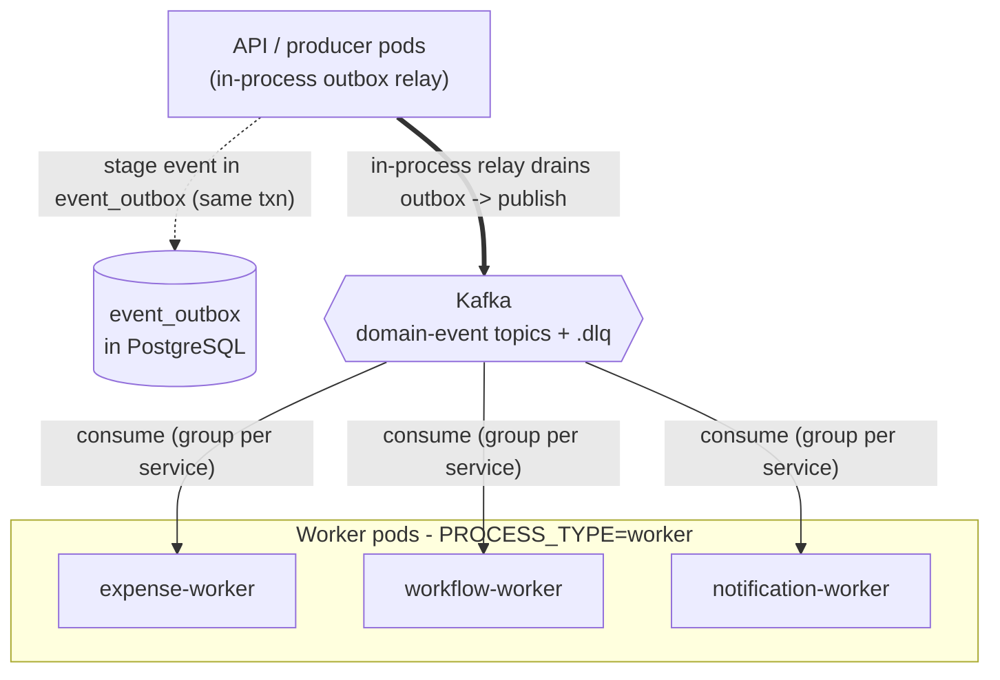
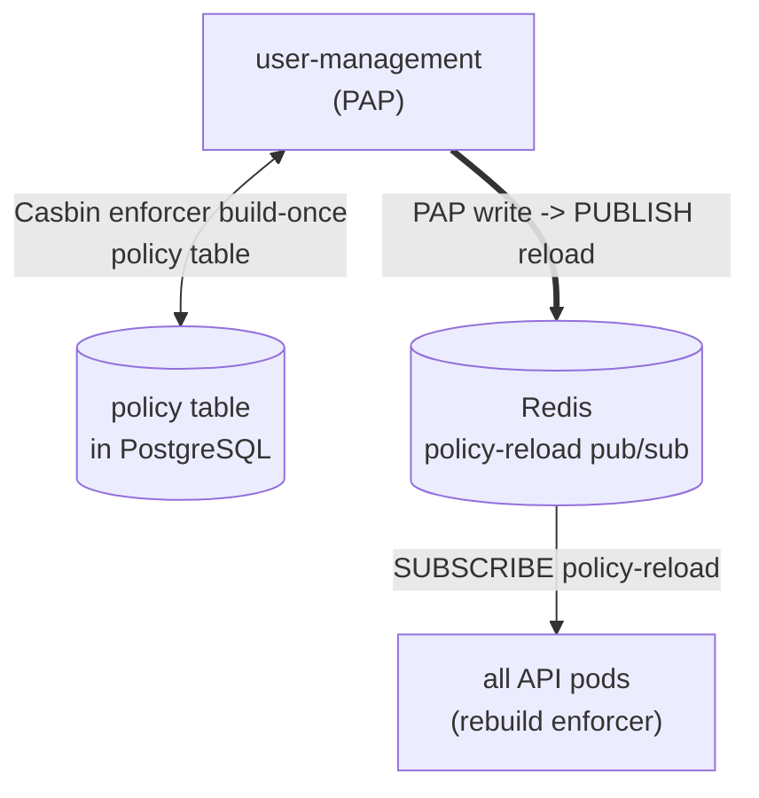
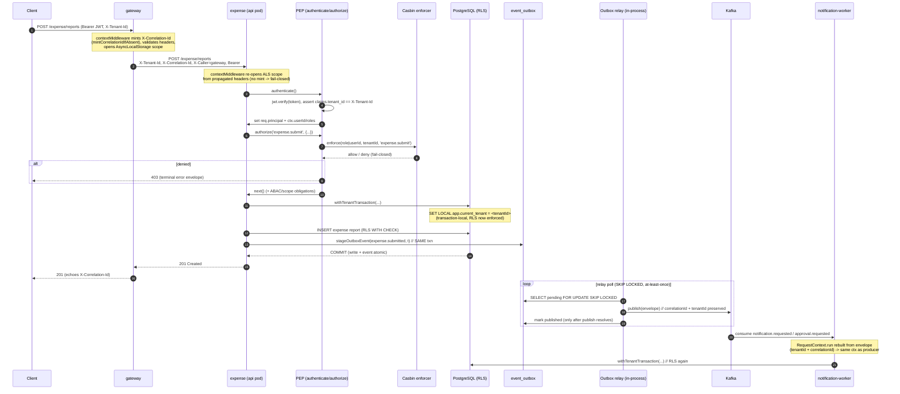

# 01 — System Overview

> Audience: anyone new to Aegis who needs the whole picture before diving into a service. Every
> claim here is traced to a file in the repo — follow the citations to the real code.

Aegis is an **enterprise access-control platform for a multi-tenant microservices SaaS**. It is an
Nx monorepo: a **gateway** in front of **seven business services**, plus a **cli**, all sharing one
PostgreSQL database with **Row-Level Security (RLS)** for tenant isolation, **Casbin** (RBAC with a
tenant domain) for authorization, **Redis** for cache + cross-pod policy-reload fan-out, and
**Kafka** for cross-service domain events delivered through a **transactional outbox**.

Each service ships as its **own container image**, built from one shared `Dockerfile.service`; the
role a container plays at runtime is selected by the `PROCESS_TYPE` / `SERVICE_NAME` env vars
(`scripts/start.sh`). A service's worker reuses its api image — the same bytes — and migrations run
as a one-shot job from the `cli` image.

---

## 1. The big picture — services and responsibilities

`apps/` holds nine deployable Node apps. The gateway is plain Express (reverse proxy, no DI); each
business service uses the per-service Express + InversifyJS internal layering and shares
`@aegis/service-core` + `@aegis/access-control` + `@aegis/db` + `@aegis/events`.

| Service | Port | Kind | Responsibility |
|---|---|---|---|
| **gateway** | 4000 | edge proxy | Single entry point. Mints `X-Correlation-Id` at the edge, validates required context headers, reverse-proxies the first path segment to the owning service, enforces an upstream timeout budget. Does **not** authorize — every service re-checks auth (defense in depth). `apps/gateway/src/{bootstrap,proxy,routes-config}.ts` |
| **user-management** | 4001 | API | Tenants, users, roles, and the role→permission catalog. Hosts the PAP (Policy Administration Point): role/permission writes project into the Casbin store and fan out a policy-reload. |
| **expense** | 4002 | API (+ worker) | Expense reports and the approval state machine; emits `expense.*` events; pushes approved reports to ERP connectors. Worker consumes `approval.completed` / `record.updated`. `apps/expense/src/bootstrap.ts` |
| **payroll** | 4003 | API | Pay runs and payments; emits `payroll.run.approved` / `payroll.payment.settled`. |
| **reporting** | 4004 | API | Cross-domain read/reporting surface. |
| **workflow** | 4005 | API (+ worker) | Tenant-defined rules. Worker consumes `record.created` / `record.updated`, runs rules, and issues `approval.command` back to owning services. |
| **notification** | 4006 | API (+ worker) | Notifications. The worker is the event-only write path: it consumes `approval.requested` / `notification.requested` and fans out to recipients. |
| **invoice** | 4007 | API | Header-level invoices (no GL codes / line items); emits `invoice.received` / `invoice.approved`. |
| **cli** | — | one-shot | Migrations + seeders (`PROCESS_TYPE=migration`). `node dist/apps/cli/main.js migrate` then `migrate-seeders`. |

Service identifiers are centralized in the `ServiceName` enum (`libs/shared/enums/src/service.enum.ts`),
which is also the valid value set for the `X-Source-Service` header.

The gateway's path-segment → service map is the inter-service contract for north-south traffic
(`apps/gateway/src/routes-config.ts`): `user-management → :4001`, `expense → :4002`,
`payroll → :4003`, `reporting → :4004`, `workflow → :4005`, `notification → :4006`,
`invoice → :4007`. Each target's URL is overridable by a `*_URL` env var.

---

## 2. Infrastructure components

Defined and wired together in `docker-compose.all.yml`.

### PostgreSQL — single database, RLS for tenant isolation
- One database `aegis` (`postgres:15-alpine`). All services share the **same** Sequelize connection
  config (`libs/db/src/connection.ts`).
- Tenant isolation is enforced **in the database**, not the application. Every tenant-scoped table has
  `tenant_id NOT NULL` and a `RESTRICTIVE` RLS policy keyed on a transaction-local setting
  (`libs/db/src/rls.ts`):
  ```sql
  ALTER TABLE "<t>" ENABLE ROW LEVEL SECURITY;
  ALTER TABLE "<t>" FORCE ROW LEVEL SECURITY;
  CREATE POLICY "<t>_tenant_isolation" ON "<t>" AS RESTRICTIVE
    USING (tenant_id = current_setting('app.current_tenant', true)::uuid)
    WITH CHECK (...);
  ```
  `RESTRICTIVE` means the tenant guard cannot be OR'd away by a permissive policy; `FORCE` makes it
  apply even to the table owner. A distinct `WITH CHECK` lets a table admit globally-readable rows it
  must not write (the `opts.withCheck` path).
- The runtime DB role is `aegis_app` — **non-owner, `NOBYPASSRLS`** (`scripts/db-init/01-init.sql`) —
  so RLS is genuinely in force; the app cannot see another tenant's rows even with a bug. `aegis_owner`
  owns the schema and runs migrations.
- The active tenant is set **per transaction**, never globally:
  `SELECT set_config('app.current_tenant', <tenantId>, true)` — the trailing `true` makes it
  transaction-LOCAL (the `SET LOCAL` equivalent), which is safe under transaction-pooled connections
  (`setTenantContext` in `libs/db/src/rls.ts`).

### Redis — cache + Casbin policy-reload pub/sub
- `redis:7-alpine`. Two distinct uses:
  1. **Cache** (feature-flag cache, idempotency replay) via the shared `CacheAdapter`.
  2. **Casbin policy-reload bus** (`libs/access-control/src/watcher.ts`). The enforcer is a
     build-once process singleton; a PAP write must reach every already-running pod. After a write the
     writer pod `PUBLISH`es to `aegis:access-control:policy-reload`; every pod subscribes and reloads
     its enforcer from the store on receipt. Pub/sub is at-most-once and fire-and-forget — exactly
     right, because a missed message only delays convergence and the reload itself is **fail-closed**
     (a failed reload clears the policy so the pod denies until a healthy reload lands). Wiring is
     fail-open at startup: no Redis → the pod still boots, just without cross-pod fan-out.

### Kafka — cross-service eventing
- Single-broker **KRaft** mode (no ZooKeeper), `bitnami/kafka:3.7`. It is the transport for
  cross-process domain events (the `EventTopic` set in `libs/events/src/topics.ts`).
- Redis is **cache-only**; Kafka is the event bus. (In single-process local dev with `KAFKA_BROKERS`
  unset, the bus falls back to an in-process implementation — see §4.)

---

## 3. The per-service image + `PROCESS_TYPE` model

Each service image (`Dockerfile.service`) is built from the shared Nx monorepo with
`nx run <service>:build --prod`. The container entrypoint `scripts/start.sh` branches on
`PROCESS_TYPE` (default `api`), and `SERVICE_NAME` picks which app's bundle to run:

```sh
case "$PROCESS_TYPE" in
  migration) node ./dist/apps/cli/main.js migrate --auto-confirm
             node ./dist/apps/cli/main.js migrate-seeders --auto-confirm ;;
  worker)    exec node "./dist/apps/${SERVICE_NAME}/main.js" ;;   # bootstrap.ts forks on PROCESS_TYPE
  api|*)     exec node "./dist/apps/${SERVICE_NAME}/main.js" ;;
esac
```

`api` and `worker` run the **same** entry file; the service's `bootstrap.ts` reads `PROCESS_TYPE` and
forks: the API branch builds the HTTP app + starts the in-process outbox relay; the worker branch
registers Kafka consumers and runs them with **no HTTP listener** (see `apps/expense/src/bootstrap.ts`,
lines 30–75). Migrations are a **one-shot** (run then exit), not a long-running role.

**There is no separate outbox-relay process.** The relay runs **in-process** inside the API/producer
roles via `initOutboxRelay()`; opt a pod out with `OUTBOX_RELAY_ENABLED=false`
(`libs/events/src/init-relay.ts`, and the explicit note in `ecosystem.config.js`).

### Pod matrix (compose / production)

| Pod | `SERVICE_NAME` | `PROCESS_TYPE` | HTTP? | Kafka consumer? | Outbox relay? |
|---|---|---|---|---|---|
| gateway | gateway | api | yes (:4000) | no | no |
| user-management / payroll / reporting / invoice | (self) | api | yes | no | yes (in-process) |
| expense | expense | api | yes (:4002) | no | yes (in-process) |
| expense-worker | expense | worker | no | yes (`approval.completed`, `record.updated`) | no |
| workflow | workflow | api | yes (:4005) | no | yes (in-process) |
| workflow-worker | workflow | worker | no | yes (`record.created/updated` → rules) | no |
| notification | notification | api | yes (:4006) | no | yes (in-process) |
| notification-worker | notification | worker | no | yes (`approval.requested`, `notification.requested`) | no |
| migrate | cli | migration | no (exits) | no | no |

`ecosystem.config.js` is the **dev-only, no-Docker** equivalent (PM2): 8 api roles + the 2 dedicated
workers; production uses the compose/container model above.

---

## 4. Inter-service communication

### Topology

The full topology has too many edges to read as one chart, so it is split into **four focused
views** — north-south edge, data plane, async eventing, and the policy-reload bus. Each is
independently legible; together they are the complete picture.

#### (a) North-south edge — client → gateway → API services

*Every request enters through the gateway, which forwards (without authorizing) to the owning service.*



#### (b) Data plane — services + workers → Postgres (RLS) / Redis

*All pods reach the single Postgres through `withTenantTransaction` so RLS is in force; Redis is cache + idempotency.*



#### (c) Async eventing — producer → outbox → relay → Kafka → consumers

*A domain event is staged in the outbox in the business txn, drained by the in-process relay, then consumed per service.*



#### (d) Policy-reload bus — PAP write fans out via Redis pub/sub

*A PAP write projects into the policy table, then PUBLISHes a reload every running pod SUBSCRIBEs to.*



Key invariants visible in the code:
- **North-south** is HTTP only, always through the gateway, which forwards with propagated context
  headers (`apps/gateway/src/proxy.ts`).
- **East-west** is **asynchronous via Kafka domain events** delivered through the transactional
  outbox — services do not RPC each other synchronously for domain workflows.
- Every data access goes through `withTenantTransaction` so RLS is in force
  (`libs/db/src/transaction.ts`).
- The Kafka **producer connects on every pod** (`initEventBus()` in `libs/events/src/init-bus.ts`):
  api/producer pods publish, worker pods additionally register consumers and `start()` them.

### Representative cross-service call (sequence)

A client submits an expense report; the gateway routes it; the expense service authenticates +
authorizes via the PEP, writes inside a tenant transaction, and stages a domain event in the same
transaction; the in-process relay later publishes it to Kafka; the notification worker consumes it.



Why this shape:
- **Defense in depth** — the gateway does not authorize; each service re-runs `authenticate` +
  `authorize` (`apps/gateway/src/proxy.ts` header comment; PEP in `libs/access-control/src/pep.ts`).
  `createService` even **fails the boot** if any non-public route lacks a guard (`assertPepBeforeRoutes`
  in `libs/service-core/src/bootstrap/bootstrap.ts`).
- **No dual-write** — the event is staged into `event_outbox` **inside the same transaction** as the
  business write (`stageOutboxEvent` in `libs/events/src/outbox.ts`), so it commits or rolls back
  atomically with the work. The relay drains pending rows **at-least-once** with
  `FOR UPDATE SKIP LOCKED` (safe to run multiple relays) and marks a row `published` only **after**
  `bus.publish` resolves; consumers are idempotent via the envelope `id` (`OutboxRelay.drainOnce`).
- **Failure handling** — the gateway never hangs on a dead upstream: a per-hop timeout
  (`GATEWAY_UPSTREAM_TIMEOUT_MS`, default 15000) yields `504`; a refused connection `503`; other
  unreachable errors `502` — and the correlation id is echoed on every error response
  (`apps/gateway/src/proxy.ts`). Kafka handlers retry with backoff and dead-letter to `<topic>.dlq`
  on exhaustion before the offset advances (`libs/events/src/kafka-bus.ts`); the in-process bus has a
  matching retry-then-DLQ sink (`libs/events/src/bus.ts`).

### In-process vs Kafka transport (one contract, two transports)
- When `KAFKA_BROKERS` is **set**, `initEventBus()` swaps the default in-process bus for `KafkaBus`
  on every pod (`libs/events/src/init-bus.ts`). `KafkaBus`: one shared producer, one consumer per
  topic with an async back-pressure queue (pause/resume), bounded handler retries with exponential
  backoff, `<topic>.dlq` on exhaustion, and CommitManager-style **at-least-once** manual commit.
  Partition key = `tenantId` so a tenant's events keep ordering.
- When `KAFKA_BROKERS` is **unset** (single-process local dev), the **in-process** `InProcessBus`
  stays the default so a producer and its consumers share one process (`libs/events/src/bus.ts`).
- Both transports rebuild the `RequestContext` from the `EventEnvelope` on consume, so a consumer runs
  under the **same** tenant + correlation id the producer was authorized under
  (`KafkaBus.dispatch` / `InProcessBus.runWithRetry`).

---

## 5. Request-context propagation

The single ambient per-request store is Node's native `AsyncLocalStorage`, wrapped by
`RequestContext` (`libs/service-core/src/context/request-context.ts`). The stored shape
(`context.types.ts`) carries: `tenantId`, `userId`, `roles`, `correlationId`, `caller`,
`sourceService`, `token`, `requestUrl`, `ipAddress`, `startedAt`.

How it is populated and propagated:

1. **Edge minting (gateway only).** `applyCoreMiddleware(app, { context: { excludePaths:['/health'],
   mintCorrelationIdIfAbsent:true } })` — the gateway is the only place that mints
   `X-Correlation-Id` when absent (`apps/gateway/src/bootstrap.ts`). The middleware band order is
   `helmet → CORS(opt-in) → contextMiddleware (opens ALS) → json → request-log → audit →
   idempotency(opt-in)`, with the terminal error handler last
   (`libs/service-core/src/bootstrap/bootstrap.ts`).
2. **Header validation (fail-closed).** `contextMiddleware` requires the configured headers (default
   `X-Tenant-Id`, `X-Correlation-Id`), validates `X-Tenant-Id` is a UUID, and **never** defaults to
   `UNKNOWN` — a missing required header is a `400` validation error
   (`libs/service-core/src/middleware/context.middleware.ts`). Internal services do **not** mint a
   correlation id, so a hop without one fails closed.
3. **Propagation across the proxy hop.** The gateway forwards `X-Tenant-Id`, `X-Correlation-Id`,
   `X-Caller: gateway`, and (when present) the `Bearer` token from the active context to the upstream
   (`apps/gateway/src/proxy.ts`, lines 50–60). The downstream service's own `contextMiddleware`
   re-opens an ALS scope from those headers.
4. **Principal enrichment.** `authenticate()` verifies the JWT, asserts the token's `tenant_id` equals
   the request tenant, populates `req.principal`, and writes `userId` + `roles` back into the active
   context via `RequestContext.set(...)` (`libs/access-control/src/pep.ts`).
5. **Into the database.** `withTenantTransaction` reads `RequestContext.tenantId()` /
   `RequestContext.userId()` and issues `SET LOCAL app.current_tenant` (+ optional `app.current_user`)
   so RLS sees the right tenant for every statement in the transaction
   (`libs/db/src/transaction.ts` → `setTenantContext`).
6. **Into events and back out.** `makeEnvelope` stamps `tenantId` + `correlationId` +
   `sourceService` from the active context onto every `EventEnvelope`
   (`libs/events/src/topics.ts`); on consume, both buses call `RequestContext.run(...)` to rebuild the
   scope from the envelope, so the entire async chain — HTTP → DB → outbox → Kafka → worker → DB —
   carries one correlation id end-to-end. The gateway also echoes `X-Correlation-Id` on responses
   (including error responses) so a failed hop stays traceable.

`RequestContext.get()` **throws** outside a scope (fail-closed), while `tryGet()` is the safe
off-request accessor used by the Logger — so logs are correlated when a scope exists and never crash
when one does not.
