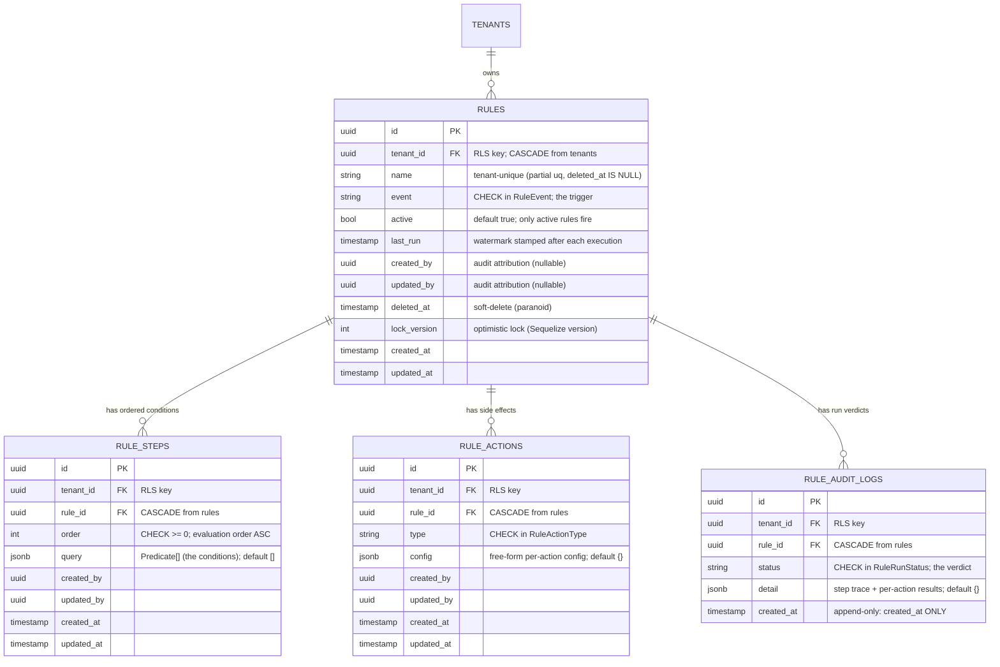
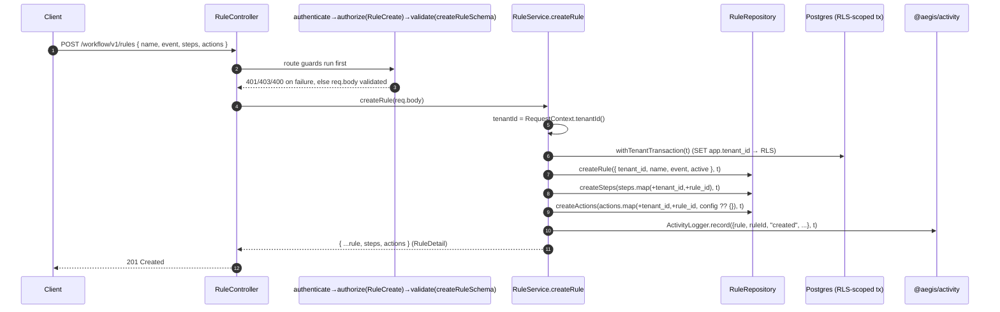
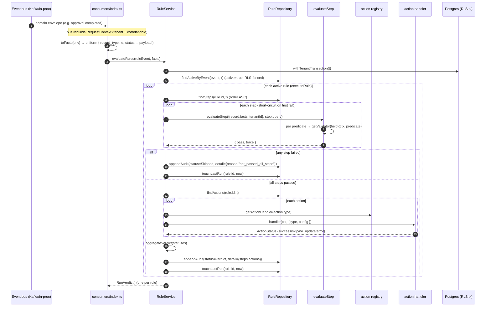

# Rules & Workflow — the rules-as-data engine

The `workflow` service (`apps/workflow`) is Aegis's **rules-as-data engine**. Instead of hard-coding
business policy ("invoices under $500 auto-approve") into each finance service, operators author
**rules** as rows in four tenant-scoped tables. The engine loads the active rules for a domain event,
evaluates their conditions against the triggering record's facts, and dispatches **actions** —
each of which emits a follow-on event that the *owning* service applies within its own authority.

This document is accurate to the code as of the cited files. Every claim links back to a file path.

Two distinct entry points feed the engine:

- **Authoring (API role)** — `RuleController` (`apps/workflow/src/controllers/rule.controller.ts`)
  exposes `POST /workflow/v1/rules` (create), `GET /workflow/v1/rules[/:id]` (list/get), and
  `POST /workflow/v1/rules/:id/run` (manual run / dry-run). Every route is PEP-guarded.
- **Execution (worker role)** — the bus consumers (`apps/workflow/src/consumers/index.ts`) subscribe
  to real domain topics, map each to a `RuleEvent`, and auto-run the matching rules. The role split is
  in `apps/workflow/src/bootstrap.ts` (`PROCESS_TYPE=worker` → consumers only, no HTTP).

---

## 1. The rules data model

Four tables, created in `apps/cli/src/migrations/0004_workflow.ts`, all tenant-scoped with `tenant_id
NOT NULL` and **FORCE + RESTRICTIVE Row-Level Security** on `tenant_id` (via
`rlsPolicyStatements(...)` from `@aegis/db`). Table names come from `TableName` in
`libs/shared/enums/src/table-name.enum.ts` (`rules`, `rule_steps`, `rule_actions`,
`rule_audit_logs`).



Field meanings and persistence policy (`apps/workflow/src/models/*.model.ts` + the migration):

- **`rules`** — the aggregate root. A long-lived master entity, so it carries audit attribution
  (`created_by`/`updated_by`), soft-delete (`deleted_at`, Sequelize `paranoid: true`), and an
  optimistic-lock counter (`lock_version`, Sequelize `version: true`) so concurrent edits raise an
  `OptimisticLockError` instead of a silent lost update. `event` is `CHECK`-constrained to the
  `RuleEvent` enum; `(tenant_id, name)` is a **partial unique index** ignoring soft-deleted rows.
  Indexes: `(tenant_id, event, active)` (the auto-run lookup) and `(tenant_id, created_at)` (listing).
- **`rule_steps`** — an ordered condition group. `query` is a JSONB `Predicate[]` (the conditions),
  evaluated in `order` ASC. Mutable child config: audit columns but **no soft-delete** (rebuilt with
  the rule). `order >= 0` is `CHECK`-enforced.
- **`rule_actions`** — a typed side effect with a free-form `config` JSONB. `type` is
  `CHECK`-constrained to `RuleActionType`. Same child policy as steps.
- **`rule_audit_logs`** — the **append-only verdict log**. One immutable row per execution
  (`created_at` only — the model sets `updatedAt: false`; the migration omits audit/soft-delete
  columns). `status` is `CHECK`-constrained to `RuleRunStatus`. `detail` carries the step trace and
  per-action results. Indexed `(tenant_id, rule_id)` and `(tenant_id, created_at)`.

> Note: the migration models the source-of-truth schema (it includes `lock_version`); the
> `RuleRow`/`RuleStepRow`/etc. TypeScript shapes in `libs/shared/types/src/workflow.shape.ts`
> (`WorkflowShape`) are the read DTOs the repository returns via `*.get({ plain: true })`.

### The enums (`libs/shared/enums/src/workflow.enum.ts`)

| Enum | Values |
|---|---|
| `RuleEvent` | `record.created`, `record.updated`, `record.submitted`, `approval.completed` |
| `RuleConjunction` | `AND`, `OR` |
| `RuleOperator` | `eq`, `neq`, `gt`, `gte`, `lt`, `lte`, `between`, `in`, `contains` |
| `RuleActionType` | `auto_approve`, `assign_approval_policy`, `assign_team`, `add_tag`, `notify`, `push_to_connector` |
| `RuleRunStatus` | `success`, `skipped`, `partial_success`, `error` |

---

## 2. What a rule looks like (concrete JSON)

A rule is an **event** + ordered **steps** (each a `Predicate[]` of conditions) + **actions**. This is
the exact body `POST /workflow/v1/rules` accepts (`createRuleSchema` in
`apps/workflow/src/validators/rule.validator.ts`), and the shape of `WorkflowShape.CreateRuleInput`:

```jsonc
{
  "name": "Auto-approve small approved invoices",
  "event": "approval.completed",          // RuleEvent — CHECK-constrained
  "active": true,                          // optional, defaults to true
  "steps": [
    {
      "order": 0,
      "query": [
        // AND bucket: record must be an invoice ...
        { "field": "record_type", "operator": "eq",  "value": "invoice", "conjunction": "AND" },
        // ... and amount (integer minor units) must be <= $500.00 ...
        { "field": "amount",      "operator": "lte", "value": 50000,     "conjunction": "AND" },
        // OR bucket: vendor is on either trusted list (at least one must hold)
        { "field": "vendor", "operator": "in", "value": ["acme", "globex"], "conjunction": "OR" },
        { "field": "vendor", "operator": "eq", "value": "initech",          "conjunction": "OR" }
      ]
    }
  ],
  "actions": [
    { "type": "auto_approve", "config": { "reason": "small trusted invoice" } },
    { "type": "notify",       "config": { "template": "invoice.auto_approved" } }
  ]
}
```

A `Predicate` (`WorkflowShape.Predicate`) is `{ field, operator, value, conjunction }`. `value` is a
scalar, a `[lo, hi]` tuple for `between`, or an array for `in`. Each predicate joins either the **AND
bucket** or the **OR bucket** via `conjunction` — see §4 for the semantics.

---

## 3. How rules are saved (POST → controller → service → repository)



Step by step, accurate to the code:

1. **Controller** (`rule.controller.ts`) — `createRule` is decorated
   `@httpPost('/rules', authenticate(), authorize(Permission.RuleCreate), validate(createRuleSchema))`.
   The class is `@controller('/workflow' + ApiConstants.PublicPrefix)` and `ApiConstants.PublicPrefix
   = '/v1'`, so the full path is `/workflow/v1/rules`. The handler is a thin pass-through:
   `res.status(201).json(await this.rules.createRule(req.body))`. (`RuleView`/`RuleRun` guard the
   other routes — `libs/shared/enums/src/access.enum.ts`.)
2. **Validation** is middleware, not inline: `validate(createRuleSchema)` runs the Joi schema. It
   requires `name` (min 2), `event` ∈ `RuleEvent`, `steps` (≥1, each with `order >= 0` and a
   non-empty `query` of well-formed predicates), and `actions` (≥1, each `type` ∈ `RuleActionType`).
3. **Service** (`rule.service.ts → createRule`) — reads `tenantId` from the ambient
   `RequestContext`, opens `withTenantTransaction` (sets the RLS tenant GUC for the whole unit of
   work), then calls the repository to insert the rule, its steps, and its actions in that one tx, and
   appends a `created` entry to the shared business timeline (`@aegis/activity`) in the same tx.
4. **Repository** (`rule.repository.ts`) — pure data access. Every method takes the ambient
   `Transaction` the *service* opened; it never opens its own. Because the tx is RLS-scoped, a tenant
   only ever reads/writes its own rows. Writes stamp `tenant_id` (and `rule_id` on children) onto
   each row before `create`/`bulkCreate`.

---

## 4. How rules are executed

The worker process subscribes to real domain topics and maps each to a `RuleEvent`, then runs the
matching active rules. The trigger map is `TOPIC_TO_RULE_EVENT` in
`apps/workflow/src/consumers/index.ts`:

| Domain `EventTopic` | → `RuleEvent` |
|---|---|
| `expense.submitted` (`ExpenseSubmitted`) | `record.submitted` |
| `invoice.received` (`InvoiceReceived`) | `record.submitted` |
| `approval.completed` (`ApprovalCompleted`) | `approval.completed` |

> Design note from the code: `approval.completed` is the **single canonical "approval resolved"
> trigger** (W5-12). The per-domain `*Approved` topics (`expense.approved`/`invoice.approved`/
> `payroll.run.approved`) are intentionally **not** mapped — they drive notifications, and mapping
> them too would double-fire. `ApprovalCompleted` fires exactly once per chain, covers every record
> type, and also surfaces rejected outcomes. The topics workflow *produces* (`ApprovalCommand`,
> `RecordUpdated`, `NotificationRequested`, `ConnectorPushRequested`) are **not** in this map, so the
> rules engine never consumes a topic it produces (no re-trigger loop).

### Execution flow



The pieces, accurate to the code:

- **`toFacts(env)`** (`consumers/index.ts`) normalizes any domain payload into header-level `Facts`.
  It resolves the polymorphic key first from the canonical `recordType`/`recordId` (what
  `ApprovalCompleted` carries), then falls back to topic-specific keys (`reportId`→`expense_report`,
  `invoiceId`→`invoice`, `payRunId`→`pay_run`). It surfaces a uniform `record_type` and `id`, keeps
  `status`, and spreads the rest of the payload through as facts.
- **Load active rules** — `repo.findActiveByEvent(event, t)` returns rules `where { event, active:
  true }`; RLS fences to the current tenant.
- **Evaluate a step** (`engine/evaluate-step.ts`) — for each `Predicate` it looks up the field's
  validator (`getValidator(predicate.field)`), runs it against `ctx.record` (the facts), and buckets
  the boolean by `conjunction`. The **load-bearing AND/OR semantics**:

  ```
  pass = andResults.every(true) && (orResults.empty || orResults.some(true))
  ```

  Every AND predicate must hold; if any OR predicate exists, at least one OR must hold. It returns a
  per-field `trace` that lands in the audit `detail`.
- **Validators** (`engine/validators/builtin.ts` + registry) — a field→validator `Map`. Built-ins:
  `amount` is a **numeric/money** validator (compares in **integer minor units** via `toBigInt` +
  `compareNumeric` from `engine/operators.ts`, supporting `between` as a `[lo, hi]` tuple); `status`,
  `vendor`, `category`, `owner_user_id`, `team_id`, `currency`, and `record_type` are **scalar**
  validators (`eq`/`neq`/`in`/`contains`/numeric comparisons via `compareScalar`). An unknown field
  throws a typed validation error. A new condition type is one more `registerValidator(...)` — the
  engine core never changes.
- **All-steps gate** (`rule.service.ts → executeRule`) — steps are evaluated in `order` ASC and the
  loop **short-circuits on the first failing step**. Actions dispatch **only if every step passes**.
  On failure it appends a `Skipped` audit row with `reason: "not_passed_all_steps"` and stamps
  `last_run`.
- **Run actions via the registry** — for each `rule_action`, the service builds an `ActionSpec
  { type, config }` and an `ActionContext { tenantId, record: facts, rule: { id, name, event } }`,
  resolves the handler with `getActionHandler(type)` (`engine/actions/registry.ts`), and awaits it.
  A handler that throws is caught and recorded as `'error'` (`Logger.error(..., 'WORKFLOW_ACTION')`)
  — one bad action never aborts the rest.
- **Verdict** (`engine/aggregate.ts → aggregateVerdict`) folds the per-action statuses into one
  `RuleRunStatus`: no actions → `skipped`; mix of `error`+`success` → `partial_success`; all
  `success`/`no_update` → `success`; all `skip` → `skipped`; all `error` → `error`.
- **Audit + watermark** — `repo.appendAudit({ status, detail })` writes the immutable verdict row
  (`detail` carries the step trace + per-action results + a `dryRun` flag) and
  `repo.touchLastRun(rule.id, now)` stamps the watermark. Live (non-dry-run) executions also append
  `triggered` and `actions_dispatched` entries to the shared `@aegis/activity` timeline.

### Manual run / dry-run (operator path)

`POST /workflow/v1/rules/:id/run` (guarded by `RuleRun`, validated by `runRuleSchema` =
`{ facts, dryRun? }`) calls `RuleService.runRule(id, facts, dryRun)`, which runs the **same**
`executeRule` against a supplied facts payload. When `dryRun: true`, conditions are still evaluated
but **every action is reported as `skip` and performs no side effect** — and the `triggered` /
`actions_dispatched` activity entries are not written (dry-runs are condition-only previews).

---

## 5. The built-in actions

All built-in handlers live in `apps/workflow/src/engine/actions/builtin.ts`. Each performs a **scoped
side effect — almost always emitting a follow-on event the *owning* service consumes** (keeping every
service the owner of its own data) — and returns a typed `ActionStatus`. New actions are added by
registering a function; the engine core never changes. `recordRef(ctx)` derives `{ recordType,
recordId }` from `ctx.record['record_type']` / `ctx.record['id']`.

| Action type | Emits (`EventTopic`) | `config` keys | Returns `skip`/`no_update` when |
|---|---|---|---|
| `auto_approve` | `ApprovalCommand` (`autoApprove: true`) | `reason?` | record `status` is `disputed`/`blocked`/`rejected` → `skip` |
| `assign_approval_policy` | `ApprovalCommand` (`policyId`) | `policyId` | no `policyId` → `skip` |
| `assign_team` | `RecordUpdated` (`teamId`) | `teamId` | no `teamId` → `skip` |
| `add_tag` | `RecordUpdated` (`tags`) | `tags[]` | empty/non-array `tags` → `no_update` |
| `notify` | `NotificationRequested` | `recipientUserId?`, `template?` | no recipient (and no `owner_user_id` fallback) → `skip` |
| `push_to_connector` | `ConnectorPushRequested` | `connectorKind?`, `entity?` | (always emits; defaults `LedgerOne`/`Invoice`) |

Notes from the code:

- **`auto_approve`** emits on `ApprovalCommand` (a workflow→owner *command*) — **not** the
  user-facing `ApprovalRequested` the notification service consumes — so the two contracts never
  collide. It carries `{ recordRef, autoApprove: true, ruleId, reason }`. The publish is **awaited**
  so a failure surfaces in the action verdict instead of an unhandled rejection. It contains a
  **belt-and-suspenders safety gate**: it returns `skip` (and emits nothing) when the record's
  `status` is `disputed`, `blocked`, or `rejected`.
- **`notify`** addresses `config.recipientUserId`, falling back to the record's `owner_user_id`; it
  never writes notification's tables — it asks via `NotificationRequested`.
- **`push_to_connector`** carries a **stable `idempotencyKey`** of `${rule.id}:${record.id}` so the
  ERP push is at-most-once, plus `data: ctx.record`. It does not call the connector inline — the
  owning ERP-sync consumer performs the push (see §4's loop-guard note and
  `connector-sync.consumer.ts`).

`registerBuiltinActions()` wires all six into the registry once at bootstrap (idempotent via
`registerBuiltinEngine()`).

---

## 6. Auto-approval flow, end to end

The most important action. A rule's `auto_approve` action does **not** decide the approval itself — it
emits a command, a dedicated consumer drives the shared approval engine, the engine emits
`ApprovalCompleted`, and the **owning** service advances its own record. This keeps authority with the
record owner and makes every hop idempotent + retryable (bus retry → DLQ).

```mermaid
sequenceDiagram
    autonumber
    participant R as Rule (executeRule)
    participant A as autoApprove handler
    participant Bus as Event bus
    participant ACC as approval-command.consumer
    participant Eng as @aegis/approvals ApprovalService
    participant Own as Owning service (expense/invoice/payroll)

    R->>A: action auto_approve matched
    Note over A: SAFETY GATE — skip if status ∈ {disputed, blocked, rejected}
    A->>Bus: publish ApprovalCommand { recordType, recordId, autoApprove:true, ruleId, reason }
    A-->>R: ActionStatus = success (publish awaited)

    Bus->>ACC: ApprovalCommand envelope
    Note over ACC: assertEnvelopeTenant — ctx tenant MUST equal envelope tenant (fail-closed)
    opt policyId present (assign_approval_policy)
        ACC->>Eng: requestApproval (materialise chain under active policy — idempotent bind)
    end
    opt autoApprove
        ACC->>Eng: requestApproval (ensure a chain exists; empty chain auto-completes)
        loop until chain.completed (bounded by slot count)
            ACC->>Eng: getStatus(recordType, recordId)
            ACC->>Eng: decide(slot.approver_id, Approved, comment=reason) for each pending slot
            Eng-->>ACC: { completed }  (engine advances level-by-level / quorum)
        end
    end

    Note over Eng: on terminal chain, engine STAGES ApprovalCompleted in its own tx (outbox)
    Eng->>Bus: ApprovalCompleted { recordType, recordId, outcome }
    Bus->>Own: ApprovalCompleted envelope
    Own->>Own: idempotent applyCompletionFromEvent → advance the record (ERP push / disburse-eligible)
```

Accurate-to-code details:

1. **`auto_approve` handler** (`engine/actions/builtin.ts`) — checks the safety gate, then publishes
   `EventTopic.ApprovalCommand` with `{ ...recordRef, autoApprove: true, ruleId, reason }`. The
   payload contract is `ApprovalCommandPayload` (`libs/events/src/payloads.ts`): `{ recordType,
   recordId, ruleId, autoApprove?, policyId?, reason? }`.
2. **`approval-command.consumer.ts`** — subscribed in `registerConsumers()`. Before this consumer
   existed, *nothing* consumed `ApprovalCommand`, so the rule reported success while the command
   silently no-op'd (BUG-0001). It runs the **approval engine**, not the rules engine, so consuming a
   topic workflow produces creates no rule-trigger loop. `assertEnvelopeTenant(env)` is an
   anti-ambient-authority guard: the context tenant the bus rebuilt **must** equal the envelope's own
   `tenantId`, fail-closed.
3. **Applying the command** (`applyApprovalCommand`):
   - If `policyId` is present (the `assign_approval_policy` action), it calls
     `requestApproval(...)` to **bind** the record into the approval flow by materialising its chain
     under the tenant's active policy (idempotent — a re-bind returns the existing chain). When both
     `policyId` and `autoApprove` are set, the bind happens **first**, then auto-approval.
   - If `autoApprove`, `driveToApproved(...)` casts an approving vote (`ApprovalDecision.Approved`)
     under a synthetic `SYSTEM_PRINCIPAL = 'system:workflow'` for every pending approver, **level by
     level**, re-reading the live chain (`getStatus`) after each pass until `completed`, bounded by
     the slot count to guarantee termination. The synthetic principal can never collide with a real
     approver slot (SoD requester-exclusion is a no-op for it) and the audit trail attributes the
     action to the workflow engine + rule.
   - **Idempotency / reliability:** a failure propagates out of the handler so the bus's bounded retry
     → DLQ engages; the engine's own guards make each step re-runnable (a materialised chain returns
     unchanged; an already-decided slot conflicts rather than double-voting).
4. **Engine emits `ApprovalCompleted`** — `@aegis/approvals` `ApprovalService.decide` advances the
   chain (sequential level-by-level / parallel quorum, short-circuiting on any rejection) and
   **stages `ApprovalCompleted` exactly once** per chain completion **in its own transaction** via the
   transactional outbox (`libs/approvals/src/approval.service.ts`). The payload
   (`ApprovalCompletedPayload`) carries the canonical `recordType`/`recordId` and `outcome`
   (`approved`/`rejected`).
5. **Owning service advances its record** — each finance service runs its own
   `approval-completed.consumer.ts` (e.g.
   `apps/expense/src/consumers/approval-completed.consumer.ts`, and the invoice/payroll equivalents)
   subscribed to `EventTopic.ApprovalCompleted`. It drives an **idempotent** `applyCompletionFromEvent`
   (BUG-0005 stranded-record recovery) so a re-delivered (at-least-once) `ApprovalCompleted` advances
   the record exactly once. Authority stays with the owner — workflow never writes finance tables.

### The safety gate

There is no auto-approval of a **disputed**, **blocked**, or **rejected** record. The gate is enforced
**at the source** in the `auto_approve` handler (`engine/actions/builtin.ts`): if `ctx.record.status
∈ {disputed, blocked, rejected}` it returns `skip` and emits **no** `ApprovalCommand` at all. The
comment in the code calls this a "belt-and-suspenders" invariant — the command is never even put on
the bus for a record that must not be auto-approved.
