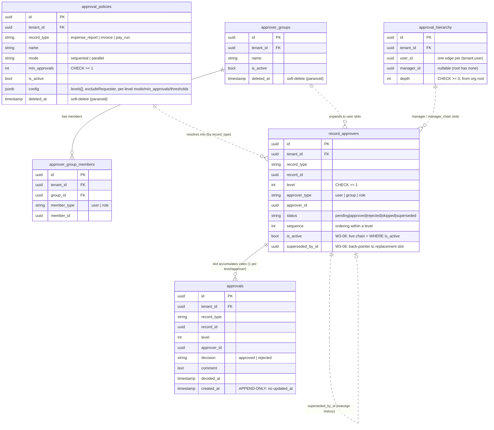
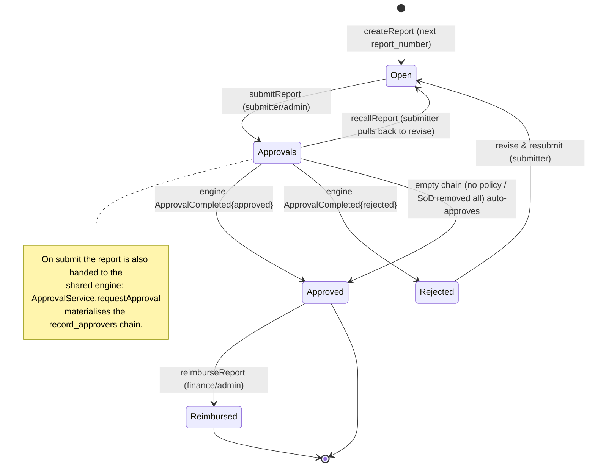

# 03 — The Shared Approval Engine & the Expense Lifecycle

This chapter documents two things that are deliberately separate in the code:

1. **`@aegis/approvals`** — one configurable, tenant-scoped, multi-level approval **engine** that
   routes approvals for *every* record type (expense reports, invoices, pay runs) keyed by a
   polymorphic `(record_type, record_id)`. It owns the chain and the immutable vote ledger; it knows
   nothing about expenses or payroll.
2. **`apps/expense`** — one *consumer* of that engine. It owns the expense-report state machine and
   calls the engine at submit/decide time, then advances its own record when the engine reports the
   chain is terminal.

The same engine is wired identically into `apps/invoice` and `apps/payroll` (§3). Adding a new
approvable record type is "one enum entry + a policy row — no new tables"
(`libs/shared/enums/src/approval.enum.ts:95-103`).

Everything below is taken from the actual implementation; file paths are cited inline.

---

## 1. The approval engine

### 1.1 Data model

Six tables, all created in `apps/cli/src/migrations/0012_approvals.ts` (the W3-06 supersede columns
are added by `0013_approvals_supersede.ts`). Every table is tenant-scoped with **FORCE + RESTRICTIVE
Row-Level Security** keyed on `app.current_tenant` (`rlsPolicyStatements(...)`,
`0012_approvals.ts:222-233`), so an approval row can never leak across tenants.



Key invariants enforced at the DB level:

- **`approval_policies`** — one *active* policy per `(tenant, record_type, name)` among live rows
  (partial unique index `WHERE deleted_at IS NULL`, `0012_approvals.ts:69-73`). Soft-deleted
  (`paranoid: true`, `models/approval-policy.model.ts:13`) so a retired policy survives for historical
  chains that resolved against it. `mode` and `min_approvals >= 1` are CHECK-pinned.
  The `config` JSONB is the policy's level spec (see §1.2).
- **`approval_hierarchy`** — one edge per `(tenant, user)` (`user_id → manager_id`), unique-indexed
  (`0012_approvals.ts:97-100`). Walked by the manager / manager-chain resolver sources.
- **`approver_groups` / `approver_group_members`** — a named group whose members are polymorphic
  (`user | role`); a principal appears at most once per group per kind (unique index,
  `0012_approvals.ts:142-145`).
- **`record_approvers`** — the **resolved chain materialised for one record instance** (the per-record
  routing snapshot). Snapshotting means a mid-flight policy edit cannot silently re-route an
  in-progress approval (`models/record-approver.model.ts:5-11`). The live chain is `WHERE is_active`;
  a **partial** unique index on `(tenant, record_type, record_id, level, approver_id) WHERE is_active`
  (`0013_approvals_supersede.ts:32-40`) lets the same approver reappear at the same level across a
  supersede (one retired row + one live row) while forbidding two *live* slots for the same
  approver+level.
- **`approvals`** — the **immutable, append-only vote ledger**. One row per
  `(record, level, approver) → decision`. `created_at` only, **no `updated_at`** — a vote is never
  mutated; a rejection short-circuits the chain instead (`models/approval-vote.model.ts:5-13`). A
  unique index on `(tenant, record_type, record_id, level, approver_id)` enforces the **no-double-vote**
  invariant (`0012_approvals.ts:204-208`).

### 1.2 Policy config & the resolver

A policy row's behaviour lives in two places: top-level columns (`mode`, `min_approvals`) and the
`config` JSONB, which holds `levels[]` (each a `PolicyLevelSpec`) plus the `excludeRequester` SoD flag.
The engine never reads `levels` to *resolve* approvers itself — that is the **resolver's** job. The
service builds a per-request `PolicyApproverResolver` bound to the RLS transaction
(`approval.service.ts:78-80`).

`PolicyApproverResolver.resolve()` (`resolver.ts:113-167`) turns a policy + record context into an
ordered set of `ResolvedSlot`s. Per declared level it:

| Concern | Source / rule | Code |
|---|---|---|
| **Amount threshold (W3-03)** | level dropped unless `amount >= amountMinorMin` (when set) **and** `amount < amountMinorMax` (when set), and `currency` matches if bound. A missing amount fails any lower-bound gate. Compared in **BigInt minor units** so amounts beyond `Number.MAX_SAFE_INTEGER` route correctly (BUG-0007). | `thresholdApplies()` / `toBigIntMinor()`, `resolver.ts:238-278` |
| **`user` / `role` source** | the single declared principal | `expandSpec`, `resolver.ts:176-179` |
| **`group` source (W3-04)** | expand to **every user member** of the group (`GroupPort.expandUserMembers`); ANY member (or a `min_approvals` quorum) clears the level | `resolver.ts:180-184` |
| **`manager` source (W3-05)** | the requester's reporting manager, one edge up `approval_hierarchy` | `resolver.ts:185-188` |
| **`manager_chain` source (W3-05)** | the requester's managers up to `depth`, one slot each | `resolver.ts:189-192` |
| **SoD `excludeRequester`** | drop the requester from any resolved **user** slot | `resolver.ts:136-139` |
| **De-dup within a level** | same `(type:id)` surfaced by two specs collapses to one | `resolver.ts:140-145` |
| **Normalisation** | surviving levels renumbered to **contiguous 1-based levels** with a deterministic per-level `sequence`; empty levels (threshold/group/manager/SoD removed everyone) are dropped | `resolver.ts:150-166` |

`DefaultApproverResolver` (`resolver.ts:48-87`) is the simpler static-only variant (reads
`config.levels` directly, applies `excludeRequester`, normalises). It is the extension/test seam
injected via `ApprovalService.useResolver()`.

> **No configured policy?** `resolvePolicy()` synthesises a built-in DEFAULT single-level
> `sequential` policy with **no `levels`** (`approval.service.ts:369-385`). The resolver yields an
> **empty chain**, which the engine treats as "no required approvers" and **auto-completes as
> approved** (`approval.service.ts:134-145`). So the engine never throws on an unconfigured type.

### 1.3 Sequential vs parallel; per-level mode & quorum (W3-08)

Mode and quorum are **per-level** concerns the *engine* reads from the policy (the resolver only
produces slots):

- **Effective level mode** = the level spec's own `mode`, else the policy `mode`
  (`levelMode()`, `approval.service.ts:388-391`).
- **Level quorum** (`levelQuorum()`, `approval.service.ts:399-408`):
  - **sequential level** → requires **every** slot at the level (quorum = slot count).
  - **parallel level** → `min_approvals` (per-level spec, else policy `min_approvals`, default 1 =
    any-one), clamped to `[1, slotCount]`.
- A **level is satisfied** when approved-count ≥ its quorum (`levelSatisfied()`, lines 411-418).
- The **whole chain is satisfied** when every distinct level is satisfied (`chainSatisfied()`,
  lines 426-433).

On submit, *all slots at the lowest level* are notified, regardless of mode
(`approval.service.ts:148-152`). Sequential then advances level-by-level on each decision; parallel
completes a level on its quorum.

### 1.4 decide(): voting, advance, short-circuit, concurrency

`ApprovalService.decide()` (`approval.service.ts:170-248`) runs entirely inside one RLS transaction:

1. **Advisory lock first (BUG-0004).** `locks.acquireRecordLock(record_type, record_id)` serialises
   concurrent decisions on the same record *before* reading the chain, so two approvers on a parallel
   quorum level can't both miss quorum (stall) or both complete (double `ApprovalCompleted`)
   (lines 173-178).
2. Find the caller's **own pending slot**. Not an approver → `403`; already decided → `409`
   (lines 185-196).
3. **No-double-vote guard** (defence-in-depth alongside the DB unique index) — `409` if already voted
   at this level (lines 199-203).
4. **Append the immutable vote** to `approvals` and set the slot status approved/rejected
   (lines 207-229).
5. **Rejection short-circuits**: `skipRemaining()` marks every still-pending slot `skipped`, then
   `emitCompleted(..., 'rejected', ...)` (lines 232-236).
6. **Approval**: `evaluateCompletion()` (lines 441-468) checks the decided level's quorum. If a higher
   level remains, it `skipRemainingAtLevel()` for the satisfied level and **notifies the next level's
   pending approvers** (advance) — chain stays open. If it was the last level, the chain completes →
   `emitCompleted(..., 'approved', ...)` (lines 238-244).

`reassign()` (lines 256-313) retires a pending slot via `supersede()` (status `superseded`,
`is_active=false`, `superseded_by_id` → replacement) and creates a fresh pending slot at the same
level for the new approver, then notifies them. The vote ledger is untouched. BUG-0006 rejects a
reassign that would create a duplicate live slot at the level (lines 276-290).

`getStatus()` (lines 329-359) returns the live chain + the superseded **history** + the vote ledger,
and recomputes `completed`/`outcome` from the chain — this is what the consumer services use for the
BUG-0005 self-heal (§2).

---

## 2. The expense lifecycle (end-to-end)

`apps/expense` owns the `expense_reports` aggregate (`models/expense-report.model.ts`: BIGINT
minor-unit money, per-tenant `report_number`, `paranoid` soft-delete + optimistic `lock_version`).
Status transitions are **role-keyed** by the principal's effective role for the report
(`ExpenseReportTransitions`, `libs/shared/constants/src/expense.constants.ts`):

| Role | Allowed edges |
|---|---|
| **SUBMITTER** | `OPEN → APPROVALS` (submit); `APPROVALS → OPEN` (recall); `REJECTED → OPEN` (revise & resubmit) |
| **MANAGER** | `APPROVALS → APPROVED`; `APPROVALS → REJECTED` |
| **FINANCE** | `APPROVED → REIMBURSED` |
| **admin** | any structurally valid edge (union of all maps) |

`assertTransition()` enforces these (`expense.service.ts:823-846`). Note the **APPROVALS → APPROVED /
REJECTED edges are driven by the engine**, not a direct manager click: `decideReport` advances the
report only when the *engine* reports the chain terminal (§2.2).

### 2.1 State diagram



### 2.2 Full approval flow (sequence)

`submitReport` (`expense.service.ts:371-425`) flips `OPEN → APPROVALS` and writes the activity +
`ExpenseSubmitted` in one RLS tx (transactional outbox), then calls the engine in its **own** tenant
tx. If the engine returns an **empty chain** it auto-completed → the report is advanced straight to
APPROVED via `applyCompletion` (lines 418-422).

`decideReport` (`expense.service.ts:440-492`) is the engine-backed replacement for the old single-shot
approve/reject. It pre-checks the report is in APPROVALS, runs the **BUG-0005 self-heal** (if the
engine chain is already terminal but the report is stranded, drive `applyCompletion` from
`getStatus()` instead of re-voting), then `ApprovalService.decide()`, mirrors the vote onto the
report's own `expense_approvals` trail (`recordDecisionTrail`, lines 621-645), and on a terminal chain
calls `applyCompletion`.

`applyCompletion` (`expense.service.ts:546-614`) is **idempotent** (already-terminal → no-op) and is
the single place where: status advances, activity + audit + `ExpenseApproved`/`ExpenseRejected` are
written, and — for `approved` only and only when *this* call effected the transition — the report is
**pushed to the ERP**.

> **ERP push mechanism (accurate to the code):** expense pushes **synchronously**, in-process, via
> `ConnectorRegistry.get(ConnectorKind.LedgerOne).pushTransaction(...)` inside `pushToErp`
> (`expense.service.ts:759-791`), then stamps `synced_at` when accepted. It does **not** emit a
> `ConnectorPushRequested` event. (That event + the workflow `connector-sync.consumer` exist and are
> used by invoice/payroll/workflow paths, but the expense service calls the connector directly.)

```mermaid
sequenceDiagram
    actor Submitter
    actor Approver
    participant EXP as ExpenseService (apps/expense)
    participant ENG as ApprovalService (@aegis/approvals)
    participant RES as PolicyApproverResolver
    participant DB as record_approvers / approvals (RLS)
    participant OBX as transactional outbox / bus
    participant NOTE as notification consumer
    participant ERP as ConnectorRegistry (LedgerOne)

    Submitter->>EXP: submitReport(reportId)
    EXP->>EXP: OPEN → APPROVALS (assertTransition, submitter)
    EXP->>OBX: stage ExpenseSubmitted (same RLS tx)
    EXP->>ENG: requestApproval(ExpenseReport, reportId, amountMinor, currency, requestedBy)
    Note over ENG: own RLS tx; idempotent (existing live chain ⇒ no-op)
    ENG->>RES: resolve(policy, ctx)
    RES->>DB: read approval_hierarchy / approver_group_members
    RES-->>ENG: ordered ResolvedSlots (thresholds, manager/group expansion, SoD)
    ENG->>DB: INSERT record_approvers (the resolved chain)
    alt empty chain (no policy / SoD removed all)
        ENG->>OBX: stage ApprovalCompleted{approved}
        ENG-->>EXP: chain = []
        EXP->>EXP: applyCompletion(reportId, approved) → APPROVED
    else chain has slots
        ENG->>OBX: stage ApprovalRequested (each lowest-level slot)
        ENG-->>EXP: chain
        OBX-->>NOTE: ApprovalRequested → notify approvers
    end

    Approver->>EXP: decideReport(reportId, {decision, comment})
    EXP->>ENG: getStatus (BUG-0005 self-heal check)
    EXP->>ENG: decide(ExpenseReport, reportId, approverId, decision)
    Note over ENG: advisory lock (BUG-0004) → no-double-vote guard
    ENG->>DB: append immutable vote (approvals); set slot status
    alt rejected
        ENG->>DB: skipRemaining (short-circuit)
        ENG->>OBX: stage ApprovalCompleted{rejected}
    else approved & level quorum met
        alt higher level remains
            ENG->>DB: skipRemainingAtLevel; advance
            ENG->>OBX: stage ApprovalRequested (next level)
        else last level
            ENG->>OBX: stage ApprovalCompleted{approved}
        end
    end
    ENG-->>EXP: DecisionResult{completed, outcome}
    EXP->>DB: mirror vote → expense_approvals (recordDecisionTrail)

    opt result.completed
        EXP->>EXP: applyCompletion(reportId, outcome) [idempotent]
        alt approved
            EXP->>OBX: stage ExpenseApproved
            EXP->>ERP: pushTransaction(Expense, idempotencyKey=reportId)
            ERP-->>EXP: accepted ⇒ stamp synced_at
        else rejected
            EXP->>OBX: stage ExpenseRejected
        end
    end

    Note over OBX,EXP: ApprovalCompleted is ALSO consumed by<br/>approval-completed.consumer (worker role)<br/>→ applyCompletionFromEvent → recovers a stranded report
```

### 2.3 Stranded-record recovery (BUG-0005)

`decideReport` stages `ApprovalCompleted` inside the engine's tx but advances the report in a
*separate* step. If that advance fails, the chain is complete but the report is stranded in APPROVALS.
Two safety nets:

1. **In-request self-heal** — the next `decideReport` sees `getStatus().completed` and drives
   `applyCompletion` from the staged outcome instead of re-voting (`expense.service.ts:454-461`).
2. **Event-driven recovery** — `consumers/approval-completed.consumer.ts` subscribes to the relayed
   `ApprovalCompleted`, filters to `ExpenseReport` only (invoice/payroll share the topic but have
   their own consumers, line 48), validates the **envelope tenant** matches the rebuilt context
   (anti-ambient-authority, lines 30-35), and calls the same idempotent `applyCompletionFromEvent`.
   At-least-once delivery advances a stranded record exactly once; a double delivery is a no-op.

---

## 3. The same engine for invoice & payroll

The engine is record-type-agnostic: each finance service injects `ApprovalService` (the reusable
`registerApprovalProviders()` wiring in each `ioc/loader.ts`) and calls the identical
`requestApproval` / `decide` / `getStatus` API, differing only in the `ApprovalRecordType` key and how
its own state machine advances on completion.

| Service | record_type | requestedBy | On approved |
|---|---|---|---|
| **expense** | `expense_report` | submitter | `APPROVED` (+ synchronous ERP push) |
| **invoice** | `invoice` | `submitted_by ?? created_by ?? user` (`invoice.service.ts:408`) | advances + ERP push |
| **payroll** | `pay_run` | the run **creator** `run.created_by` (`pay-run.service.ts:309`) | `Approved` (snapshot + `PayRunApproved`) |

All three reuse the **identical patterns**: idempotent `requestApproval`, empty-chain auto-approve,
BUG-0005 self-heal via `getStatus`, idempotent `applyCompletion`, and a per-service
`ApprovalCompleted` consumer filtered to its own record type.

### Payroll maker-checker SoD

Payroll is the strictest user of the engine. Its decision flow (`pay-run.service.ts:280-339`) enforces
**segregation of duties as a hard domain invariant — defence-in-depth on two layers**:

1. **Policy layer** — the seeded PayRun policy sets `excludeRequester`, so the resolver never places
   the run's creator on the chain (`resolver.ts:136-139`).
2. **In-service guard** — `assertSegregationOfDuties()` (`pay-run.service.ts:488-494`) throws `403`
   if `run.created_by === approver`, *"even if they hold the permission and even if the policy were
   misconfigured to resolve them into the chain"* (lines 289-292). Because `requestApproval` passes
   `requestedBy: run.created_by`, the maker (who created/edited the run's inputs) can never be the
   checker (who approves it).

This is the canonical maker-checker control: the same shared engine that does threshold/manager/group
routing for expenses enforces an unbreakable two-person rule for pay runs, with the only difference
being one policy flag plus one belt-and-braces service guard.
