# 04 — Services

This document describes each business microservice and the cross-cutting libraries that the
services lean on. Every claim below is drawn directly from the implementation; file paths are cited
so the doc can be re-verified against the code. The diagrams are Mermaid and render on GitHub.

All services share the same skeleton:

- **HTTP surface**: `inversify-express-utils` controllers. Every protected route is PEP-guarded with
  `authenticate()` (verify JWT → populate `req.principal` / `RequestContext`) followed by
  `authorize(Permission.*)` from `@aegis/access-control`. Bodies validate via `validate(schema)`.
- **Service layer**: owns the transaction (`withTenantTransaction` from `@aegis/db`, which sets the
  PostgreSQL RLS tenant predicate first); repositories take the ambient `Transaction`.
- **Eventing**: domain events are staged with `stageOutboxEvent(makeEnvelope(...), t)` in the SAME
  transaction as the write (transactional outbox — no dual-write gap), then drained to the bus and
  consumed by per-service consumers (in-process locally; Kafka in `PROCESS_TYPE=worker`).
- **Cross-cutting**: `@aegis/audit` (hash-chained security log), `@aegis/activity` (shared business
  timeline), `@aegis/approvals` (multi-level maker-checker engine), `@aegis/connectors` (ERP push).

*North-south + cross-cutting: a JWT request routes through the gateway to a service, which writes to the audit and activity logs.*

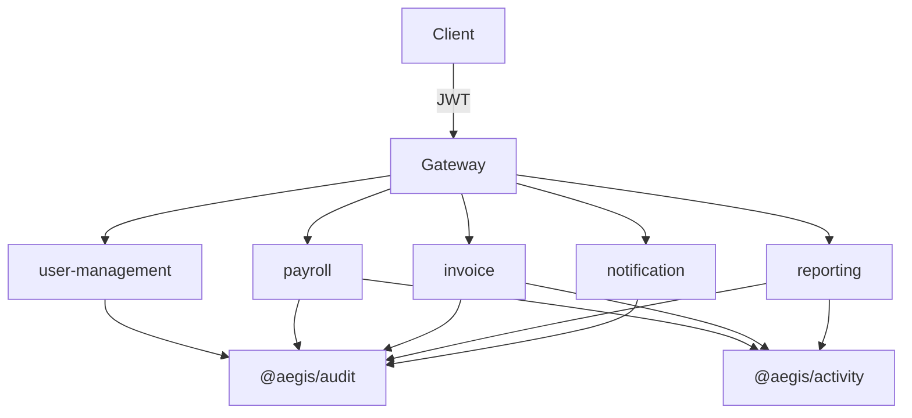

*Eventing: payroll/invoice stage outbox events onto the bus, fanning out to the notification + connector-sync workers (ERP push).*

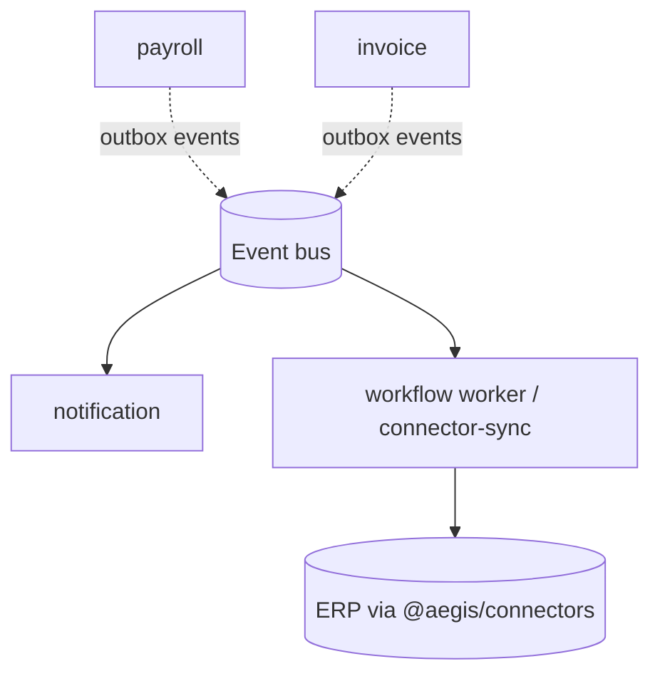

---

## user-management — the reference IdP + Policy Administration Point (PAP)

**Purpose.** Aegis's identity provider and the runtime PAP. It owns users, the role/permission
catalog, role assignments (with row-level scope), and per-tenant config + feature flags. Roles,
permissions, and assignments are managed at **runtime** — no migration/deploy — and committed writes
are **projected into the live Casbin policy store** with a cross-pod reload so they take effect
without a restart.

**Key tables** (`apps/user-management/src/models/`):

| Table              | Notes                                                                                                                           |
| ------------------ | ------------------------------------------------------------------------------------------------------------------------------- |
| `users`            | tenant-scoped; `password_hash` is scrypt (`<saltHex>:<hashHex>`), `node:crypto`; paranoid + optimistic-locked (`lock_version`). |
| `roles`            | system roles have `tenant_id = null` + `is_system`; custom roles are tenant-scoped; optimistic-locked.                          |
| `permissions`      | global catalog of dotted `domain.action` names (`name` unique).                                                                 |
| `role_permissions` | role ⇄ permission join (many-to-many).                                                                                          |
| `user_roles`       | tenant-scoped; carries the user's row-level `scope` (default `own_only`).                                                       |
| `tenants`          | root of each tenant data island (`slug` unique).                                                                                |
| `tenant_config`    | arbitrary per-tenant settings as JSONB keyed by name (SPEC §11.5).                                                              |
| `tenant_features`  | per-tenant feature flags; gating reads `enabled` (default-off when no row).                                                     |

**Key endpoints** (`controllers/`):

| Method + path                                          | Guard                           | Handler                          |
| ------------------------------------------------------ | ------------------------------- | -------------------------------- |
| `POST /user-management/api/auth/register`              | public                          | `AuthService.register`           |
| `POST /user-management/api/auth/login`                 | public                          | `AuthService.login` — issues JWT |
| `GET  /user-management/api/auth/me`                    | `authenticate()`                | `AuthService.me`                 |
| `GET  /user-management/api/permissions`                | `permission.view`               | `PapService.listPermissions`     |
| `GET  /user-management/api/roles`                      | `role.view`                     | `PapService.listRoles`           |
| `POST /user-management/api/roles`                      | `role.create`                   | `PapService.createRole`          |
| `POST /user-management/api/users/:userId/role`         | `role.assign`                   | `PapService.assignRole`          |
| `GET/PUT /user-management/api/tenant/config[/:key]`    | `tenant.view` / `tenant.manage` | `TenantConfigService`            |
| `GET/PUT /user-management/api/tenant/features[/:flag]` | `tenant.view` / `tenant.manage` | `TenantConfigService`            |

### Flow — login issues a permission-bearing JWT

`AuthService.login` (`services/auth.service.ts`) verifies the scrypt password (`utils/password.ts`,
`timingSafeEqual`), resolves the user's access via `UserRepository.getAccess` (role name(s),
flattened permission names, row-level `scope`), then signs a JWT whose claims carry
`{ sub, tenant_id, roles, permissions, scope, aud:'aegis' }`. A `LoginSucceeded` audit row is
written in the same RLS transaction.

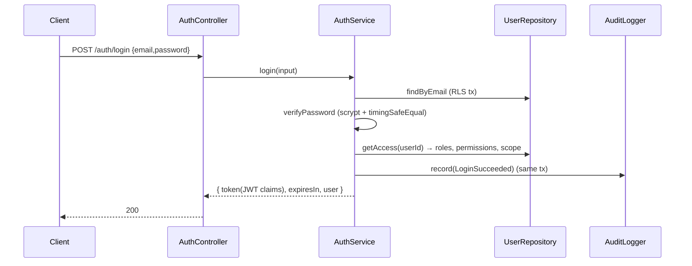

The claims are the PEP's input downstream: every other service's `authorize(Permission.*)` reads
`permissions` off the token, and field/row obligations (e.g. payroll's `payroll.sensitive.read`,
reporting's masking) are resolved from the same claim set.

### Flow — runtime PAP write + Casbin projection/reload

`PapService.createRole` / `assignRole` (`services/pap.service.ts`) commit the relational catalog
write first (the source of truth), then **after commit** call `projectGrant` →
`applyPolicyGrant(@aegis/access-control)` to push the grant into the Casbin store and fan out a reload
(W5-03), so running pods enforce it without a restart.

Two important behaviours, both in code:

- **Default best-effort, fail-open at the projection** — an ADD-only projection failure is logged at
  alert severity and **not** rethrown (the catalog already committed; a re-seed/next mutation
  re-converges; a pod that never learns of a new grant just keeps denying — the safe direction).
- **Re-assignment revocation is fail-closed (BUG-0008)** — `assignRole` resolves the prior role name
  and, on a real role change, includes a `revokeGroupings` entry. Because leaving the stale grouping
  in the store would keep granting the old role, that projection is called with `failOnError:true`,
  so a revoke failure **rethrows**.

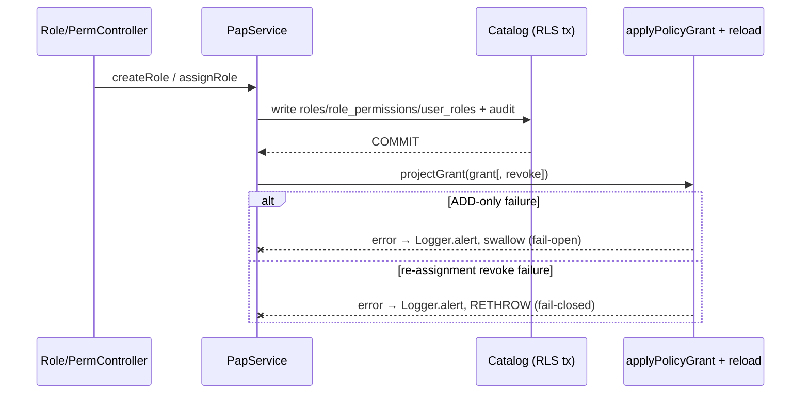

### Flow — feature flags through the read-through cache

`TenantConfigService.isFeatureEnabled` (`services/tenant-config.service.ts`) resolves through
`FeatureFlags.isEnabledForTenant`, fronted by `FeatureFlagCache` (installed at construction). Reads
are cache-served per `(tenant, flag)`; `setFlag` writes + audits in an RLS tx then
`FeatureFlagCache.invalidate(...)` after commit so a toggle takes effect immediately. Resolution is
fail-soft to `false` (no context / no reader / lookup error ⇒ disabled). Current gated capabilities
include the Expenditure Visualizer (`expense.visualizer`) and Wave-6 record annotations
(`record.annotations`).

---

## payroll — employees, PII, and the pay-run engine

**Purpose.** Employee master data (with field-encrypted PII) and the pay-run lifecycle
**Draft → Calculated → Approved → Paid**, with maker-checker segregation of duties via the shared
approval engine, real data-driven tax, idempotent payments, and an append-only double-entry ledger.

**Key tables** (`apps/payroll/src/models/`):

| Table                               | Notes                                                                                                                                       |
| ----------------------------------- | ------------------------------------------------------------------------------------------------------------------------------------------- |
| `employees`                         | `bank_account_enc` / `national_id_enc` / `tax_identifier_enc` are AES-256-GCM ciphertext (`TEXT`); paranoid + optimistic-locked.            |
| `pay_runs`                          | state machine (`status`), `locked_snapshot` (JSONB), `team_id`, `assignee_id`, denormalized `tags`; optimistic-locked.                      |
| `payslips`                          | per-employee totals (`gross`/`taxable_base`/`total_tax`/`total_deductions` as `BIGINT` minor units), `net_enc` (encrypted net), `currency`. |
| `payslip_lines`                     | per-payslip earning/deduction lines.                                                                                                        |
| `employee_pay_items`                | recurring pay items, effective-dated (`effective_from/to`).                                                                                 |
| `employment_contracts`              | effective-dated; `base_amount_enc` encrypted; carries `currency`.                                                                           |
| `tax_rules`                         | effective-dated per `jurisdiction`; `params` JSONB (flat `{rate}` or `{brackets}`).                                                         |
| `deduction_codes` / `earning_codes` | catalogs; deduction `pre_tax` flag drives taxable-base reduction.                                                                           |
| `payments`                          | `idempotency_key` UNIQUE; `amount` (net) minor units; `status`.                                                                             |
| `payment_batches`                   | one batch per disbursement.                                                                                                                 |
| `ledger_entries`                    | append-only double-entry (`account`, `debit`, `credit`, `currency`, `reversal_of`).                                                         |

**Key endpoints** (`controllers/`):

| Method + path                                  | Guard                                                                               |
| ---------------------------------------------- | ----------------------------------------------------------------------------------- |
| `POST /payroll/api/employees`                  | `payroll.employee.manage`                                                           |
| `GET  /payroll/api/employees`                  | `payroll.employee.view` (+ field obligation `payroll.sensitive.read`)               |
| `POST /payroll/api/pay-runs`                   | `pay-run.create`                                                                    |
| `GET  /payroll/api/pay-runs`                   | `pay-run.approve` (paged; filters: `status`, `tag`, `team`, `assignee`, `tagMatch`) |
| `POST /payroll/api/pay-runs/:id/calculate`     | `pay-run.calculate`                                                                 |
| `POST /payroll/api/pay-runs/:id/decisions`     | `pay-run.approve` (canonical decision)                                              |
| `POST /payroll/api/pay-runs/:id/approve`       | `pay-run.approve` (alias for `decision:approved`)                                   |
| `GET  /payroll/api/pay-runs/approvals/pending` | `pay-run.approve` (inbox)                                                           |
| `POST /payroll/api/pay-runs/:id/disburse`      | `pay-run.disburse` (requires `Idempotency-Key` header)                              |

### Flow — employee PII: encrypt on write, mask on read, audit clear reads

`EmployeeService` (`services/employee.service.ts`, `utils/field-crypto.ts`): on `create`, PII is
`encryptField`-ed (AES-256-GCM, stored as `iv:authTag:ciphertext`; key from `FIELD_ENCRYPTION_KEY`).
On `list`, the controller resolves the field obligation `canReadSensitive =
perms.includes(payroll.sensitive.read)`; the service decrypts then either returns clear (only when
the obligation is held) or masks (`maskLast4` / `••••••••`). When clear PII is returned, **one
hash-chained `SensitiveFieldRead` audit row per employee** records the exact fields disclosed
(SPEC §2.5). Masked reads are not audited.

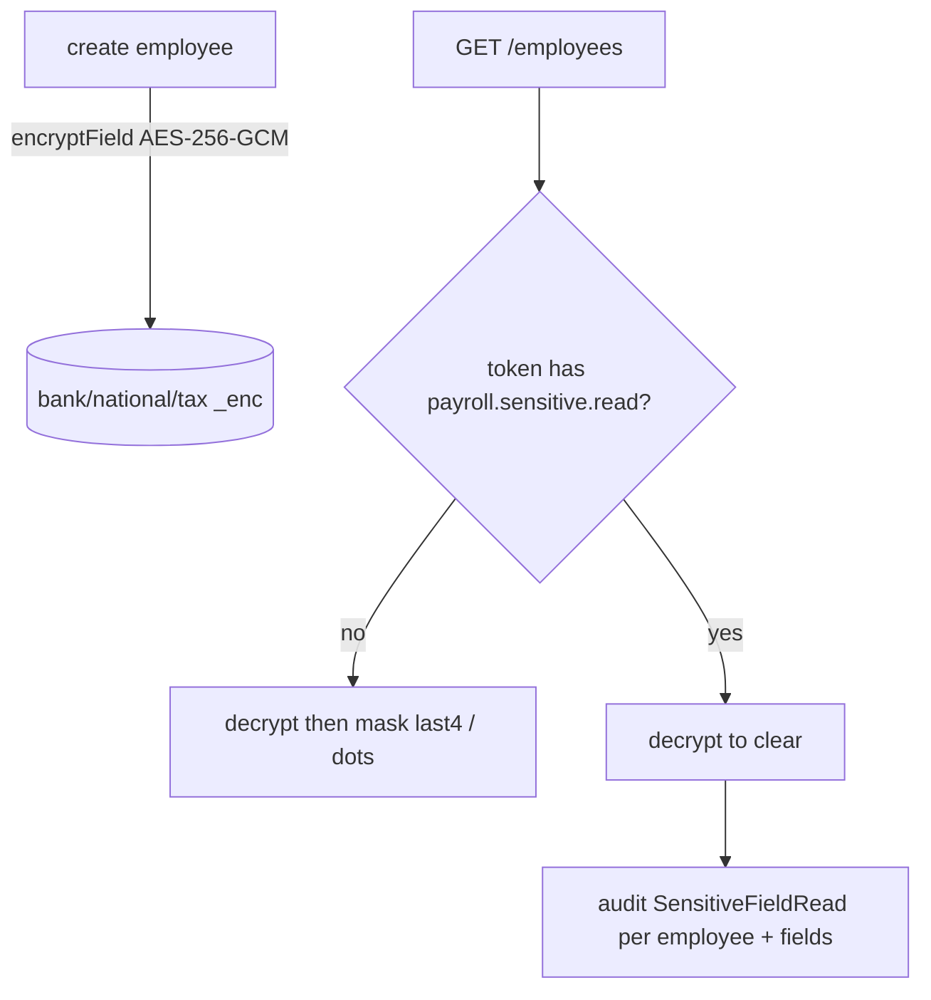

### Flow — pay-run lifecycle (Draft → Calculated → Approved → Paid)

`PayRunService` (`services/pay-run.service.ts`):

- **create → Draft**: seeds one payslip shell per employee, currency = the employee's effective
  contract currency on the pay date (`resolveCurrency`/`findContractCurrencyForEmployee`).
- **calculate → Calculated**: for each payslip, sums effective-dated `employee_pay_items`; pre-tax
  deductions (resolved from `deduction_codes` via `deductionPreTaxFlag`) reduce the taxable base
  before tax; tax is **data** from effective-dated `tax_rules` for the employee's jurisdiction
  (`utils/tax-engine.ts` — flat `rate` or progressive `brackets`; zero rules ⇒ zero tax via the data
  path, not a constant). `net = gross − tax − all deductions`, stored as `net_enc`. The status
  transition is version-checked (`updatePayRunVersioned`, W5-07).
- **decide → Approved** (maker-checker / SoD): delegated to `@aegis/approvals` keyed
  `(PayRun, runId)`. SoD is enforced twice — the seeded policy's `excludeRequester` **and** a hard
  in-service guard `assertSegregationOfDuties` (creator can never approve). On chain completion,
  `applyCompletion` snapshots the result into `locked_snapshot`, version-checked-flips to Approved,
  and stages `PayRunApproved`. Rejection leaves the run **Calculated** for revision. A self-heal
  (BUG-0005) recovers a run whose closing vote committed but in-request advance failed.
- **disburse → Paid**: gated on Approved + `Idempotency-Key`. Per payslip, an idempotent payment is
  created keyed `idempotencyKey:slipId` (`payments.idempotency_key` UNIQUE — no double-pay). All
  payslips must share a single currency (`assertSingleCurrency`). A **balanced double-entry** is
  appended: `Dr wage_expense(gross) / Cr cash(net) + tax_liability(tax) + deduction_liability(ded)`.
  The Paid transition is version-checked, then a `ConnectorPushRequested` GL summary (header-level
  only, **no PII / no net**) is staged for the ERP-sync worker.

```mermaid
stateDiagram-v2
  [*] --> Draft: create (seed payslip shells)
  Draft --> Calculated: calculate (tax from tax_rules, net_enc)
  Calculated --> Calculated: decide=rejected (revise)
  Calculated --> Approved: chain complete (SoD; snapshot + PayRunApproved)
  Approved --> Paid: disburse (idempotent payments + balanced ledger + ERP push event)
  Paid --> [*]
```

**Consumers** (`consumers/`): `ApprovalCompleted` → `applyCompletionFromEvent` (stranded-run
recovery, idempotent) and `RecordUpdated` → `applyRecordUpdate` (workflow
`assign_team`/`add_tag`/`remove_tag`/`assign_owner`, syncing `record_tags`, `assignee_id`, and the
denormalized `tags` cache). Both assert the rebuilt context tenant matches the envelope tenant.

---

## invoice — header-level AP with duplicate detection and ERP push

**Purpose.** Header-level invoice intake with currency-aware **duplicate detection** (no double-pay),
the multi-level approval engine, and an ERP journal push on approval via the outbox.

**Key tables** (`apps/invoice/src/models/`):

| Table                | Notes                                                                                                                                                                                                          |
| -------------------- | -------------------------------------------------------------------------------------------------------------------------------------------------------------------------------------------------------------- |
| `invoices`           | header (`vendor_name`, `invoice_number`, `amount_minor` BIGINT, `currency` STRING(3)), `status`, `auto_approved`, `submitted_by`, `team_id`, `assignee_id`, denormalized `tags`; paranoid + optimistic-locked. |
| `invoice_metadata`   | one-to-one extracted facts (`invoice_id` UNIQUE).                                                                                                                                                              |
| `invoice_approvals`  | per-invoice decision ledger (mirror of engine votes; `approval_level`, `decision`).                                                                                                                            |
| `invoice_duplicates` | `invoice_id`, `duplicate_of`, `signature`, `reason`.                                                                                                                                                           |
| `invoice_activities` | per-invoice activity feed (also mirrored to `@aegis/activity`).                                                                                                                                                |

**Key endpoints** (`controllers/invoice.controller.ts`):

| Method + path                                  | Guard                                                                            |
| ---------------------------------------------- | -------------------------------------------------------------------------------- |
| `POST /invoice/api/invoices`                   | `invoice.create`                                                                 |
| `GET  /invoice/api/invoices`                   | `invoice.view` (paged; filters: `status`, `tag`, `team`, `assignee`, `tagMatch`) |
| `GET  /invoice/api/invoices/approvals/pending` | `invoice.approve` (inbox; registered before `:id`)                               |
| `GET  /invoice/api/invoices/:id`               | `invoice.view`                                                                   |
| `POST /invoice/api/invoices/:id/submit`        | `invoice.update`                                                                 |
| `POST /invoice/api/invoices/:id/decisions`     | `invoice.approve` (canonical)                                                    |
| `POST /invoice/api/invoices/:id/approve`       | `invoice.approve` (alias)                                                        |

### Flow — create + duplicate detection (currency-inclusive, race-safe)

The dedup **signature** is `sha256(VENDOR|INVOICE_NUMBER|amountMinor|CURRENCY)` (uppercased; includes
currency). `create` runs `insertAndDetect`: insert the header (Received) + metadata + activity, then
`findDuplicateCandidate`. A read-visible collision marks the invoice **Duplicate** + writes an
`invoice_duplicates` row; otherwise it advances Validating → PendingReview. The read can't see an
uncommitted sibling, so a partial-unique index (`invoices_dup_signature_cur_live_uq`, currency-less
`..._live_uq` accepted during migration) closes the race at the DB: the concurrent loser's insert
raises a unique violation, which `isDedupViolation` detects and `recordConcurrentDuplicate` resolves
by re-creating the loser **born Duplicate** (excluded from the index predicate), linked to the winner.

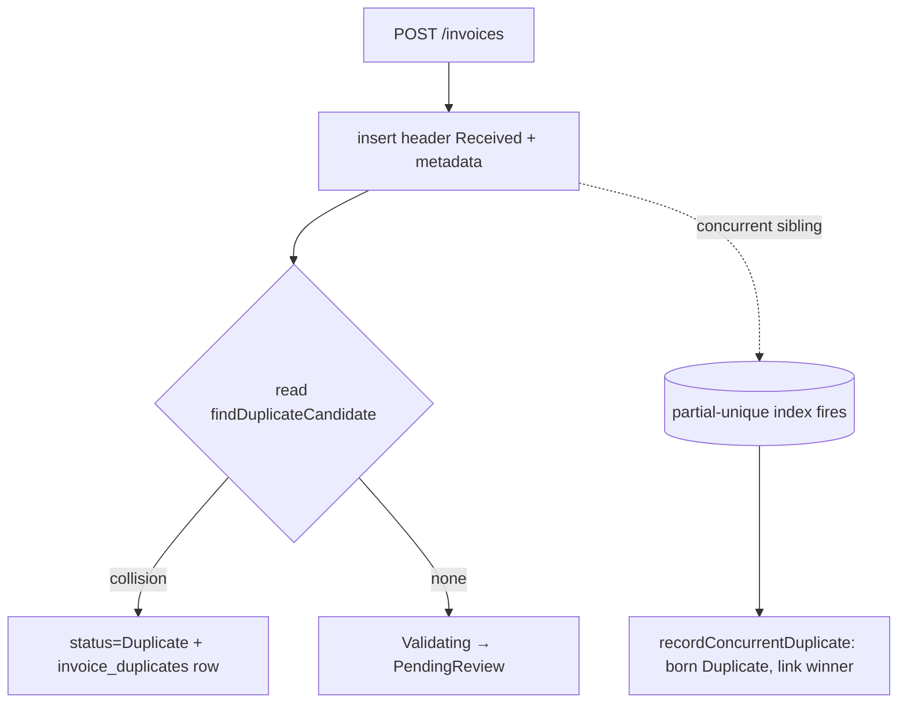

### Flow — submit → approve → ERP push (consumer)

`submit` version-checks Received-class → ForApproval, stages `InvoiceReceived`, and materialises the
approver chain via `ApprovalService.requestApproval` (amount + currency drive the threshold level;
**BIGINT passed straight through**, BUG-0007). An empty chain auto-approves. `decide` records the vote
through the engine, mirrors it onto `invoice_approvals` + the activity timeline, and on completion
`applyCompletion` version-checks the terminal status. On **approved** it stages two outbox events in
the write's tx: `InvoiceApproved` (notify) and `ConnectorPushRequested` (`idempotencyKey = invoice id`).
A separate worker (`apps/workflow/.../connector-sync.consumer.ts`) performs the actual ERP push off the
request path — a slow/failing ERP no longer blocks the user and the push is retried/DLQ'd.

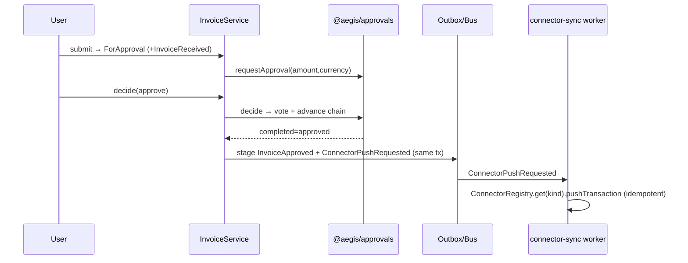

**Consumer**: `ApprovalCompleted` → `applyCompletionFromEvent` (stranded-record recovery, idempotent),
filtered to `ApprovalRecordType.Invoice`.

---

## reporting — declarative definitions, async runs, column masking

**Purpose.** CQRS-lite read side: declarative report definitions, per-tenant column-masking access
policies, and an **asynchronous** run lifecycle (HTTP `202 + runId`, client polls).

**Key tables** (`apps/reporting/src/models/`):

| Table                    | Notes                                                                                               |
| ------------------------ | --------------------------------------------------------------------------------------------------- |
| `report_definitions`     | `spec` JSONB (data, never raw SQL); `required_permission` (defaults to `report.run`); paranoid.     |
| `report_runs`            | `status` (`queued`/`succeeded`/...), `params`, `started_at`/`finished_at`, `artifact_url`, `error`. |
| `report_schedules`       | `cron` + `timezone` + `enabled` (scheduled runs).                                                   |
| `report_access_policies` | per `role`: `allowed_columns`, `masked_columns`, `row_filter` — drives column masking.              |

**Key endpoints**:

| Method + path                            | Guard           | Notes                              |
| ---------------------------------------- | --------------- | ---------------------------------- |
| `POST /reporting/api/report-definitions` | `report.define` | create declarative definition      |
| `GET  /reporting/api/report-definitions` | `report.view`   | paged                              |
| `POST /reporting/api/report-runs`        | `report.run`    | **202** + `Location` + `{ runId }` |
| `GET  /reporting/api/report-runs/:id`    | `report.view`   | poll status + `artifact_url`       |

### Flow — async run with column masking

`createRun` (`services/reporting.service.ts`) inserts a `report_run` as `queued` and returns
`202 + runId`. It resolves the caller's column-masking policy by role
(`runs.findAccessPolicyByRole`) — in production the compiler applies `masked_columns` + the
`row_filter` **before** SQL is built, so sensitive columns never enter the query plan, cache, or
artifact (§5.2). Two `@aegis/activity` entries (`run_requested`, `run_completed`) are written in the
same RLS tx. In the demo the run is settled synchronously to `succeeded` with a stub `artifact_url`;
the documented production path hands `runId` to a BullMQ worker that does that update.

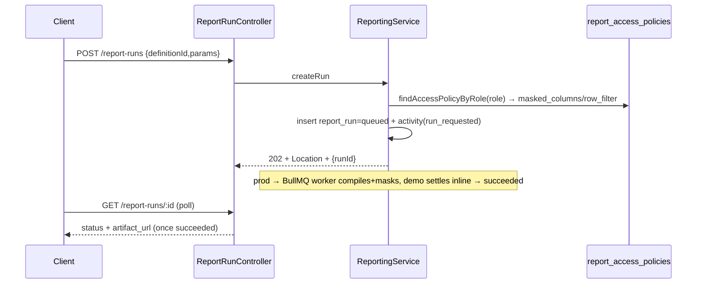

---

## notification — recipient resolution, preferences, templates, email/SMS, suppression

**Purpose.** The event-driven outbound layer: consumes domain events, resolves a recipient **hint**
into the concrete recipient **set**, renders a template, and delivers in-app + email + SMS with
per-channel preferences, sender identity, domain gating, and a suppression list. Exactly-once at the
recipient via an idempotent delivery ledger.

**Key tables** (`apps/notification/src/models/`):

| Table                      | Notes                                                                                                                                                          |
| -------------------------- | -------------------------------------------------------------------------------------------------------------------------------------------------------------- |
| `notifications`            | in-app inbox rows (`user_id`, `code`, `message` JSONB, `correlation_id`, `read_at`).                                                                           |
| `notification_preferences` | per `(user, event_type, channel)`; default-on unless an explicit disable row.                                                                                  |
| `email_notification_logs`  | channel-agnostic delivery ledger (`idempotency_key`, `status`, `error_message`, `sent_at`); reused for SMS (address in `email`, channel encoded into the key). |
| `email_sender_identities`  | per-tenant `from_name`/`from_email`/`reply_to` + `email_enabled` master-switch.                                                                                |
| `email_suppressions`       | per-tenant suppressed `address` + `reason`/`source`.                                                                                                           |

**Key endpoints** (`controllers/notification.controller.ts`): caller-scoped inbox
`GET /notification/api/notifications` (paged) and `POST .../:id/read` (fail-closed NotFound if not
owned). The primary surface is the **event consumer**, not HTTP.

### Flow — consume event → resolve → render → deliver

`notification.consumer.ts` subscribes to `ExpenseApproved`, `ExpenseRejected`, `InvoiceApproved`,
`ApprovalRequested`, `PayRunApproved`, and `NotificationRequested` (rule-authored, BUG-0002). Each
handler asserts the rebuilt context tenant matches the envelope, maps the payload to a typed
`NotificationMessage`, and builds a `RecipientSpec` from the hint, then calls
`NotificationService.resolveAndDispatch`.

- **RecipientResolver** (`recipient-resolver.service.ts`): a `user` spec trusts an inline
  email/phone, else resolves `userId → contact` via a context-propagating call to user-management
  (best-effort: on failure it degrades to in-app-only, never a dropped notification).
  `role`/`group`/`tenant-admins` audiences delegate to a membership lookup (empty set when
  unavailable → fan out nothing for that audience).
- **Render** (`content-map.ts` + `template-engine.ts`): one named template per code, `{{var}}`
  interpolation; `VAR_BUILDERS` is a total typed map over the code union (adding a code without a
  builder is a compile error). Unknown placeholders render to empty string.
- **Per-recipient dispatch** (`notification.service.ts` `createAndDispatch`): inside one RLS tx, each
  channel is gated by the per-channel preference (default-on). In-app inserts idempotently; email and
  SMS go through the idempotent senders keyed `channel:code:businessKey:user:correlation`. A per-code
  kill-switch can suppress entirely.

### Flow — idempotent email with the send gate (G2/G3/G8)

`EmailSenderService.sendIdempotent` (`email-sender.service.ts`): `findOrCreateForUpdate` locks the
ledger row (`idempotency_key` UNIQUE); short-circuit if terminal. Then the **send gate**, each branch
recorded as an intentional not-sent (distinct from `Failed`) and **never throwing**:

1. **tenant master-switch off** (`SenderIdentityService.resolve` → `email_enabled`) ⇒ `Disabled`.
2. **suppression list hit** (`email_suppressions`) ⇒ `Suppressed`.
3. **domain gate** (`email-gating.ts`, env allow/deny + non-prod subject prefix; deny wins) ⇒
   `Blocked`, else a possibly-prefixed subject.

Otherwise it sends via `EmailProviderService` (real **nodemailer** — SMTP when `SMTP_HOST` is set,
else a no-network `jsonTransport` dev sink; **no SES**), stamping per-tenant From/Reply-To and
html/attachments; marks `Sent` on success or `Failed` on exception (rethrows so the bus
retries/DLQs). SMS (`sms-sender.service.ts` + `sms-provider.service.ts`, a credential-free stub) walks
the same ledger lifecycle.

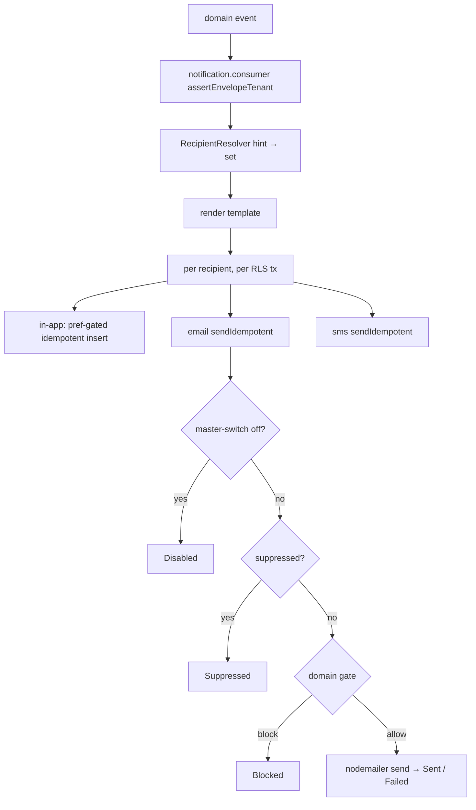

---

## libs/connectors — ERP adapter / transformer / registry + durable sync-state + reconcile

**Purpose.** The ERP integration seam (adapter/strategy/factory). `BaseConnector` provides durable
idempotency, typed retry/backoff, attempt + error accounting, and audits every push; subclasses
(`mock/ledger-one.ts`, `finovo.ts`, `acct-bridge.ts`) implement `doPush`/`doStatus`.

- **Registry (factory)** `registry.ts`: `ConnectorRegistry.{register,get,list}` keyed by `ConnectorKind`.
- **Transformer (strategy)** `transformer.ts`: maps a domain entity → an ERP-specific payload
  (`IdentityTransformer` pass-through; `AbstractTransformer` stamps the common envelope). Orchestration
  never branches on the ERP.
- **Config store** `config-store.ts`: `ConnectorConfigStore.resolve(kind, tenantId)` (interface;
  `StaticConnectorConfigStore` for mocks; a `connector_configs`-backed store in production for
  `baseUrl`/`credentialsRef`/`settings`).
- **Durable sync-state** `sync-state.ts`: `SyncStateStore` (interface) — one row per
  `(tenant, idempotency_key)` with status/externalId/attempts/lastError. Ships an
  `InMemorySyncStateStore`; the workflow app binds a Postgres-backed RLS-scoped store
  (`connector_sync_state`), so idempotency survives restarts / replica fan-out / Kafka rebalance.

### Flow — durable idempotent push + reconcile

`BaseConnector.pushTransaction`: `store.upsertQueued` is the cross-instance idempotency gate (an
existing row returns its recorded outcome without re-hitting the ERP). Otherwise it applies the
transformer, calls `doPush` under `withRetry` (an `UnrecoverableError` short-circuits; retryable/untyped
throws back off `baseDelayMs * 2^attempt`), then `recordOutcome` persists status + externalId +
attempts (rethrowing on exhaustion so the bus DLQs the envelope). `reconcile` advances a
`queued`/`in_progress` row by polling the ERP (`getStatus`) and persisting any change — the donor's
status-poll cron.

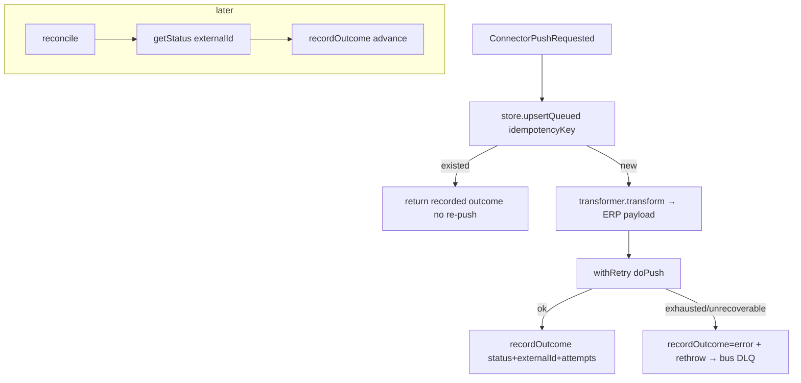

---

## libs/audit — hash-chained, tamper-evident security log

**Purpose.** Append-only security audit (`audit_log`: `actor_id`, `action`, `outcome`,
`resource_type/id`, `details`, `permissions-at-time`, `prev_hash`, `hash`).

`AuditLogger.record` (`audit-logger.ts`) must run in an RLS tx. It serializes appends per tenant via a
**transaction-scoped advisory lock** (`pg_advisory_xact_lock(NAMESPACE, tenantLockKey)`) so the
tail-read → hash → insert is atomic even on an empty chain (where a `FOR UPDATE` has no row and two
first-writers would both anchor to `GENESIS` and fork). It also `LOCK.UPDATE`s the tail row
(deterministic `created_at DESC, id DESC` tiebreak). Each entry's `hash = sha256(prev_hash | canonical
payload)` (`hash.ts`), so altering any historical row breaks every subsequent hash. `verifyChain`
re-walks in insertion order to detect tampering.

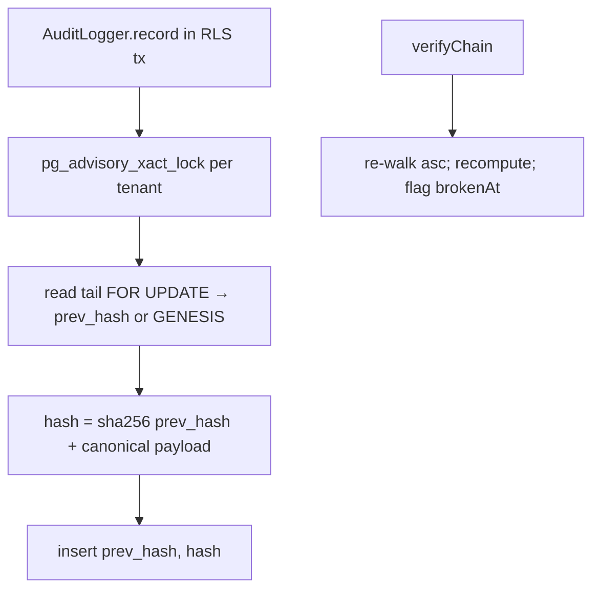

---

## libs/activity — shared business timeline

**Purpose.** The business-event twin of `@aegis/audit`: one polymorphic, append-only `activity_log`
(`record_type`, `record_id`, `actor_id`, `action`, `details`, `correlation_id`) that every service
writes a who-did-what feed into, keyed by the same `(recordType, recordId)` the approval engine uses.

`ActivityLogger.record` appends in the caller's RLS tx (actor/correlation default from
`RequestContext`); `ActivityLogger.list(recordType, recordId, t)` returns the timeline newest-first.
Payroll, invoice, and reporting all write here (`created`/`calculated`/`approved`/`disbursed`,
`Received`/`Approved`/`Rejected`/`record_updated`, `run_requested`/`run_completed`).

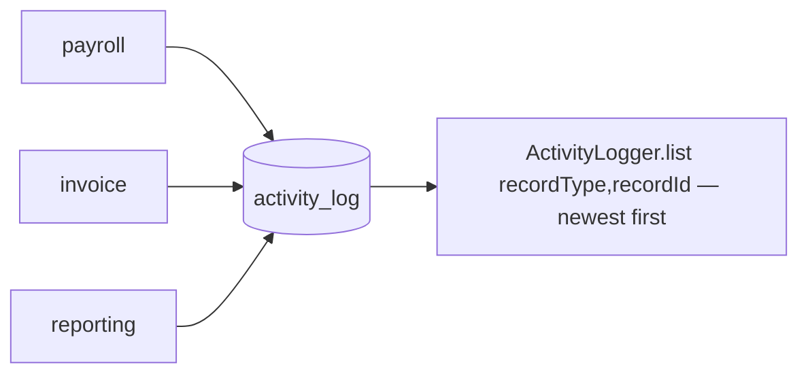
