# 05 — Data Model

> **Source of truth:** `apps/cli/src/migrations/0001_*.ts … 0022_*.ts` (registered in
> `apps/cli/src/migrations/index.ts`). Every table, column, FK, index, CHECK and RLS policy below is
> derived strictly from those migrations and the RLS helper in `libs/db/src/rls.ts`. The migrations
> consume `@aegis/shared-enums` (table names + enum value sets) and `@aegis/shared-constants`
> (`RlsConstants` session-variable names).

The schema is a **single PostgreSQL database**, multi-tenant by row, isolated by **Row-Level
Security**. PKs are UUID v4 (`gen_random_uuid()`) except the Casbin policy store (serial int) and the
Sequelize migration bookkeeping table. Money is stored as **BIGINT minor units**. Every business
table that carries a `tenant_id` is RLS-guarded with a **FORCE + RESTRICTIVE** policy keyed on the
transaction-local session variable `app.current_tenant`.

---

## 1. Multi-tenancy & Row-Level Security

### 1.1 The standard policy (`rlsPolicyStatements`)

`libs/db/src/rls.ts` emits the same four statements for every tenant-keyed table. The policy name is
always `<table>_tenant_isolation`:

```sql
ALTER TABLE "<table>" ENABLE ROW LEVEL SECURITY;
ALTER TABLE "<table>" FORCE ROW LEVEL SECURITY;          -- applies even to the table owner
DROP POLICY IF EXISTS "<table>_tenant_isolation" ON "<table>";
CREATE POLICY "<table>_tenant_isolation" ON "<table>"
  AS RESTRICTIVE                                          -- ANDs with any other policy; cannot be OR'd away
  USING      (tenant_id = current_setting('app.current_tenant', true)::uuid)   -- READ predicate
  WITH CHECK (tenant_id = current_setting('app.current_tenant', true)::uuid);  -- WRITE predicate
```

Key properties (all load-bearing, all from the code):

- **`FORCE ROW LEVEL SECURITY`** — RLS applies even to the table-owning role; there is no
  "owner bypass". RLS is never circumvented for ordinary access.
- **`AS RESTRICTIVE`** — the tenant guard is AND-combined with every other policy, so a future
  permissive policy can never OR it away.
- **READ vs WRITE split** — `USING` controls which rows are visible; `WITH CHECK` controls which rows
  may be inserted/updated. By default they are identical. They diverge only where a table must let a
  tenant _read_ a global row it must not _write_ (see §1.3).
- **`current_setting('app.current_tenant', true)`** — the `true` ("missing_ok") second arg means a
  session with no tenant set yields `NULL`, so the predicate fails closed (no rows) rather than
  erroring. Casting `::uuid`.

### 1.2 Setting the tenant context per transaction (`setTenantContext`)

```sql
SELECT set_config('app.current_tenant', :tenantId, true);   -- true = transaction-LOCAL (SET LOCAL)
SELECT set_config('app.current_user',   :userId,   true);   -- optional, when a principal is present
```

The third `true` argument makes the setting **transaction-local** (the `SET LOCAL` equivalent), which
is the critical detail for **transaction-mode connection pooling**: the tenant scope is bound to the
transaction, not the physical connection, so a pooled connection cannot leak one tenant's scope into
another tenant's next transaction.

Session variables (`libs/shared/constants/src/app.constants.ts → RlsConstants`):

| Constant         | Value                | Used by                                    |
| ---------------- | -------------------- | ------------------------------------------ |
| `TenantVar`      | `app.current_tenant` | every tenant-isolation policy              |
| `UserVar`        | `app.current_user`   | optional principal context                 |
| `OutboxRelayVar` | `app.outbox_relay`   | the outbox relay cross-tenant drain (§1.3) |

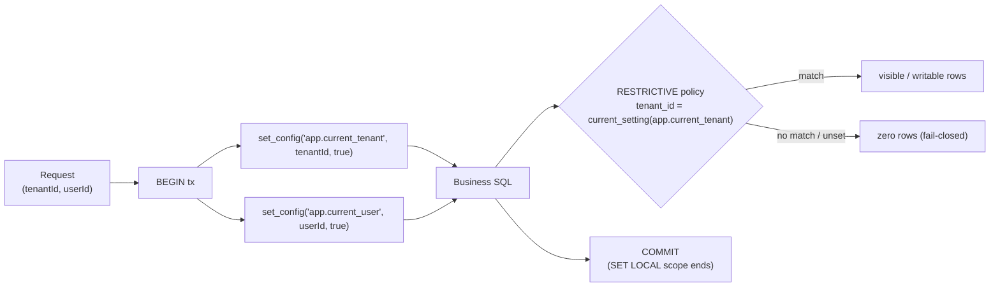

### 1.3 Exceptions to the standard policy

Three deviations exist, each created with a hand-written policy instead of the helper:

1. **Tables with a non-`tenant_id` isolation key.**
   - `tenants` (`0001`) — isolates on its own PK: `id = current_setting('app.current_tenant', true)::uuid`
     (helper `customRls`, RESTRICTIVE, no separate WITH CHECK).

2. **Tables that admit cross-tenant _reads_ of global rows but must restrict _writes_ (BUG-0009).**
   The `USING` predicate is wider than `WITH CHECK`:
   - `roles` (`0001`) — `tenant_id IS NULL` rows are platform-wide **system roles** every tenant may
     READ, but a tenant session may only WRITE its own tenant rows:
     - `USING`: `tenant_id IS NULL OR tenant_id = current_setting('app.current_tenant', true)::uuid`
     - `WITH CHECK`: `tenant_id = current_setting('app.current_tenant', true)::uuid`
   - `tax_rules` (`0005`) — `tenant_id IS NULL` rows are seeded **platform-default** tax rules visible
     to all tenants; `customRls` here applies the wide predicate to USING (and, since `customRls` in
     `0005` passes no separate WITH CHECK, Postgres defaults WITH CHECK to USING — note this is a
     looser write predicate than `roles`).

3. **The outbox relay bypass.**
   - `event_outbox` (`0011`) — predicate is
     `(tenant_id = current_setting('app.current_tenant', true)::uuid) OR current_setting('app.outbox_relay', true) = 'on'`
     for **both** USING and WITH CHECK. Only the relay sets `app.outbox_relay = 'on'` (via `SET LOCAL`),
     letting one poll drain every tenant's backlog; normal sessions never set it and stay strictly
     isolated.

4. **Append-only hardening at the database (defense in depth).**
   - `ledger_entries` (`0005`) — in addition to the tenant policy, two extra RESTRICTIVE policies make
     the table physically append-only: `FOR UPDATE USING (false)` and `FOR DELETE USING (false)`.

5. **Tables intentionally WITHOUT RLS.**
   - `casbin` (`0009`) — the Casbin policy catalog is **global infrastructure**, carries no
     `tenant_id`, and has **no RLS**. Tenant scoping lives _inside_ each policy row via the `dom`
     field (`dom = tenantId`), enforced by the Casbin matcher, not by Postgres.

### 1.4 Tenant-table inventory (RLS keying)

| Domain           | Tables with standard `tenant_id` RLS                                                                                                                                                                                            | Custom / no RLS                                                                                               |
| ---------------- | ------------------------------------------------------------------------------------------------------------------------------------------------------------------------------------------------------------------------------- | ------------------------------------------------------------------------------------------------------------- |
| identity/access  | `users`, `user_roles`, `teams`, `team_members`, `tags`, `team_tags`, `record_tags`                                                                                                                                              | `tenants` (PK key), `roles` (wide-read/narrow-write), `permissions`/`role_permissions` (global, no tenant_id) |
| approvals engine | `approval_policies`, `approval_hierarchy`, `approver_groups`, `approver_group_members`, `record_approvers`, `approvals`                                                                                                         | —                                                                                                             |
| expense          | `expense_categories`, `expense_reports`, `expenses`, `expense_approvals`, `expense_comments`, `expense_activities`                                                                                                              | —                                                                                                             |
| invoice          | `invoices`, `invoice_metadata`, `invoice_duplicates`, `invoice_approvals`, `invoice_activities`                                                                                                                                 | —                                                                                                             |
| payroll          | `employees`, `employment_contracts`, `pay_calendars`, `earning_codes`, `deduction_codes`, `employee_pay_items`, `pay_runs`, `payslips`, `payslip_lines`, `payroll_input_items`, `payment_batches`, `payments`, `ledger_entries` | `tax_rules` (platform-default + tenant rows)                                                                  |
| workflow         | `rules`, `rule_steps`, `rule_actions`, `rule_audit_logs`                                                                                                                                                                        | —                                                                                                             |
| notification     | `notifications`, `email_notification_logs`, `notification_preferences`, `email_sender_identities`, `email_suppressions`                                                                                                         | —                                                                                                             |
| reporting        | `report_definitions`, `report_schedules`, `report_runs`, `report_access_policies`                                                                                                                                               | —                                                                                                             |
| connectors       | `connector_sync_state`                                                                                                                                                                                                          | —                                                                                                             |
| platform         | `audit_log`, `activity_log`, `event_outbox` (relay-bypass), `tenant_config`, `tenant_features`                                                                                                                                  | `casbin` (no RLS)                                                                                             |

`permissions` and `role_permissions` are **global catalog tables** — no `tenant_id`, no RLS; they are
linked to tenants only transitively through `roles`/`user_roles`.

---

## 2. Conventions (column-level patterns)

These reusable column groups appear across the migrations (defined as local `const` spreads):

| Convention                 | Columns                                                                     | Semantics                                                                                                                                                                                                                        |
| -------------------------- | --------------------------------------------------------------------------- | -------------------------------------------------------------------------------------------------------------------------------------------------------------------------------------------------------------------------------- |
| **UUID PK**                | `id UUID PK DEFAULT gen_random_uuid()`                                      | all business tables                                                                                                                                                                                                              |
| **Timestamps**             | `created_at`, `updated_at` (`DATE NOT NULL DEFAULT now()`)                  | mutable rows; append-only tables keep `created_at` **only**                                                                                                                                                                      |
| **Audit attribution**      | `created_by`, `updated_by` (`UUID NULL`)                                    | "who created / last mutated"; nullable for system/seed/back-fill writes                                                                                                                                                          |
| **Soft-delete (paranoid)** | `deleted_at DATE NULL`                                                      | Sequelize `paranoid: true`; `NULL` = live row                                                                                                                                                                                    |
| **Optimistic lock**        | `lock_version INTEGER NOT NULL DEFAULT 0`                                   | Sequelize `version: 'lock_version'`; bumped on each UPDATE with `WHERE lock_version = ?`, raising `OptimisticLockError` on a stale write. Named `lock_version` to avoid colliding with domain effective-dating `version` columns |
| **Money**                  | `*_minor` / `amount` / `gross` … `BIGINT`                                   | integer **minor units** (e.g. cents); CHECKed `>= 0`                                                                                                                                                                             |
| **Currency**               | `currency CHAR(3)` (invoice/expense) or `STRING` (payroll, default `'USD'`) | ISO 4217                                                                                                                                                                                                                         |
| **Idempotency key**        | `idempotency_key STRING` + UNIQUE index                                     | exactly-once semantics on side-effecting tables                                                                                                                                                                                  |
| **Tenant FK**              | `tenant_id UUID NOT NULL REFERENCES tenants(id) ON DELETE CASCADE`          | the RLS key                                                                                                                                                                                                                      |

### 2.1 Soft-delete + partial-unique

Because `paranoid` tables retain soft-deleted rows, every natural-key uniqueness is a **partial unique
index scoped to live rows** (`WHERE deleted_at IS NULL`), so a natural key (slug, email, role name,
report number, calendar/code name, pay-run period) can be reused after a soft-delete without hitting a
`23505` on recreate. Examples: `tenants_slug_uq`, `users_tenant_email_uq`, `roles_tenant_name_uq`
(+ `roles_system_name_uq` for `tenant_id IS NULL` system roles, since NULLs are distinct in a
composite unique index), `expense_reports_tenant_number_uq`, `pay_runs_tenant_period_uq`,
`approval_policies_tenant_type_name_uq`, `approver_groups_tenant_name_uq`.

### 2.2 Optimistic-lock carriers

`lock_version` is present on the mutable aggregate roots whose state machines admit concurrent writers:
`users`, `roles`, `invoices`, `expense_reports`, `rules`, `employees`, `pay_runs`.

### 2.3 Append-only tables (no `updated_at`, no soft-delete, no `lock_version`)

`audit_log`, `activity_log`, `event_outbox`, `invoice_activities`, `expense_activities`,
`rule_audit_logs`, `approvals`, `payments`, `ledger_entries` (DB-enforced via no-UPDATE/no-DELETE
policies), `email_suppressions`. `report_runs` is append-**once** (carries only `requested_by`, no
`updated_by`/`deleted_at`).

### 2.4 Hash-chained audit log

`audit_log` (`0008`) is **tamper-evident**: each row carries `prev_hash` and `hash` (both
`STRING NOT NULL`). Rows form a hash chain — `hash` is computed over the row's content plus the prior
row's `hash` (`prev_hash`), so any retroactive edit/deletion breaks the chain and is detectable. It
also stores `action`, `outcome`, `resource_type`/`resource_id`, `details` (JSONB) and the
`permissions` (JSONB array) evaluated for the action. (Note: `audit_log.tenant_id` is `NOT NULL` but
is **not** declared as an FK to `tenants` — it is a plain UUID, still RLS-keyed.)

### 2.5 Double-entry, append-only ledger

`ledger_entries` (`0005`) is a double-entry GL: each row has an unsigned `debit` and `credit`
(`BIGINT`, CHECK `>= 0`), an `account` (CHECKed to `LedgerAccount`), and a self-referential
`reversal_of` (a correction posts a **reversal** row, never an update/delete). The append-only
guarantee is enforced in SQL by the `FOR UPDATE USING (false)` / `FOR DELETE USING (false)` policies.

---

## 3. Domain ER diagrams

> Notation: `PK`/`FK`/`UK` marked where load-bearing. `(money)` = BIGINT minor units. Soft-delete
> tables are flagged in the table comment. Relationship labels read parent→child.

### 3.1 Identity & Access (`0001`)

`permissions` and `role_permissions` are **global** (no `tenant_id`). `roles.tenant_id` is nullable
(`NULL` = system role). `users`, `roles`, `tenants` are paranoid + optimistic-locked.

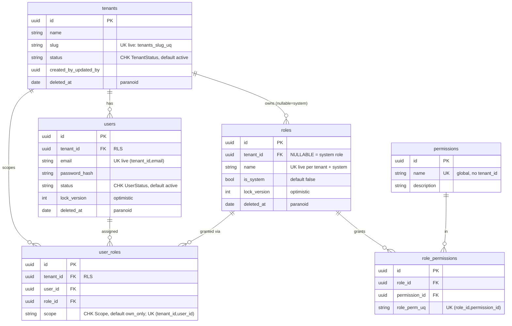

### 3.2 Approvals engine (`0012`, `0013`)

A shared, polymorphic multi-level engine keyed by `(record_type, record_id)`. `record_approvers` is
the resolved live chain (with supersede history added in `0013`); `approvals` is the immutable vote
ledger.

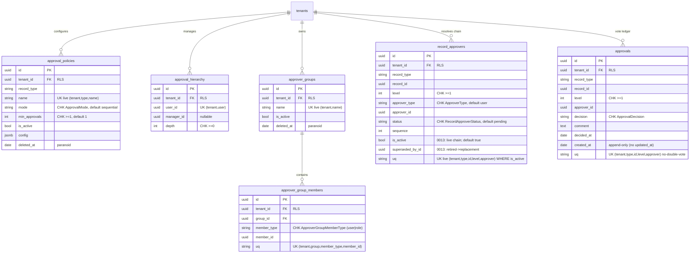

`record_approvers` and `approvals` reference business records polymorphically by
`(record_type, record_id)` — there is **no DB FK** to the underlying expense/invoice/pay-run rows;
the link is by convention enforced in the service layer.

### 3.3 Record annotations (`0023`, `0024`, `0025`)

Wave 6 turns the placeholder `team_id`/`tags` columns from `0022` into a governed model. `teams`
and `team_members` provide the real FK target for record ownership; `tags` is the tenant catalog;
`team_tags` maps which tags a team may use; `record_tags` is a polymorphic finance-record join keyed
by `(record_type, record_id)`. The three finance aggregates keep `tags` JSONB as a denormalized
rule/read cache synced from `record_tags` on write.

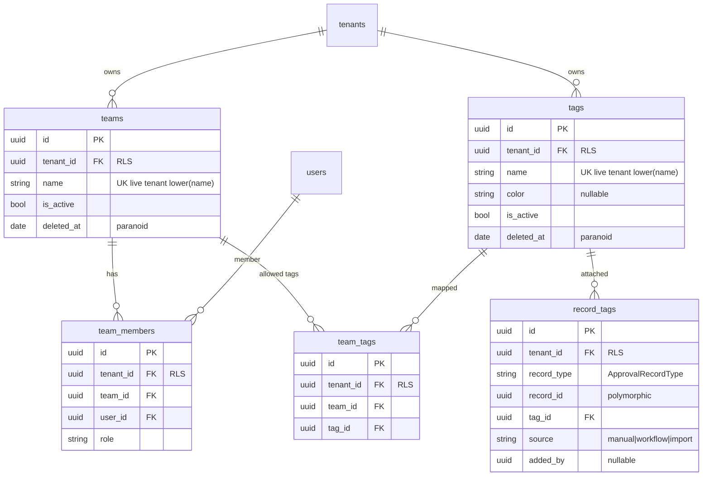

`record_tags` deliberately does not FK to expense/invoice/payroll rows because `record_type` is
polymorphic. The owning service consumes `RecordUpdated` and is responsible for validating the record
exists under RLS before syncing its aggregate row.

### 3.4 Expense (`0003`, `0016`, `0022`, `0025`)

Header-only expenses (no GL codes, no document-extracted line items). `expenses.report_id` /
`category_id` are nullable with `ON DELETE SET NULL` (an item survives its report/category removal).
`0022` adds `team_id`/`tags`; `0025` wires `team_id` to `teams` and adds `assignee_id`.

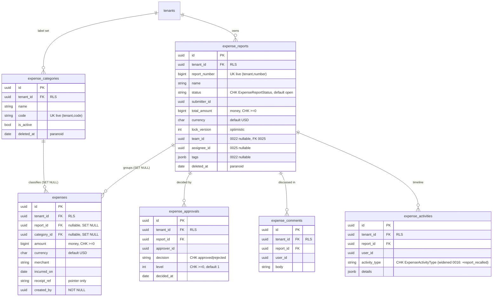

### 3.5 Invoice (`0002`, `0017`, `0021`, `0022`, `0025`)

Header-level invoices with a status state machine, a 1:1 `invoice_metadata`, duplicate links, and a
per-level approval/activity trail. `0017`/`0021` add the concurrency-safe dedup index. `0022` adds
`team_id`/`tags`; `0025` wires `team_id` to `teams` and adds `assignee_id`.

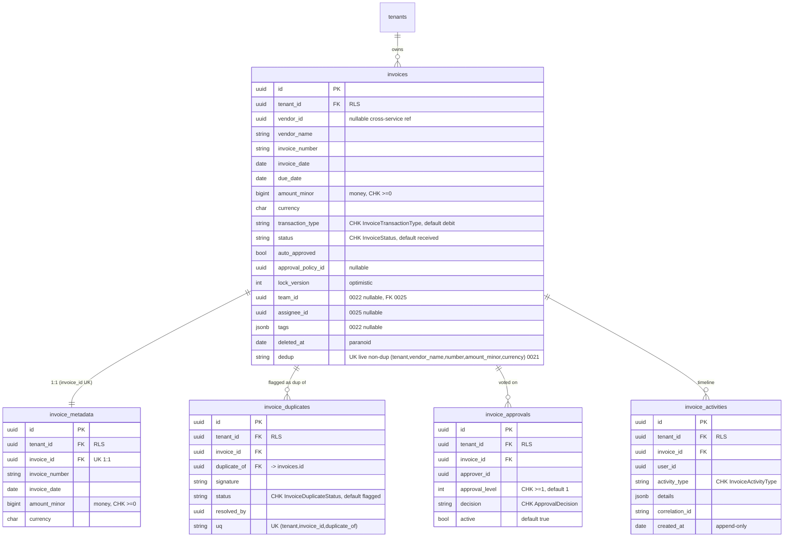

**Dedup evolution:** `invoices_dup_signature_idx` (non-unique, `0002`) supports lookup but a flagged
duplicate is itself a real row sharing the signature. `0017` adds the partial-unique
`invoices_dup_signature_live_uq` over `(tenant_id, vendor_name, invoice_number, amount_minor)`
`WHERE status <> 'duplicate' AND deleted_at IS NULL` — DB-enforced "at most one live non-duplicate per
signature" so the loser of a concurrent insert gets a `23505` the service maps to `Duplicate`. `0021`
(BUG-0010) **replaces** it with `invoices_dup_signature_cur_live_uq` that adds `currency` to the
signature (two invoices differing only by currency are not duplicates).

### 3.6 Payroll (`0005`, `0018`, `0022`, `0025`)

The largest domain: employees, effective-dated contracts/pay-items/tax-rules, pay calendars, code
catalogs, pay runs → payslips → payslip lines, payments (batched, idempotent), and the append-only
double-entry ledger. `tax_rules.tenant_id` is **nullable** (NULL = platform default). `0022` adds
`team_id`/`tags` to `pay_runs`; `0025` wires `team_id` to `teams` and adds `assignee_id`.

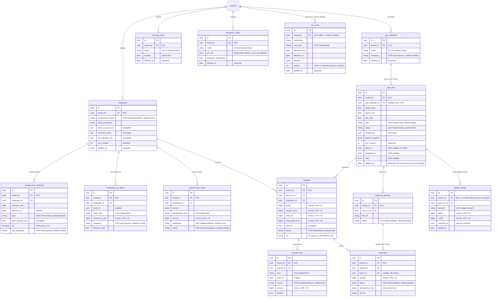

`0018` (W5-05) is purely additive: it adds `is_pre_tax` to `deduction_codes` **only if neither
`pre_tax` nor `is_pre_tax` already exists** (the `0005` schema already ships `pre_tax`, which stays
canonical), and adds the covering index `tax_rules_jurisdiction_type_effective_idx` on
`(jurisdiction, rule_type, effective_from)` for the effective-dated tax resolver.

### 3.6 Workflow (`0004`)

A rules-as-data engine: a `rules` aggregate root with ordered `rule_steps` (JSONB queries) and
`rule_actions` (typed config), plus an append-only `rule_audit_logs` verdict log.

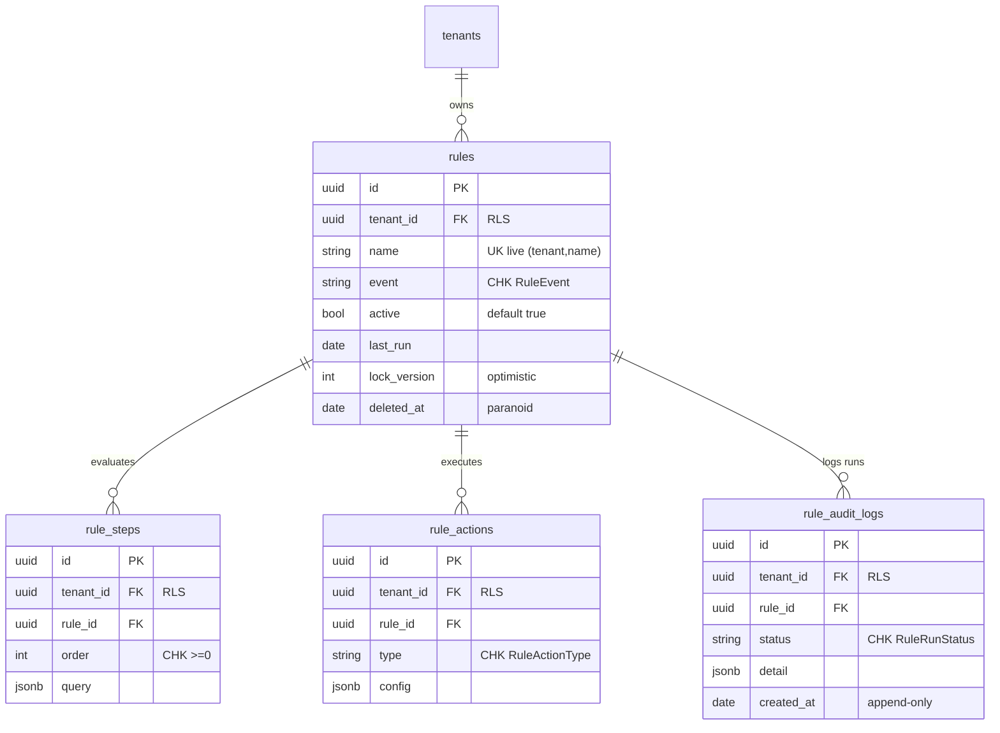

### 3.7 Notification & Email plane (`0006`, `0014`, `0019`)

In-app notifications (dedup-keyed), the status-tracked email send log (exactly-once), per-user/tenant
channel preferences, per-tenant sender identity + master-switch, and the suppression list.
`email_sender_identities` is a **notification-service-local** table — it is not in the shared
`TableName` enum (its name is a string literal), but it is still RLS-keyed.

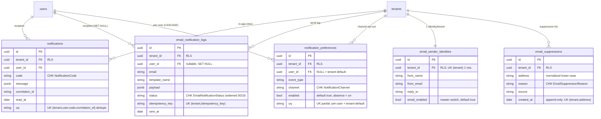

`0019` widens `email_notification_logs_status_chk` from `pending|sent|failed` to the full
`EmailNotificationStatus` set (adds policy not-sent states `suppressed|disabled|blocked`).
`notification_preferences` uses **two partial-unique indexes** — one for non-NULL `user_id`, one for
the NULL-user tenant default — because NULLs are distinct in a plain unique index.

### 3.8 Reporting (CQRS-lite read side) (`0007`)

Declarative definitions (compiled, never raw SQL), schedules, async runs, and per-role
column/row access policies. `report_definitions` is paranoid; `report_runs` is append-once.

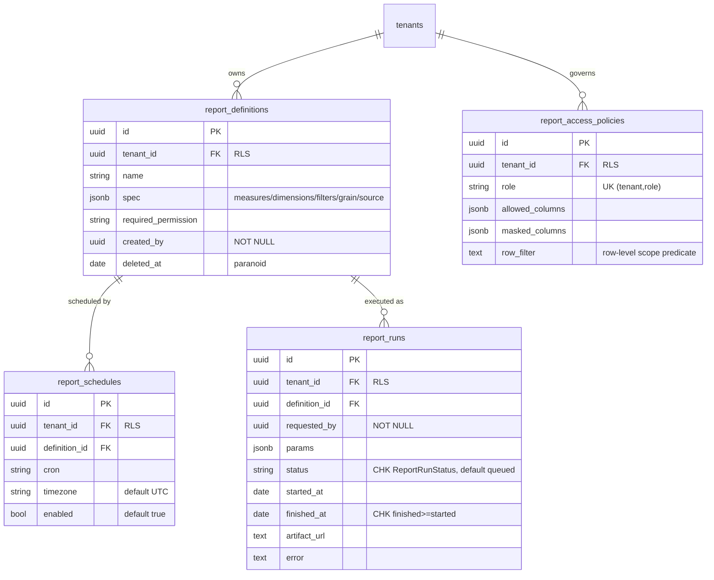

### 3.9 Connectors (`0020`)

Durable ERP push idempotency. One row per `(tenant_id, idempotency_key)` (UNIQUE) makes a push
outcome survive worker restarts / Kafka rebalances; a reconcile poll advances non-terminal rows.

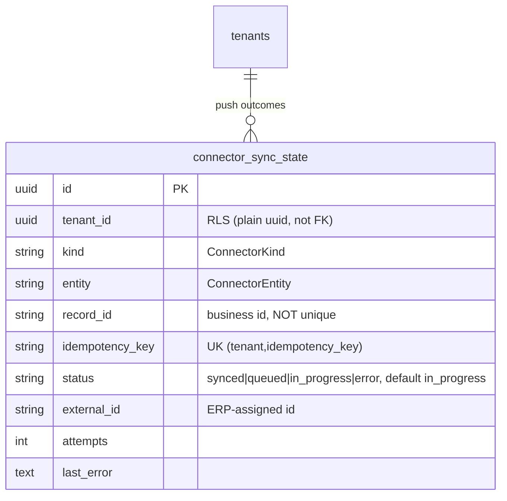

### 3.10 Platform (audit / activity / outbox / config / casbin) (`0008`–`0011`, `0015`)

Cross-cutting infrastructure. `audit_log` (hash-chained security log), `activity_log` (polymorphic
business timeline), `event_outbox` (transactional outbox + relay bypass), `tenant_config` /
`tenant_features` (per-tenant settings & flags), `casbin` (global policy store, **no RLS**).

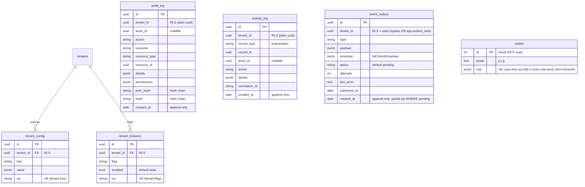

**Outbox flow (transactional outbox pattern):**

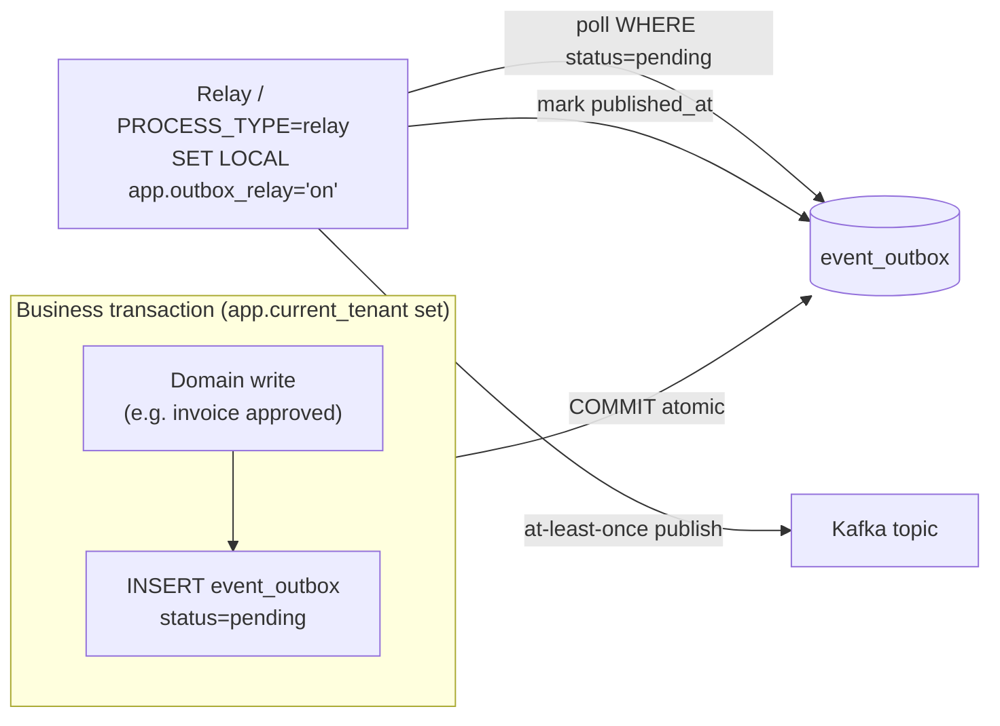

The outbox row is written **inside the same tenant transaction** as the business write, so the event
is persisted atomically — no dual-write window. The relay's `app.outbox_relay='on'` lets one poll
drain every tenant's pending rows (the RLS OR-clause), while producers stay strictly isolated.

`casbin` policy semantics (model in `libs/access-control/src/enforcer.ts`):

- **p-rule:** `rule = [sub, dom, act, eft]` — `sub` = role | userId, `dom` = tenantId | `'*'`, `act` = permission.
- **g-rule:** `rule = [user, role, dom]` — user has role in tenant domain `dom`.

Tenant scoping is expressed _inside_ each rule via `dom` (`dom = tenantId`), which is why the table
needs neither a `tenant_id` column nor RLS.

---

## 4. Cross-domain relationships (the seams)

Several references cross service boundaries and are **intentionally not DB foreign keys** (the domains
own separate aggregates; integrity is upheld by events + the service layer):

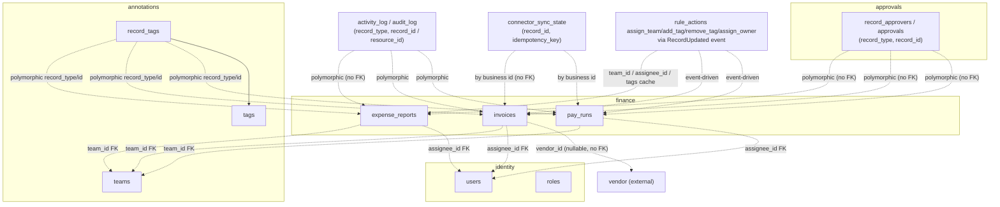

- **Approvals** link to expense/invoice/pay-run purely by `(record_type, record_id)` — no FK.
- **`invoices.vendor_id`** is a nullable cross-service reference with no FK.
- **`audit_log` / `activity_log` / `event_outbox` / `connector_sync_state`** carry `tenant_id` as a
  **plain UUID** (RLS-keyed) — they are deliberately _not_ FK-bound to `tenants` so the logs/outbox
  survive independently and can be written in contexts where the FK would be inconvenient.
- **Workflow `assign_team` / `add_tag` / `remove_tag` / `assign_owner`** write through the
  `RecordUpdated` event. The finance services persist `team_id`, `assignee_id`, and `record_tags`, then
  refresh the denormalized `tags` JSONB cache for rule facts and fast reads.

---

## 5. Enum-backed CHECK constraints

Every status/type/kind column is pinned by a `CHECK (col IN (...))` whose value list is rendered from
the corresponding `@aegis/shared-enums` enum at migration time (the enum is the single source of
truth shared by the CHECK, the DTO type, and the write sites). Because a CHECK snapshots the value set
at author time, _adding_ an enum value requires a drop-and-re-add migration — exactly what `0016`
(expense `report_recalled`) and `0019` (email policy not-sent states) do. Numeric invariants are
likewise pinned: money columns `>= 0`, `min_approvals >= 1`, `level >= 1`, `depth >= 0`,
`tax_rules.version >= 1`, ledger `debit/credit >= 0`, and `report_runs.finished_at >= started_at`.
