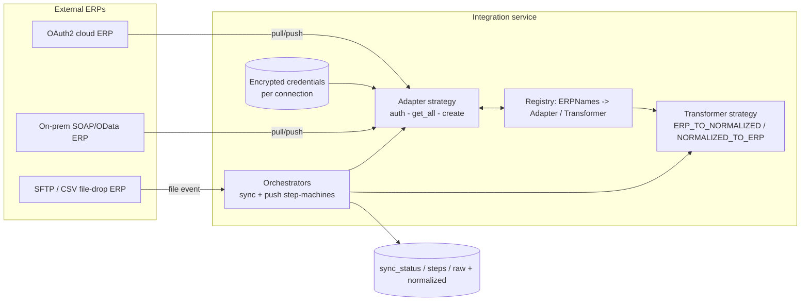
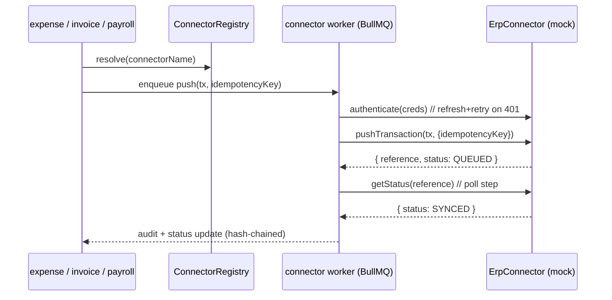

# ERP Connector Analysis — justification & specification for `@aegis/connectors`

> **What this document is.** An engineering analysis of a production ERP-integration
> reference codebase, distilled into (a) a clear recommendation that a finance platform
> like Aegis *should* own a first-class ERP-connector framework, and (b) a concrete
> specification for the Node/TS shared library **`@aegis/connectors`** adapted from the
> reference's patterns. Aegis ships **mock** connectors with neutral names — the
> framework is real and production-shaped; the endpoints it talks to are emulators, so a
> real accounting system can be plugged in later by writing one adapter.
>
> **This file is the analysis/justification.** The concrete framework *design* (the
> interface surface, registry, tables, route bindings, sequence diagrams) lives in the
> sibling **design** doc [`../services/connectors.md`](../services/connectors.md). Where
> the two overlap, the design doc is the build contract; this doc explains *why* and
> *where the patterns came from*.
>
> **Authoritative scope:** [`../../SPEC.md`](../../SPEC.md) §1, §6, **§10.3**. Per §10.3,
> ERP/accounting sync is an enterprise requirement that increases trust (reconciliation
> against the customer's system of record); the prior ad-hoc "ERP sync" is replaced by a
> pluggable connector framework shipped as `@aegis/connectors` and consumed by
> [`expense`](../services/expense.md), [`invoice`](../services/invoice.md), and
> [`payroll`](../services/payroll.md). Per [`../../SPEC.md`](../../SPEC.md) §10.1 there are
> **no GL codes** and **no document-extracted line items** anywhere on the platform; the
> reference's GL-/line-item-heavy machinery is therefore explicitly **out of scope** for
> what we adopt (see §7).
>
> **Reference (READ-ONLY).** The pattern source is the Python ERP-integration platform
> recorded as the **ERP-integration reference** in [`../../AGENTS.md`](../../AGENTS.md) §2
> (its repository path is given there). We read it for *patterns only*; we copy **no**
> code and **no** branding. All vendor/customer ERP names from the reference are referred
> to here by **neutral, capability-based descriptions** (e.g. "OAuth2 cloud-accounting
> ERP", "on-prem SOAP ERP", "SFTP/CSV ERP"), never by product name.
>
> Related: [`./service-core-analysis.md`](./service-core-analysis.md) ·
> [`../02-patterns.md`](../02-patterns.md) ·
> [`../06-service-to-service.md`](../06-service-to-service.md) ·
> [`../services/connectors.md`](../services/connectors.md) ·
> [`../services/expense.md`](../services/expense.md) ·
> [`../services/invoice.md`](../services/invoice.md).

---

## 1. Executive summary

The reference is a **dedicated integration service** that sits between a finance product
and ~13 external ERP/accounting systems. Its entire job is to (a) **pull master data**
(vendors, payment terms, accounts, organizations, …) from each ERP into a normalized
shape, and (b) **push transactions** (vendor bills / expenses) *out* to each ERP and then
**poll** for the ERP's acceptance. It does this for many heterogeneous ERPs — cloud
OAuth2 APIs, on-prem SOAP/OData endpoints, and file-drop (SFTP/CSV) systems — behind **one
uniform internal contract**.

The codebase is worth studying because it has already solved, in production, the problems
a finance platform hits the moment it integrates a single real ERP:

- **N heterogeneous protocols, one internal shape** — adapter + transformer + registry so
  the orchestration code never branches on a specific ERP's wire format.
- **Long-running, resumable, idempotent sync** — multi-step state machines persisted to a
  DB, advisory locks, retry-with-credential-refresh, pause/resume/cancel.
- **Secret handling** — per-connection encrypted credentials, OAuth token refresh, no
  provider secret baked into source.
- **Async orchestration** — Celery workers + an SQS/file consumer for event/webhook-style
  ingestion, so a slow ERP never blocks the request path.

**Recommendation (detailed in §6):** Aegis **should** own an ERP-connector framework, and
it should be a *framework*, not per-service glue. We adopt the reference's
**adapter/strategy/factory/registry** decomposition and its **idempotent step-machine +
retry + secret-isolation** principles, re-expressed in Node/TS as `@aegis/connectors`,
running on Aegis's existing service-to-service auth, request-context propagation, and
BullMQ workers. We **simplify** away everything tied to GL codes, document line items,
and 3-way line matching (out of scope per §10.1), and we ship **mock** connectors instead
of real ERP SDKs so the platform is demonstrably end-to-end without external credentials.

---

## 2. What the reference integrates, and how

### 2.1 The ERP catalogue

The reference registers a fixed set of ERPs in a central enum and maps each to a concrete
adapter class. The enum (`app/utils/common.py`, `class ERPNames`) and the adapter map
(`app/factories/adapter_factory.py:31` `ADAPTERS = { … }`) together enumerate roughly
thirteen distinct integrations spanning three integration *styles*:

| Integration style (neutralized) | How auth works | How data moves | Notes from the reference |
|---|---|---|---|
| **OAuth2 cloud-accounting ERP** | OAuth2 authorization-code + refresh token; client id/secret injected from config, not stored per-tenant (`credentials_manager.py:234`, the provider-specific-credentials helper) | REST; SDK objects (Bill, LinkedTxn) | The only ERP with a full OAuth refresh-and-retry path; account-period-closed is a domain error handled specially (`bill_sync_orchestrator.py:419`) |
| **On-prem / mid-market ERPs (SOAP/OData/REST)** | Per-connection credential bag (host, user, secret) decrypted at use; some need an `additional_data` lookup keyed by company (`erp_sync_orchestrator.py:68`, `get_additional_data_for_erp_adapter`) | Paginated `get_all(page_number=…)` pull; `create(data)` push | One ERP needs **multi-company pagination** with resumable cursors (`erp_sync_orchestrator.py:516`, `fetch_by_pagination_rentalman`) |
| **File-drop ERP (SFTP/CSV)** | No live API; credentials gate the file location | Files land in object storage → an **SQS S3-event consumer** parses the path and enqueues a sync (`app/consumer/sqs.py:133`, `__handle_file`); push is a no-op success for demo | This is the closest analogue to a *webhook* ingestion in the reference |

**Pull (master-data ingest).** The `ERPSyncOrchestrator` (`erp_sync_orchestrator.py:36`)
drives this: for each requested entity it creates a `SyncStatuses` row, **paginates** the
adapter (`fetch_by_pagination`, line 463), **bulk-stores raw** payloads, runs a
per-(ERP, entity) **transformer** to normalize, **bulk-upserts** into shared tables, then
**marks-inactive** anything not seen this run (a soft full-sync reconciliation,
`__execute_data_fetch_and_storage`, line 416).

**Push (transaction export).** The `BillSyncOrchestrator`
(`bill_sync_orchestrator.py:74`) and the expense equivalent
(`orchestrators/expense_sync/expense_base.py:26`) drive this: validate sync conditions →
acquire an advisory lock → build the ERP-specific payload via a transformer → call the
adapter's `create()` → persist the result reference → (for some ERPs) poll for final
status.

**Status / polling.** Push is modeled as an ordered **step machine** —
`create_bill_attachment` → `create_bill` → `poll_for_bill`
(`orchestrators/bill_sync/create_bill_base.py:15`). Steps are persisted rows; the
orchestrator only ever runs the **next unfinished** step (`next_step()`, line 123), so a
re-run resumes rather than duplicates. The file-drop ERP surfaces final status **back**
through the same SQS consumer when the ERP moves a file into a `completed`/`failed` folder
(`sqs.py:173`).

### 2.2 The end-to-end shape (pull and push)



The single most important property: **orchestration code never knows which ERP it is
talking to.** It resolves an adapter and a transformer from the registry by an enum key,
then calls a uniform interface (`get_all`, `create`, `refresh_credentials`). Adding an ERP
is "write one adapter + register it" — the exact property §10.3 asks Aegis to reproduce.

---

## 3. Code patterns observed (adapter / strategy / factory / registry)

### 3.1 Factory + registry (the seam that makes ERPs pluggable)

Two factories carry the design. Both are pure **dict-as-registry + lookup**:

- **Adapter factory** (`app/factories/adapter_factory.py:51`): a module-level
  `ADAPTERS: {ERPNames -> AdapterClass}` map, and `get_adapter(erp_name, credentials,
  **kwargs)` that looks up the class and instantiates it, raising
  `ValueError(f"Unsupported ERP: …")` on a miss (line 57). A union type `ERPAdapter`
  (line 18) documents the closed set of adapter types for the type checker.
- **Transformer factory** (`app/factories/transformer_factory.py:34`): a **two-level**
  registry `{ERPNames -> {TransformerType -> TransformerClass}}` (`transformer_map`,
  line 35) and `get_transformer(erp_name, transformer_type, mappings)` (line 147). The
  two-level keying is the crux: *the same logical entity (e.g. "vendors") is transformed
  differently per ERP*, so the strategy is selected by the **(ERP, entity)** pair, not by
  ERP alone.

This is the textbook **Abstract Factory + Strategy** pairing: the factory selects the
strategy object; the strategy encapsulates the per-ERP behavior. There is no `switch` on
ERP type inside business logic — except, notably, in the push orchestrator (§3.4), which
is the one place the reference *didn't* finish the refactor and which we will not copy.

### 3.2 Adapter (uniform interface over heterogeneous wire formats)

Adapter classes live in an external `adapters.*` package (not in this repo — referenced
via imports at `adapter_factory.py:1`). The orchestrator only relies on a small **implicit
interface**:

- entity pull: `adapter.<entity>.get_all(page_number=…) -> (data, paginator)`
  (`erp_sync_orchestrator.py:480`)
- entity push: `adapter.<entity>.create(payload)`
  (`expense_base.py:172`, `bill_sync_orchestrator.py:412`)
- credential refresh: `adapter.refresh_credentials()`
  (`erp_sync_orchestrator.py:673`)

Because the contract is implicit (Python duck typing), the reference can't *enforce* that
an adapter implements it. **Aegis will make this contract explicit** — a TypeScript
`interface ErpConnector` — which is the single biggest correctness upgrade we make (§5.1).

### 3.3 Strategy via abstract base + template method (push)

The push side uses a clean **Template Method**: an abstract base defines the overall
algorithm and leaves the ERP-specific bits abstract.

- `CreateBillBase` (`orchestrators/bill_sync/create_bill_base.py:20`) implements
  `create_bill_and_attachment()` (the fixed sequence: archive stale steps → create steps →
  run attachment step → run bill step → reconcile) and declares three `@abstractmethod`s —
  `create_bill_in_erp`, `create_attachment`, `poll_bill_for_erp` (lines 126–136). Each ERP
  subclass fills only those.
- `BaseERPCreateExpense` (`orchestrators/expense_sync/expense_base.py:26`) generalizes
  this to a **declared step list**: `get_defined_steps()` returns ordered step names and
  the base **dynamically dispatches** to `_run_<step>` methods via `getattr`
  (line 60), persisting each step's status. A concrete creator for the OAuth2
  cloud-accounting ERP (`orchestrators/expense_sync/<erp>_create_expense.py:5`) is then
  ~80 lines: declare the steps, name the ERP, build the payload.

This is the pattern Aegis adopts wholesale for connector push, because it makes
"resumable, auditable, idempotent multi-step export" a property of the *base*, inherited
by every connector for free.

### 3.4 The anti-pattern we explicitly avoid

`BillSyncOrchestrator.process()` (`bill_sync_orchestrator.py:220`) is a ~150-line method
with a long `if self.erp_name == ERPNames.X … elif …` ladder (lines 281–357) that
re-implements, per ERP, the "instantiate the creator, call it, upsert status" dance the
base class already abstracts. It is the *un*-refactored counterpart to the clean
`expense_base` dispatch. **Aegis routes 100% of push through the
registry + base-class dispatch** so this ladder never exists (§5, §7).

---

## 4. Design principles observed

### 4.1 Idempotency & resumability

- **Persisted step machine.** Steps are DB rows with positions and statuses; the
  orchestrator only runs the *next unfinished* step (`create_bill_base.py:123`), and
  **archives** a finished or failed step-set before recreating
  (`__archive_steps_if_steps_failed`, line 90). Re-delivering the same job re-enters at the
  failed step, never re-creates a successful bill.
- **Advisory locks.** Push acquires a Postgres advisory lock keyed by the business
  reference (`bill_sync_orchestrator.py:519`, `lock_key_id`) so two workers can't push the
  same record concurrently; released in `finally` (line 368).
- **Resumable cursors.** The multi-company pull persists `current_company_index` /
  `current_page` / `synced_ids` into a `meta` JSON on the sync record and resumes from
  there (`erp_sync_orchestrator.py:601`). This is a hand-rolled checkpoint.

### 4.2 Retry & error handling

- **A retry decorator** (`app/utils/decorators.py:7`, `retry(exception_types,
  max_attempts, initial_delay, delay_multiplier)`) implements bounded **exponential
  backoff**, applied to the network-touching methods
  (`erp_sync_orchestrator.py:388`, `expense_base.py:166`).
- **Retry-with-refresh.** On an auth exception during pull, the orchestrator refreshes the
  credentials *then re-raises* so the decorator retries with the new token
  (`erp_sync_orchestrator.py:405`–410, `__refresh_and_update_credentials`, line 656). Push
  does the same inline (`bill_sync_orchestrator.py:414`).
- **Typed domain exceptions.** A small hierarchy (`common/helpers/exceptions.py`) plus
  adapter-level `AuthorizationException` / `RetryException` separate *retryable* from
  *terminal* failures, and a closed-period error is special-cased rather than retried
  blindly (`bill_sync_orchestrator.py:419`).
- **Errors are recorded, not swallowed.** Failures persist the error string onto the sync
  status / step row (`__handle_entity_error`, `erp_sync_orchestrator.py:680`) so the
  failure is queryable, not just logged.

### 4.3 Secret handling

- **Per-connection credentials, encrypted at rest.** Credentials live keyed by
  `connection_id` and are fetched through a `CredentialsManager`
  (`app/services/credentials_manager.py:24`). At-rest encryption is a custom SQLAlchemy
  column type using **Fernet** symmetric encryption with a key from config
  (`app/utils/encryption_utils.py:62`, `EncryptedType`; `get_encryption_key` requires the
  key outside local, line 19).
- **Provider app secrets come from config, never the tenant row.** The OAuth client
  id/secret/redirect are injected from environment config at call time and *filtered out*
  before persisting refreshed credentials (`credentials_manager.py:245`,
  `__filter_credentials_for_update`). This cleanly separates *app* secrets (one per
  provider) from *tenant* secrets (one per connection).

### 4.4 Async / Celery orchestration

- **Celery app + autodiscovery** (`celery_worker.py:34`) with JSON serialization, UTC, and
  task-duration logging via pre/post-run signals (lines 20–31). Sync work runs as tasks,
  off the request path.
- **Event/webhook ingestion** via an **SQS consumer** (`app/consumer/sqs.py:21`) that
  parses S3-event notifications, regex-matches the object key to derive
  `(company, connection, entity)`, and enqueues a sync task with a `countdown` delay
  (`sqs.py:187`). It manages **visibility-timeout extension** on a background thread while
  processing (line 273) and deletes on success — a careful at-least-once consumer.
- **Pause / resume / cancel** are first-class: the sync record carries a `last_sync_status`
  the worker polls, sleeping while `PAUSED` and bailing on `CANCELLED`
  (`erp_sync_orchestrator.py:262`–303).

### 4.5 Normalization boundary (transformers + field mappings)

Every byte crossing the boundary goes through a transformer with an explicit
**direction** (`ERP_TO_NORMALIZED` / `NORMALIZED_TO_ERP`, `class TransformationDirection`)
and a **field-mapping** list that maps ERP field names ↔ normalized field names, with
required-field assertions (`erp_sync_orchestrator.py:343`, `__fetch_erp_mapping`). This is
how one ERP's `VendorName` and another's `supplier_name` both become the platform's
`name`. Aegis keeps this boundary (a `toCanonical` / `fromCanonical` pair) but **shrinks
the canonical model** to header-level finance entities (§7).

---

## 5. Folder structure observed (and the seam map)

```
erp-integration-reference/           (READ-ONLY reference — path in AGENTS.md §2; names neutralized)
├── config.py                        env-merged Config (secrets, DB URLs, provider creds)
├── celery_worker.py                 Celery app + autodiscovery + signal logging
├── app/
│   ├── factories/                   ★ registry seam
│   │   ├── adapter_factory.py         ERPNames -> AdapterClass            (registry)
│   │   ├── transformer_factory.py     (ERP, entity) -> TransformerClass   (2-level registry)
│   │   ├── entity_handler_factory.py  entity -> upsert/delete handler
│   │   └── erp_entities_factory.py    ERP -> default entity set
│   ├── transformers/                ★ strategy: per-(ERP,entity) normalization
│   ├── services/                    managers: credentials, field-mappings, records, validation
│   │   ├── credentials_manager.py     ★ secret fetch/refresh/filter
│   │   └── credential_refresh_manager.py
│   ├── consumer/sqs.py              ★ event/webhook ingestion (S3 -> task)
│   ├── models/                      ORM: connect/ public/ engine/ expense/ schemas
│   ├── utils/
│   │   ├── decorators.py              ★ retry(backoff)
│   │   └── encryption_utils.py        ★ Fernet EncryptedType column
│   └── schemas/                     pydantic DTOs (response/summary shapes)
├── orchestrators/                   ★ the workflows
│   ├── erp_sync_orchestrator.py       pull master-data (paginate→raw→transform→upsert)
│   ├── bill_sync_orchestrator.py      push transaction (validate→lock→build→create→status)
│   ├── bill_sync/create_bill_base.py  ★ Template-Method push step-machine
│   └── expense_sync/
│       ├── expense_base.py            ★ declared-step push base (getattr dispatch)
│       ├── expense_creator_factory.py registry: ERP -> creator class
│       └── *_create_expense.py        concrete creators (~80 lines each)
└── common/helpers/                  enums, exceptions, logging, constants
```

The **★** rows are the load-bearing seams Aegis reproduces. Note the clean separation:
*registries* (factories) pick *strategies* (adapters/transformers), and *orchestrators*
own the *idempotent workflow* — three concerns, three folders.

---

## 6. Recommendation — Aegis should own `@aegis/connectors`

**Verdict: yes, and as a shared framework lib, not per-service code.**

Reasoning, grounded in what the reference proves:

1. **Reconciliation is the trust story for a finance platform.** Aegis approves expenses,
   invoices, and pay runs; those approvals only matter to a customer once they are
   reflected in the customer's *system of record*. A connector framework is what closes
   that loop — it is the difference between "Aegis says it's approved" and "the ledger
   agrees." This is exactly the §10.3 rationale.
2. **The integration problem is real and recurring, and the reference already paid for the
   hard parts.** Idempotent multi-step push, retry-with-refresh, advisory locking,
   resumable pull, encrypted per-tenant credentials, async workers — these are not
   "later" concerns; the very first real ERP forces all of them. Reusing the *patterns*
   (not the code) lets Aegis skip the expensive discovery.
3. **A framework, not glue, because three services need it.** Expense (push approved
   reports), invoice (push approved invoices + optionally pull a vendor list for duplicate
   detection), and payroll (export the disbursement ledger) all need the same machinery.
   Putting it in one lib means *one* connector interface, *one* registry, *one* credential
   store, *one* worker contract — consistent with Aegis's "shared substrate" thesis
   ([`../../SPEC.md`](../../SPEC.md) §1).
4. **Mocks make it demonstrable end-to-end.** Per §10.3 we ship neutral **mock**
   connectors (`LedgerOne`, `Finovo`, `AcctBridge`) that emulate the handshake / push /
   status behaviors without external credentials, so the whole platform runs on a fresh
   machine and the connector flow is exercisable in tests and demos. The framework is
   production-shaped; only the endpoints are emulated.

### 6.1 The three mock connectors (capability matrix)

Each mock deliberately exercises a *different* slice of the framework, mirroring the three
integration styles in §2.1 so the framework is proven against all of them:

| Mock connector | Emulated auth style | Push behavior | Status behavior | Proves |
|---|---|---|---|---|
| **LedgerOne** | OAuth2-style: short-lived access token + refresh; emulator rejects an expired token once to force a refresh-and-retry | synchronous `create` returns a reference id | immediate `SYNCED` | the retry-with-refresh + idempotency-key path |
| **Finovo** | API-key in a configured header | `create` returns `QUEUED` + reference | **async**: status flips to `SYNCED`/`FAILED` on a later poll | the multi-step *poll* state machine |
| **AcctBridge** | file-drop style: a "connection secret" gates a mock object-store path | `create` writes a record the emulator "ingests" | status arrives via a simulated callback/poll | the webhook/file-ingestion path and at-least-once delivery |

These names are illustrative for this analysis; the **authoritative** connector list,
config schema, and table DDL are defined in
[`../services/connectors.md`](../services/connectors.md).

---

## 7. What we adopt vs. simplify

> "Adopt" = bring the pattern across, re-expressed in Node/TS on Aegis's substrate.
> "Simplify / drop" = deliberately not building it, with the reason.

| Concern | Reference | Aegis `@aegis/connectors` | Adopt / Simplify |
|---|---|---|---|
| **Pluggable selection** | dict registries: `ADAPTERS`, two-level `transformer_map` (`adapter_factory.py:31`, `transformer_factory.py:35`) | `ConnectorRegistry` keyed by a `ConnectorName` enum → connector instance; a typed `ErpConnector` interface | **Adopt** (registry + factory) |
| **Connector contract** | implicit/duck-typed (`get_all`, `create`, `refresh_credentials`) | **explicit** `interface ErpConnector { authenticate; pushTransaction; getStatus; … }`; InversifyJS `@provideSingleton` bindings | **Adopt + harden** (make the contract a real type) |
| **Per-ERP push** | clean base (`expense_base.py`) **and** a long `if/elif` ladder (`bill_sync_orchestrator.py:281`) | one base step-machine + registry dispatch; **no** ERP `if/elif` ladder anywhere | **Adopt the base, drop the ladder** |
| **Idempotency** | persisted step rows + advisory lock + idempotency on re-run | `connector_jobs` + `connector_job_steps` tables; **idempotency key on every push** (§10.3); job-level lock | **Adopt** |
| **Retry/backoff** | `retry` decorator (`decorators.py:7`) | a `withRetry` helper / BullMQ job retry with backoff; retryable-vs-terminal error taxonomy | **Adopt** (use BullMQ's built-in backoff where possible) |
| **Secret handling** | Fernet `EncryptedType` column + provider secret from config (`encryption_utils.py:62`, `credentials_manager.py:245`) | per-tenant connector credentials **encrypted (AES-256)** in Postgres; provider/app secrets from the param store, never the tenant row; routed via the cloud key-proxy pattern | **Adopt + align** with Aegis secret/key-proxy conventions |
| **Async orchestration** | Celery + SQS consumer (`celery_worker.py`, `sqs.py`) | **BullMQ** workers on the single multi-purpose image (`PROCESS_TYPE=worker`); inbound status via a guarded callback route or a poll job | **Adopt the shape, swap the transport** (Celery→BullMQ, SQS→Redis/BullMQ locally) |
| **Normalization** | transformers with direction + field mappings; **GL-code & line-item heavy** canonical model | `toCanonical`/`fromCanonical` over a **header-level** canonical model (no GL codes, no line items) | **Adopt the boundary, shrink the model** (§10.1) |
| **Master-data pull** | full pull of vendors/accounts/PO/receipts/etc., mark-inactive reconciliation | optional, minimal: at most a **vendor list** to support invoice **duplicate detection**; no accounts/PO/receipts | **Heavily simplify** |
| **3-way / line matching** | PO + receipt + line aggregation/splitting (`orchestrators/bill_sync/*`) | **dropped entirely** — invoice "matching" is header-level (duplicate + threshold/variance vs optional PO ref) per §10.1 | **Drop** |
| **GL codes / chart-of-accounts** | first-class throughout (`AccountRef`, GL helpers) | **none** — removed platform-wide (§10.1) | **Drop** |
| **Multi-company resumable cursor** | hand-rolled `meta` checkpoint for one ERP (`erp_sync_orchestrator.py:601`) | not needed for mocks; the resumable **step** machine covers push; pull is small | **Simplify** (keep step resumability, skip cursor bookkeeping) |
| **Context / s2s auth** | bearer tokens, ad-hoc cross-service calls (`config.py` exposes per-service base-URL + token pairs for the core/engine/auditor backends) | Aegis **request-context propagation** + signed internal JWT + `X-Correlation-Id` + `X-Source-Service` ([`../06-service-to-service.md`](../06-service-to-service.md)) | **Replace** with Aegis's substrate |
| **Tenant isolation** | `connection_id`-scoped, app-enforced | every connector table carries `tenant_id NOT NULL` + **Postgres RLS** ([`../04-multi-tenancy.md`](../04-multi-tenancy.md)) | **Add** (the reference has no RLS) |
| **Audit** | error strings on status rows | connector pushes emit **hash-chained audit** entries (actor, tenant, connector, decision) like every Aegis write | **Add** |

### 7.1 Net effect

We keep the reference's three durable ideas — **(1) a registry that selects a strategy per
ERP, (2) an explicit idempotent step-machine for push, (3) hard isolation of secrets** —
and discard everything that exists only because the reference owned GL codes, document
line items, and 3-way matching. The result is a smaller, strongly-typed framework that
proves the *access-control + reconciliation* story end-to-end with mock connectors, on the
exact same JWT + PDP + RLS + worker substrate as the rest of Aegis.

---

## 8. Mapping the patterns onto Aegis (interface sketch)

The build contract is in [`../services/connectors.md`](../services/connectors.md); this is
only the shape implied by the analysis, to show the patterns survive the port.

```typescript
// libs/connectors — the explicit contract the reference left implicit.
export interface ErpConnector {
  readonly name: ConnectorName;                       // enum key used by the registry

  authenticate(creds: ConnectorCredentials): Promise<ConnectorSession>;
  refreshCredentials(session: ConnectorSession): Promise<ConnectorSession>;

  // push a header-level finance transaction (no GL codes, no line items)
  pushTransaction(
    tx: CanonicalTransaction,
    opts: { idempotencyKey: string; session: ConnectorSession },
  ): Promise<PushResult>;                              // { reference, status: QUEUED|SYNCED|FAILED }

  getStatus(reference: string, session: ConnectorSession): Promise<PushStatus>;

  // optional, minimal master-data pull (e.g. vendor list for duplicate detection)
  pull?(entity: CanonicalEntity, session: ConnectorSession): Promise<CanonicalRecord[]>;
}

// Registry = the reference's ADAPTERS dict, made type-safe + DI-bound.
@provideSingleton(ConnectorRegistry)
export class ConnectorRegistry {
  resolve(name: ConnectorName): ErpConnector { /* fail-closed on unknown */ }
}
```



---

## 9. Open questions / follow-ups

- **Inbound status delivery** — mocks can deliver status by **poll** (simplest, matches
  Finovo above) or by a **guarded callback route** (mirrors the reference's SQS callback).
  The design doc should pick one default; a poll job is the lower-risk default for a
  showcase and needs no inbound auth surface.
- **Where credentials live** — confirm connector credentials sit in the connector lib's
  own tenant-scoped table vs. the consuming service; the analysis recommends the lib owns
  them (single secret-handling path), encrypted, RLS-scoped.
- **Reconciliation read-back** — whether invoice duplicate-detection consumes a pulled
  vendor list from a connector or stays purely internal; keep it optional so the platform
  works with zero connectors configured.

---

*Provenance: analysis of the **ERP-integration reference** (pattern source per
[`../../AGENTS.md`](../../AGENTS.md) §2, where its repository path is recorded). No code or branding copied;
all external ERP product/customer names referenced by neutral capability descriptions
only. Scope governed by [`../../SPEC.md`](../../SPEC.md) §10.3 (keep + productionize) and
§10.1 (no GL codes / no line items / header-level invoice).*
