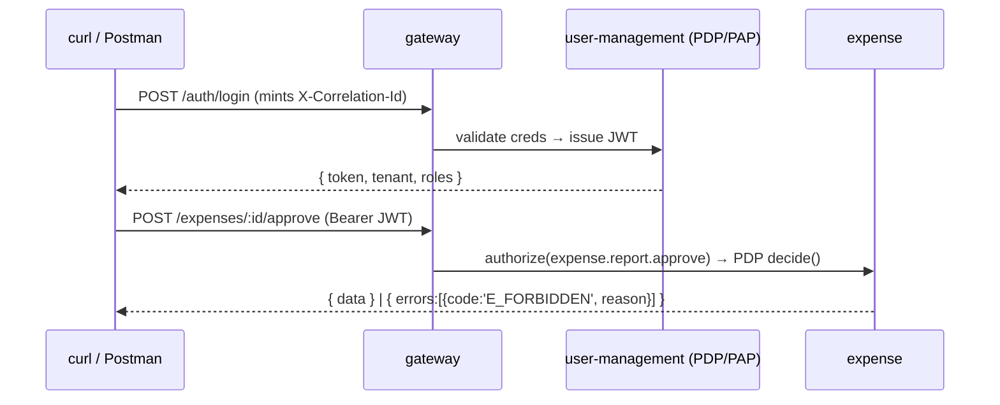
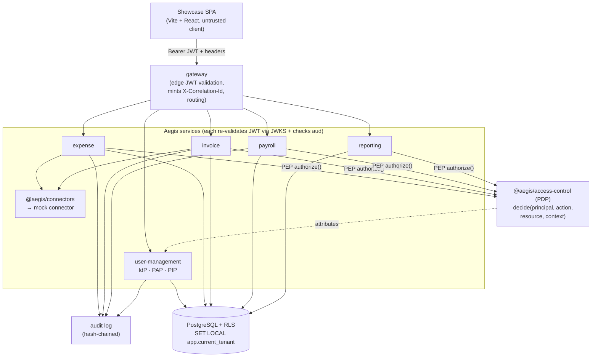

# Frontend Analysis — Should Aegis Ship a Lightweight Showcase UI?

> **Status: ANALYSIS ONLY. Decision pending owner review — do not implement yet.**
> This document evaluates whether Aegis should add a small UI to demonstrate every
> access-control flow end-to-end. It does **not** authorize a build. Per
> [`SPEC.md`](../../SPEC.md) §10.7, the owner reviews this analysis before any
> frontend work begins.

**Audience:** Aegis platform engineers and the reviewing owner.
**Related:** [`SPEC.md`](../../SPEC.md) (§0 services, §2 access-control model, §6
service-to-service, §10 amendments) · [`AGENTS.md`](../../AGENTS.md) (conventions +
forbidden names) · [`../testing/`](../testing/) (end-to-end flow catalogue) ·
[`../services/`](../services/) (per-service docs).

---

## 1. The question

Aegis is a backend access-control platform: seven business services
(user-management, expense, payroll, reporting, workflow, notification, invoice) plus
a gateway and a cli, sharing one PDP/PEP substrate over PostgreSQL + RLS. The whole
value proposition — centralized authorization, tenant isolation, dynamic
roles/permissions (PAP), tamper-evident audit — is expressed through APIs and
database state.

The platform is fully demonstrable **without** a UI: every flow is a sequence of
authenticated HTTP calls returning typed JSON envelopes, observable in the audit log
and the database. So the real question is one of **showcase ergonomics**, not
capability:

> Is a small, purpose-built UI worth the cost, to let a reviewer **see** the
> access-control story (a denied decision, a tenant switch, a role grant taking
> effect, an approval routing) at a glance — without replicating a heavy production
> frontend?

We evaluate three options.

| Option | One-line | Verdict |
|---|---|---|
| **(a)** No UI — APIs + curl/Postman + recorded API flows | Lean; relies on JSON + recordings | Viable baseline |
| **(b)** Minimal single-page admin/console driving the real APIs | Shows capability visually, thin | **Recommended (pending review)** |
| **(c)** Reuse/trim the donor's heavy frontend | Salvage a large SPA | **Rejected — too heavy** |

---

## 2. What a showcase UI must demonstrate

Whatever option we pick, the demonstration surface is fixed. These are the flows the
showcase must make legible (they map 1:1 to entries in the
[end-to-end flow catalogue](../testing/)):

1. **Login** — authenticate against the reference IdP in user-management; receive a
   short-lived RS256/ES256 JWT (`sub`, `tenant_id`, `roles`, `aud`, `exp`).
2. **Tenant switch** — a user with memberships in multiple tenants flips
   `active_workspace`; the "current tenant + current role" changes deterministically,
   and subsequent reads are RLS-scoped to the new tenant.
3. **Role / permission management (PAP)** — create a custom role, attach permissions
   from the catalog via `role_permissions`, assign the role to a user. Runtime CRUD,
   no redeploy.
4. **An authorization decision** — invoke the PDP directly (`decide(principal,
   action, resource, context) → { allow, reason, obligations }`) and show **both** an
   `allow` and a fail-closed `deny` with a human-readable reason.
5. **Expense approval** — submit an expense report, route it through multi-level
   approval, watch the state machine advance and the audit entries accrue.
6. **Invoice approval** — create a header-level invoice; run **duplicate detection**
   and a **threshold/variance check** against an optional PO reference; route for
   approval. (Header-level only — no line items, no GL codes — per §10.1.)
7. **Payroll run** — execute a pay run under **maker-checker** (the run approver must
   differ from the input editor), with field-level masking on sensitive PII.
8. **Report run** — run a report definition; observe row-level + column-level
   masking applied per `report_access_policies`, with access-scope baked into the
   cache key.
9. **ERP connector push** — push a posted transaction through the
   [`@aegis/connectors`](../../libs/connectors) framework to a **mock** connector
   (e.g. `LedgerOne` / `Finovo` / `AcctBridge`), with an idempotency key, and read
   back its status. (Mock connectors only — no real ERP is called.)

The cross-cutting thing every flow should surface: the **`X-Correlation-Id`** minted
at the gateway, propagated unchanged through every hop, so one logical operation can
be stitched across services and audit entries.

---

## 3. Option (a) — No UI (API + curl/Postman + recorded API flows)

**Scope.** No frontend at all. The deliverables are:

- An **OpenAPI** spec per service (served at `/docs`, unauthenticated per §9).
- A **Postman / Bruno collection** (or a `scripts/flows/*.http` set) with one folder
  per flow in §2, pre-wired with environment variables (base URL, tenant, token).
- **Recorded API flows**: terminal/HTTP-client screen captures, annotated per the
  recording format defined in [`../testing/`](../testing/), showing request →
  response → resulting DB/audit state.

**Effort (rough): ~0.5–1 engineer-day** on top of work already mandated by §10.6
(the testing plan + flow catalogue already enumerate these flows). Mostly collection
curation + annotation.

**What it demonstrates.** Everything — at the protocol level. A reader sees the exact
request/response envelopes, the JWT, the propagated headers, the typed error codes,
and the audit rows. For an engineer-facing audience this is often the *most*
convincing artifact because nothing is hidden behind UI sugar.



**Pros**
- Zero frontend maintenance surface; nothing to keep in lockstep with API changes
  beyond the OpenAPI spec (which is generated).
- Forces the APIs to be self-describing and correct — no UI to paper over rough edges.
- Cheapest path; reuses the §10.6 flow catalogue almost verbatim.
- Honest: shows the real wire contract, headers, and audit, not a curated facade.

**Cons**
- The access-control *story* is harder to **see** for a non-CLI reviewer. A denied
  decision is a `403` envelope, not a visibly greyed-out button — the "aha" of RBAC
  being enforced live is muted.
- Tenant switching and "this role now grants that action" are conceptually crisp but
  visually flat in raw JSON.
- Multi-step flows (approval chains, maker-checker) require the reader to follow a
  script; the state machine isn't rendered.

---

## 4. Option (b) — Minimal single-page admin/console (RECOMMENDED, pending review)

**Scope.** One small SPA — **Vite + React + TypeScript**, ~8–12 routes — that calls
the **real** Aegis APIs through the gateway. It is a *thin driver and viewer*, not a
product frontend:

- **No business logic in the client.** Every decision (authorization, masking,
  routing) is computed server-side; the UI only renders what the API returns. The PDP
  is never re-implemented client-side. This is itself a demonstration: the client is
  *untrusted*, exactly as a real enterprise client would be.
- **Token-aware.** Stores the JWT in memory, attaches `Authorization: Bearer …`,
  surfaces the active tenant/role, and shows the `X-Correlation-Id` for the last
  request so a reviewer can trace it into logs/audit.
- **Decision-centric.** The signature screen is an **Authorization Explorer** that
  calls `decide(...)` and renders `{ allow, reason, obligations }` verbatim, plus a
  side-by-side allow/deny so RBAC+ABAC enforcement is visible at a glance.
- **Showcase-grade styling only.** A single stylesheet, no design system, no state
  library beyond React's built-ins + a thin fetch wrapper. Read-only where a write
  isn't part of a flow.

**Effort (rough): ~3–5 engineer-days.** Scaffold + auth/token plumbing + a shared
typed API client (generated from the OpenAPI spec) is ~1 day; each route is a thin
form + JSON/table renderer at roughly 0.25–0.5 day. No backend changes are required —
the SPA consumes existing endpoints. (CORS at the gateway and a static-serve route are
the only platform touch-points, and both are trivial.)

**What it demonstrates.** Everything in §2, *visibly*:

- Login renders the decoded JWT claims and the active membership.
- Tenant switch flips the workspace and visibly re-scopes the list views (rows for
  tenant B vanish — RLS made tangible).
- The PAP screens let a reviewer create a role, tick permissions, assign it, then
  *immediately* re-run the Authorization Explorer and watch a previously-denied action
  flip to allowed — the dynamic-RBAC payoff in two clicks.
- Approval screens render the **state machine** and the audit trail as it advances.
- The payroll screen makes **maker-checker** concrete: the "Approve run" button is
  disabled (server-enforced; the client just reflects the `403` reason) when the
  current user is the input editor.
- The ERP screen pushes to a mock connector and polls status, showing idempotency.

**Proposed page / route list (only if (b) is approved):**

| Route | Flow (§2) | Drives | Shows |
|---|---|---|---|
| `/login` | 1 | `POST /auth/login` (gateway → user-management IdP) | Decoded JWT claims, active membership, `X-Correlation-Id` |
| `/tenant` | 2 | `GET /memberships`, `POST /memberships/:id/activate` | Tenant list; switching re-scopes all subsequent reads (RLS) |
| `/access/roles` | 3 | `GET/POST /roles`, `POST /roles/:id/permissions` (PAP) | Role list, permission catalog, `role_permissions` editing |
| `/access/grants` | 3 | `POST /users/:id/roles` (PAP) | Grant a role to a user; scope selector (`AllRecords/OwnAndTeam/OwnOnly`) |
| `/access/explorer` | 4 | `POST /authz/decide` (PDP) | Live `{ allow, reason, obligations }`; allow vs fail-closed deny side-by-side |
| `/expense` | 5 | `POST /expense-reports`, `/expenses`, `/…/approve` | Report state machine + multi-level approval + audit feed |
| `/invoice` | 6 | `POST /invoices`, `/…/check`, `/…/approve` | Header-level invoice; duplicate detection + threshold/variance vs optional PO ref + routing |
| `/payroll` | 7 | `POST /pay-runs`, `/…/inputs`, `/…/approve` | Maker-checker (approver ≠ editor), masked PII columns |
| `/reporting` | 8 | `POST /report-runs`, `GET /report-runs/:id` | Row + column masking per access policy; async run status |
| `/connectors` | 9 | `GET /connectors`, `POST /connectors/:id/push`, `GET /…/status` | Mock connector push (idempotency key) + status read-back |
| `/audit` | all | `GET /audit?correlationId=…` | Tamper-evident, hash-chained entries stitched by `X-Correlation-Id` |

That is ~11 routes, each thin. `/login`, `/tenant`, `/access/explorer`, and `/audit`
are the four that carry the access-control narrative; the rest are per-service flow
demonstrations.

**Proposed UI → gateway → services flow:**



**Pros**
- The access-control story becomes *visible and interactive*: a denied decision is a
  rendered reason, a role grant flips an explorer result live, a tenant switch makes
  rows disappear. This is the single biggest reason to build it.
- Still thin: no business logic client-side, so the UI **reinforces** the security
  model (untrusted client, server-enforced everything) rather than diluting it.
- A typed API client generated from OpenAPI keeps the SPA honest and cheap to update.
- Doubles as living documentation and a smoke-test driver for the §10.6 flow catalogue.

**Cons**
- A real (if small) maintenance surface: routes drift if endpoint shapes change.
  Mitigated by generating the client from the spec and keeping each route trivial.
- Adds a build target (Vite) and a static-serve/CORS path at the gateway.
- Risk of scope creep — "just one more nice screen." Must be governed by the fixed §2
  flow list; anything beyond it is out of scope.
- Not a substitute for the recorded flows in (a); it complements them.

**Example — the only kind of client-side logic permitted (render server truth, never decide):**

```typescript
// The SPA never authorizes anything. It calls the PDP and renders the verdict.
async function explainDecision(
  client: AegisApi,
  principalId: string,
  action: string,            // dotted domain.action, e.g. 'expense.report.approve'
  resourceRef: ResourceRef,
): Promise<DecisionView> {
  const res = await client.post('/authz/decide', {
    principalId,
    action,
    resource: resourceRef,
    // no entryContext — strict header context only (SPEC §6, §10.1)
  });
  // res = { allow, reason, obligations }  — verbatim from @aegis/access-control
  return {
    allowed: res.allow,
    reason: res.reason,                    // human-readable, fail-closed on deny
    masked: res.obligations?.maskColumns ?? [],
    correlationId: res.headers['x-correlation-id'],
  };
}
```

---

## 5. Option (c) — Reuse / trim the donor's heavy frontend (REJECTED)

**Scope (what it would entail).** The domain donor ships a large React/Redux SPA
split by product line (an order/AP surface, an expense surface, a cash surface, and an
app shell), backed by ~45 feature state slices and a deep adapter layer. Reusing it
means importing that SPA, stripping every branded identifier and customer/vendor
integration surface, rewiring its data layer from the donor's API shapes to Aegis's,
and re-theming it.

**Effort (rough): weeks, not days — and most of it is subtraction.** The donor SPA
assumes the donor's auth (a third-party IdP), its event/data conventions, and dozens
of feature slices tied to concepts Aegis has explicitly removed (line items, GL
coding, line-item matching). Porting it is a larger project than rebuilding the backend
slice it would demonstrate.

**Why rejected:**

- **Scope mismatch.** A large fraction of the donor frontend models exactly the
  concepts §10.1 removes — document-extracted line items, GL codes, line-item
  matching. Those screens have no backend in Aegis and would have to be deleted, not
  ported. Aegis's invoice is **header-level**; the donor's is line-item-centric.
- **Forbidden-name surface.** The donor's frontend is saturated with the forbidden
  npm scope across its path aliases and imports, plus customer/vendor integration
  modules. Scrubbing all of it to satisfy the [`AGENTS.md`](../../AGENTS.md) §3 hard
  constraint is high-risk, high-effort, and easy to miss.
- **Weight contradicts the goal.** §10.7 explicitly asks for a showcase **without**
  replicating a heavy production frontend. A multi-product SPA with ~45 state slices
  is the opposite of "lightweight."
- **Stale dependencies.** The donor pins old major versions across its UI stack;
  adopting them imports a remediation backlog for zero showcase benefit.
- **Wrong audience.** Aegis's value is access-control depth, not UX polish. A heavy
  frontend foregrounds product UI and buries the PDP/PEP/PAP/RLS story.

The donor frontend remains a **read-only pattern reference** (per `AGENTS.md` §2) —
useful to see how a real console organizes role/permission/approval screens — but
nothing is ported.

---

## 6. Comparison

| Dimension | (a) No UI | (b) Minimal console | (c) Donor frontend |
|---|---|---|---|
| Effort | ~0.5–1 day | ~3–5 days | Weeks (mostly removal) |
| Backend changes | None | CORS + static serve | Significant rewiring |
| Demonstrates all §2 flows | Yes (protocol-level) | Yes (visibly) | Partially / mismatched |
| Makes RBAC/RLS *visible* | Weakly | **Strongly** | Strongly but off-scope |
| Maintenance surface | Minimal (OpenAPI) | Small (generated client) | Large |
| Forbidden-name risk | None | None (greenfield) | **High** |
| Aligns with §10.1 scope | Yes | Yes | **No** (line items/GL) |
| Reinforces security model | Yes (raw contract) | Yes (untrusted client) | Diluted by product UI |

---

## 7. Recommendation

**Build option (b) — a minimal Vite + React + TypeScript console — *but only after
owner review*, and keep option (a) regardless.**

Rationale:

1. **(a) is necessary either way.** The OpenAPI specs, the flow collection, and the
   recorded API flows are already implied by §10.6 and cost almost nothing
   incremental. They are the honest, protocol-level proof. Ship them no matter what.
2. **(b) adds disproportionate showcase value for ~3–5 days.** The access-control
   narrative — a fail-closed deny with a reason, a tenant switch that re-scopes rows,
   a PAP grant that flips an Authorization Explorer result live, maker-checker
   disabling a button server-side — is dramatically more legible when *seen*. Because
   the client holds **no** business logic, it reinforces rather than dilutes the
   security model: it is a visible proof that the client is untrusted and the server
   decides everything.
3. **(c) is rejected.** It is heavier than the backend it would showcase, structurally
   tied to removed scope (line items / GL codes), and a forbidden-name minefield. The
   donor frontend stays a pattern reference only.

**Proposed governance if (b) is approved:**

- The route list in §4 is the **complete and frozen** scope. Any screen beyond the §2
  flows is out of scope and requires a fresh decision.
- The API client is **generated from OpenAPI** — no hand-maintained request types.
- **Zero** authorization/masking/routing logic in the client; it renders server truth
  only. This is a reviewable invariant, not a guideline.
- The SPA lives under a single app (e.g. `apps/console`) and a static-serve route on
  the gateway; it must not become a dependency of any backend service.
- It honors the [`AGENTS.md`](../../AGENTS.md) §3 forbidden-name constraint from line
  one (greenfield, so no scrubbing debt).

---

## 8. Decision

> **DECISION PENDING OWNER REVIEW — DO NOT IMPLEMENT YET.**
>
> This document recommends shipping option (a) unconditionally and building option
> (b) on top of it, with option (c) rejected. No frontend code is to be written until
> the owner signs off on (b)'s scope (the §4 route list) and its governance
> invariants. Per [`SPEC.md`](../../SPEC.md) §10.7, frontend is **analysis-only** at
> this stage.

---

### Appendix — flow-to-route traceability

| §2 flow | (b) route(s) | Primary service(s) | Access-control point demonstrated |
|---|---|---|---|
| 1 Login | `/login` | gateway, user-management (IdP) | Authn → JWT issuance; `aud`/`exp` |
| 2 Tenant switch | `/tenant` | user-management | `active_workspace` → RLS re-scope |
| 3 Role/permission mgmt | `/access/roles`, `/access/grants` | user-management (PAP) | Dynamic RBAC CRUD, `role_permissions` |
| 4 Authorization decision | `/access/explorer` | access-control (PDP) | `decide()` allow vs fail-closed deny |
| 5 Expense approval | `/expense` | expense | Multi-level approval + ABAC limits |
| 6 Invoice approval | `/invoice` | invoice | Header-level duplicate/threshold + routing |
| 7 Payroll run | `/payroll` | payroll | Maker-checker + field masking (obligations) |
| 8 Report run | `/reporting` | reporting | Row + column masking; scope in cache key |
| 9 ERP push | `/connectors` | `@aegis/connectors` (mock) | S2S auth + idempotency to a mock connector |
| (cross-cut) | `/audit` | all | Hash-chained audit stitched by `X-Correlation-Id` |
