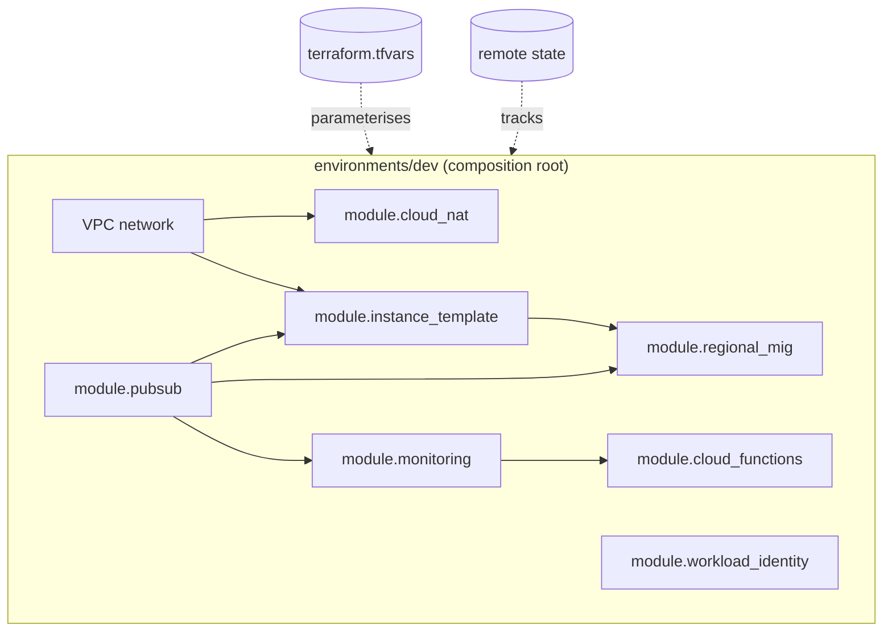

# IaC Analysis — Showcase Terraform for Aegis

> **Purpose.** Specify the showcase Terraform under `infra/terraform/` that can stand the Aegis
> platform up on a cloud quickly — a compute target running the single Aegis image with
> `PROCESS_TYPE` per service, a Pub/Sub event bus, autoscaling (min/max), networking + NAT, and
> basic monitoring/alerts — per [`../../SPEC.md`](../../SPEC.md) §10.5.
>
> **Method.** This document analyses a real, production-grade GCP Terraform reference
> (`infra/terraform/` in an internal inference-pipeline repository), distils the patterns worth
> adopting, decides what to **simplify** for a showcase, and lands on a concrete proposed layout.
> Citations are `file:line` against that reference.
>
> **Related docs.** [`../09-deployment-and-ops.md`](../09-deployment-and-ops.md) (single-image +
> `PROCESS_TYPE` model, local one-command run) · [`../06-service-to-service.md`](../06-service-to-service.md)
> (event bus, context propagation) · [`../01-architecture.md`](../01-architecture.md) (service topology).

---

## 1. Why we have a Terraform reference at all

The Aegis deployment model is already locked: **one multi-purpose Docker image** built from the Nx
monorepo, with `scripts/start.sh` switching on `PROCESS_TYPE` → `api` (the selected `SERVICE_NAME`),
`worker`, or `migration` (SPEC §7). Locally, `scripts/dev-up.sh` brings the whole estate up on one
Docker network (SPEC §10.4). The remaining gap is **"instant cloud setup"**: a contributor or
reviewer should be able to take that same image and stand the platform up in a real cloud with a
single `terraform apply`.

Rather than invent IaC conventions, we study a mature reference that already solves the hard parts —
state management, env-per-folder isolation, reusable modules, autoscaling off a queue signal, NAT,
and monitoring — and **borrow its shape while dropping its domain-specific weight**. The reference is
a multi-region GPU inference fleet; Aegis is a stateless web/worker platform. The structural lessons
transfer cleanly; the GPU/multi-region machinery does not, and we deliberately leave it behind.

---

## 2. The reference at a glance

The reference `infra/terraform/` is organised as **environments + reusable modules**, exactly the
split we want:

```
infra/terraform/
├── environments/
│   ├── dev/      # 1 region, min=0 (scale-to-zero), max=2–3
│   └── prod/     # multi-region, large min/max
└── modules/
    ├── pubsub/              # topics + subscriptions + DLQ + retry policy
    ├── cloud_nat/           # Cloud Router + NAT, one per region
    ├── regional_mig/        # health check + regional MIG + autoscaler
    ├── instance_template/   # the immutable VM template (image + metadata)
    ├── monitoring/          # alert policies, log metrics, log → warehouse sink
    ├── workload_identity/   # keyless CI auth (GitHub OIDC → service account)
    └── cloud_functions/     # DLQ persister + alert forwarder
```

Each environment's `main.tf` is a **thin composition root**: it instantiates the network, then wires
each module together, passing outputs of one as inputs to the next. The env folder owns the backend
(remote state), the provider config, and the `terraform.tfvars` that parameterise everything.



---

## 3. Patterns worth adopting

### 3.1 Env-per-folder + reusable modules

Each environment is its **own root module** with its **own state**: the dev folder declares the
backend with an env-scoped prefix and a provider bound to one region
(`environments/dev/main.tf:29`–`43`). Modules under `modules/` are parameterised and re-used across
environments; the README frames the whole point as *"Multi-environment (dev/prod) via
`terraform.tfvars`"* and *"Adding a 4th region = one new module block"* (`README.md:16`, `README.md:18`).
A region is added by adding a map entry, not by editing code (`environments/dev/main.tf:11`).

**Adopt.** This is the cleanest isolation model: a mistake in dev cannot touch prod state, and the
module library is the unit of reuse. Aegis takes `env/{dev}` + `modules/` directly.

### 3.2 A single immutable template, version-controlled, that rolls forward

The compute identity is one immutable template; *every* change (new image, new config) produces a new
template version, and the managed group rolls to it via a `PROACTIVE` update policy
(`modules/instance_template/main.tf:4`–`9`, `modules/regional_mig/main.tf:83`–`90`). The template
uses `name_prefix` + `create_before_destroy` so the new version is built before the old is torn down
(`modules/instance_template/main.tf:29`, `:88`–`90`). The image tag is pinned, never `:latest`
(`environments/dev/variables.tf:42`).

**Adopt — and it maps perfectly onto Aegis.** Aegis already promotes **immutable SHA images** (SPEC
§7). The template's `metadata` block is where the reference injects per-VM env (`WORKER_IMAGE`,
`RUN_ID`, `ENV`, `PUBSUB_SUBSCRIPTION_ID`, a health port — `modules/instance_template/main.tf:71`–`86`).
For Aegis, the same slot carries `IMAGE_TAG`, `PROCESS_TYPE`, `SERVICE_NAME`, `DATABASE_URL`,
`REDIS_URL`, `EVENT_BUS_TOPIC`, and `PARAM_STORE_PREFIX` — exactly the runtime contract `start.sh`
expects.

### 3.3 MIG + autoscaler with min/max, scaling off the queue

The `regional_mig` module bundles **health check + managed instance group + autoscaler** in one
reusable unit (`modules/regional_mig/main.tf:33`–`138`). Autoscaling is driven by **Pub/Sub backlog**
(`num_undelivered_messages`), with a per-VM backlog target that translates "pending messages per VM"
into a replica count (`modules/regional_mig/main.tf:129`–`136`). `min_replicas`/`max_replicas` are per-region inputs, with
dev set to **scale-to-zero** `min=0` and a small `max` (`environments/dev/terraform.tfvars:38`–`42`,
`modules/regional_mig/main.tf:10`–`11`). An `autoscaler_mode` of `OFF` preserves config while
preventing scale-out during tests (`modules/regional_mig/variables.tf:51`–`60`).

**Adopt the shape; change the signal.** The bundle (health check + group + autoscaler with min/max)
is exactly what Aegis needs. Aegis's **api** tier scales on CPU/request load; its **worker** tier
scales on **event-bus backlog** — the queue-depth pattern transfers directly to the Aegis event bus.
Scale-to-zero in dev and a small `max` keep the showcase cheap.

### 3.4 Pub/Sub as the event bus, with DLQ + retry

The `pubsub` module creates a main topic + subscription and a **dead-letter topic + monitor
subscription**, with `ack_deadline_seconds`, a `dead_letter_policy` (`max_delivery_attempts = 10`),
and an exponential `retry_policy` (`modules/pubsub/main.tf:53`–`72`). It also grants Pub/Sub's own
service account permission to publish to the DLQ (`modules/pubsub/main.tf:46`–`51`).

**Adopt directly.** Aegis's `@aegis/events` bus is explicitly **transport-swappable** (SPEC §1, §6);
Pub/Sub is a first-class cloud transport. The DLQ + retry + ack-deadline trio is precisely what a
production event bus needs and pairs naturally with the transactional-outbox semantics Aegis already
specifies. We keep the DLQ — it is the difference between "lost an event" and "found it in the
dead-letter queue."

### 3.5 Cloud NAT for egress without public IPs

Workers have **no external IP**; a Cloud Router + Cloud NAT per region provides outbound-only
internet for image pulls and outbound API calls (`modules/cloud_nat/main.tf:19`–`38`,
`modules/instance_template/main.tf:59`–`62`). Inbound is locked down to health-check prober ranges
and IAP-tunnelled SSH via firewall rules (`environments/dev/main.tf:107`–`145`).

**Adopt.** Aegis compute should likewise have no public ingress except through the **gateway** (the
single edge). NAT for egress + tight firewall rules is a strong default security posture and costs
almost nothing to express.

### 3.6 Basic monitoring + alerts as code

Alert policies are declared as Terraform resources with severity-tagged display names and **runbook
text embedded in the alert documentation** (`modules/monitoring/alerts.tf:17`–`52`, `:59`–`94`). The
reference alerts on **DLQ non-zero** (a permanently failing message), **queue age spike** (pipeline
stalled), and **fleet below floor** (capacity exhausted). A notification channel fans out to a
forwarder (`modules/monitoring/main.tf:46`–`54`).

**Adopt a trimmed set.** Three alerts carry most of the value for Aegis and are reusable verbatim in
spirit: **DLQ non-zero**, **event-bus age/backlog**, and **service unhealthy / fleet below floor**.
Embedding the runbook in the alert is a small touch with outsized operational value.

### 3.7 Keyless CI auth (workload identity federation)

CI authenticates to the cloud with **no long-lived service-account keys** — a GitHub OIDC provider is
federated to a runner service account, scoped to one exact repository
(`modules/workload_identity/main.tf:33`–`63`, `:46`). The env wires the plan-on-PR / apply-on-merge
contract around it (`environments/dev/main.tf:5`–`9`).

**Adopt as an optional module, documented, off by default for the showcase.** It is the right way to
run IaC in CI, but it requires a real org/repo and cloud project, so for a fresh-clone showcase we
**document** it rather than make it a hard dependency of `terraform apply`.

---

## 4. What to simplify (showcase, not a months-long pipeline)

The reference is a hardened, multi-region GPU fleet with months of operational scar tissue. A
showcase must demonstrate the **architecture** without inheriting that weight. We deliberately drop or
shrink:

| Reference complexity | Evidence | Aegis decision |
|---|---|---|
| **Multi-region** fleet (`for_each` over a regions map; dev runs 3 regions) | `environments/dev/main.tf:147`–`163`, `environments/dev/terraform.tfvars:38`–`42` | **Single region.** One `dev` env, one region. The module is still `for_each`-ready, but we ship one entry. |
| **prod** environment with large min/max and quota gates | `README.md:48`–`53` | **`dev` only.** Add `prod` later by copying the folder + tfvars. We ship `env/{dev}`. |
| **GPU / Spot** scheduling (T4 accelerators, preemptible, COS image) | `modules/instance_template/main.tf:35`–`54` | **General-purpose CPU, standard image.** Aegis is a Node web/worker workload — no accelerators, no Spot churn. |
| **State migration history**, `moved`/`import` blocks, re-import of dropped resources | `environments/dev/main.tf:198`–`222` | **Greenfield.** No legacy state to reconcile; omit entirely. |
| **Cloud Functions** (DLQ persister to a warehouse, Slack forwarder) | `modules/cloud_functions/main.tf:83`–`157` | **Out of the core stack.** A DLQ subscription is enough to *show* dead-lettering; persistence/forwarding is an optional add-on, not part of `apply`. |
| **Log-based metrics + warehouse log sink** | `modules/monitoring/main.tf:69`–`176` | **Drop.** Standard infra metrics (CPU, instance count, queue depth) cover the showcase; bespoke log markers depend on app changes. |
| **DLQ → BigQuery persistence**, billing/run-id labelling, scaling runbooks | `modules/monitoring/alerts.tf:135`, `modules/instance_template/main.tf:31` | **Drop.** Not needed to demonstrate the pattern. |
| Provider-pinned secrets passed **through Terraform state** (client id/secret in template metadata) | `modules/instance_template/main.tf:83`–`85`, `environments/dev/variables.tf:60`–`76` | **Param-store reference, not value.** Inject only a `PARAM_STORE_PREFIX` (SPEC §7); the image reads secrets at runtime. No secret material in state. |
| **Workload identity** as a hard dependency of apply | `environments/dev/main.tf:192`–`196` | **Optional module, documented.** Showcase `apply` runs from a developer's own cloud credentials; CI federation is a follow-on. |

**Net effect:** the seven-module reference collapses to **five core modules** for the showcase
(`network`, `pubsub`, `compute`, `autoscaling`, `monitoring`) plus an **optional** `workload_identity`
module — small enough to read in one sitting, faithful enough to demonstrate the production shape.

---

## 5. Proposed Aegis layout — `infra/terraform/`

```
infra/terraform/
├── README.md                       # what this stands up, prerequisites, one-command apply
├── .gitignore                      # .terraform/, *.tfstate, lock files, plan files
├── modules/
│   ├── network/                    # VPC + subnet + Cloud Router + NAT + firewall (egress-only, gateway ingress)
│   ├── pubsub/                     # event-bus topic + subscription + DLQ + retry policy
│   ├── compute/                    # instance template (the single Aegis image + PROCESS_TYPE/SERVICE_NAME metadata)
│   ├── autoscaling/               # managed instance group + health check + autoscaler (min/max)
│   ├── monitoring/                 # 3 alert policies (DLQ non-zero, bus age, unhealthy) + notification channel
│   └── workload_identity/          # OPTIONAL — keyless CI auth (documented, not wired into apply)
└── env/
    └── dev/
        ├── main.tf                 # composition root: network → pubsub → compute → autoscaling → monitoring
        ├── variables.tf            # typed inputs (project, region, image_tag, services map, min/max, …)
        ├── outputs.tf              # gateway address, bus topic/subscription, MIG ids
        ├── terraform.tfvars        # dev values: 1 region, min=1/max=3, the pinned image tag
        └── backend.tf              # remote state (env-scoped prefix)
```

### 5.1 The compute target — single image, `PROCESS_TYPE` per service

This is the crux of the mapping. Aegis ships **one image**; each running process selects its role via
env. The Terraform expresses that as **one instance template per service-role**, all referencing the
**same `image_tag`**, differing only in the `PROCESS_TYPE` / `SERVICE_NAME` metadata — mirroring the
reference's "one immutable template, metadata-driven" approach
(`modules/instance_template/main.tf:71`–`86`) but with Aegis's runtime contract.

A `services` map (analogous to the reference's `regions` map at
`environments/dev/variables.tf:19`–`26`) drives a `for_each`: one MIG + autoscaler per service.

| Aegis role | `PROCESS_TYPE` | `SERVICE_NAME` | scales on | min/max (dev) |
|---|---|---|---|---|
| gateway (edge) | `api` | `gateway` | request load (CPU) | 1 / 2 |
| user-management | `api` | `user-management` | request load (CPU) | 1 / 3 |
| expense / invoice / payroll / reporting | `api` | `<svc>` | request load (CPU) | 1 / 3 |
| workflow / notification (consumers) | `worker` | `<svc>` | **event-bus backlog** | 0 / 3 |
| migration (one-shot) | `migration` | — | run-to-completion task, not a MIG | — |

> A **container service** (e.g. Cloud Run / managed containers) is an equally valid compute target and
> is arguably simpler for a stateless image — the showcase can pick either. The MIG approach is
> documented here because it is what the reference demonstrates and it makes autoscaling/NAT/health
> checks explicit and inspectable. The module boundary (`compute` + `autoscaling`) is drawn so the
> compute target can be swapped without touching `network`, `pubsub`, or `monitoring`.

### 5.2 Module list + key variables

**`module "network"`** — VPC, subnet, Cloud Router + NAT (egress-only), firewall (health-check
prober ranges + gateway ingress only). Mirrors `modules/cloud_nat/main.tf:19`–`38` and the firewall
rules at `environments/dev/main.tf:107`–`145`.

| Variable | Type | Note |
|---|---|---|
| `project_id`, `region` | string | target cloud project + region |
| `env` | string | name prefix on every resource (collision-safe), per `modules/regional_mig/variables.tf:6`–`10` |
| `enable_nat` | bool | egress NAT on/off |

**`module "pubsub"`** — event-bus topic + subscription + DLQ + retry. Mirrors
`modules/pubsub/main.tf:31`–`81`.

| Variable | Type | Note |
|---|---|---|
| `topic_name`, `subscription_name` | string | the Aegis event-bus topic/subscription |
| `dlq_topic_name`, `dlq_subscription_name` | string | dead-letter pair |
| `ack_deadline_seconds` | number | default 60 (Aegis handlers are fast; cf. reference's 600 for GPU work) |
| `max_delivery_attempts` | number | default 10, per `modules/pubsub/main.tf:63` |

**`module "compute"`** — one instance template per service-role; same `image_tag`, metadata carries
the runtime contract. Mirrors `modules/instance_template/main.tf:26`–`91`.

| Variable | Type | Note |
|---|---|---|
| `image_tag` | string | pinned Aegis SHA image, never `:latest` (cf. `environments/dev/variables.tf:42`) |
| `service_name`, `process_type` | string | `PROCESS_TYPE` switch fed to `start.sh` (SPEC §7) |
| `param_store_prefix` | string | `/aegis/<env>/…`; secrets read at runtime, **not** in state |
| `machine_type`, `network`, `subnetwork` | string | general-purpose CPU; no accelerators |

**`module "autoscaling"`** — health check + MIG + autoscaler with min/max. Mirrors
`modules/regional_mig/main.tf:33`–`138`.

| Variable | Type | Note |
|---|---|---|
| `instance_template_self_link` | string | from `module.compute` |
| `min_replicas`, `max_replicas` | number | per-service; dev workers `min=0` (scale-to-zero), per `modules/regional_mig/main.tf:10`–`11` |
| `scaling_signal` | string | `cpu` (api tier) or `bus_backlog` (worker tier) |
| `health_check_path`, `health_check_port` | string/number | `/health` (SPEC §7); cf. reference `/healthz:8080` at `modules/regional_mig/main.tf:44`–`47` |
| `autoscaler_mode` | string | `ON`/`OFF`, per `modules/regional_mig/variables.tf:51`–`60` |

**`module "monitoring"`** — notification channel + three alert policies (DLQ non-zero, bus
age/backlog, service unhealthy). Mirrors `modules/monitoring/alerts.tf:17`–`138` (trimmed).

| Variable | Type | Note |
|---|---|---|
| `subscription_name`, `dlq_subscription_name` | string | the bus + DLQ to watch |
| `unhealthy_threshold` | number | fleet-below-floor / unhealthy-instance trigger |
| `notification_channel` | string | where alerts fan out |

**`module "workload_identity"` (optional)** — keyless CI auth. Mirrors
`modules/workload_identity/main.tf:22`–`63`. Not referenced by `env/dev/main.tf` by default;
documented in the README for teams wiring plan-on-PR / apply-on-merge.

### 5.3 Sketch of `env/dev/main.tf` (showcase, not full)

```hcl
# env/dev/main.tf — composition root for the Aegis dev cloud.
# One region, scale-to-zero workers, the single Aegis image driven by PROCESS_TYPE.

terraform {
  required_version = ">= 1.5"
  required_providers {
    google = { source = "hashicorp/google", version = "~> 5.0" }
  }
  backend "gcs" { bucket = var.state_bucket, prefix = "aegis/terraform-state/dev" }
}

provider "google" {
  project = var.project_id
  region  = var.region
}

# ── Network: VPC + egress-only NAT + locked-down firewall ─────────────────────
module "network" {
  source     = "../../modules/network"
  project_id = var.project_id
  region     = var.region
  env        = var.env
  enable_nat = true
}

# ── Event bus: topic + subscription + DLQ + retry (the @aegis/events transport) ─
module "pubsub" {
  source                = "../../modules/pubsub"
  project_id            = var.project_id
  topic_name            = "aegis-${var.env}-events"
  subscription_name     = "aegis-${var.env}-events-sub"
  dlq_topic_name        = "aegis-${var.env}-events-dlq"
  dlq_subscription_name = "aegis-${var.env}-events-dlq-monitor"
  ack_deadline_seconds  = 60
  max_delivery_attempts = 10
}

# ── Compute: ONE image, ONE template per service-role (PROCESS_TYPE/SERVICE_NAME)
# services map drives a for_each — adding a service is a tfvars entry, no code change.
module "compute" {
  for_each = var.services

  source             = "../../modules/compute"
  project_id         = var.project_id
  env                = var.env
  image_tag          = var.image_tag            # same SHA image for every role
  service_name       = each.key                 # e.g. "gateway", "workflow"
  process_type       = each.value.process_type  # "api" | "worker"
  param_store_prefix = "/aegis/${var.env}"       # secrets read at runtime, never in state
  machine_type       = each.value.machine_type
  network            = module.network.network_self_link
  subnetwork         = module.network.subnetwork_self_link
  event_bus_subscription = module.pubsub.subscription_name
}

# ── Autoscaling: health check + MIG + autoscaler (min/max) per service-role ────
module "autoscaling" {
  for_each = var.services

  source                      = "../../modules/autoscaling"
  project_id                  = var.project_id
  env                         = var.env
  region                      = var.region
  service_name                = each.key
  instance_template_self_link = module.compute[each.key].template_self_link
  min_replicas                = each.value.min_replicas
  max_replicas                = each.value.max_replicas
  scaling_signal              = each.value.scaling_signal  # "cpu" | "bus_backlog"
  bus_subscription_name       = module.pubsub.subscription_name
  health_check_path           = "/health"                  # SPEC §7 readiness probe
  health_check_port           = 8080
  autoscaler_mode             = "ON"
}

# ── Monitoring: notification channel + 3 alert policies (DLQ / bus age / unhealthy)
module "monitoring" {
  source                = "../../modules/monitoring"
  project_id            = var.project_id
  env                   = var.env
  subscription_name     = module.pubsub.subscription_name
  dlq_subscription_name = module.pubsub.dlq_subscription_name
  unhealthy_threshold   = var.fleet_min_threshold
}

# module "workload_identity" is intentionally NOT wired here — see README §CI.
```

And the `services` map in `terraform.tfvars` — the only file most contributors edit, mirroring the
reference's region map (`environments/dev/terraform.tfvars:38`–`42`):

```hcl
project_id   = "your-aegis-dev-project"
region       = "us-central1"
env          = "dev"
state_bucket = "your-aegis-tf-state"
image_tag    = "registry.example.com/aegis:<git-sha>"   # pinned, never :latest

services = {
  "gateway"         = { process_type = "api",    scaling_signal = "cpu",         min_replicas = 1, max_replicas = 2, machine_type = "e2-small" }
  "user-management" = { process_type = "api",    scaling_signal = "cpu",         min_replicas = 1, max_replicas = 3, machine_type = "e2-small" }
  "expense"         = { process_type = "api",    scaling_signal = "cpu",         min_replicas = 1, max_replicas = 3, machine_type = "e2-small" }
  "invoice"         = { process_type = "api",    scaling_signal = "cpu",         min_replicas = 1, max_replicas = 3, machine_type = "e2-small" }
  "payroll"         = { process_type = "api",    scaling_signal = "cpu",         min_replicas = 1, max_replicas = 3, machine_type = "e2-small" }
  "reporting"       = { process_type = "api",    scaling_signal = "cpu",         min_replicas = 1, max_replicas = 3, machine_type = "e2-small" }
  "workflow"        = { process_type = "worker", scaling_signal = "bus_backlog", min_replicas = 0, max_replicas = 3, machine_type = "e2-small" }
  "notification"    = { process_type = "worker", scaling_signal = "bus_backlog", min_replicas = 0, max_replicas = 3, machine_type = "e2-small" }
}
```

> The `migration` role is **not** a MIG — it is a run-to-completion job using the same image with
> `PROCESS_TYPE=migration`, invoked once before/after apply (or as a CI step), consistent with SPEC §7
> ("migrations as a one-shot task using the same image").

---

## 6. How this satisfies SPEC §10.5

| SPEC §10.5 requirement | Where it lands |
|---|---|
| Compute target (VM/MIG **or** container service) running the single image | `module "compute"` (template per role, same `image_tag`, `PROCESS_TYPE` metadata); container-service swap noted in §5.1 |
| Pub/Sub event bus | `module "pubsub"` — topic + subscription + DLQ + retry |
| Autoscaling with min/max | `module "autoscaling"` — MIG + autoscaler, per-service `min_replicas`/`max_replicas`, scale-to-zero workers |
| Networking + NAT | `module "network"` — VPC + Cloud Router/NAT (egress-only) + firewall |
| Basic monitoring/alerts | `module "monitoring"` — DLQ non-zero, bus age/backlog, service unhealthy |
| Showcase-grade (not full prod estate) | `env/{dev}` only; single region; no GPU/Spot; no warehouse sinks/functions; secrets by reference |
| "Instant cloud setup" | one composition root + one `terraform.tfvars` to edit |

---

## 7. Standing it up

```bash
cd infra/terraform/env/dev

terraform init      # downloads providers, connects remote state
terraform plan      # review: network, bus, per-service compute + autoscaling, monitoring
terraform apply     # creates the dev estate
```

Edit one file to retarget (`terraform.tfvars`: `project_id`, `region`, `image_tag`, the `services`
map). Adding a service is one map entry; promoting to a new environment is copying `env/dev` →
`env/<name>` and adjusting tfvars. Secrets never enter Terraform state — the image reads them at
runtime from the param store under `/aegis/<env>/…` (SPEC §7).

**One `terraform apply` stands the platform up.**
