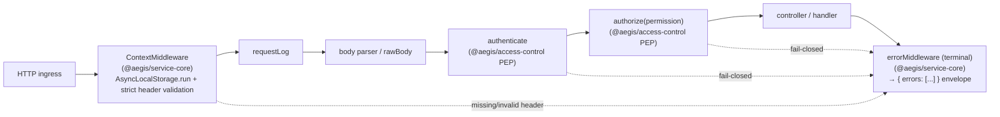

# Research — `@aegis/service-core` (cross-cutting backbone)

> **Status:** Phase 0 implementation spec. Distilled from a read of the available
> cross-cutting **reference** at `apps/web-backend/src/utils/{context,middleware}`
> (plus the neighbouring `logging/`, `httpClient/`, `ErrUtils.ts`, `ValidationUtils.ts`,
> `util.ts`). This document analyses that reference and specifies the **de-branded,
> `AsyncLocalStorage`-based** re-implementation Aegis ships as `libs/service-core`
> (`@aegis/service-core`).
>
> Authoritative scope: [`SPEC.md`](../../SPEC.md) §1 (cross-cutting lib), §6
> (context propagation), §10.2 (service-core source of truth). Companion docs:
> [`01-architecture.md`](../01-architecture.md) · [`02-patterns.md`](../02-patterns.md) ·
> [`06-service-to-service.md`](../06-service-to-service.md) ·
> [`08-api-conventions.md`](../08-api-conventions.md).
>
> The reference is **read-only and reference-only**. Nothing here is copied verbatim;
> we re-implement its *patterns* under neutral names. Forbidden-name rules
> ([`AGENTS.md`](../../AGENTS.md) §3) apply throughout.

---

## 1. Why this lib exists

The per-service internals (Express + InversifyJS + Sequelize layering) come from the
architecture reference, whose security/plumbing backbone is a **closed-source package we do
not have**. Aegis replaces it with a clean, in-house `@aegis/service-core` that owns the
cross-cutting responsibilities every service needs identically:

- a **RequestContext** (ambient per-request state — tenant, user, correlation id …),
- a **context middleware** that initialises that state from inbound headers (**with strict
  validation**),
- a **structured Logger** that auto-enriches every line with context,
- a **context-propagating HttpClient** for service-to-service calls,
- **Config/Secrets** access (param-store-backed),
- a **CacheAdapter** (Redis) seam,
- **ErrUtils** + a single **error middleware** producing one error envelope,
- a **bootstrap** helper that wires the middleware chain in the correct order.

The reference implements all of these, but with two material weaknesses Aegis must fix:
**(a)** it stores context in **`cls-hooked`** (a legacy continuation-local-storage shim),
and **(b)** its header population **defaults missing values to the string `"UNKNOWN"`**
instead of rejecting them. Aegis switches the storage to Node's native
**`AsyncLocalStorage`** and makes the context middleware **fail-closed** on missing
required headers.

---

## 2. Analysis of the reference

### 2.1 Context manager — storage mechanism

The reference splits context into two classes:

- **`ContextManager`** — the low-level store. It wraps a single `cls-hooked` namespace
  named `"session"` and exposes `setAttribute(key, value)` / `getAttribute(key)`
  (`ContextManager.ts:13`, `:70`, `:88`). Its `init(app)` creates the namespace and
  installs **one Express middleware** that, per request, binds the `req`/`res` emitters
  to the namespace and runs the rest of the chain inside `namespace.runPromise(...)`
  (`ContextManager.ts:22-39`) so that everything downstream shares one continuation-local
  scope. It refuses to operate before `init()` (`validateInitialization`,
  `ContextManager.ts:53-61`).

- **`ReqContextManager`** — the typed, business-aware layer on top. It declares the header
  keys it understands as static fields (`ReqContextManager.ts:10-18`):
  a request/correlation id header, `traceAttributes`, a user-id header, a caller header,
  a timestamp header, an IP field, a request-url field, a user-meta object, and a
  subscription-context field. On HTTP ingress
  its `registerWithReqContextManager(app, …)` installs a middleware that calls
  `populateFromHeaders(req, …)` and records IP + URL (`ReqContextManager.ts:48-56`).
  `populateFromHeaders` (`:59-76`) copies headers into the store and computes a request id
  (`addTraceAttributes`, `:163-171`: reuse the inbound correlation-id header or mint a
  `uuidv4()`).
  Typed getters (`getUserId`, `getCaller`, `getRequestId`, `getTimeStamp`, `getToken`,
  `getUserMeta`, …, `:177-235`) read back from the store.

**Fields carried (reference):** request/correlation id, `traceAttributes`,
user id, caller, timestamp, IP address, request URL, a `userMeta`
object (id/email/role/superuser/tier), a subscription context, and per-request flags
(`authenticationRequired` / `authorizationRequired` / `apiKeyRequired`).

**Init on non-HTTP paths:** `ContextManager.initCustomContext(service)` (`:41-45`) opens a
fresh namespace scope for **non-HTTP** entrypoints (workers, jobs, message consumers),
which then `setAttribute` the same keys manually. So the store is reusable off the request
path — but the typed population helper is HTTP-only.

#### 2.1.1 The two weaknesses we fix

1. **Storage = `cls-hooked`.** `cls-hooked` predates and is heavier than Node's built-in
   `AsyncLocalStorage`; it requires `bindEmitter` calls and a namespace registry. Aegis
   uses `AsyncLocalStorage<RequestContext>` directly — no namespace strings, no emitter
   binding, native `async/await` propagation.

2. **`"UNKNOWN"` defaulting (the security bug).** `ReqContextManager.setAttribute` takes
   an `ignoreMissingHeaders` flag and, when set, replaces a missing header with the literal
   `"UNKNOWN"` (`ReqContextManager.ts:78-88`); `populateFromHeaders` calls it with `caller`
   and `timestamp` allowed to be unknown (`:65-66`). A request with **no tenant / no
   caller** therefore proceeds with an `"UNKNOWN"` tenant — an ambient-authority and
   cross-tenant-leak hazard. Aegis **asserts** required headers and **rejects fail-closed**
   ([`SPEC.md`](../../SPEC.md) §6, §10.2). There is a `validateHeaders(req, headers[])`
   helper in the reference (`:156-161`) but it is **opt-in and unused on the main path** —
   Aegis makes equivalent validation **mandatory and central**.

> The reference has **no entry-context** concept and uses a reference-named request-id header
> for the correlation id. Per [`SPEC.md`](../../SPEC.md) §6/§10.1 Aegis **drops the
> entry-context field** entirely and standardises the propagated business-request id as
> **`X-Correlation-Id`** — the the reference's request-id and trend/tracker header names are not
> used anywhere in Aegis.

### 2.2 Middleware chain + order

The reference establishes this ingress order (context first, enforcement after):

1. **`ContextManager.init` middleware** — opens the per-request CLS scope
   (`ContextManager.ts:26-34`). Everything else runs inside it.
2. **`ReqContextManager` middleware** — populates context from headers, sets IP + URL,
   and pre-computes the per-request `authenticationRequired` / `authorizationRequired` /
   `apiKeyRequired` flags by URL prefix match (`ReqContextManager.ts:48-154`).
3. **`RawBodyCaptureMiddleware`** — must run **before** the body parser for webhook
   signature verification (`RawBodyCapture.ts:30-53`).
4. **`ReqResMiddleware.reqResLog`** — request/response timing log (`ReqResMiddleware.ts`).
5. **`ApiKeyMiddleware.checkApiKey`** — short-circuits when `apiKeyRequired` is false,
   else hashes + looks up the key, checks active/expired, sets user context
   (`ApiKeyMiddleware.ts:18-161`).
6. **`AuthenticationMiddleware.checkAuthentication`** — short-circuits when
   `authenticationRequired` is false; else verifies the JWT, checks the session row is
   active, loads the user with roles, sets `x-user` + `userMeta`
   (`AuthenticationMiddleware.ts:18-109`).
7. **`AuthorizationMiddleware.checkAuthorization`** — short-circuits when
   `authorizationRequired` is false; else loads the user's resource→action privileges and
   checks the route's required action (`AuthorizationMiddleware.ts:60-115`).
8. **controllers / route handlers.**
9. **Error middleware** — single terminal handler producing the `{ errors: [...] }`
   envelope (`bootstrap.ts:196-236`).

**Aegis adaptation.** Aegis keeps the *order* but changes the *responsibilities*:
authn/authz are **not** part of `service-core`. Per [`SPEC.md`](../../SPEC.md) §2.2 and
[`AGENTS.md`](../../AGENTS.md) §6, **`authenticate → authorize(permission) → handler`** is
the PEP, owned by [`@aegis/access-control`](../03-access-control-model.md). `service-core`
owns only the **infrastructure** band of the chain:
`ContextMiddleware → requestLog → errorMiddleware (terminal)`. The reference's
URL-prefix-driven `authenticationRequired` flags are replaced by **explicit per-route
guards** (no global "is this URL authed?" table).



### 2.3 Logger

`logging/Logger.ts` is a **winston** wrapper (`Logger.ts:6-61`): a static singleton
initialised with `init(service)`, JSON-formatted output, `defaultMeta.serviceName`, and
level driven by `LOG_LEVEL`/`NODE_ENV`. Level methods are `silly/debug/info/warn/error`
(`:124-147`). The key trait: **every line is auto-enriched from context** — `log()` reads
`traceAttributes`, `reqUrl`, `ipAddress`, `caller` off `ReqContextManager` and attaches
them (`Logger.ts:90-110`), swallowing the "context not populated" error so logging works
off the request path. `error(err, errId, errType, data)` logs the stack plus the typed
error id/type (`:140-147`).

**Aegis adaptation:** keep the auto-enrichment idea but pull fields from the
`AsyncLocalStorage` `RequestContext` (`correlationId`, `tenantId`, `userId`, `caller`,
`traceId`). Per [`SPEC.md`](../../SPEC.md) §4 the default transport is **pino** (faster,
lower-overhead structured JSON); the public surface stays winston-shaped
(`info/warn/error/debug`) so call sites are transport-agnostic.

### 2.4 HttpClient

`httpClient/HttpClient.ts` is a static **superagent** wrapper (`HttpClient.ts:8-104`).
`init(service)` records the caller's own name; `call(service, uri, options)` resolves the
target host from an **env var named after the service** (`getServiceUrl` →
`process.env[service]`, `:85-87`), normalises body/formdata/query/headers, retries
`HTTP_REQUEST_RETRY_COUNT` times, and times the call. Crucially it **propagates context
headers**: `populateHeaders` injects a timestamp header and the request-id header (the
correlation id) read from `ReqContextManager` (`:88-93`) — i.e. the correlation id flows to
downstream services automatically.

**Aegis adaptation:** keep the context-propagation behaviour but propagate the Aegis header
set ([`SPEC.md`](../../SPEC.md) §6): `X-Tenant-Id`, `X-Correlation-Id`, `X-Trace-Id`,
`X-Caller`, `X-Source-Service`, plus the internal/delegation token and `X-Internal-Origin`
gate. Replace the magic `process.env[service]` host lookup with a typed **service registry**
in [`@aegis/shared-constants`](../02-patterns.md). The underlying client can be `undici`/
`axios`; the seam is what matters.

### 2.5 Error utilities + envelope

`ErrUtils.ts` is a factory of typed errors over a small `ERROR_MAP` of
`{ ERR_CODE, HTTP_CODE, ERR_TYPE }` (`ErrUtils.ts:5-40`): `validation` (400),
`notFound` (404), `rateLimit` (429), `system` (500), `permission` (401), `database` (500).
`createError(...)` stamps `code`, `type`, `details`, `status`, and **`traceId` pulled from
context** (`:44-53`), with `create*`/`throw*` pairs per category. The terminal error
middleware (`bootstrap.ts:196-236`) logs the error then serialises **one envelope**:
`{ errors: [{ code, details, display_message, type, trace_id }] }`, choosing the HTTP
status from `err.status`.

**Aegis adaptation:** keep the typed-error + single-envelope pattern, but normalise to the
[`SPEC.md`](../../SPEC.md) §9 / [`08-api-conventions.md`](../08-api-conventions.md) field
names: `{ errors: [{ code, type, message, details, traceId }] }` (camelCase `traceId`,
`message` not `display_message`). The `traceId` is the `correlationId` from context.
`ValidationUtils.ts` (the reference's null/string/number guards used to *throw*
validation errors) collapses into `ErrUtils` + the header-assertion helpers below.

---

## 3. `@aegis/service-core` — module list

```
libs/service-core/src/
├── context/
│   ├── request-context.ts      # RequestContext (AsyncLocalStorage)
│   └── context.types.ts        # RequestContextData shape
├── middleware/
│   ├── context.middleware.ts   # ContextMiddleware — init + STRICT header validation
│   ├── request-log.middleware.ts
│   └── error.middleware.ts     # terminal → { errors: [...] } envelope
├── logging/
│   └── logger.ts               # Logger (pino, context-enriched)
├── http/
│   └── http-client.ts          # HttpClient (context-propagating)
├── config/
│   ├── config.ts               # Config (typed env)
│   └── secrets.ts              # Secrets (param-store-backed)
├── cache/
│   └── cache-adapter.ts        # CacheAdapter (Redis seam)
├── errors/
│   └── error-utils.ts          # ErrUtils + typed AppError
├── bootstrap/
│   └── bootstrap.ts            # createServiceApp(...) composition helper
└── index.ts                    # barrel
```

`@aegis/access-control` (PEP `authenticate`/`authorize`) is a **separate** lib and is
**not** part of this module list — see [`03-access-control-model.md`](../03-access-control-model.md).

---

## 4. Module APIs (Phase 0 signatures)

### 4.1 `RequestContext` — `AsyncLocalStorage`-based

The single ambient store. No CLS namespace strings; no `bindEmitter`. Fields are exactly
the [`SPEC.md`](../../SPEC.md) §6 set — **no entry-context field**, **no reference request-id
header**.

```typescript
// context/context.types.ts
export interface RequestContextData {
  tenantId: string;            // required on tenant-scoped requests
  userId?: string;             // set by the PEP after authentication
  roles?: string[];            // set by the PEP after authentication
  correlationId: string;       // X-Correlation-Id — the business-request id
  traceId?: string;            // X-Trace-Id — OTel span id (distinct from correlationId)
  caller?: string;             // X-Caller — logical origin (user-agent / client app)
  sourceService?: SourceService; // X-Source-Service — typed enum, set on s2s hops
  token?: string;              // raw bearer/internal token (for downstream propagation)
  requestUrl?: string;
  ipAddress?: string;
  startedAt: number;           // hrtime-ish epoch ms for latency
}

// context/request-context.ts
export class RequestContext {
  private static als = new AsyncLocalStorage<RequestContextData>();

  /** Run `fn` with a fresh context (HTTP middleware + non-HTTP entrypoints both use this). */
  static run<T>(seed: RequestContextData, fn: () => T): T;

  /** Whole context, or throw if called outside a context scope (fail-closed). */
  static get(): RequestContextData;

  /** Whole context or undefined (safe off the request path — used by Logger). */
  static tryGet(): RequestContextData | undefined;

  /** Mutate the active context in place (e.g. PEP sets userId/roles post-auth). */
  static set<K extends keyof RequestContextData>(key: K, value: RequestContextData[K]): void;

  // Typed accessors (replace the reference's get* methods)
  static tenantId(): string;        // throws if absent — fail-closed
  static userId(): string | undefined;
  static roles(): string[];
  static correlationId(): string;
  static traceId(): string | undefined;
  static caller(): string | undefined;
  static sourceService(): SourceService | undefined;
  static token(): string | undefined;
}
```

**Non-HTTP init.** Workers / event consumers wrap their unit of work in
`RequestContext.run(seedFromMessageHeaders(msg), () => handle(msg))`, building the seed from
message headers (`X-Tenant-Id`, `X-Correlation-Id`, …) exactly as the HTTP middleware builds
it from request headers. This replaces the reference's `initCustomContext`
(`ContextManager.ts:41-45`).

### 4.2 `ContextMiddleware` — with strict header validation (fail-closed)

This is the central fix over the reference's `"UNKNOWN"` defaulting. The middleware opens
the `AsyncLocalStorage` scope **and asserts the required headers are present and
well-formed**, rejecting fail-closed otherwise. Header keys come from the centralised
`HttpHeaderKey` enum ([`SPEC.md`](../../SPEC.md) §9).

```typescript
// middleware/context.middleware.ts
export interface ContextMiddlewareOptions {
  /** Header names that MUST be present + non-empty. Default: [X-Tenant-Id, X-Correlation-Id]. */
  requiredHeaders?: HttpHeaderKey[];
  /** If inbound X-Correlation-Id is absent at the EDGE, mint one (uuid v4). Default false
   *  (internal services require it; only the gateway mints). */
  mintCorrelationIdIfAbsent?: boolean;
}

export function contextMiddleware(opts?: ContextMiddlewareOptions): RequestHandler;
```

Behaviour:

1. Read `X-Tenant-Id`, `X-Correlation-Id`, `X-Trace-Id`, `X-Caller`, `X-Source-Service`,
   `Authorization` from `req.headers`.
2. **Validate required headers** via `assertHeaderPresent(...)`. A missing/blank required
   header throws `ErrUtils.validation(...)` → the error middleware turns it into a
   `400`/`401` envelope. **Never** substitute `"UNKNOWN"` (the reference's
   `ReqContextManager.ts:84` anti-pattern). Malformed `tenantId` (not a UUID) is also
   rejected.
3. `correlationId`: use the inbound value; only the **gateway** mints one when
   `mintCorrelationIdIfAbsent` is set (the single id is then propagated unchanged
   downstream — [`SPEC.md`](../../SPEC.md) §6). Internal services that receive a request
   without a correlation id **fail closed**.
4. Build the `RequestContextData` seed and call
   `RequestContext.run(seed, () => next())` so the whole chain runs inside the scope
   (mirrors `ContextManager.ts:31-33`, on `AsyncLocalStorage`).

```typescript
// helper (replaces reference ValidationUtils.validateStringNotEmpty on the header path)
export function assertHeaderPresent(
  req: Request, key: HttpHeaderKey, label?: string,
): string; // returns the value or throws ErrUtils.validation — fail-closed
```

### 4.3 `Logger` — context-enriched structured logging

```typescript
// logging/logger.ts
export class Logger {
  static init(serviceName: string, opts?: { level?: LogLevel }): void;
  static debug(message: string, data?: Record<string, unknown>): void;
  static info(message: string, data?: Record<string, unknown>): void;
  static warn(message: string, data?: Record<string, unknown>): void;
  static error(err: Error, errId?: string, errType?: string, data?: Record<string, unknown>): void;
  /** Internal: every line auto-merges { serviceName, correlationId, traceId, tenantId,
   *  userId, caller } pulled from RequestContext.tryGet() (no throw off the request path). */
  private static enrich(base: Record<string, unknown>): Record<string, unknown>;
}
```

Same level surface as the reference (`Logger.ts:124-147`), same auto-enrichment idea
(`Logger.ts:90-110`) — but reading the `AsyncLocalStorage` context and emitting via **pino**
([`SPEC.md`](../../SPEC.md) §4). `correlationId` on every line is what stitches a logical
operation across services.

### 4.4 `HttpClient` — context-propagating service-to-service client

```typescript
// http/http-client.ts
export interface HttpRequest {
  method: 'GET' | 'POST' | 'PUT' | 'PATCH' | 'DELETE';
  path: string;                              // e.g. '/internal/v1/users/:id'
  query?: Record<string, string | number>;
  body?: unknown;
  headers?: Record<string, string>;          // merged over the propagated defaults
  propagateContext?: boolean;                // default true
  idempotencyKey?: string;                   // for non-idempotent writes / connector pushes
}

export class HttpClient {
  static init(selfService: SourceService): void;
  /** Resolve target base URL from the typed service registry (NOT process.env[name]). */
  static call<T>(target: SourceService, req: HttpRequest): Promise<T>;
  /** Injected on every outbound call when propagateContext !== false. */
  private static propagatedHeaders(target: SourceService): Record<string, string>;
}
```

`propagatedHeaders` injects the Aegis set from `RequestContext`:
`X-Tenant-Id`, `X-Correlation-Id`, `X-Trace-Id`, `X-Caller`, `X-Source-Service` (= `selfService`),
the internal/delegation token, and `X-Internal-Origin` ([`SPEC.md`](../../SPEC.md) §6) —
the de-branded successor to the reference's timestamp / request-id header injection
(`HttpClient.ts:88-93`). This is the transport the [`@aegis/connectors`](../06-service-to-service.md)
ERP framework rides on.

### 4.5 `Config` / `Secrets`

```typescript
// config/config.ts
export class Config {
  static get(key: string): string | undefined;
  static require(key: string): string;            // throws if missing — fail-fast at boot
  static int(key: string, fallback?: number): number;
  static bool(key: string, fallback?: boolean): boolean;
  static serviceUrl(service: SourceService): string; // replaces process.env[service]
}

// config/secrets.ts  (param-store-backed; SPEC §7 "/aegis/<env>/...")
export class Secrets {
  static init(opts: { provider: 'env' | 'ssm' | 'vault'; prefix: string }): Promise<void>;
  static get(name: string): Promise<string>;      // cached; never logged
}
```

Replaces the reference's scattered `process.env[...]` reads (`HttpClient.ts:64,86`) with a
typed, fail-fast surface and a param-store seam (no secrets in images/CI —
[`SPEC.md`](../../SPEC.md) §7).

### 4.6 `CacheAdapter`

```typescript
// cache/cache-adapter.ts  (Redis seam; PDP decision cache, PIP attribute cache, idempotency)
export interface CacheAdapter {
  get<T>(key: string): Promise<T | undefined>;
  set<T>(key: string, value: T, ttlSeconds?: number): Promise<void>;
  del(key: string): Promise<void>;
  withTenant(key: string): string;   // namespaces keys by RequestContext.tenantId() —
                                      // prevents cross-tenant cache bleed (SPEC §2.5 reporting)
}
export class RedisCacheAdapter implements CacheAdapter { /* ioredis */ }
```

No equivalent in the reference; added because the PDP decision cache and reporting's
per-scope cache keys ([`SPEC.md`](../../SPEC.md) §2.5) need a shared, tenant-namespaced seam.

### 4.7 `ErrUtils` + error middleware

```typescript
// errors/error-utils.ts
export type ErrorType =
  | 'VALIDATION_ERR' | 'NOT_FOUND_ERR' | 'RATE_LIMIT_ERR'
  | 'SYSTEM_ERR' | 'PERMISSION_ERR' | 'DATABASE_ERR';

export class AppError extends Error {
  code: number; type: ErrorType; status: number;
  details?: unknown; traceId?: string;            // traceId = correlationId from context
}

export class ErrUtils {
  static validation(message: string, details?: unknown): AppError;   // 400
  static notFound(message: string, details?: unknown): AppError;     // 404
  static permission(message: string, details?: unknown): AppError;   // 401/403 — PEP denials
  static rateLimit(message: string, details?: unknown): AppError;    // 429
  static system(message: string, details?: unknown): AppError;       // 500
  static database(message: string, details?: unknown): AppError;     // 500
  static throwValidation(message: string, details?: unknown): never; // ... throw* per type
}
```

```typescript
// middleware/error.middleware.ts  — single terminal handler
export function errorMiddleware(): ErrorRequestHandler;
```

The envelope is normalised to [`SPEC.md`](../../SPEC.md) §9 (camelCase, `message`):

```json
{
  "errors": [
    {
      "code": 1,
      "type": "VALIDATION_ERR",
      "message": "X-Tenant-Id header is required",
      "details": { "header": "X-Tenant-Id" },
      "traceId": "f1c2…-correlation-id"
    }
  ]
}
```

This keeps the reference's `{ errors: [...] }` shape and per-type `ERROR_MAP`
(`ErrUtils.ts:5-40`, `bootstrap.ts:208-226`) but renames `display_message → message` and
`trace_id → traceId`, and sources `traceId` from `RequestContext.correlationId()`.

### 4.8 `bootstrap` helper

```typescript
// bootstrap/bootstrap.ts
export interface ServiceAppOptions {
  serviceName: SourceService;
  requiredHeaders?: HttpHeaderKey[];     // forwarded to contextMiddleware
  isEdge?: boolean;                      // gateway → mintCorrelationIdIfAbsent = true
  registerRoutes: (app: Express) => void;
}

/** Composition root: installs the service-core middleware band in the correct order,
 *  initialises Logger/HttpClient/Config, registers routes, then the TERMINAL error
 *  middleware last. */
export function createServiceApp(opts: ServiceAppOptions): Express;
```

Installation order (the §2.2 chain, infra band only — authn/authz come from the PEP and are
registered per-route by each service):

```
Logger.init → Config/Secrets init → HttpClient.init
  → contextMiddleware({ requiredHeaders, mintCorrelationIdIfAbsent: isEdge })
  → requestLogMiddleware
  → bodyParser / rawBody
  → registerRoutes(app)        // each route: authenticate → authorize(perm) → handler  (PEP)
  → errorMiddleware()          // TERMINAL — must be last
```

This is the de-branded successor to the reference's `bootstrap.ts` server build +
`setErrorConfig` (`bootstrap.ts:196-243`).

---

## 5. Reference → Aegis mapping (summary)

| Reference (internal web backbone) | `@aegis/service-core` | Key change |
|---|---|---|
| `ContextManager` (`cls-hooked` namespace `"session"`) | `RequestContext` | **`AsyncLocalStorage`**; no namespace strings / `bindEmitter` |
| `ReqContextManager` (request-id, user-meta, subscription-context fields) | `RequestContextData` fields | **drop entry-context + reference request-id header**; use `correlationId`/`traceId`/`tenantId`/`sourceService` |
| `setAttribute(..., ignoreMissingHeaders)` → `"UNKNOWN"` (`:78-88`) | `assertHeaderPresent` in `contextMiddleware` | **fail-closed**, never default to `"UNKNOWN"` |
| `registerWithReqContextManager` URL-prefix authn flags | per-route PEP guards | authn/authz move to `@aegis/access-control` |
| `Logger` (winston, context-enriched) | `Logger` (pino, context-enriched) | same surface, faster transport |
| `HttpClient` (superagent, `process.env[service]`, request-id injection) | `HttpClient` | typed service registry; propagate Aegis header set |
| `ErrUtils` + `{ errors:[{…display_message, trace_id}] }` | `ErrUtils` + `errorMiddleware` | `message`/`traceId` camelCase; `traceId` = correlationId |
| `ValidationUtils` (throwing guards) | folded into `ErrUtils` + header asserts | — |
| `ContextManager.initCustomContext` (non-HTTP) | `RequestContext.run(seedFromMessageHeaders, fn)` | unify HTTP + worker init |
| — (none) | `Config`/`Secrets`, `CacheAdapter` | new seams (param store, tenant-namespaced cache) |

---

## 6. Phase 0 deliverables (this lib)

Per [`SPEC.md`](../../SPEC.md) §8 Phase 0, `@aegis/service-core` ships:

1. `RequestContext` (`AsyncLocalStorage`) + typed accessors + non-HTTP `run` seeding.
2. `contextMiddleware` with **strict, fail-closed header validation** (required:
   `X-Tenant-Id`, `X-Correlation-Id`; edge mints correlation id).
3. `Logger` (pino, context-enriched), `requestLogMiddleware`.
4. `HttpClient` (context-propagating, idempotency-key aware).
5. `Config`/`Secrets` (param-store seam), `CacheAdapter` (Redis).
6. `ErrUtils` + `AppError` + terminal `errorMiddleware` (the §9 envelope).
7. `createServiceApp` bootstrap helper wiring the middleware band in order.
8. Unit tests: context isolation across concurrent requests, **fail-closed** assertion on
   missing `X-Tenant-Id`/`X-Correlation-Id`, header propagation by `HttpClient`, and the
   error-envelope shape.

> **Forbidden-name check:** this spec contains no reference brand or customer name and no
> non-production framing wording; all identifiers are `@aegis/*` /
> neutral-domain. Re-run the [`AGENTS.md`](../../AGENTS.md) §3 grep before committing the
> implementation.
