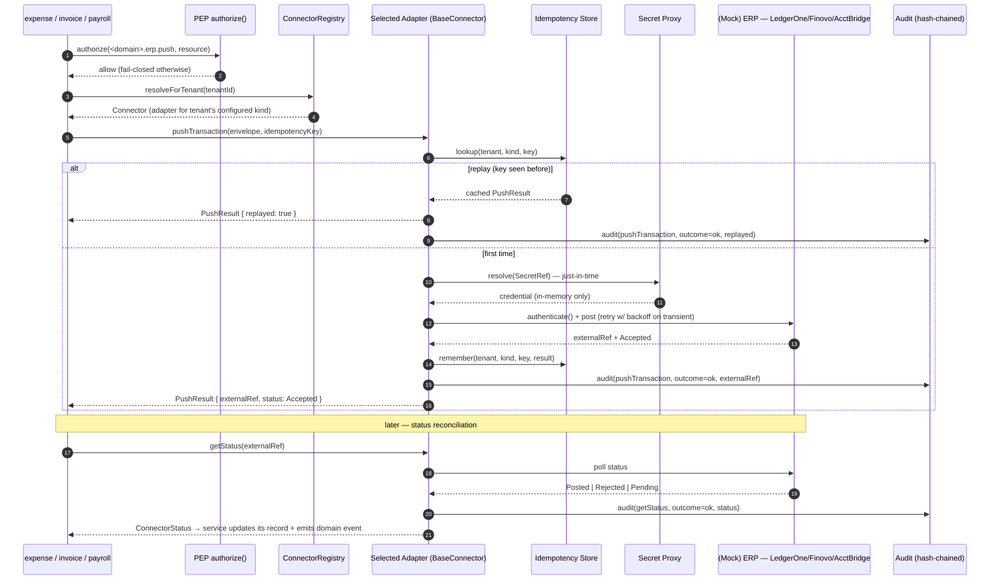

# @aegis/connectors — Pluggable ERP Connector Framework

> The shared library that lets any Aegis business service post an **approved
> transaction** (an expense report, an invoice, a payroll disbursement) to a tenant's
> external accounting **system of record** through a single, uniform interface — without
> any service ever learning a vendor-specific protocol. A new ERP is added by writing
> **one adapter** and registering it; nothing else changes.
>
> Modeled on the adapter/strategy + registry + per-connector-config pattern from the
> Python ERP-integration reference and re-implemented in Node/TS on the same
> InversifyJS + RequestContext + secret-proxy substrate as the rest of the platform.
> The library ships **mock connectors** with neutral names — `LedgerOne`, `Finovo`,
> `AcctBridge` — that faithfully emulate ERP behaviour (auth handshake, idempotent push,
> status poll, entity fetch, health check) **without any real outbound call**, so the
> framework is provably production-ready and a real ERP plugs in by replacing one mock
> adapter with a real one.
>
> **Authoritative scope:** [`../../SPEC.md`](../../SPEC.md) **§10.3** (ERP integration —
> pluggable connector framework), §1 (locked decisions), §6 (service-to-service).
>
> Related: [`../01-architecture.md`](../01-architecture.md) ·
> [`../02-patterns.md`](../02-patterns.md) ·
> [`../06-service-to-service.md`](../06-service-to-service.md) ·
> [`../09-deployment-and-ops.md`](../09-deployment-and-ops.md) ·
> [`../10-auditability-and-compliance.md`](../10-auditability-and-compliance.md) ·
> consumers [`expense.md`](expense.md) · [`invoice.md`](invoice.md) ·
> [`payroll.md`](payroll.md).

---

## Current implementation (2026-06-27)

The implemented connector surface is split between a shared adapter library and the workflow worker:

| Concern | Implemented location |
|---|---|
| Connector contract | `libs/connectors/src/connector.ts` |
| Adapter base with retry, durable idempotency, auth hook, reconcile | `libs/connectors/src/base-connector.ts` |
| Factory/registry by connector kind | `libs/connectors/src/registry.ts` |
| Per-connector transformers | `libs/connectors/src/transformer.ts` and `libs/connectors/src/mock/*.ts` |
| Tenant connector config table | `apps/cli/src/migrations/0026_connector_configs.ts` |
| Tenant connector config model/repository/API | `apps/workflow/src/models/connector-config.model.ts`, `repositories/connector-config.repository.ts`, `controllers/connector.controller.ts` |
| Durable sync state | `apps/cli/src/migrations/0020_connector_sync_state.ts`, `apps/workflow/src/services/connector-sync-state.store.ts` |
| ERP push consumer | `apps/workflow/src/consumers/connector-sync.consumer.ts` |

Implemented HTTP operator routes, all under `/workflow/v1` and PEP-guarded:

| Route | Permission | Purpose |
|---|---|---|
| `GET /connectors` | `connector.manage` | List tenant connector configs. |
| `PUT /connectors/:kind` | `connector.manage` | Upsert one tenant connector config (`active`, `baseUrl`, `credentialsRef`, `settings`). |
| `GET /connectors/:kind/health` | `connector.manage` | Run the connector health check against the active tenant config. |
| `GET /connectors/sync-state` | `connector.push` | List durable ERP push lifecycle rows, filterable by `kind` and `status`. |
| `GET /connectors/sync-state/:idempotencyKey` | `connector.push` | Fetch one push lifecycle row. |
| `POST /connectors/reconcile` | `connector.push` | Run a tenant-scoped status reconciliation sweep over queued/in-progress sync-state rows. |

Approved transactions are not pushed through public connector transaction endpoints. Expense,
invoice, and payroll stage `connector.push.requested` events in their own business transaction;
the workflow worker consumes those events and calls the registered connector. This keeps slow or
failing ERP work out of the finance request path and gives the outbox/Kafka retry/DLQ path ownership
of delivery.

Still open:

- Automated scheduling must still enumerate tenant contexts and call the reconcile sweep without an
  operator request.
- `credentialsRef` is stored and passed to `authenticate(config)`, but secret proxy resolution and
  token-refresh-on-auth-failure are not implemented yet.
- `connector_sync_state` records terminal outcomes, but owning records are not yet updated from a
  terminal sync callback.
- `connector_sync_log` remains a reserved table name in docs/enums; append-only attempt history is
  not implemented yet.

## 1. Why a framework (and not ad-hoc sync)

ERP / accounting reconciliation is a real enterprise requirement: a finance team only
trusts Aegis once approved transactions land in *their* ledger of record. The naive
approach — each service growing its own "ERP sync" code — does not scale: every vendor
has a different auth scheme, payload shape, idempotency story, and failure taxonomy, and
that complexity leaks into expense/invoice/payroll. Per [`../../SPEC.md`](../../SPEC.md)
§10.3 we **remove ad-hoc sync** and replace it with one shared library, `@aegis/connectors`,
that owns the whole concern behind a stable interface.

```
libs/
└── connectors/                       # @aegis/connectors
    ├── src/
    │   ├── connector.interface.ts    # Connector contract (the strategy interface)
    │   ├── base-connector.ts         # BaseConnector: shared idempotency/retry/audit template
    │   ├── registry.ts               # ConnectorRegistry (the factory + binding table)
    │   ├── config/
    │   │   ├── connector-config.ts   # per-tenant connector config shape + loader
    │   │   └── secret-ref.ts         # SecretRef resolution via the secret proxy
    │   ├── errors.ts                 # ConnectorError taxonomy + error-mapping helpers
    │   ├── retry.ts                  # withRetry(): exponential backoff + jitter
    │   ├── audit.ts                  # outbound-call audit emitter
    │   ├── types.ts                  # TransactionEnvelope, PushResult, ConnectorStatus, …
    │   └── adapters/
    │       ├── mock/
    │       │   ├── ledger-one.adapter.ts
    │       │   ├── finovo.adapter.ts
    │       │   └── acct-bridge.adapter.ts
    │       └── README.md             # "how to add a real ERP" checklist
    └── index.ts
```

Design goals, in priority order:

1. **One interface, many ERPs** — services depend on `Connector`, never on a vendor.
2. **Idempotent by construction** — every push carries an `idempotencyKey`; a replay is a
   no-op that returns the original result.
3. **Fail-closed + observable** — every outbound call is retried with backoff, mapped to a
   typed error, and **audited** (actor, tenant, connector, idempotency key, decision).
4. **Tenant-scoped config + secrets** — connector selection and credentials are per-tenant;
   secrets are `SecretRef`s resolved at call time through the secret proxy, never stored or
   logged in plaintext.
5. **Pluggable** — adding an ERP = write one adapter + register it. No service edits.

---

## 2. The `Connector` interface (the strategy contract)

Every connector — mock or real — implements one TypeScript interface. This is the
adapter/strategy seam: the business services program against `Connector`; each ERP is a
concrete strategy selected at runtime by the registry.

```ts
// libs/connectors/src/connector.interface.ts
import type {
  TransactionEnvelope,
  PushResult,
  ConnectorStatus,
  EntityQuery,
  EntityPage,
  HealthReport,
  ConnectorContext,
} from './types';

/**
 * The uniform contract every ERP connector satisfies. Methods are intentionally
 * coarse-grained and idempotent so the framework can retry safely.
 */
export interface Connector {
  /** Stable connector kind, e.g. ConnectorKind.LedgerOne. Used by the registry + audit. */
  readonly kind: ConnectorKind;

  /**
   * Establish an authenticated session for this tenant's connection. Resolves any
   * SecretRefs through the secret proxy, performs the connector's auth handshake
   * (API key / OAuth2 client-credentials / signed-request, per config), and returns
   * a short-lived session handle the other methods reuse. MUST NOT log secrets.
   */
  authenticate(ctx: ConnectorContext): Promise<ConnectorSession>;

  /**
   * Push one approved transaction to the ERP. The idempotencyKey is mandatory and
   * deterministic for a given (tenant, source record, version): replaying the same
   * key returns the ORIGINAL PushResult without creating a duplicate in the ERP.
   */
  pushTransaction(
    session: ConnectorSession,
    txn: TransactionEnvelope,
    idempotencyKey: string,
  ): Promise<PushResult>;

  /** Poll the ERP for the lifecycle state of a previously pushed transaction. */
  getStatus(
    session: ConnectorSession,
    externalRef: string,
  ): Promise<ConnectorStatus>;

  /**
   * Read reference master data from the ERP (e.g. vendors, accounts, cost centers)
   * for reconciliation / lookups. Paginated; read-only; never mutates the ERP.
   */
  fetchEntities(
    session: ConnectorSession,
    query: EntityQuery,
  ): Promise<EntityPage>;

  /** Cheap liveness/credentials probe — used by /health?details=true and by the registry. */
  healthCheck(ctx: ConnectorContext): Promise<HealthReport>;
}
```

Supporting types keep the surface vendor-neutral and header-level (no GL codes, no
document-extracted line items — consistent with [`../../SPEC.md`](../../SPEC.md) §10.1):

```ts
// libs/connectors/src/types.ts
export enum ConnectorKind {
  LedgerOne  = 'ledger_one',
  Finovo     = 'finovo',
  AcctBridge = 'acct_bridge',
}

/** What a business service hands the framework — vendor-neutral, header-level. */
export interface TransactionEnvelope {
  /** Originating Aegis domain: 'expense' | 'invoice' | 'payroll'. */
  source: TransactionSource;
  /** The Aegis record id (expense_report_id / invoice_id / pay_run_id). */
  sourceRecordId: string;
  /** ISO-4217 currency + integer minor units (platform money convention). */
  currency: string;
  amountMinor: number;
  /** Business-meaningful posting date (not the push time). */
  postingDate: string;            // YYYY-MM-DD
  /** Counterparty as the tenant knows it (vendor/payee/employee display ref). */
  counterpartyRef: string;
  /** Optional purchase-order reference for invoice threshold/variance checks. */
  poReference?: string | null;
  /** Free-form, vendor-neutral metadata the adapter maps to ERP fields. */
  attributes: Record<string, string | number | boolean | null>;
}

export type TransactionSource = 'expense' | 'invoice' | 'payroll';

export interface PushResult {
  /** The id the ERP assigned, used later by getStatus. */
  externalRef: string;
  status: ConnectorStatus;
  /** true when this push was satisfied from the idempotency cache (a replay). */
  replayed: boolean;
  /** Raw vendor receipt, redacted before audit/log. */
  receipt?: Record<string, unknown>;
}

export enum ConnectorStatus {
  Accepted = 'accepted',   // ERP acknowledged receipt
  Posted   = 'posted',     // ERP committed it to the ledger
  Rejected = 'rejected',   // ERP rejected (validation / business rule)
  Pending  = 'pending',    // in-flight / queued in the ERP
  Unknown  = 'unknown',
}
```

`ConnectorContext` is derived from the ambient `RequestContext`
([`@aegis/service-core`](../02-patterns.md)) — it carries `tenantId`, `userId`,
`correlationId`, `traceId`, and the resolved per-tenant `ConnectorConfig`. The connector
never reads global state; everything it needs arrives in the context, which makes it pure
to test and impossible to use across tenants by accident.

---

## 3. The adapter/strategy base + `ConnectorRegistry`

### 3.1 `BaseConnector` — the template that owns cross-cutting concerns

Concrete adapters extend `BaseConnector`, which wraps every outbound call in the
idempotency check, retry/backoff, error mapping, and audit emission. An adapter author
writes only the **vendor-specific `do*` methods**; the safety machinery is inherited and
identical across every ERP. This is the Template-Method companion to the Strategy
interface — the *shape* of a push is fixed; only the wire format varies.

```ts
// libs/connectors/src/base-connector.ts
import { injectable } from 'inversify';
import { withRetry } from './retry';
import { mapVendorError, ConnectorError } from './errors';
import { auditOutbound } from './audit';
import type { Connector, ConnectorSession } from './connector.interface';
import type {
  ConnectorContext, TransactionEnvelope, PushResult, ConnectorStatus,
} from './types';

@injectable()
export abstract class BaseConnector implements Connector {
  abstract readonly kind: ConnectorKind;

  /** Vendor-specific work the subclass implements. */
  protected abstract doAuthenticate(ctx: ConnectorContext): Promise<ConnectorSession>;
  protected abstract doPush(
    session: ConnectorSession, txn: TransactionEnvelope, idempotencyKey: string,
  ): Promise<PushResult>;
  protected abstract doGetStatus(
    session: ConnectorSession, externalRef: string,
  ): Promise<ConnectorStatus>;
  // doFetchEntities / doHealthCheck similarly.

  async authenticate(ctx: ConnectorContext): Promise<ConnectorSession> {
    return withRetry(
      () => this.doAuthenticate(ctx),
      { kind: this.kind, op: 'authenticate', ctx },
    ).catch((e) => { throw mapVendorError(this.kind, 'authenticate', e); });
  }

  async pushTransaction(
    session: ConnectorSession, txn: TransactionEnvelope, idempotencyKey: string,
  ): Promise<PushResult> {
    // 1. Idempotency: short-circuit a replay BEFORE any outbound call.
    const cached = await this.idempotency.lookup(session.tenantId, this.kind, idempotencyKey);
    if (cached) return { ...cached, replayed: true };

    // 2. Retry the vendor push with exponential backoff (idempotent at the ERP via the key).
    const started = Date.now();
    try {
      const result = await withRetry(
        () => this.doPush(session, txn, idempotencyKey),
        { kind: this.kind, op: 'pushTransaction', ctx: session.ctx, idempotencyKey },
      );
      await this.idempotency.remember(session.tenantId, this.kind, idempotencyKey, result);

      // 3. Audit EVERY outbound push — success path.
      await auditOutbound({
        ctx: session.ctx, kind: this.kind, op: 'pushTransaction',
        idempotencyKey, source: txn.source, sourceRecordId: txn.sourceRecordId,
        outcome: 'ok', externalRef: result.externalRef, status: result.status,
        latencyMs: Date.now() - started,
      });
      return result;
    } catch (raw) {
      const err = mapVendorError(this.kind, 'pushTransaction', raw);
      // 3b. Audit EVERY outbound push — failure path (typed, redacted).
      await auditOutbound({
        ctx: session.ctx, kind: this.kind, op: 'pushTransaction',
        idempotencyKey, source: txn.source, sourceRecordId: txn.sourceRecordId,
        outcome: 'error', errorCode: err.code, retryable: err.retryable,
        latencyMs: Date.now() - started,
      });
      throw err;
    }
  }

  // getStatus / fetchEntities / healthCheck follow the same retry → map → audit shape.
}
```

### 3.2 `ConnectorRegistry` — the binding table + selector

The registry is the Node/TS analogue of the reference's adapter-factory dictionary: a
single binding table from `ConnectorKind` to an adapter constructor, plus a `resolve()` that
picks the adapter for a tenant from that tenant's `ConnectorConfig`. It is the **only** place
that knows the full set of adapters; adding an ERP touches this table and nothing else.

```ts
// libs/connectors/src/registry.ts
import { injectable, inject } from 'inversify';
import type { Connector } from './connector.interface';
import { ConnectorKind } from './types';
import { ConnectorConfigStore } from './config/connector-config';
import { LedgerOneConnector }  from './adapters/mock/ledger-one.adapter';
import { FinovoConnector }     from './adapters/mock/finovo.adapter';
import { AcctBridgeConnector } from './adapters/mock/acct-bridge.adapter';

/** Single source of truth: kind → adapter constructor. Add new ERPs HERE. */
const BINDINGS: Record<ConnectorKind, new (...a: any[]) => Connector> = {
  [ConnectorKind.LedgerOne]:  LedgerOneConnector,
  [ConnectorKind.Finovo]:     FinovoConnector,
  [ConnectorKind.AcctBridge]: AcctBridgeConnector,
  // ➜ register a real ERP adapter here, e.g. [ConnectorKind.Acme]: AcmeConnector,
};

@injectable()
export class ConnectorRegistry {
  constructor(
    @inject(ConnectorConfigStore) private readonly configs: ConnectorConfigStore,
  ) {}

  /** All registered kinds — used by health probes and the admin surface. */
  list(): ConnectorKind[] { return Object.keys(BINDINGS) as ConnectorKind[]; }

  /** Resolve the connector configured for this tenant (fail-closed if none/disabled). */
  async resolveForTenant(tenantId: string): Promise<Connector> {
    const cfg = await this.configs.activeFor(tenantId);
    if (!cfg || !cfg.enabled) {
      throw new ConnectorError('NO_ACTIVE_CONNECTOR',
        `No active ERP connector for tenant ${tenantId}`, { retryable: false });
    }
    return this.get(cfg.kind);
  }

  /** Resolve by explicit kind (e.g. a tenant with multiple connections). */
  get(kind: ConnectorKind): Connector {
    const Ctor = BINDINGS[kind];
    if (!Ctor) {
      throw new ConnectorError('UNSUPPORTED_CONNECTOR',
        `Unsupported connector: ${kind}`, { retryable: false });
    }
    return new Ctor();
  }
}
```

> Registry vs. Inversify: the binding table above is deliberately explicit and data-shaped
> so the registry is trivially testable in isolation. In the composition root the registry,
> `ConnectorConfigStore`, idempotency store, and audit emitter are all bound as Inversify
> singletons (`@provideSingleton`), exactly like every other `@aegis/*` collaborator.

---

## 4. Per-tenant connector config + secret handling

Connector selection and credentials are **per tenant** and live in `user-management`'s
configuration store (tenant-scoped, RLS-protected like every other row). The config record
never holds a plaintext secret — only a `SecretRef` that names a slot in the parameter
store, resolved at call time through the **secret proxy** (`@aegis/service-core`).

```ts
// libs/connectors/src/config/connector-config.ts
export interface ConnectorConfig {
  tenantId: string;
  kind: ConnectorKind;
  enabled: boolean;
  /** Per-connector auth scheme; selected by the adapter at authenticate(). */
  auth: ConnectorAuthConfig;
  /** Vendor-neutral knobs (base URL alias, environment, subsidiary alias, …). */
  options: Record<string, string | number | boolean>;
}

export type ConnectorAuthConfig =
  | { scheme: 'api_key';     apiKey: SecretRef }
  | { scheme: 'oauth2_cc';   clientId: SecretRef; clientSecret: SecretRef; tokenUrlAlias: string }
  | { scheme: 'signed_req';  keyId: SecretRef; signingKey: SecretRef };

/** A pointer to a secret — NEVER the secret itself. Resolved via the secret proxy. */
export interface SecretRef {
  /** e.g. '/aegis/<env>/connectors/<tenantId>/<kind>/api_key' */
  ref: string;
}
```

Secret resolution, per [`../../SPEC.md`](../../SPEC.md) §10.3 (calls go through the
secret-proxy pattern, outbound auth is per-connector, carried via the connector's
configured scheme):

```ts
// inside an adapter's doAuthenticate()
const apiKey = await this.secrets.resolve(cfg.auth.apiKey.ref); // secret proxy → param store
const session = await this.openSession(apiKey, cfg.options);    // vendor handshake
// apiKey is in-memory only, never logged, never persisted, never put in audit.
```

Secret-handling rules (enforced by review + lint):

- The config record stores **only** `SecretRef.ref` strings. No `apiKey`, `clientSecret`,
  bearer token, or signing key value is ever written to a column, log line, or audit entry.
- Secrets are resolved **just-in-time** in `authenticate()`, held in the session for its
  short TTL, and dropped. Sessions are per-(tenant, kind) and never cached cross-tenant.
- Outbound auth is **per-connector**: the adapter chooses the scheme from
  `cfg.auth.scheme`. There is no shared/global ERP token, and **no `X-Trend`/`X-Tracker`
  header** — outbound business context rides on `X-Correlation-Id` (the propagated
  business-request id) plus the connector's own auth header.

---

## 5. Idempotency, retry/backoff, error mapping, audit

### 5.1 Idempotency

Every `pushTransaction` carries a mandatory, **deterministic** `idempotencyKey`. The caller
derives it from stable record identity, never from a clock or random value:

```ts
// in a service, before pushing:
const idempotencyKey =
  `${txn.source}:${txn.sourceRecordId}:v${record.version}`;   // e.g. "expense:9f3…:v2"
```

`BaseConnector.pushTransaction` checks an idempotency store (Postgres table keyed by
`(tenant_id, connector_kind, idempotency_key)`, with a unique constraint) **before** any
outbound call. A replay returns the original `PushResult` with `replayed: true` and makes no
ERP call. This makes the whole pipeline safe to retry at any layer — the BullMQ worker, a
crash-recovery re-drive, or a manual re-push all converge to one ERP posting.

### 5.2 Retry / backoff

Transient failures (network, 5xx, throttling) are retried with **exponential backoff +
jitter**, adapting the reference's retry decorator to async TS:

```ts
// libs/connectors/src/retry.ts
export async function withRetry<T>(
  fn: () => Promise<T>,
  meta: RetryMeta,
  opts: { maxAttempts?: number; baseDelayMs?: number; multiplier?: number } = {},
): Promise<T> {
  const { maxAttempts = 4, baseDelayMs = 500, multiplier = 2 } = opts;
  let attempt = 0, delay = baseDelayMs;
  for (;;) {
    try {
      return await fn();
    } catch (raw) {
      const err = mapVendorError(meta.kind, meta.op, raw);
      attempt += 1;
      if (!err.retryable || attempt >= maxAttempts) throw err;       // fail-closed
      const jitter = Math.floor(Math.random() * (delay / 2));        // ±jitter, no thundering herd
      await sleep(delay + jitter);                                   // 500ms → 1s → 2s …
      delay *= multiplier;
    }
  }
}
```

Only errors mapped as `retryable` are retried; business rejections (validation, duplicate,
auth) are surfaced immediately. The idempotency key guarantees a retried push cannot
duplicate in the ERP.

### 5.3 Error mapping

Vendor errors — wildly inconsistent across ERPs — are normalized into one taxonomy so
services and the audit log speak a single language:

```ts
// libs/connectors/src/errors.ts
export type ConnectorErrorCode =
  | 'AUTH_FAILED'            // bad/expired credentials              (not retryable)
  | 'RATE_LIMITED'          // throttled                             (retryable)
  | 'TRANSIENT_UPSTREAM'    // network / 5xx / timeout               (retryable)
  | 'VALIDATION_REJECTED'   // ERP rejected the payload              (not retryable)
  | 'DUPLICATE'             // ERP says it already exists            (not retryable)
  | 'NO_ACTIVE_CONNECTOR'   // tenant has no enabled connector       (not retryable)
  | 'UNSUPPORTED_CONNECTOR' // kind not in the registry              (not retryable)
  | 'UNKNOWN';

export class ConnectorError extends Error {
  constructor(
    public readonly code: ConnectorErrorCode,
    message: string,
    public readonly meta: { retryable: boolean; vendorCode?: string },
  ) { super(message); }
  get retryable() { return this.meta.retryable; }
}
```

`mapVendorError(kind, op, raw)` inspects the raw vendor error per-adapter and returns a
`ConnectorError`. Services catch `ConnectorError` and translate it into the platform error
envelope (`{ errors: [{ code, type, message, details, traceId }] }`) via
[`@aegis/service-core`](../08-api-conventions.md) — no vendor leakage past the library
boundary.

### 5.4 Audit of every outbound call

Per [`../../SPEC.md`](../../SPEC.md) §10.3 and the audit model
([`../10-auditability-and-compliance.md`](../10-auditability-and-compliance.md)), **every**
outbound connector call (authenticate, push, status, fetch, health) emits a tamper-evident,
hash-chained audit entry. The emitter redacts secrets and large receipts before writing.

```ts
// libs/connectors/src/audit.ts
export interface OutboundAuditEntry {
  tenantId: string;
  actorUserId: string | null;     // who triggered it (from RequestContext)
  correlationId: string;          // X-Correlation-Id — stitches the whole business op
  connectorKind: ConnectorKind;
  operation: 'authenticate' | 'pushTransaction' | 'getStatus' | 'fetchEntities' | 'healthCheck';
  idempotencyKey?: string;
  source?: TransactionSource;
  sourceRecordId?: string;
  outcome: 'ok' | 'error';
  externalRef?: string;
  status?: ConnectorStatus;
  errorCode?: ConnectorErrorCode;
  retryable?: boolean;
  latencyMs: number;
  // hash-chain fields (prev_hash, entry_hash) added by the audit writer.
}
```

Because the entry carries `correlationId`, an auditor can reconstruct the full path of one
business request: *approve → push → status callback → ledger posting*, across services and
the async worker, from a single id.

---

## 6. End-to-end flow: approved transaction → ERP → status callback → audit



The "status callback" is realized as a **poll-then-reconcile** worker (a BullMQ job per
[`../../SPEC.md`](../../SPEC.md) §4): after a push returns `Accepted`, a scheduled job calls
`getStatus` until the ERP reports `Posted` or `Rejected`, then the owning service updates its
record (e.g. expense report → `REIMBURSED`, or invoice → `posted`) and emits a domain event
through [`@aegis/events`](../06-service-to-service.md). For ERPs that support push callbacks,
a thin gateway-fronted webhook can short-circuit the poll, but the poll path is always
present so correctness never depends on an inbound call.

---

## 7. Mock connectors (`LedgerOne`, `Finovo`, `AcctBridge`)

The three shipped connectors are **mocks**: they implement the full `Connector` contract and
emulate realistic ERP behaviour — an auth handshake, an idempotent push that mints an
external reference, a status lifecycle, an entity fetch, and a health probe — **without any
real network call**. They make the framework demonstrable end-to-end and prove that a real
ERP needs only one adapter swap. Each mock deliberately varies its behaviour so the
framework's generality is exercised:

| Mock | Auth scheme emulated | Status behaviour | Quirk exercised |
|---|---|---|---|
| **LedgerOne** | `api_key` | `Accepted` → `Posted` on next poll | Happy path; deterministic external refs. |
| **Finovo** | `oauth2_cc` (client-credentials) | `Accepted` → `Pending` ×N → `Posted` | Token TTL + slow async posting (tests polling/backoff). |
| **AcctBridge** | `signed_req` | `Accepted`; `Rejected` when `amountMinor` ⩾ a configured ceiling, `DUPLICATE` on a seeded ref | Validation rejection + duplicate path (tests error mapping). |

```ts
// libs/connectors/src/adapters/mock/ledger-one.adapter.ts (sketch)
@injectable()
export class LedgerOneConnector extends BaseConnector {
  readonly kind = ConnectorKind.LedgerOne;

  protected async doAuthenticate(ctx: ConnectorContext): Promise<ConnectorSession> {
    const apiKey = await this.secrets.resolve(ctx.config.auth.apiKey.ref); // proxy-resolved
    if (!apiKey) throw new ConnectorError('AUTH_FAILED', 'missing api_key', { retryable: false });
    return makeSession(ctx, { scheme: 'api_key' });                        // no real socket
  }

  protected async doPush(session, txn, idempotencyKey): Promise<PushResult> {
    // Emulate the ERP: deterministic external ref from the idempotency key, immediate accept.
    const externalRef = `LO-${hash12(idempotencyKey)}`;
    return { externalRef, status: ConnectorStatus.Accepted, replayed: false };
  }

  protected async doGetStatus(session, externalRef): Promise<ConnectorStatus> {
    return ConnectorStatus.Posted;   // LedgerOne posts on first poll
  }
}
```

Because the mocks honour the same idempotency, retry, error-mapping, and audit machinery as
any real adapter (it all lives in `BaseConnector`), the **infrastructure is production-ready
today**: dropping in a real ERP is a localized change, not a re-architecture.

---

## 8. How services post approved transactions

Expense, invoice, and payroll each post on the **approved** transition of their state
machine, behind a PEP guard, and treat the connector as a fire-and-reconcile dependency.
They share one helper shape:

```ts
// e.g. apps/expense/src/services/erp-push.service.ts
@provideSingleton(ErpPushService)
export class ErpPushService {
  constructor(
    @inject(ConnectorRegistry) private readonly registry: ConnectorRegistry,
  ) {}

  async pushApprovedReport(report: ExpenseReport): Promise<void> {
    const ctx = RequestContext.current();                 // tenantId, userId, correlationId…
    const connector = await this.registry.resolveForTenant(ctx.tenantId);
    const session = await connector.authenticate(toConnectorCtx(ctx));

    const txn: TransactionEnvelope = {
      source: 'expense',
      sourceRecordId: report.id,
      currency: report.currency,
      amountMinor: report.totalAmountMinor,
      postingDate: report.approvedOn,
      counterpartyRef: report.submitterRef,
      attributes: { reportNumber: report.reportNumber, category: report.categoryLabel },
    };
    const key = `expense:${report.id}:v${report.version}`;     // deterministic idempotency

    const result = await connector.pushTransaction(session, txn, key);
    await this.repo.recordErpPush(report.id, connector.kind, result); // externalRef + status
    // a scheduled job later calls getStatus(externalRef) and finalizes the report.
  }
}
```

Service-specific notes:

- **expense** ([`expense.md`](expense.md)) — pushes an **approved report** (header-level
  total, submitter, category *label* — **no GL codes, no line items** per
  [`../../SPEC.md`](../../SPEC.md) §10.1). Drives `APPROVED → REIMBURSED` on `Posted`.
- **invoice** ([`invoice.md`](invoice.md)) — pushes an **approved, header-level** invoice
  after duplicate-detection and threshold/variance checks (optional `poReference` rides in
  the envelope). **No line-item matching, no GL codes.** Drives the invoice state machine to
  `posted` on `Posted`.
- **payroll** ([`payroll.md`](payroll.md)) — pushes an **approved disbursement / pay-run
  total** to the ledger of record. Highest sensitivity: the push runs under maker-checker
  (the approver differs from the input editor), the envelope carries only non-PII totals and
  references (no salary/bank/national-id values), and every push is audited.

Every push route is wrapped `authenticate → authorize(<domain>.erp.push, …) → handler`
([`../05-authn-authz-flow.md`](../05-authn-authz-flow.md)); a tenant without an enabled
connector fails closed with `NO_ACTIVE_CONNECTOR` and the transaction simply stays in its
pre-push state, retryable later.

---

## 9. How to add a new ERP

Adding a real ERP is a bounded, one-adapter change — no service edits, no interface change:

1. **Pick a neutral `ConnectorKind`.** Add it to the `ConnectorKind` enum in
   `libs/connectors/src/types.ts` (use a neutral product name — never a real vendor brand in
   committed code, per [`../../SPEC.md`](../../SPEC.md) §0 naming rules).
2. **Write the adapter.** Create `adapters/<kind>.adapter.ts` extending `BaseConnector` and
   implement only the `do*` methods: `doAuthenticate` (resolve `SecretRef`s via the secret
   proxy, perform the vendor handshake), `doPush` (map `TransactionEnvelope` → vendor payload,
   honour `idempotencyKey`), `doGetStatus`, `doFetchEntities`, `doHealthCheck`. Inherit all
   idempotency, retry, error-mapping, and audit behaviour from the base — do not re-implement
   it.
3. **Map the vendor's errors.** Extend `mapVendorError` so the vendor's auth / throttle /
   validation / duplicate signals map to the shared `ConnectorErrorCode` taxonomy with the
   correct `retryable` flag.
4. **Register it.** Add one line to the `BINDINGS` table in `registry.ts`:
   `[ConnectorKind.<New>]: <New>Connector`.
5. **Declare its config + secrets.** Add the `ConnectorAuthConfig` variant if the vendor uses
   a new auth scheme, and create the param-store slots (`/aegis/<env>/connectors/<tenant>/<kind>/…`)
   the `SecretRef`s point at. Never commit a secret value.
6. **Test it like the mocks.** Mirror the mock connectors' unit tests (happy push, replay /
   idempotency, transient-then-success retry, validation rejection, duplicate, status
   lifecycle) and assert that an audit entry is emitted for every outbound call.
7. **Wire per-tenant.** Through `user-management`'s PAP, a tenant admin selects the new
   `kind`, sets options, and stores credentials as `SecretRef`s — the registry's
   `resolveForTenant` picks it up with no deploy.

The contract that makes this safe: **every cross-cutting guarantee (idempotency, retry,
error normalization, audit) lives in `BaseConnector` and `withRetry`/`mapVendorError`/
`auditOutbound`, never in the adapter.** An adapter is pure translation between the
vendor-neutral `TransactionEnvelope` and the ERP's wire format — which is exactly why one
adapter is all a new ERP costs.

---

## 10. Summary

`@aegis/connectors` turns "post an approved transaction to the customer's accounting system"
into a single, uniform, audited, idempotent operation that every business service shares. The
adapter/strategy + registry + per-tenant-config pattern — adapted from the Python
ERP-integration reference to Node/TS on Aegis's own RequestContext + secret-proxy + audit
substrate — means a real ERP is a one-adapter plug-in, and the shipped `LedgerOne` /
`Finovo` / `AcctBridge` mocks prove the framework is production-ready end-to-end without a
single real outbound call.

> See also: [`expense.md`](expense.md) · [`invoice.md`](invoice.md) ·
> [`payroll.md`](payroll.md) · [`../06-service-to-service.md`](../06-service-to-service.md) ·
> [`../10-auditability-and-compliance.md`](../10-auditability-and-compliance.md).
