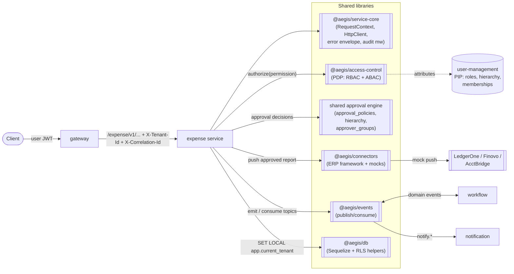
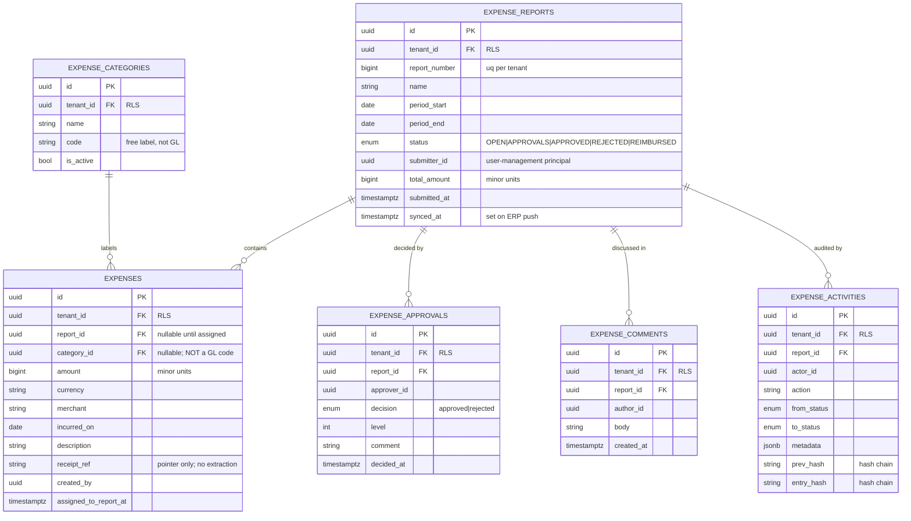
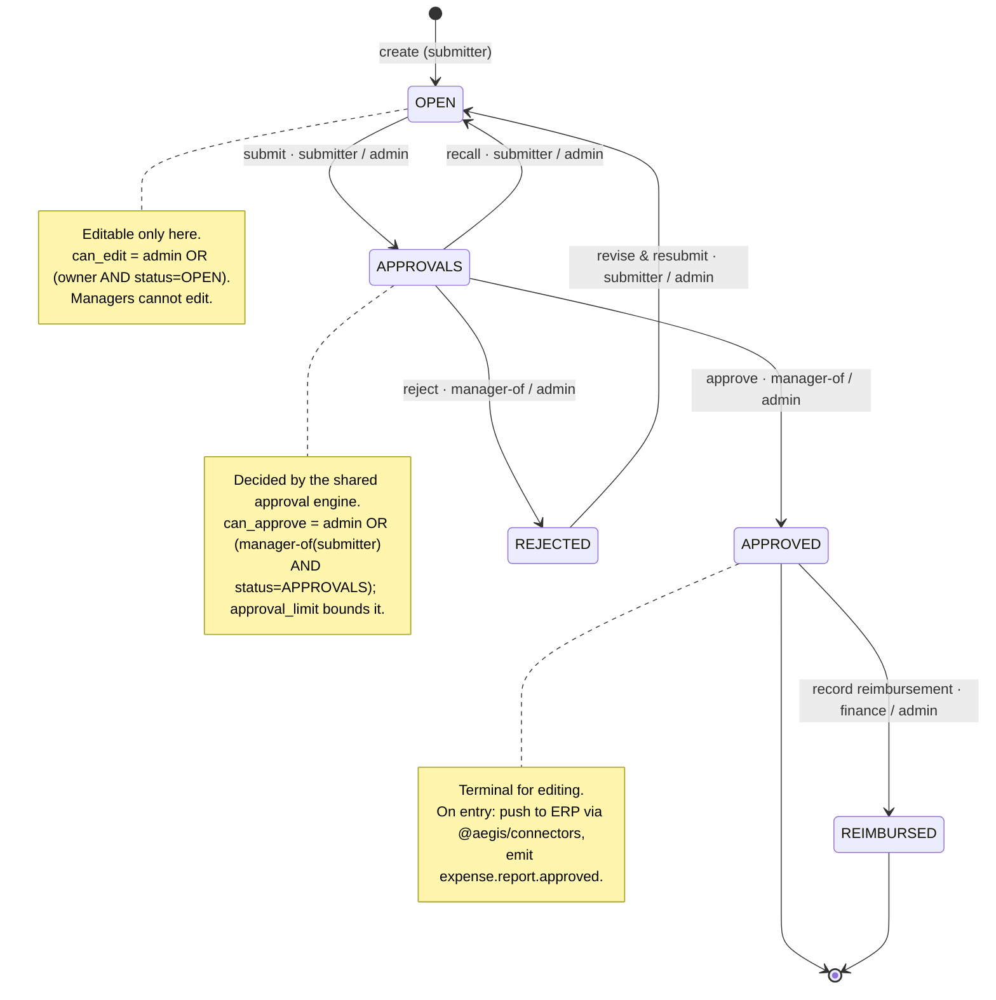
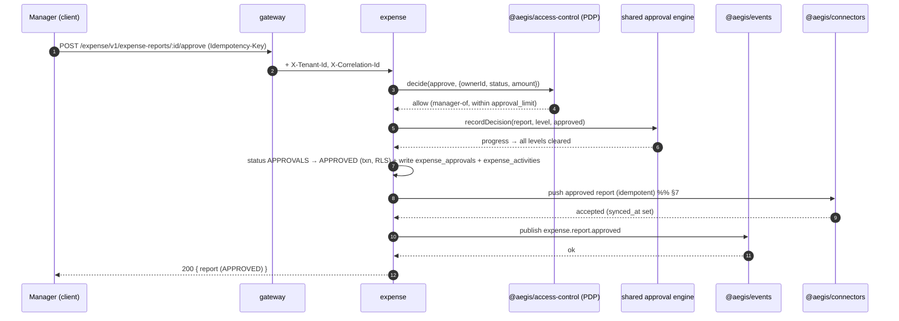

# expense — Service Design

> Expense reports and the user-entered items under them, with a role-keyed approval
> state machine, multi-level approval through the shared approval engine, receipt
> pointers (no extraction), and ERP push of approved reports through
> [`@aegis/connectors`](connectors.md). Ported from a Python/FastAPI reference into
> Node/TS, re-platformed onto the same JWT + PDP + Postgres-RLS substrate as every
> other Aegis service.
>
> **Authoritative scope:** [`../../SPEC.md`](../../SPEC.md) §5, **§10.1**, **§10.3**.
> Per §10.1 this service has **NO GL codes** and **NO document-extracted line items** —
> an `expense` row is a _user-entered_ item under a report, not an OCR line item, and
> there is no 3-way line matching.
>
> Related: [`../03-access-control-model.md`](../03-access-control-model.md) ·
> [`../04-multi-tenancy.md`](../04-multi-tenancy.md) ·
> [`../05-authn-authz-flow.md`](../05-authn-authz-flow.md) ·
> [`../06-service-to-service.md`](../06-service-to-service.md) ·
> [`../07-data-models.md`](../07-data-models.md) ·
> [`../08-api-conventions.md`](../08-api-conventions.md) ·
> sibling services [`invoice.md`](invoice.md) · [`payroll.md`](payroll.md) ·
> [`workflow.md`](workflow.md) · [`notification.md`](notification.md) ·
> [`connectors.md`](connectors.md).

---

## 1. Responsibility

`expense` owns the **expense-reimbursement domain** for every tenant on the platform:

- **Expense reports** — a named, dated container with a lifecycle status, a per-tenant
  sequential `report_number`, a denormalized `total_amount`, and a submitter.
- **Expenses** — the user-entered items inside a report (amount, merchant, date,
  description, optional category, optional receipt **pointer**). Not extracted, not GL-coded.
- **Expense categories** — a tenant-scoped, human-curated label set (e.g. _Travel_,
  _Meals_, _Software_) for classifying expenses. **Not** GL codes — purely a reporting/UX
  label with no chart-of-accounts semantics.
- **Approvals** — the role-keyed status state machine (OPEN → APPROVALS →
  APPROVED/REJECTED → REIMBURSED) plus the decision records that back it, driven by the
  shared approval engine (§6).
- **Comments & activities** — a per-report discussion thread (`expense_comments`) and an
  append-only audit feed (`expense_activities`).
- **ERP push** — on approval, an approved report is staged for the workflow connector
  worker, which pushes to the tenant's accounting system of record through the pluggable
  [`@aegis/connectors`](connectors.md) framework (mock connectors `LedgerOne` / `Finovo`
  / `AcctBridge` ship by default).

### What it is explicitly NOT (scope guardrails)

| Out of scope                                     | Why                                                                                                                                                                                    |
| ------------------------------------------------ | -------------------------------------------------------------------------------------------------------------------------------------------------------------------------------------- |
| **GL codes / chart-of-accounts mapping**         | Removed platform-wide by [`SPEC.md`](../../SPEC.md) §10.1. Categories are labels, not accounts.                                                                                        |
| **Document-extracted line items / OCR**          | No extraction pipeline exists (§10.1). A receipt is a _pointer_ (`receipt_ref`); the file is never parsed into structured lines.                                                       |
| **3-way line matching**                          | A line-item concept; out of scope. Header-level reconciliation lives in [`invoice.md`](invoice.md).                                                                                    |
| **Minting its own tokens / its own identity DB** | The Python reference ran its own dual-DB + HS256 secret. Aegis centralizes identity in `user-management`; `expense` consumes the **same platform JWT** and asks the **same PDP** (§4). |
| **Its own tenant model**                         | The reference used a `/{company_id}` path segment enforced in code. Aegis uses ambient `tenant_id` + **Postgres RLS** (§3) — there is no tenant path segment.                          |

> **Porting note.** The reference service (`expense-app`, Python/FastAPI) was a sibling of
> a different platform with a read-only "Core" identity DB, an HS256 Core JWT validated
> against a live `user_session_tokens` table, lazy local-principal provisioning, and a
> `/{company_id}` path tenant. Aegis keeps the **domain** (report/expense model, the
> role-keyed transition maps, per-tenant sequential numbering, receipt-pointer + ERP push)
> and discards the **infrastructure** (own JWT secret, own identity DB, path tenant) in
> favor of the platform JWT, the central [PDP](../03-access-control-model.md), and
> RLS-backed tenant isolation. Two foot-guns in the reference are fixed in the port: the
> duplicate `ExpenseReportStatus` enums (uppercase model vs lowercase filter constants) are
> collapsed into one canonical enum in `@aegis/shared-enums`, and the unbound path-tenant
> is replaced by RLS so a request can never address a tenant the principal is not a member of.

---

## 2. Place in the platform



`expense` is a standard Aegis deployable: Express + InversifyJS, the
controllers/services/repositories/models layering, Joi validators, the central error
middleware, and the `authenticate → authorize(permission) → handler` chain on every
route (see [`../02-patterns.md`](../02-patterns.md) and
[`../08-api-conventions.md`](../08-api-conventions.md)). It shares
[`@aegis/service-core`](../research/service-core.md) and
[`@aegis/access-control`](../03-access-control-model.md), enforces tenant RLS via
[`@aegis/db`](../04-multi-tenancy.md), and runs from the single multi-purpose image with
`PROCESS_TYPE=api`.

---

## 3. Domain model

All tables are **tenant-scoped** (`tenant_id UUID NOT NULL`) with a `RESTRICTIVE`,
`FORCE`-d RLS policy keyed on `app.current_tenant`; the app DB role is a non-owner without
`BYPASSRLS` (see [`../04-multi-tenancy.md`](../04-multi-tenancy.md)). PKs are UUID v4,
money is integer **minor units** (cents), timestamps are `created_at` / `updated_at`
(`underscored: true`). Table names come from the `TableName` enum.

| Table                | Purpose                                     | Key columns                                                                                                                                                                                                         |
| -------------------- | ------------------------------------------- | ------------------------------------------------------------------------------------------------------------------------------------------------------------------------------------------------------------------- |
| `expense_reports`    | The report container + status state machine | `id`, `tenant_id`, `report_number` (per-tenant unique), `name`, `period_start`, `period_end`, `status`, `submitter_id`, `team_id`, `assignee_id`, denormalized `tags`, `total_amount`, `submitted_at`, `synced_at`  |
| `expenses`           | User-entered items under a report           | `id`, `tenant_id`, `report_id` (nullable until assigned), `category_id` (nullable), `amount`, `currency`, `merchant`, `incurred_on`, `description`, `receipt_ref` (nullable), `created_by`, `assigned_to_report_at` |
| `expense_categories` | Tenant label set (NOT GL codes)             | `id`, `tenant_id`, `name`, `code` (free label), `is_active`, unique `(tenant_id, code)`                                                                                                                             |
| `expense_approvals`  | Decision records backing the state machine  | `id`, `tenant_id`, `report_id`, `approver_id`, `decision` (`approved`/`rejected`), `level`, `comment`, `decided_at`                                                                                                 |
| `expense_comments`   | Per-report discussion thread                | `id`, `tenant_id`, `report_id`, `author_id`, `body`, `created_at`                                                                                                                                                   |
| `expense_activities` | Append-only audit feed (hash-chained)       | `id`, `tenant_id`, `report_id`, `actor_id`, `action`, `from_status`, `to_status`, `metadata` (jsonb), `prev_hash`, `entry_hash`                                                                                     |

> **No `expense_gl_codes`, no `expense_gl_code_mappings`, no `expense_class_mappings`, no
> line-item table, no extraction/integration-step tables** — all removed per §10.1. The
> reference's `expense_external_integrations` / `expense_integration_steps` are replaced by
> the connector framework's own idempotent push log (see [`connectors.md`](connectors.md)),
> not duplicated here.

### 3.1 ER diagram



The `expense_activities` table participates in the platform's hybrid, hash-chained audit
model (see [`../10-auditability-and-compliance.md`](../10-auditability-and-compliance.md)):
each row carries `prev_hash`/`entry_hash` so the report's history is tamper-evident, and the
generic platform `audit_log` additionally records the PDP decision (allow/deny, reason,
permissions-at-time-of-action) for every guarded write.

### 3.2 The status enum (single source of truth)

```ts
// libs/shared/enums/src/expense.enum.ts
export enum ExpenseReportStatus {
  Open = 'OPEN', // draft; submitter is editing items
  Approvals = 'APPROVALS', // submitted; in the approval chain
  Approved = 'APPROVED', // fully approved (terminal for editing)
  Rejected = 'REJECTED', // sent back / declined
  Reimbursed = 'REIMBURSED', // payment recorded after approval
}

export const ExpenseReportStatusDisplay: Record<ExpenseReportStatus, string> = {
  [ExpenseReportStatus.Open]: 'Open',
  [ExpenseReportStatus.Approvals]: 'In approvals',
  [ExpenseReportStatus.Approved]: 'Approved',
  [ExpenseReportStatus.Rejected]: 'Rejected',
  [ExpenseReportStatus.Reimbursed]: 'Reimbursed',
};
```

> One canonical enum (uppercase values), one `*Display` map for UI — collapsing the
> reference's dual-enum foot-gun. Filters and writes both use this enum.

---

## 4. Access control (owner / manager / admin)

`expense` uses the **same platform JWT and the same PDP** as every other service. There is
no service-local identity store, no second token, and no path-tenant. The user JWT is
minted by `user-management`, validated at the [gateway](gateway.md) and re-validated
per-service via JWKS ([`../05-authn-authz-flow.md`](../05-authn-authz-flow.md)); the PEP
guard in front of every route calls
[`@aegis/access-control`](../03-access-control-model.md)'s `decide(...)`.

### 4.1 Permission vocabulary (dotted `domain.action`)

Permissions live in the catalog and are assigned to roles via `role_permissions` (the PAP
in `user-management`). The `expense` domain contributes:

| Permission                                            | Granted to (system roles)                       |
| ----------------------------------------------------- | ----------------------------------------------- |
| `expense.report.read`                                 | submitter (own), manager (reports), admin (all) |
| `expense.report.create`                               | submitter, manager, admin                       |
| `expense.report.edit`                                 | submitter (own, while editable), admin          |
| `expense.report.submit`                               | submitter (own), admin                          |
| `expense.report.approve`                              | manager (of submitter), admin                   |
| `expense.report.reject`                               | manager (of submitter), admin                   |
| `expense.report.reimburse`                            | admin (or a dedicated `finance` role)           |
| `expense.report.push`                                 | admin / system (ERP push; usually automatic)    |
| `expense.item.read` / `.create` / `.edit` / `.delete` | scoped like the parent report                   |
| `expense.comment.read` / `.create`                    | anyone who can view the report                  |
| `expense.category.read`                               | all members                                     |
| `expense.category.manage`                             | admin                                           |

### 4.2 RBAC core → ABAC refinement → row scope

The decision is the standard three-stage Aegis evaluation
([`../03-access-control-model.md`](../03-access-control-model.md)):

1. **RBAC** — does the principal's role grant the bare `expense.*` action? Fast cached
   `role → permissions` lookup.
2. **ABAC** — refine with attributes the **PIP** supplies from `user-management`:
   - **owner** — `report.submitter_id === principal.userId`.
   - **manager-of** — the principal is the submitter's manager in `user_hierarchy`
     (`manager_id`), optionally bounded by `approval_limit` vs `report.total_amount`.
   - **admin** — the principal holds the tenant `admin` role.
   - **status** — e.g. _edit_ is only allowed while `status = OPEN`; _approve_ only while
     `status = APPROVALS`.
3. **Row scope** — list endpoints compile a predicate (`AllRecords` for admin,
   `OwnAndTeam`/subordinates for manager, `OwnOnly` for submitter) **and** the query runs
   under RLS keyed on `app.current_tenant`, so cross-tenant rows are unreachable even if a
   predicate is wrong (belt-and-suspenders).

### 4.3 The `can_view` / `can_edit` / `can_approve` predicates

These are the three load-bearing report predicates the PDP resolves (ported faithfully from
the reference's `AuthorizationService`, now expressed as ABAC conditions):

| Predicate     | Allowed when                                                        | Notes                                                                                                                                                                                   |
| ------------- | ------------------------------------------------------------------- | --------------------------------------------------------------------------------------------------------------------------------------------------------------------------------------- |
| `can_view`    | `admin` **OR** `owner` **OR** `manager-of(submitter)`               | Managers can see their reports' reports and their subordinates'.                                                                                                                        |
| `can_edit`    | `admin` **OR** (`owner` **AND** `status = OPEN`)                    | **Managers cannot edit** — editing is the submitter's right while the report is open.                                                                                                   |
| `can_approve` | `admin` **OR** `manager-of(submitter)` **AND** `status = APPROVALS` | A self-manager (e.g. a CEO who is their own manager) may approve their own report; this is the only owner-approves-self path. `approval_limit` (if set) bounds the manager's authority. |

```ts
// apps/expense/src/services/expense-report.service.ts  (illustrative)
async assertCanApprove(report: ExpenseReport): Promise<void> {
  const decision = await this.pdp.decide(
    this.ctx.principal(),                       // sub, tenantId, roles (from JWT)
    PermissionKey.ExpenseReportApprove,         // 'expense.report.approve'
    {
      kind: ResourceKind.ExpenseReport,
      id: report.id,
      ownerId: report.submitterId,
      status: report.status,
      amount: report.totalAmount,
    },
    this.ctx.environment(),                     // time, ip, correlationId
  );
  if (!decision.allow) {
    throw ErrorUtils.forbidden('EXPENSE_APPROVE_DENIED', decision.reason);
  }
}
```

The guard is wired declaratively on the route; the resource loader fetches the report so the
PDP has its attributes:

```ts
@httpPost('/:id/approve',
  authenticate(),
  authorize(PermissionKey.ExpenseReportApprove, {
    resourceLoader: (req) => reportRepo.byId(req.params.id),
  }),
)
async approve(@requestParam('id') id: string, @requestBody() body: ApproveDto) { /* ... */ }
```

> Because tenant is ambient (RLS) and the principal comes from the validated JWT, an
> attacker cannot probe another tenant's reports by guessing IDs — the row is invisible
> under `app.current_tenant`, and the PDP additionally fails closed.

---

## 5. Status state machine (role-keyed transitions)

The report lifecycle is **OPEN → APPROVALS → APPROVED / REJECTED → REIMBURSED**. Two
forces drive it: ordinary **status transitions** are gated by role-keyed transition maps,
and **approval/rejection** decisions are delegated to the shared approval engine (§6).
`APPROVED` is terminal for editing; `admin` bypasses the role maps but still passes the PDP
and emits audit.

### 5.1 Role-keyed transition maps

```ts
// apps/expense/src/constants/expense-report.constants.ts
export class ExpenseReportTransitions {
  // The submitter advances their own report and can pull it back.
  static readonly SUBMITTER: Partial<Record<ExpenseReportStatus, ExpenseReportStatus[]>> = {
    [ExpenseReportStatus.Open]: [ExpenseReportStatus.Approvals], // submit
    [ExpenseReportStatus.Approvals]: [ExpenseReportStatus.Open], // recall
    [ExpenseReportStatus.Rejected]: [ExpenseReportStatus.Open], // revise & resubmit
  };

  // The manager decides on a report that is in the approval chain.
  static readonly MANAGER: Partial<Record<ExpenseReportStatus, ExpenseReportStatus[]>> = {
    [ExpenseReportStatus.Approvals]: [ExpenseReportStatus.Approved, ExpenseReportStatus.Rejected],
  };

  // Finance/admin records reimbursement after approval.
  static readonly FINANCE: Partial<Record<ExpenseReportStatus, ExpenseReportStatus[]>> = {
    [ExpenseReportStatus.Approved]: [ExpenseReportStatus.Reimbursed],
  };
}
```

Validation rules enforced by `_validateStatusTransition`:

- `same → same` is rejected (no-op transitions are a `409`).
- `APPROVED` is terminal for the submitter/manager maps; only the finance map's
  `APPROVED → REIMBURSED` edge leaves it.
- The transition map chosen is keyed by the principal's **effective role for this report**
  (submitter / manager-of-submitter / finance), resolved from the PIP.
- `admin` may take any structurally valid edge (bypasses the role keying) but never skips
  the PDP or the audit write.

### 5.2 Role-keyed state diagram



Legend — the actor after `·` is the role permitted to take that edge: **submitter**
(report owner), **manager** (`manager-of(submitter)`), **finance** (reimbursement role),
**admin** (bypasses role keying, still PDP-checked + audited).

---

## 6. Approval via the shared approval engine

`expense` does not hand-roll its approval chain. When a report enters `APPROVALS`, it binds
to the **shared approval engine** ([`SPEC.md`](../../SPEC.md) §5, the `approval_*` tables —
also used by [`invoice`](invoice.md) and [`payroll`](payroll.md)). The engine resolves
_who must approve, in what order, with what thresholds_:

- **`approval_policies`** — per-tenant policy selecting the chain for a report (e.g. by
  amount band or category).
- **`approval_hierarchy(level)`** — the ordered levels a report must clear.
- **`approver_groups` / `approver_group_members(user|role|team|persona)`** — who can act at
  each level (the submitter's _manager_ persona resolves through `user_hierarchy`).
- **`record_approvers(threshold)`** — binds a specific report to its required approvers,
  carrying the `threshold` (e.g. amounts above a limit require an extra level).
- **`approvals` / `approval_progress_log`** — the decisions and the per-step progress trail.

Flow when a manager approves:



When not all levels are cleared, the report stays in `APPROVALS` and `approval_progress_log`
records the partial progress; the engine notifies the next approver via the `notification`
service (an event, never a re-derivation of authority — see
[`notification.md`](notification.md)). The whole transition (status change + decision row +
activity row) runs in **one transaction** under `SET LOCAL app.current_tenant`.

---

## 7. Receipts (pointer, no extraction)

A receipt is a **pointer**, never parsed content. `expenses.receipt_ref` holds an opaque
reference to a blob in the platform's object store (an S3-style key resolved to a short-lived
presigned URL on demand). The service:

- **Stores** only the reference + minimal metadata (`file_name`, content type) — no OCR, no
  structured line extraction, no GL inference (§10.1).
- **Resolves** the pointer to a presigned URL when a client with `can_view` requests the
  receipt; the URL is time-boxed and tenant-scoped.
- **Forwards** the pointer (not the bytes) in the ERP push payload (§8) so the accounting
  system can attach it.

This is a deliberate simplification of the reference's document-store + presign coupling:
the _pointer-and-presign_ pattern is kept; the extraction/branding is dropped.

---

## 8. ERP push of approved reports (`@aegis/connectors`)

On `APPROVED`, expense stages a `connector.push.requested` event inside the same database
transaction as the status transition. The workflow worker consumes that event and pushes to the
tenant's configured connector through the pluggable **[`@aegis/connectors`](connectors.md)**
framework — **not** an ad-hoc sync and not an inline ERP call from the finance request path.

```ts
makeEnvelope(EventTopic.ConnectorPushRequested, {
  connectorKind: ConnectorKind.LedgerOne,
  entity: ConnectorEntity.Expense,
  idempotencyKey: report.id,
  recordType: ApprovalRecordType.ExpenseReport,
  recordId: report.id,
  ruleId: 'expense.approve',
  data: {
    reportId: report.id,
    reportNumber: Number(report.report_number),
    name: report.name,
    currency: report.currency,
    totalAmount: Number(report.total_amount),
    items: expenses.map((e) => ({
      amount: Number(e.amount),
      currency: e.currency,
      merchant: e.merchant,
      incurredOn: e.incurred_on,
      categoryId: e.category_id,
      receiptRef: e.receipt_ref,
    })),
  },
});
```

Key properties:

- **Idempotency** — every push carries an idempotency key (`report.id`), so retries are
  safe; the connector framework dedupes through `connector_sync_state`.
- **Auth & context** — the push travels over the service-to-service path
  ([`../06-service-to-service.md`](../06-service-to-service.md)): internal JWT,
  `X-Internal-Origin` gate, `X-Source-Service`, `X-Correlation-Id` propagated; the
  connector's own outbound credential is per-connector (there is no `X-Trend` header).
- **No swallowed failures** — a failed push is retried/DLQ'd by the event pipeline and
  recorded in `connector_sync_state`; `synced_at` is not yet stamped from terminal connector
  status.

See [`connectors.md`](connectors.md) for the connector interface, the registry, and how a
new ERP is added by writing one adapter.

---

## 9. Events (`@aegis/events`)

`expense` publishes and consumes through the platform event bus (topic enum → handler,
inline-when-sync / queue-when-async, transactional-outbox semantics — see
[`SPEC.md`](../../SPEC.md) §1). Events carry the propagated `X-Correlation-Id` so the whole
business operation stitches together across services.

### 9.1 Published

| Topic                        | When                          | Primary consumers                                |
| ---------------------------- | ----------------------------- | ------------------------------------------------ |
| `expense.report.created`     | A report is created           | reporting (fact load), workflow                  |
| `expense.report.submitted`   | `OPEN → APPROVALS`            | workflow (route to approvers), notification      |
| `expense.report.approved`    | Fully approved (`→ APPROVED`) | connectors push trigger, reporting, notification |
| `expense.report.rejected`    | `→ REJECTED`                  | notification (notify submitter), reporting       |
| `expense.report.reimbursed`  | `APPROVED → REIMBURSED`       | reporting (ledger fact), notification            |
| `expense.report.push.failed` | ERP push failed               | notification, monitoring                         |
| `expense.comment.created`    | A comment is added            | notification (mention/participant fan-out)       |

### 9.2 Consumed

| Topic                         | From       | Effect                                                                                             |
| ----------------------------- | ---------- | -------------------------------------------------------------------------------------------------- |
| `workflow.action.expense.*`   | workflow   | Rules-as-data actions (e.g. auto-reject stale `OPEN` reports, escalate an overdue approval level). |
| `connector.push.acknowledged` | connectors | Confirms ERP acceptance → set/clear `synced_at`, optionally advance toward reimbursement.          |

> `expense` never re-derives authority from a consumed event — events arrive
> already-authorized, mirroring the platform rule that consumers trust the producer's PDP
> decision (see [`notification.md`](notification.md) and
> [`../03-access-control-model.md`](../03-access-control-model.md)).

---

## 10. HTTP endpoints

All routes are mounted under `/expense/v1`, wrapped
`authenticate → authorize(permission) → handler`, return the standard envelope, and use the
`{ data, meta }` list shape ([`../08-api-conventions.md`](../08-api-conventions.md)). State
transitions are **POST action sub-resources** (one permission each), not `PATCH {status}`.
Money/state writes require `Idempotency-Key`. **Tenant is ambient** (context + RLS) — there
is no tenant path segment.

### 10.1 Reports

| Method + path                                    | Permission                 | Notes                                                                                                |
| ------------------------------------------------ | -------------------------- | ---------------------------------------------------------------------------------------------------- |
| `POST /expense/v1/expense-reports`               | `expense.report.create`    | Creates an `OPEN` report; assigns the per-tenant `report_number`.                                    |
| `GET /expense/v1/expense-reports/:id`            | `expense.report.read`      | PDP `can_view`; 404 if RLS-invisible.                                                                |
| `GET /expense/v1/expense-reports`                | `expense.report.read`      | Row-scoped list (`{ data, meta }`); filters include `status`, `tag`, `team`, `assignee`, `tagMatch`. |
| `POST /expense/v1/expense-reports/search`        | `expense.report.read`      | Read-only rich filter body (operators + paging).                                                     |
| `PATCH /expense/v1/expense-reports/:id`          | `expense.report.edit`      | `can_edit` (owner + `OPEN`, or admin).                                                               |
| `POST /expense/v1/expense-reports/:id/submit`    | `expense.report.submit`    | `OPEN → APPROVALS`; binds approval engine.                                                           |
| `POST /expense/v1/expense-reports/:id/recall`    | `expense.report.submit`    | `APPROVALS → OPEN` (submitter).                                                                      |
| `POST /expense/v1/expense-reports/:id/approve`   | `expense.report.approve`   | Records decision via approval engine; may reach `APPROVED`.                                          |
| `POST /expense/v1/expense-reports/:id/reject`    | `expense.report.reject`    | `APPROVALS → REJECTED`.                                                                              |
| `POST /expense/v1/expense-reports/:id/reimburse` | `expense.report.reimburse` | `APPROVED → REIMBURSED`.                                                                             |

### 10.2 Items, categories, comments

| Method + path                                          | Permission                |
| ------------------------------------------------------ | ------------------------- |
| `POST /expense/v1/expenses`                            | `expense.item.create`     |
| `PATCH /expense/v1/expenses/:id`                       | `expense.item.edit`       |
| `DELETE /expense/v1/expenses/:id`                      | `expense.item.delete`     |
| `POST /expense/v1/expense-reports/:id/items` (attach)  | `expense.item.edit`       |
| `GET /expense/v1/expenses/:id/receipt` (presigned URL) | `expense.item.read`       |
| `GET /expense/v1/expense-categories`                   | `expense.category.read`   |
| `POST /expense/v1/expense-categories`                  | `expense.category.manage` |
| `GET /expense/v1/expense-reports/:id/comments`         | `expense.comment.read`    |
| `POST /expense/v1/expense-reports/:id/comments`        | `expense.comment.create`  |
| `GET /expense/v1/expense-reports/:id/activities`       | `expense.report.read`     |
| `GET /health` (+ `?details=true`)                      | _(unauthenticated)_       |

### 10.3 Example — submit a report

```http
POST /expense/v1/expense-reports/8f3a.../submit HTTP/1.1
Authorization: Bearer <user JWT>
X-Correlation-Id: 6b1e...
Idempotency-Key: submit-8f3a-01
Content-Type: application/json

{ "note": "Q2 travel — ready for review" }
```

```json
{
  "data": {
    "id": "8f3a...",
    "reportNumber": 1042,
    "name": "Q2 Travel",
    "status": "APPROVALS",
    "totalAmount": 184350,
    "currency": "USD",
    "submitterId": "u-77...",
    "submittedAt": "2026-06-26T14:02:11Z"
  }
}
```

### 10.4 Example — error envelope (deny)

A submitter trying to approve their own (non-self-managed) report is failed closed by the
PDP, surfaced through the central error middleware as the standard envelope:

```json
{
  "errors": [
    {
      "code": "EXPENSE_APPROVE_DENIED",
      "type": "forbidden",
      "message": "Principal may not approve this expense report.",
      "details": { "reason": "not_manager_of_submitter", "status": "APPROVALS" },
      "traceId": "6b1e..."
    }
  ]
}
```

---

## 11. Internal structure (per-service layout)

Standard Aegis layering ([`../02-patterns.md`](../02-patterns.md)); `apps/expense/src`:

```
controllers/   ExpenseReportController, ExpenseItemController, ExpenseCategoryController,
               ExpenseCommentController   (@controller + @httpGet/Post/Patch/Delete)
services/      ExpenseReportService (state machine), ExpenseItemService,
               ExpenseApprovalService (approval-engine binding), ExpenseErpService (push),
               ExpenseCategoryService, ExpenseCommentService, ExpenseActivityService
repositories/  ExpenseReportRepository, ExpenseRepository, ExpenseApprovalRepository,
               ExpenseCategoryRepository, ExpenseCommentRepository, ExpenseActivityRepository
               (Sequelize via DatabaseContext; tenant from RequestContext; RLS per-txn)
models/        ExpenseReport, Expense, ExpenseCategory, ExpenseApproval,
               ExpenseComment, ExpenseActivity   (registered into @aegis/db)
interfaces/    pure TS contracts (typing only)
validators/    Joi schemas (create/patch report, create item, transition bodies, search filter)
constants/     ExpenseReportTransitions, permission keys, table-name references
ioc/           Inversify container + provideSingleton loader
bootstrap.ts   composition root; index.ts thin entry
```

Every transition service method follows the same shape: **load (RLS) → PDP guard → validate
transition map → mutate + write `expense_approvals`/`expense_activities` in one txn → publish
event(s) → (on `APPROVED`) push via connectors**.

---

## 12. Definition of Done (this service)

Per [`../../AGENTS.md`](../../AGENTS.md) §8, `expense` is done when it:

- [x] shares `@aegis/service-core` + `@aegis/access-control` (same JWT + PDP as all services);
- [x] enforces tenant isolation via Postgres **RLS** (`SET LOCAL app.current_tenant` per txn);
- [x] has a PEP `authorize(permission, …)` on **every** route (only `/health` is open);
- [x] emits **hash-chained audit** (`expense_activities`) + platform `audit_log` on writes;
- [x] models the report lifecycle with **role-keyed transition maps** + the shared approval engine;
- [x] keeps receipts as **pointers** (no extraction) and pushes approved reports via
      **`@aegis/connectors`** (mock) — **no GL codes, no line items** (§10.1);
- [ ] has unit tests above the coverage gate (state-machine edges, PDP predicates, push idempotency);
- [x] has this up-to-date `docs/services/expense.md`.
