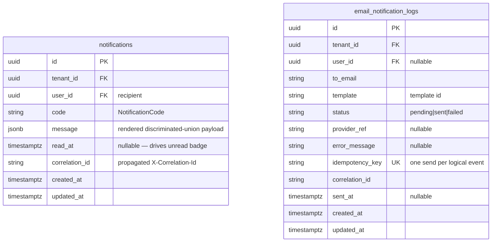
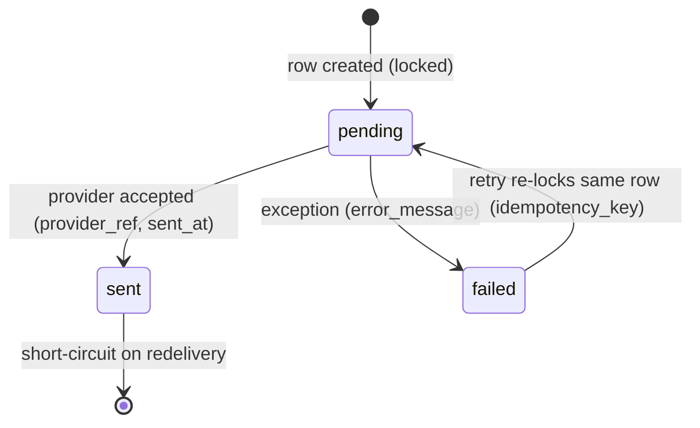

# notification — service guide

> The platform's outbound communication service: two channels (**in-app** and **email**),
> driven entirely by **already-authorized domain events**. It is the canonical
> demonstration of the **anti-ambient-authority** rule: notification **never re-derives
> authority** — it requires a *propagated, verified* user/tenant context and refuses to
> act without one.

**Reads alongside:** [`SPEC.md`](../../SPEC.md) §0–§2 (esp. §2.5 — *"notification: consumes
already-authorized events; never re-derives authority"*) and §10 (Amendments).
**Siblings:** [`03-access-control-model.md`](../03-access-control-model.md) ·
[`06-service-to-service.md`](../06-service-to-service.md) (context propagation,
`X-Correlation-Id`, `EventTopic`) · [`07-data-models.md`](../07-data-models.md#7-notification)
(table shapes) · [`02-patterns.md`](../02-patterns.md#9-event-bus--publishconsume--transactional-outbox)
(event bus + outbox + worker context).

---

## 1. Responsibility

notification is a **leaf service**. It does **not** originate business decisions; it
*reacts* to domain events that other services have already authorized and committed, and
renders them into recipient-facing messages on two channels:

| Channel | Backing store | Mechanism |
|---|---|---|
| **In-app** | `notifications` table | Row insert per recipient + a `notification.requested` topic publish/consume; an unread badge is driven by `read_at`. |
| **Email** | `email_notification_logs` table | Templated send through a pluggable email provider, with an idempotent, status-tracked log row per logical event. |

Current template implementation: `apps/notification/src/templates/` is the versioned mail catalog:
each consumed template lives in its own `*.template.ts` file and is exported through
`mail-templates.ts`. Each template has a subject, text body, and HTML body; the `TemplateEngine`
interpolates all three and `EmailSenderService` passes `RenderedContent.html` to the Nodemailer
provider. The current consumed codes are expense approved/rejected, invoice approved, approval
requested, pay-run approved, and generic workflow rule notice.

Recipient resolution is now backed by user-management's internal service-to-service directory:
`GET /user-management/internal/users/:id/contact` resolves bare user-id hints, and
`GET /user-management/internal/recipients` resolves role/team/tenant-admin audiences. Those routes are
guarded by the internal JWT/origin lane and run under tenant RLS, so notification can fan out emails
without learning user-management's table structure or re-deriving authorization.

What it explicitly is **not** responsible for:

- **Authorization.** It does not decide *whether* a recipient is allowed to receive a
  notification — the *producing* service already enforced its PEP `authorize(...)` guard
  before emitting the event. notification trusts the **propagated verified context**
  (see §6) and renders.
- **Routing policy.** Approval routing, escalation, and "who approves what" live in
  **workflow** + the shared approval engine. notification only learns the *outcome*
  (e.g. `approval.requested`, `approval.decided`).
- **Provider secrets.** No SMTP/API credential is stored in this service. Outbound email
  auth is brokered via the cloud key-proxy pattern (SPEC §1), so a leaked notification DB
  row cannot send mail.

Within the platform's access-control story, notification is the **negative space**: it
proves that downstream services are *consumers* of authority, not re-deriving it. That is
the entire point of the section below on ambient authority (§6).

---

## 2. Data model (recap)

The authoritative ER definition lives in
[`07-data-models.md` §7](../07-data-models.md#7-notification). Summarized here for context:



Both tables are tenant-scoped (`tenant_id NOT NULL` + RLS — see
[`04-multi-tenancy.md`](../04-multi-tenancy.md)). `email_notification_logs.idempotency_key`
is `UNIQUE` — the linchpin of exactly-once email (§5).

---

## 3. The typed message: a discriminated union keyed by `NotificationCode`

A notification's payload is **not** a free-form blob. It is a TypeScript discriminated
union, narrowed by a `NotificationCode` enum, so that every code carries exactly the data
its templates need — a payload-shape change is a **compile-time break**, not a runtime
surprise.

```ts
// libs/shared/enums/src/notification.enum.ts
export enum NotificationCode {
  ExpenseReportSubmitted = 'expense.report.submitted',
  ApprovalRequested      = 'approval.requested',
  ApprovalDecided        = 'approval.decided',
  InvoiceApprovalRequired = 'invoice.approval.required',
  PayslipAvailable       = 'payroll.payslip.available',
  ReportExportReady      = 'reporting.export.ready',
}

// Parallel *Display map idiom (shared-enums convention)
export const NotificationCodeDisplay: Record<NotificationCode, string> = {
  [NotificationCode.ExpenseReportSubmitted]:  'Expense report submitted',
  [NotificationCode.ApprovalRequested]:       'Approval requested',
  [NotificationCode.ApprovalDecided]:         'Approval decided',
  [NotificationCode.InvoiceApprovalRequired]: 'Invoice needs approval',
  [NotificationCode.PayslipAvailable]:        'Payslip available',
  [NotificationCode.ReportExportReady]:       'Report export ready',
};

// Channels the dispatcher can fan out to.
export enum NotificationChannel { InApp = 'in_app', Email = 'email' }
```

```ts
// libs/shared/types/src/notification.shape.ts
export namespace NotificationShape {
  // One variant per code — the union is exhaustive and self-documenting.
  export interface ExpenseReportSubmittedMsg {
    code: NotificationCode.ExpenseReportSubmitted;
    reportId: string;
    submittedBy: string;
    amountMinor: number;          // money is always integer minor units (SPEC §9)
  }
  export interface ApprovalRequestedMsg {
    code: NotificationCode.ApprovalRequested;
    approvalId: string;
    subjectType: 'expense_report' | 'invoice';
    subjectId: string;
    requestedBy: string;
  }
  export interface ApprovalDecidedMsg {
    code: NotificationCode.ApprovalDecided;
    approvalId: string;
    subjectType: 'expense_report' | 'invoice';
    subjectId: string;
    decision: 'approved' | 'rejected';
    decidedBy: string;
  }
  export interface InvoiceApprovalRequiredMsg {
    code: NotificationCode.InvoiceApprovalRequired;
    invoiceId: string;
    vendorName: string;
    amountMinor: number;          // HEADER-LEVEL amount — no line items (SPEC §10.1)
    poReference?: string;         // optional PO ref; matching is header-level only
  }
  export interface PayslipAvailableMsg {
    code: NotificationCode.PayslipAvailable;
    payslipId: string;
    payRunId: string;
    // NOTE: never carries salary/bank/national-id — those stay encrypted in payroll.
  }
  export interface ReportExportReadyMsg {
    code: NotificationCode.ReportExportReady;
    reportRunId: string;
    artifactUrl: string;
  }

  export type Message =
    | ExpenseReportSubmittedMsg
    | ApprovalRequestedMsg
    | ApprovalDecidedMsg
    | InvoiceApprovalRequiredMsg
    | PayslipAvailableMsg
    | ReportExportReadyMsg;

  export type Recipient = { userId: string; toEmail?: string; channels: NotificationChannel[] };
}
```

The `message` JSONB column on `notifications` stores the **rendered** variant; the union's
`code` field is mirrored into the `code` column so in-app queries can filter by type
without parsing JSON.

> **Scope guardrails baked into the shapes.** Invoice variants are **header-level** —
> `amountMinor` + an optional `poReference`, with **no GL codes and no document-extracted
> line items** (SPEC §10.1). Payroll variants deliberately omit any sensitive field; the
> payslip message is a pointer (`payslipId`), not the figures.

---

## 4. Message → channel content mapping (code → subject / body / sms)

A single **content-mapping layer** turns a typed `Message` into channel-specific content.
Keeping subject/body/sms tables in one place (keyed by `NotificationCode`) means a copy
change is one edit and channels stay consistent. This mirrors the donor's
`message-to-*-map` pattern, de-branded.

```ts
// apps/notification/src/services/content-map.ts
import { NotificationCode, NotificationShape } from '@aegis/shared-enums';

export interface RenderedContent {
  subject: string;   // email subject + in-app title
  body: string;      // email/in-app body (templated)
  sms?: string;      // optional terse SMS variant (future channel)
  template: string;  // email template id resolved per code
}

type Renderer<M extends NotificationShape.Message> = (m: M) => RenderedContent;

// One renderer per code — exhaustive over the union (compiler enforces coverage).
const RENDERERS: { [C in NotificationCode]: Renderer<Extract<NotificationShape.Message, { code: C }>> } = {
  [NotificationCode.ApprovalRequested]: (m) => ({
    subject: `Approval requested: ${m.subjectType.replace('_', ' ')}`,
    body:    `You have a new ${m.subjectType} (${m.subjectId}) awaiting your approval.`,
    sms:     `Approval needed for ${m.subjectType} ${m.subjectId}.`,
    template: 'approval-requested',
  }),
  [NotificationCode.InvoiceApprovalRequired]: (m) => ({
    subject: `Invoice ${m.invoiceId} needs approval`,
    body:    `Invoice from ${m.vendorName} for ${formatMoney(m.amountMinor)}`
           + (m.poReference ? ` (PO ${m.poReference})` : '') + ' requires your approval.',
    template: 'invoice-approval-required',
  }),
  // … one renderer per remaining code …
};

export function render(message: NotificationShape.Message): RenderedContent {
  // Discriminated dispatch — the union's `code` selects the exhaustive renderer.
  return (RENDERERS[message.code] as Renderer<typeof message>)(message);
}
```

Because `RENDERERS` is typed as `{ [C in NotificationCode]: ... }`, **adding a
`NotificationCode` without a renderer fails the build** — there is no silent gap where a
new event type sends an empty email.

---

## 5. Idempotent send (lock the log row, short-circuit if sent, mark failed on error)

The email path is **at-least-once at the bus, exactly-once at the recipient**. Delivery
relies on three properties working together:

1. `email_notification_logs.idempotency_key` is **`UNIQUE`** and is **derived from the
   logical event** (topic + business key + recipient), so a redelivered event maps to the
   *same* row.
2. The worker takes a **row lock** (`SELECT … FOR UPDATE`) before touching the provider.
3. It **short-circuits** if the row is already `sent`, and marks `failed` (with
   `error_message`) on any exception — never leaving a row stuck in `pending`.

```ts
// apps/notification/src/services/email-sender.service.ts  (inside a DB transaction)
async function sendIdempotent(env: EventEnvelope, content: RenderedContent, to: string) {
  const key = deriveIdempotencyKey(env);     // topic + subjectId + recipient → stable string

  return withTenantTransaction(async (tx) => {
    // 1. Upsert-then-lock: get (or create) the single log row for this logical event.
    const log = await this.repo.findOrCreateForUpdate(tx, {
      idempotencyKey: key,
      tenantId: ctx.tenantId,         // from the RECONSTRUCTED context (§6) — not the event body
      userId: env.payload.userId,
      toEmail: to,
      template: content.template,
      status: 'pending',
      correlationId: ctx.correlationId,
    });

    // 2. Short-circuit: a prior delivery already succeeded → do nothing, return idempotently.
    if (log.status === 'sent') return log;

    try {
      // 3. Send through the provider adapter (no creds stored here; key-proxy brokered).
      const ref = await this.provider.send({ to, subject: content.subject, body: content.body });
      await this.repo.markSent(tx, log.id, { providerRef: ref, sentAt: new Date() });
    } catch (err) {
      // 4. Mark Failed (never leave 'pending'); a retry re-locks THIS row and can resend.
      await this.repo.markFailed(tx, log.id, { errorMessage: serializeError(err) });
      throw err;   // bubble so the bus applies its retry/dead-letter policy
    }
    return log;
  });
}
```

State machine for a log row:



> **Why the lock matters.** Two concurrent deliveries of the same redelivered event race
> for the `FOR UPDATE` lock; the loser blocks until the winner commits, then re-reads
> `status = 'sent'` and short-circuits. Without the lock + `UNIQUE` key, a duplicate event
> would double-send.

The **in-app** path is idempotent by construction: a `(tenant_id, user_id, code,
correlation_id)` insert is guarded so a redelivered event does not create a second badge
row.

---

## 6. Access-control point — anti-ambient-authority

This is the security heart of the service and the reason it appears in SPEC §2.5.

> **notification never re-derives authority.** It does not call the PDP to decide whether a
> recipient *should* receive a message, and it does not look up roles/permissions to gate a
> send. It acts **only** on a context that was already verified upstream and **propagated**
> to it.

**Ambient authority** is the anti-pattern where a downstream component *re-acquires*
authority from its environment (a shared service account, a wildcard role, "we're internal
so it's fine") instead of carrying the original principal's verified authority. A
notification service that minted its own privilege — e.g. "the notification worker runs as
a system admin, so it can read any tenant's data to build a message" — would be a textbook
ambient-authority hole: a poisoned event could fan out across tenants.

Aegis closes this on three levels:

1. **Events are already authorized.** The producing service ran its PEP
   `authorize(permission, …)` guard *before* committing the domain change and emitting the
   event ([`03-access-control-model.md`](../03-access-control-model.md)). The event is a
   record of an *already-permitted* action. notification adds **no** new authority.

2. **Verified, propagated context is mandatory — fail-closed.** The consumer reconstructs
   the **same `RequestContext`** the producer ran under, from the message envelope headers
   (`tenantId`, `userId`, `correlationId`, `sourceService`), using the platform's
   `withMessageContext` wrapper. Missing or malformed context is **rejected** (dead-lettered)
   — it is **never** defaulted to a system identity or `UNKNOWN`
   ([`02-patterns.md` §3.4](../02-patterns.md#9-event-bus--publishconsume--transactional-outbox),
   [`06-service-to-service.md`](../06-service-to-service.md)).

   ```ts
   // The consumer NEVER fabricates a tenant — it inherits one or dies.
   export const onApprovalRequested = wrapConsumer(async (env: EventEnvelope) => {
     // ctx.tenantId/userId/correlationId came from the producer's verified context.
     const ctx = RequestContext.current();            // reconstructed by withMessageContext
     if (env.payload.tenantId !== ctx.tenantId) {
       // Defense-in-depth: body and header tenant MUST agree, else reject.
       throw new ContextValidationError('event tenant ≠ propagated context tenant');
     }
     await notificationService.createAndDispatch(env.payload as NotificationShape.Message);
   });
   ```

3. **Tenant isolation is DB-enforced, not trusted.** Every repository call sets
   `SET LOCAL app.current_tenant = ctx.tenantId` inside the transaction, and the app DB role
   is a **non-owner without `BYPASSRLS`**. Even if a handler bug tried to write a
   notification for the wrong tenant, **Postgres RLS** rejects the row
   ([`04-multi-tenancy.md`](../04-multi-tenancy.md)). The notification worker therefore has
   **no standing cross-tenant privilege** — it is exactly as scoped as the request that
   triggered it.

**Net effect:** authority flows *in* with the event and is *never manufactured here*. The
recipient list (`userId`s) is supplied by the producing service or resolved against the
**already-scoped** context (e.g. the approver group named in `approval.requested`), inside
RLS. There is no "send to anyone in any tenant" code path.

---

## 7. Feature-flag / config gate

A send is only attempted if the relevant channel is **enabled** for the tenant. The gate is
checked in the dispatcher *before* any provider call (matching the donor's
"check the config flag in the use-case before sending" pattern), so a tenant that has
disabled email never hits the provider and never writes an `email_notification_logs` row.

```ts
// apps/notification/src/services/notification.service.ts
async createAndDispatch(message: NotificationShape.Message) {
  const ctx = RequestContext.current();
  const cfg = await this.tenantConfig.get(ctx.tenantId);   // RLS-scoped read

  const content = render(message);                          // §4
  const recipients = await this.resolveRecipients(message); // RLS-scoped, no cross-tenant lookup

  for (const r of recipients) {
    // In-app channel
    if (cfg.channels.inApp && r.channels.includes(NotificationChannel.InApp)) {
      await this.createInAppNotification(r.userId, message, content);
    }
    // Email channel — gated by BOTH the tenant config flag and the recipient's preference
    if (cfg.channels.email && r.toEmail && r.channels.includes(NotificationChannel.Email)) {
      await this.emailSender.sendIdempotent(/* env */ ctx, content, r.toEmail); // §5
    }
  }
}
```

Gate inputs, in precedence order:

| Gate | Source | Effect |
|---|---|---|
| **Per-code kill-switch** | `@aegis/shared-constants` (`NotificationConstants`) | Globally disable a `NotificationCode` (e.g. during an incident) without a deploy. |
| **Per-tenant channel flags** | tenant config (`channels.inApp`, `channels.email`) | A tenant can disable a whole channel. |
| **Per-recipient preference** | `Recipient.channels` | A user opts out of a channel. |

All three must pass for a channel to fire; the email idempotency row is only created once
the gate passes, keeping the log clean.

---

## 8. Event-driven flow — event → create → async send

notification is **purely event-driven** on the write path: it **consumes** topics from the
event bus (`@aegis/events`), it does not poll and does not expose a "create notification"
write API to clients. Producers publish via the **transactional outbox** so the event is
never lost or phantom-published relative to their DB write
([`06-service-to-service.md` §10.2](../06-service-to-service.md)).

Topics consumed (subset; bound to `EventTopic` in `@aegis/shared-enums`):

| `EventTopic` | Producer | Becomes `NotificationCode` |
|---|---|---|
| `approval.requested` | workflow / approval engine | `ApprovalRequested` |
| `approval.decided` | workflow / approval engine | `ApprovalDecided` |
| `expense.report.submitted` | expense | `ExpenseReportSubmitted` |
| `invoice.approval.required` | invoice | `InvoiceApprovalRequired` |
| `payroll.payslip.available` | payroll | `PayslipAvailable` |
| `reporting.export.ready` | reporting | `ReportExportReady` |

```mermaid
sequenceDiagram
    autonumber
    participant PR as Producer (e.g. workflow)
    participant BUS as event bus (@aegis/events)
    participant NC as notification consumer
    participant DB as Postgres (notifications)
    participant EML as email_notification_logs
    participant PROV as email provider (key-proxy)

    Note over PR: PEP authorize() already passed; domain row + outbox row in one txn
    PR->>BUS: publish(approval.requested)<br/>headers{ X-Tenant-Id, X-Correlation-Id, X-Source-Service }
    BUS->>NC: deliver (at-least-once)
    NC->>NC: withMessageContext(): reconstruct + VALIDATE ctx (fail-closed) — no re-derivation
    NC->>NC: gate: per-code + per-tenant + per-recipient (§7)
    NC->>NC: render() → subject/body/sms (§4)

    rect rgb(238,246,255)
    Note over NC,DB: CREATE (in-app), inside RLS txn (app.current_tenant = ctx.tenantId)
    NC->>DB: INSERT notifications(code, message, correlation_id)
    end

    rect rgb(245,238,255)
    Note over NC,PROV: ASYNC SEND (email), idempotent (§5)
    NC->>EML: findOrCreate FOR UPDATE (idempotency_key)
    alt already 'sent'
        EML-->>NC: short-circuit (no resend)
    else pending
        NC->>PROV: send(subject, body)
        alt success
            PROV-->>NC: provider_ref
            NC->>EML: UPDATE status='sent', sent_at
        else error
            NC->>EML: UPDATE status='failed', error_message
            NC-->>BUS: throw → retry / dead-letter
        end
    end
    end
```

The `X-Correlation-Id` minted at the edge for the original business request rides every hop
and lands on both `notifications.correlation_id` and `email_notification_logs.correlation_id`,
so an operator can stitch "user clicked Submit" → expense write → workflow event →
notification send into one logical trace ([`06-service-to-service.md` §3](../06-service-to-service.md)).

---

## 9. Endpoints

The **write path is event-only** (§8). The HTTP surface is the **in-app inbox** (reads +
mark-as-read) and operational visibility — every route is wrapped
`authenticate → authorize(permission) → handler`, and the PDP/RLS scope reads to the
**caller's own** notifications (a user can only read their own inbox within their tenant).

| Method & path | Permission (PEP) | Purpose |
|---|---|---|
| `GET /v1/notifications` | `notification.view` | List the caller's in-app notifications (RLS-scoped to `tenant_id` + `user_id = ctx.userId`). Paginated: `{ data, meta }`. |
| `GET /v1/notifications/inbox/unread-count` | `notification.view` | Return `{ data: { unread } }` for inbox badges without fetching a page of rows. |
| `POST /v1/notifications/inbox/read-all` | `notification.view` | Mark every unread notification owned by the caller as read. |
| `GET /v1/notifications/:id` | `notification.view` | Fetch one notification the caller owns. |
| `POST /v1/notifications/:id/read` | `notification.view` | Mark one as read (sets `read_at`). |
| `GET /v1/email-notification-logs` | `notification.view` | Tenant-scoped email compliance ledger, paginated; optional `status` and `userId` filters. |

Not implemented yet: sender/suppression admin write APIs. The repositories and gating layer support
the operational model; exposing admin mutation routes is deferred until the tenant admin console is
in scope.

> **No `POST /v1/notifications` for clients.** Creating a notification is the exclusive
> result of consuming an authorized event — exposing a client-facing "send" endpoint would
> reintroduce exactly the ambient-authority risk §6 removes (a caller could fabricate a
> message attributed to the platform). Internal producers go through the **event bus**, not
> an HTTP write.

### Example — list inbox

**Request**

```http
GET /v1/notifications?page=1&pageSize=20 HTTP/1.1
Authorization: Bearer <user JWT, aud=notification>
X-Tenant-Id: 7b1e…           # validated; must match the token's tenant
X-Correlation-Id: 9f2c…      # business-request id, propagated
```

**Response** `200 OK`

```json
{
  "data": [
    {
      "id": "c0ffee00-0000-4000-8000-000000000001",
      "code": "approval.requested",
      "title": "Approval requested: expense report",
      "message": {
        "code": "approval.requested",
        "approvalId": "a1…",
        "subjectType": "expense_report",
        "subjectId": "e7…",
        "requestedBy": "u9…"
      },
      "readAt": null,
      "createdAt": "2026-06-26T10:15:04.000Z"
    }
  ],
  "meta": { "total": 3, "page": 1, "pageSize": 20 }
}
```

### Example — error envelope (foreign notification)

A request for a notification the caller does not own is **fail-closed** — RLS yields no
row, the PDP scope denies, and the standard envelope is returned:

```json
{
  "errors": [
    {
      "code": "NOTIFICATION_NOT_FOUND",
      "type": "NotFound",
      "message": "Notification not found",
      "details": null,
      "traceId": "trace-7c1a…"
    }
  ]
}
```

(We return `NotFound` rather than `Forbidden` so cross-tenant probing cannot confirm a row's
existence.)

---

## 10. Internal layout

```
apps/notification/src/
├── index.ts                       # reflect-metadata, env, telemetry → bootstrap
├── bootstrap.ts                   # composition root: app + middleware + DB/cache/bus
├── ioc/                           # Inversify container + provideSingleton loader
├── controllers/
│   └── notification.controller.ts # @controller — inbox + email-log read endpoints (PEP-guarded)
├── consumers/
│   └── notification.consumer.ts   # registers EventTopic → handler (withMessageContext)
├── services/
│   ├── notification.service.ts    # createAndDispatch: gate (§7) → render (§4) → in-app + email
│   ├── content-map.ts             # message → subject/body/sms (§4)
│   └── email-sender.service.ts    # idempotent send (§5)
├── repositories/
│   ├── notification.repository.ts        # notifications DAL + unread/read-all helpers
│   └── email-notification-log.repository.ts  # send ledger + tenant compliance listing
├── models/                        # Sequelize: notifications, email_notification_logs
├── interfaces/                    # EmailProvider port (key-proxy-brokered adapter)
├── validators/                    # Joi schemas for inbox + email-log reads
└── constants/                     # NotificationConstants (per-code kill-switch, template ids)
```

**Definition of done** (SPEC §8 / AGENTS §8): shares `@aegis/service-core` +
`@aegis/access-control`; every route PEP-guarded; tenant RLS enforced on both tables; audit
emitted on inbox mutations; idempotent email proven by unit tests (redelivery → single
send); `docs/services/notification.md` (this file) current.

---

## 11. Cross-references

- [`SPEC.md`](../../SPEC.md) §2.5, §5 (Notification tables), §10 (scope amendments)
- [`03-access-control-model.md`](../03-access-control-model.md) — PDP/PEP, why notification is a pure consumer of authority
- [`04-multi-tenancy.md`](../04-multi-tenancy.md) — RLS, `SET LOCAL app.current_tenant`
- [`06-service-to-service.md`](../06-service-to-service.md) — `X-Correlation-Id`, `EventTopic`, context propagation, outbox
- [`02-patterns.md`](../02-patterns.md#9-event-bus--publishconsume--transactional-outbox) — event bus, worker context reconstruction
- [`07-data-models.md`](../07-data-models.md#7-notification) — authoritative table definitions
