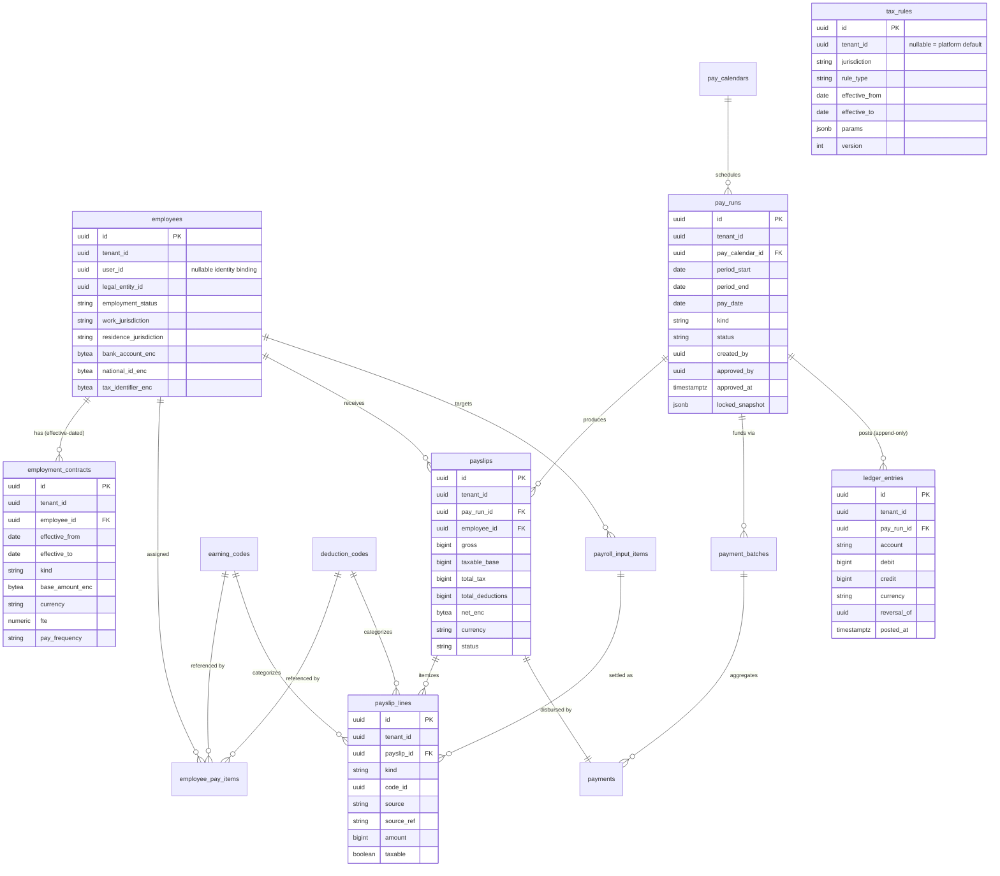
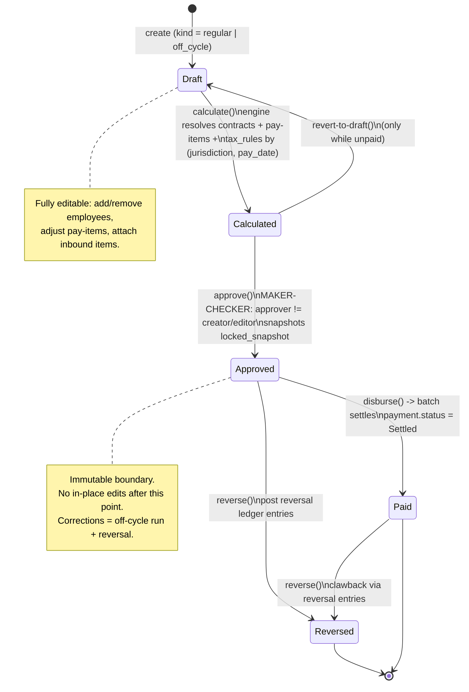
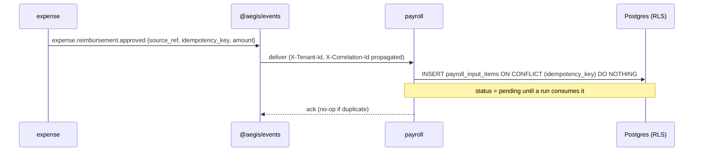

# Service — payroll

> **payroll** is the highest-sensitivity service in Aegis. It owns employee master data,
> compensation, jurisdiction-keyed tax configuration, the pay-run engine, payslips, the
> disbursement ledger, and ERP general-ledger push. It holds the most sensitive PII the
> platform processes — base salary, bank account numbers, national IDs — so it goes
> _beyond_ the platform's standard tenant isolation and route-level RBAC with **field-level
> RBAC + masking, AES-256 field encryption, sensitive-read auditing, and
> segregation-of-duties (maker-checker)** baked into the domain itself.
>
> Authoritative companions: [`SPEC.md`](../../SPEC.md) §0, §2.5, §5, §10 ·
> Related docs: [`ARCHITECTURE`](../ARCHITECTURE.md) ·
> [`03-access-control-model`](../03-access-control-model.md) ·
> [`04-multi-tenancy`](../04-multi-tenancy.md) ·
> [`05-authn-authz-flow`](../05-authn-authz-flow.md) ·
> [`06-service-to-service`](../06-service-to-service.md) ·
> [`08-api-conventions`](../08-api-conventions.md) ·
> Sibling services: [`expense`](expense.md) · [`invoice`](invoice.md) ·
> [`workflow`](workflow.md) · [`notification`](notification.md) · [`reporting`](reporting.md)

---

## 1. Responsibility & sensitivity

The payroll service is the **system of record** for everything between "an employee exists"
and "money has left the company's account into the employee's account, and the books reflect
it." Concretely it owns:

- **People & employment** — employees (with encrypted PII), effective-dated employment
  contracts (salaried/hourly base pay), pay calendars.
- **Configuration as data** — earning codes, deduction codes, and jurisdiction-keyed,
  effective-dated `tax_rules`. **Tax is data, not code** — the calculation engine resolves
  rules by `(jurisdiction, effective_date)` and never hard-codes statutory math.
- **The pay-run engine** — pay runs that move through a strict lifecycle
  `Draft → Calculated → Approved → Paid` (with a `Reversed` correction path), producing
  payslips and itemized payslip lines.
- **Inbound settlement** — approved expense reimbursements and approved bonuses/adjustments
  flow in as earning lines through one idempotent inbound endpoint.
- **Disbursement** — payments and payment batches, backed by an **append-only double-entry
  ledger** with idempotency keys.
- **ERP push** — a per-pay-run GL summary is pushed to the customer's accounting system of
  record through the pluggable [`@aegis/connectors`](#9-erp-push--aegisconnectors) framework.

### Why payroll is treated differently

Payroll concentrates risk the rest of the platform does not. Three properties drive every
design decision in this service:

| Property               | Consequence in Aegis                                                                                                                                                                 |
| ---------------------- | ------------------------------------------------------------------------------------------------------------------------------------------------------------------------------------ |
| **Most-sensitive PII** | Salary, bank account, and national ID are AES-256 field-encrypted **on top of** at-rest/in-transit encryption; reads of those fields are RBAC-gated, masked by default, and audited. |
| **Money movement**     | Disbursement is backed by an append-only ledger; every money-moving call is idempotent; corrections are reversal entries, never in-place edits.                                      |
| **Fraud surface**      | Segregation of duties is enforced in code — the principal who edits a run's inputs may **not** approve it (maker-checker at `Calculated → Approved`).                                |

Like every Aegis service, payroll shares [`@aegis/service-core`](../02-patterns.md) and
[`@aegis/access-control`](../03-access-control-model.md), enforces **PostgreSQL Row-Level
Security** on every tenant-scoped table, wraps every route
`authenticate → authorize(permission) → handler`, and emits tamper-evident audit entries.

---

## 2. Domain model

All money is stored as **integer minor units**. All PKs are **UUID v4**. Every tenant-scoped
table carries `tenant_id NOT NULL` and is governed by an RLS policy keyed on
`app.current_tenant`. Columns suffixed `_enc` hold AES-256-GCM ciphertext (envelope-encrypted;
see [§7](#7-field-level-encryption)); they are **never** selected into a DTO without passing
through the masking obligation.

### 2.1 Entity catalogue

| Table                  | Purpose                                            | Notable columns                                                                                                                                                                                             |
| ---------------------- | -------------------------------------------------- | ----------------------------------------------------------------------------------------------------------------------------------------------------------------------------------------------------------- |
| `employees`            | Employee master record                             | `user_id` (optional identity binding for own-payslip access), `legal_entity_id`, `employment_status`, `work_jurisdiction`, `residence_jurisdiction`, `bank_account_enc`, `national_id_enc`, `tax_identifier_enc`                                                          |
| `employment_contracts` | Effective-dated compensation                       | `employee_id`, `effective_from`, `effective_to`, `kind[salaried\|hourly]`, `base_amount_enc`, `currency`, `fte`, `pay_frequency`                                                                            |
| `pay_calendars`        | Pay periods & cut-offs                             | `frequency`, `period_start_rule`, `cutoff_rule`, `pay_date_rule`                                                                                                                                            |
| `earning_codes`        | Configurable earning catalog                       | `name`, `taxable`, `recurring_default`                                                                                                                                                                      |
| `deduction_codes`      | Configurable deduction catalog                     | `name`, `pre_tax`, `employer_contribution`                                                                                                                                                                  |
| `tax_rules`            | **Jurisdiction + effective-dated** statutory rules | `jurisdiction`, `rule_type`, `effective_from`, `effective_to`, `params jsonb`, `version`                                                                                                                    |
| `employee_pay_items`   | Per-employee recurring/one-off pay lines           | `employee_id`, `code_id`, `code_kind[earning\|deduction]`, `amount_or_rate`, `frequency`, `effective_from/to`                                                                                               |
| `pay_runs`             | One processing of one cycle                        | `pay_calendar_id`, `period_start/end`, `pay_date`, `kind[regular\|off_cycle]`, `status`, `created_by`, `team_id`, `assignee_id`, denormalized `tags`, `approved_by`, `approved_at`, `locked_snapshot jsonb` |
| `payslips`             | Per-employee result of a run                       | `pay_run_id`, `employee_id`, `gross`, `taxable_base`, `total_tax`, `total_deductions`, `net_enc`, `currency`, `status`                                                                                      |
| `payslip_lines`        | Itemized payslip detail                            | `payslip_id`, `kind[earning\|deduction\|tax\|employer_contribution]`, `code_id`, `source[base\|recurring\|expense\|bonus\|adjustment]`, `source_ref`, `amount`, `taxable`                                   |
| `payroll_input_items`  | **Idempotent** inbound earnings                    | `employee_id`, `source`, `source_ref`, `idempotency_key UNIQUE`, `amount`, `taxable`, `settlement[cyclic\|off_cycle]`, `status[pending\|consumed]`                                                          |
| `payments`             | One payment per payslip                            | `payslip_id`, `amount`, `currency`, `status`, `idempotency_key UNIQUE`, `batch_id`, `rail_ref`                                                                                                              |
| `payment_batches`      | Aggregated disbursement file                       | `pay_run_id`, `file_ref`, `status`                                                                                                                                                                          |
| `ledger_entries`       | **Append-only** double-entry ledger                | `pay_run_id`, `account`, `debit`, `credit`, `currency`, `reversal_of`, `posted_at`                                                                                                                          |

> A `tax_rules` row may be **platform-default** (`tenant_id` null, a seeded baseline) or
> **tenant-specific** (`tenant_id` set). Resolution prefers the most specific tenant row for
> the `(jurisdiction, rule_type)` whose validity window contains the pay date. This mirrors the
> nullable-`tenant_id` pattern used for system vs. custom roles in
> [`user-management`](../03-access-control-model.md).

### 2.2 Effective-dated & append-only design

Two structural choices give payroll auditability and correctness "for free":

- **Effective-dated** rows (`employment_contracts`, `tax_rules`, `employee_pay_items`) are
  never overwritten. A salary change inserts a new contract with a new `effective_from` and
  closes the prior one's `effective_to`. The engine resolves "what was true on the pay date,"
  enabling future-dated changes and retrospective recalculation.
- **Append-only** `ledger_entries` are read-only after posting. A clawback or correction posts
  a **reversal entry** (`reversal_of` references the original; debit/credit swapped); the
  original is preserved forever. There is no `UPDATE`/`DELETE` path on this table — enforced by
  a trigger and by the absence of a repository mutation method.

### 2.3 Entity-relationship diagram



---

## 3. Pay-run lifecycle (maker-checker)

A pay run is an explicit, enum-driven state machine. **`Approved` is an immutable boundary**:
on approval the engine writes `locked_snapshot` (the full computed result) so the run can never
be silently re-computed. Corrections after approval happen through **reversal** and **off-cycle
runs**, never by mutating a historical run.



### 3.1 Transition guards

| Transition         | Permission                  | Guard                                                                                                                     |
| ------------------ | --------------------------- | ------------------------------------------------------------------------------------------------------------------------- |
| create → `Draft`   | `payroll.run.create`    | calendar belongs to tenant; period not already run                                                                        |
| → `Calculated`     | `payroll.run.calculate` | run is `Draft`; resolves rules by `(jurisdiction, pay_date)`                                                              |
| → `Approved`       | `payroll.run.approve`   | **`approved_by != created_by`** and `approved_by` not in the set of input editors (see §3.2); snapshots `locked_snapshot` |
| → `Paid`           | `payroll.run.disburse`  | run is `Approved`; all `payments` `Settled`                                                                               |

### 3.2 Segregation of duties (maker ≠ checker)

Maker-checker is enforced **in the domain**, not merely by RBAC. When a run is approved, the
service asserts that the approving principal is neither `created_by` nor any actor who edited
the run's inputs (tracked via the run's audit trail and `employee_pay_items` / inbound-item
edits within the run window). A violation is a **domain error**, not a 403 — even a principal
holding broad payroll permissions including `payroll.run.approve` is blocked from approving a
run they touched.

```typescript
// services/pay-run.service.ts (excerpt — within @provideSingleton(PayRunService))
async approve(payRunId: string, ctx: RequestContext): Promise<PayRunDto> {
  const run = await this.payRuns.findByIdOrThrow(payRunId);
  this.assertStatus(run, PayRunStatus.Calculated);

  // Segregation of duties — checker must not be the maker.
  const editors = await this.audit.actorsWhoEditedRun(run.id); // creator + input editors
  if (editors.has(ctx.userId)) {
    throw ErrorUtils.forbidden('SOD_VIOLATION', {
      code: 'payroll.sod.maker_is_checker',
      message: 'The approver must differ from the principal who edited the pay-run inputs.',
    });
  }

  const snapshot = await this.engine.snapshot(run.id);   // immutable record of the calculation
  return this.payRuns.transition(run.id, {
    status: PayRunStatus.Approved,
    approvedBy: ctx.userId,
    approvedAt: new Date(),
    lockedSnapshot: snapshot,
  });
}
```

This complements the platform's relationship-shaped approval chains
([`workflow`](workflow.md) / shared approval engine): RBAC says _who may approve_, the SoD
guard says _this specific principal may not approve this specific run_.

---

## 4. Calculation: gross, taxable, net

The engine resolves, per employee, the contract and pay-items in effect on the pay date, folds
in any consumed inbound items, then computes:

```
gross         = base_pay + recurring_earnings + variable_earnings + inbound_earnings
taxable_base  = gross − (pre-tax deductions)              // deduction_codes.pre_tax = true
total_tax     = Σ  resolve(tax_rules, jurisdiction, pay_date).apply(taxable_base)
net           = gross − total_tax − (post-tax deductions)
```

- **Tax is data.** `resolve(...)` selects the `tax_rules` row(s) for the employee's
  `work_jurisdiction` (and `residence_jurisdiction` where reciprocity applies) whose validity
  window contains `pay_date`, preferring the most specific tenant-scoped version. Statutory math
  lives in `params jsonb` (e.g. bracket tables, flat rates, caps) — never in code branches.
  This keeps the engine stable while statutory rules change frequently, and leaves a clean seam
  to delegate to a commercial tax engine via a future `@aegis/connectors` tax adapter.
- Each component becomes a `payslip_lines` row tagged with `kind` and `source`, so a payslip is
  fully reconstructable and reportable (the per-line grain is the natural fact for
  [`reporting`](reporting.md)).
- `gross`, `taxable_base`, `total_tax`, `total_deductions` are stored in clear (aggregates that
  authorized roles routinely read); **`net_enc` is encrypted** alongside `base_amount_enc`,
  `bank_account_enc`, and the ID fields.

---

## 5. Inbound settlement (expense reimbursements & bonuses)

Approved earnings from elsewhere on the platform settle through **one** idempotent endpoint,
`POST /v1/payroll-inputs`, which writes a `payroll_input_items` row. The contract:

- **Sources**: `expense` (an approved reimbursement from [`expense`](expense.md)), `bonus`, or
  `adjustment`. Each carries a `source_ref` (the originating record id) and an
  `idempotency_key` (UNIQUE) so a redelivered event or retried call cannot double-credit.
- **Settlement**: `cyclic` (folded into the next regular run) or `off_cycle` (a dedicated run
  for final pay, supplemental bonuses, or error fixes).
- **Consumption**: when a run that covers the item executes `calculate()`, the item is read,
  emitted as a `payslip_lines` row (`source = expense|bonus|adjustment`), and flipped
  `pending → consumed`. A **no-negative-net-pay** guard rejects settlements that would drive an
  employee's net below zero.

Inbound items arrive either via the REST endpoint or via the event bus (an
`expense.reimbursement.approved` consumer registered through [`@aegis/events`](../06-service-to-service.md)).
Both paths converge on the same idempotent write, so HTTP and event delivery are interchangeable
and exactly-once at the item grain.



---

## 6. Access control — field-level RBAC, masking & SoD

Route-level RBAC is necessary but not sufficient here: two principals may both be allowed to
`GET /v1/employees/:id`, yet one must see the bank account and the other must not. Payroll layers
**field-level** authorization and **masking obligations** on top of the standard PEP.

### 6.1 Roles

| Role             | Intent                                                  | Sees encrypted PII?                                 | Maker-checker position                      |
| ---------------- | ------------------------------------------------------- | --------------------------------------------------- | ------------------------------------------- |
| **PayrollAdmin** | Configure codes, calendars, tax rules; manage employees | Yes (audited)                                       | may edit; may not approve a run they edited |
| **Processor**    | Create/calculate runs, edit inputs                      | Salary yes, bank/ID masked unless granted           | maker                                       |
| **Approver**     | Approve calculated runs                                 | Aggregates only                                     | checker (must differ from maker)            |
| **Disburser**    | Trigger disbursement, reconcile payments                | Bank (for disbursement context) only via obligation | neither — separate duty                     |
| **Manager**      | View own team's payslips/aggregates                     | No PII; masked                                      | n/a                                         |
| **Employee**     | View own payslip only                                   | Own bank (last-4 masked); own net                   | n/a                                         |
| **Auditor**      | Read-only across the service incl. audit log            | All masked; reads are themselves audited            | n/a                                         |

These map to dotted permissions in the catalog, e.g. `payroll.employee.view`,
`payroll.sensitive.read`, `payroll.run.approve`, `payroll.run.disburse`,
`audit.view`. Row-level **scope** narrows them: Manager carries `OwnAndTeam`, Employee
carries `OwnOnly`, the rest carry `AllRecords` within the tenant — all backstopped by RLS.

### 6.2 Masking as a PDP obligation

The PDP returns **obligations** alongside the allow verdict (see
[`03-access-control-model`](../03-access-control-model.md) §"obligations"). For a payroll read,
the obligation lists which `_enc` fields the principal may see in clear vs. masked. The PEP
applies the obligation in the serializer, so a controller can never accidentally leak a field.

```typescript
// PEP obligation applied in the employee serializer
const verdict = await pdp.decide(principal, 'payroll.employee.read', employee, ctx);
// verdict.obligations.mask => ['bank_account', 'national_id']  (for a Processor)

return {
  id: employee.id,
  fullName: employee.fullName,
  // decrypt-then-mask: never emit ciphertext, never emit clear to an unauthorized role
  bankAccount: applyMask(verdict, 'bank_account', () => decrypt(employee.bankAccountEnc)),
  nationalId: applyMask(verdict, 'national_id', () => decrypt(employee.nationalIdEnc)),
};
// applyMask returns '•••• 4321' (last-4) or '••••••••' depending on the obligation.
```

`read_sensitive` is a **distinct permission** from `read`. Holding it grants the unmasked
obligation — and every grant of it produces a sensitive-read audit entry (§6.3). Default-deny
means an unconfigured field is masked.

### 6.3 Sensitive-read auditing

Every read that decrypts a sensitive field writes an audit entry **even when no data changed** —
`sensitive_read = true`, capturing actor, tenant, the entity, the field(s) revealed, the
correlation id, and the PDP decision. These entries join the platform's hash-chained,
tamper-evident audit feed (see [`SPEC.md`](../../SPEC.md) §1 "Audit"), so "who looked at this
salary, and when" is answerable and non-repudiable. State transitions
(`Draft→Calculated→Approved→Paid→Reversed`) are audited identically, recording the
permissions-at-time-of-action.

### 6.4 Segregation of duties — the matrix

```mermaid
graph LR
    subgraph "Maker side"
      P[Processor / PayrollAdmin<br/>edits inputs, calculates]
    end
    subgraph "Checker side"
      A[Approver<br/>approves run]
    end
    subgraph "Money side"
      D[Disburser<br/>builds batch, settles]
    end
    P -- must differ from --> A
    A -- must differ from --> D
    P -. "audited every action" .-> AUD[(hash-chained audit)]
    A -. .-> AUD
    D -. .-> AUD
```

Regulators expect separation across _employee-data edits_, _salary approval_, and _fund
disbursement_. Aegis enforces the first boundary (`maker ≠ checker`) as a hard domain
invariant and treats the disburser as a separate duty by permission. All three are recorded in
the audit feed for periodic access review.

---

## 7. Field-level encryption

Sensitive columns are stored as AES-256-GCM ciphertext using **envelope encryption**: a
per-tenant data-encryption key (DEK) wrapped by a key-management-service master key (KMS), with
the wrapped DEK referenced — never the raw key — in config. This is **in addition to**
at-rest disk encryption and TLS in transit, so a stolen DB dump or backup yields ciphertext only.

| Column                                  | Table                  | Clear to                                                   |
| --------------------------------------- | ---------------------- | ---------------------------------------------------------- |
| `base_amount_enc`                       | `employment_contracts` | PayrollAdmin, Processor (obligation-gated)                 |
| `net_enc`                               | `payslips`             | Owning Employee, PayrollAdmin                              |
| `bank_account_enc`                      | `employees`            | Disburser (disbursement context), owning Employee (last-4) |
| `national_id_enc`, `tax_identifier_enc` | `employees`            | PayrollAdmin only                                          |

Encryption/decryption lives behind a `@aegis/service-core` crypto helper; repositories store and
return ciphertext, and only the serializer — after applying the PDP masking obligation — calls
`decrypt`. The GCM auth tag makes any tampering with stored ciphertext detectable.

---

## 8. Disbursement: ledger & idempotency

Disbursement turns an `Approved` run into money movement and into book entries. Two invariants
make it safe to retry and impossible to misstate:

- **Idempotency.** Every money-moving call accepts an `Idempotency-Key` header; each `payments`
  and (where applicable) `payroll_input_items` row carries a `UNIQUE idempotency_key`. A retried
  `disburse()` re-uses the existing batch/payment instead of double-paying. Writes use
  `INSERT ... ON CONFLICT (idempotency_key) DO NOTHING` and return the prior result.
- **Append-only double-entry ledger.** On settlement, the run posts balanced `ledger_entries`:
  debit **wage expense** / **employer-tax expense**, credit **cash**, **tax liability**, and
  **deduction liability**. Entries are immutable; a clawback posts a **reversal** referencing the
  original via `reversal_of` (debit/credit swapped) — the original is never edited or deleted.

```mermaid
sequenceDiagram
    participant DSB as Disburser
    participant PR as payroll
    participant LED as ledger_entries (append-only)
    participant RAIL as payment rail (via secret-proxy)
    DSB->>PR: POST /v1/pay-runs/:id/disburse  (Idempotency-Key)
    PR->>PR: build payment_batch + payments (idempotency_key UNIQUE)
    PR->>RAIL: submit batch file (per-connector auth; no rail key on client)
    RAIL-->>PR: webhook payment.status = Settled
    PR->>LED: POST balanced entries (Dr wage/employer-tax, Cr cash/liability)
    PR->>PR: pay_run -> Paid ; emit payslip.paid
    Note over PR,LED: clawback => reversal entry (reversal_of), never an edit
```

Payment-rail credentials never ship to a client; outbound rail calls follow the platform's
service-to-service auth + context propagation, and credentials resolve from the parameter store
([`06-service-to-service`](../06-service-to-service.md)).

---

## 9. ERP push — `@aegis/connectors`

After a run is `Paid`, payroll stages a `connector.push.requested` event carrying a **GL summary**
(the aggregated debits/credits per account for the run — **not** payslip-level PII). The workflow
worker pushes that event through the pluggable
**[`@aegis/connectors`](../../SPEC.md#103-erp-integration)** framework. A new ERP is supported by
writing one adapter against the common connector interface (`authenticate → push(transaction) →
fetchStatus`); the registry selects the configured connector per tenant.

- Ships with **mock connectors** under neutral names (`LedgerOne`, `Finovo`, `AcctBridge`) that
  emulate the auth handshake, transaction push, and status fetch **without calling any real
  ERP** — proving the seam is production-ready.
- Every push carries an **idempotency key** (`pay_run.id` + account-summary hash) so a re-push
  is a no-op. Connector auth is per-connector (carried via the connector's configured scheme),
  and the call rides the standard context propagation. There is no `X-Trend`/`X-Tracker` header;
  the propagated business-request id is `X-Correlation-Id`.

Current gap: `connector_sync_state` records queued/synced/error outcomes, but payroll does not yet
receive a terminal sync callback to annotate the pay run with external ERP status.

---

## 10. Events

Payroll publishes domain events through [`@aegis/events`](../06-service-to-service.md) so
downstream services react without re-deriving authority (notification, reporting, and GL
consumers):

| Topic                      | Emitted when                         | Typical consumers                  |
| -------------------------- | ------------------------------------ | ---------------------------------- |
| `payroll.pay_run.approved` | run reaches `Approved`               | reporting, notification            |
| `payroll.payslip.paid`     | a payslip's payment settles          | notification (employee), reporting |
| `payroll.payment.returned` | a settled payment is returned/failed | notification (finance), workflow   |
| `payroll.pay_run.reversed` | a run is reversed/clawed back        | reporting, GL consumer             |

Inbound, payroll **consumes** `expense.reimbursement.approved` (and may consume bonus/adjustment
events) into the idempotent inbound path (§5). All events carry `X-Tenant-Id` and
`X-Correlation-Id`; [`notification`](notification.md) treats them as already-authorized and never
re-derives authority.

---

## 11. API surface

All routes are tenant-scoped and wrapped `authenticate → authorize(permission) → handler`. Lists
return `{ data, meta: { total, page, pageSize } }`; errors use the standard envelope
`{ errors: [{ code, type, message, details, traceId }] }`
([`08-api-conventions`](../08-api-conventions.md)). Mutating money/state routes require an
`Idempotency-Key` header.

### 11.1 Configuration (admin)

| Method & path                  | Permission                                | Notes                                      |
| ------------------------------ | ----------------------------------------- | ------------------------------------------ |
| `GET/POST /v1/pay-calendars`   | `payroll.pay_calendar.read` / `.create`   |                                            |
| `GET/POST /v1/earning-codes`   | `payroll.earning_code.read` / `.create`   |                                            |
| `GET/POST /v1/deduction-codes` | `payroll.deduction_code.read` / `.create` |                                            |
| `GET/POST /v1/tax-rules`       | `payroll.tax_rule.read` / `.create`       | jurisdiction + effective-dated; admin only |

### 11.2 People & compensation

| Method & path                          | Permission                                      | Notes                                                                |
| -------------------------------------- | ----------------------------------------------- | -------------------------------------------------------------------- |
| `GET /v1/employees`                    | `payroll.employee.view`                         | field-level masking by role; `_enc` fields clear only with `payroll.sensitive.read` |
| `POST /v1/employees`                   | `payroll.employee.manage`                       | creates employee master data; sensitive fields are encrypted before storage |
| `GET/POST /v1/employees/:id/contracts` | `payroll.contract.read` / `.create`             | effective-dated; insert closes prior window                          |
| `GET/POST /v1/employees/:id/pay-items` | `payroll.pay_item.read` / `.create`             |                                                                      |

### 11.3 Inbound & pay-run lifecycle

| Method & path                           | Permission                  | Transition / effect                                                         |
| --------------------------------------- | --------------------------- | --------------------------------------------------------------------------- |
| `POST /v1/pay-runs`                     | `payroll.run.create`    | → `Draft` (regular\|off_cycle)                                              |
| `GET /v1/pay-runs`                      | `payroll.run.approve`   | Paged list; filters include `status`, `tag`, `team`, `assignee`, `tagMatch` |
| `GET /v1/pay-runs/:id`                  | `payroll.run.approve`   | Read one pay-run header (no payslip PII)                                    |
| `POST /v1/pay-runs/:id/calculate`       | `payroll.run.calculate` | `Draft → Calculated`                                                        |
| `GET /v1/pay-runs/:id/payslips`         | `payroll.payslip.view.all` OR `payroll.payslip.view.own` | Paged non-sensitive payslip totals for a run; own-scope callers are intersected with `employees.user_id`; never returns `net_enc` |
| `GET /v1/pay-runs/approvals/pending`    | `payroll.run.approve`   | Current user's pending pay-run approval slots                               |
| `POST /v1/pay-runs/:id/decisions`       | `payroll.run.approve`   | Engine-backed approve/reject decision; **SoD: approver ≠ editor**           |
| `POST /v1/pay-runs/:id/approve`         | `payroll.run.approve`   | Backward-compatible alias for `decisions { "decision": "approved" }`        |

### 11.4 Payslips, disbursement & audit

| Method & path                    | Permission                 | Notes                                                     |
| -------------------------------- | -------------------------- | --------------------------------------------------------- |
| `GET /v1/payslips`               | `payroll.payslip.view.all` OR `payroll.payslip.view.own` | Paged non-sensitive payslip list; filters: `payRunId`, `employeeId`, `status`. Own-scope callers are restricted to employees bound to their authenticated `user_id`. |
| `GET /v1/payslips/:id`           | `payroll.payslip.view.all` OR `payroll.payslip.view.own` | Non-sensitive payslip totals; own-scope callers receive 404 unless the payslip's employee is bound to their authenticated `user_id`; never exposes encrypted or clear net pay. |
| `POST /v1/pay-runs/:id/disburse` | `payroll.run.disburse`     | `Approved → Paid`; builds batch + payments; idempotent    |
| `POST /v1/payments/:id/status`   | (internal, signed)         | rail webhook: `Settled`/`Returned` → marks Paid/Failed    |
| `GET /v1/audit-log`              | `payroll.audit.read`       | Auditor/admin; read-only; includes sensitive-read entries |

Own-payslip scoping is implemented through the `employees.user_id` bridge: payroll keeps
`employee_id` as the payroll-domain foreign key, while access control uses the authenticated
identity `user_id` to restrict `payroll.payslip.view.own`. Own-team scoping and rendered PDF output
remain hardening items; the shipped read APIs return only non-sensitive totals and never return
`net_enc` or clear net pay.

---

## 12. Definition of done

This service is complete when it: shares `@aegis/service-core` + `@aegis/access-control`;
enforces tenant RLS on every table; wraps every route `authenticate → authorize(permission)`;
encrypts all `_enc` fields with AES-256 envelope encryption and masks them via PDP obligations;
audits every sensitive-field read and every pay-run state transition into the hash-chained feed;
enforces maker-checker (`approver ≠ editor`) as a domain invariant; backs disbursement with an
append-only double-entry ledger and idempotency keys; pushes GL summaries through
`@aegis/connectors` (mock connectors wired); emits the events in §10; and keeps this document in
step with [`SPEC.md`](../../SPEC.md).
