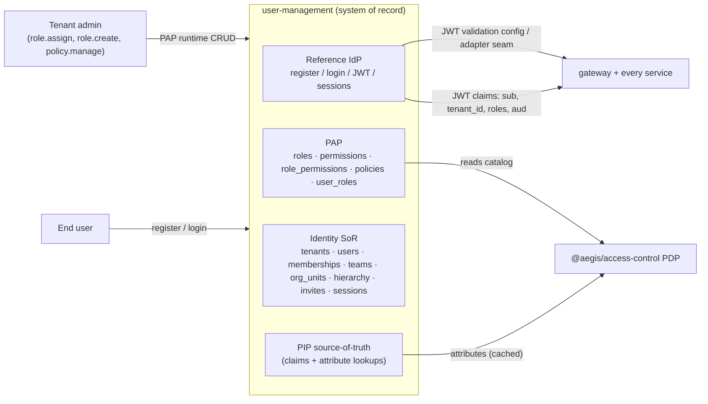
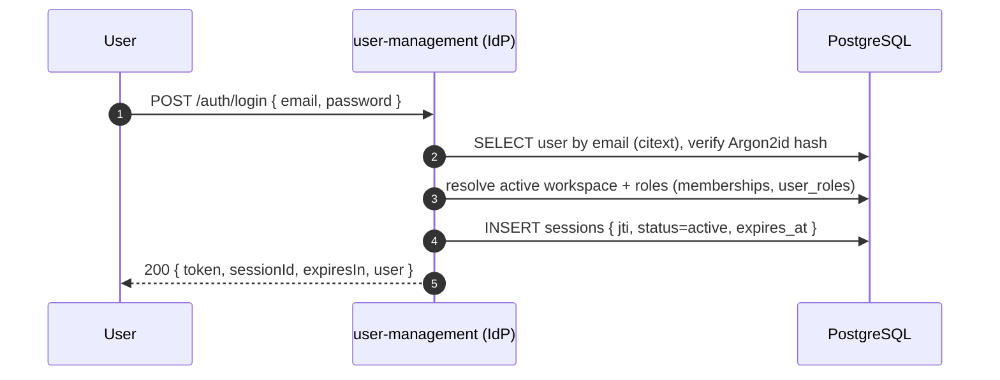

# user-management — Identity, Access System of Record, PAP & Reference IdP

> The **identity and access system of record** for Aegis. Owns tenants, users,
> memberships, the full role/permission/policy catalog, organizational
> hierarchy, teams, invitations, and sessions. It is the **Policy Administration
> Point (PAP)** — the only place roles, permissions, mappings, and policies are
> created or edited at runtime — and it ships the platform's **reference Identity
> Provider** so Aegis authenticates end-to-end out of the box.
>
> Read alongside the canonical spec ([`../../SPEC.md`](../../SPEC.md) §2, §2.4,
> §5) and the conventions in [`../../AGENTS.md`](../../AGENTS.md). Request-path
> companions: the [authn/authz flow](../05-authn-authz-flow.md), the
> [access-control model](../03-access-control-model.md), the
> [multi-tenancy](../04-multi-tenancy.md) RLS strategy, and the
> [service-to-service](../06-service-to-service.md) trust layer. API conventions
> are in [`../08-api-conventions.md`](../08-api-conventions.md).

---

## 1. Responsibility

`user-management` is the substrate every other service depends on for _who a
principal is_ and _what authority they carry_. Its responsibilities are:

1. **Identity system of record** — tenants, users, and the `memberships` join
   that binds a user into a tenant with a deterministic _active workspace_
   (current tenant + current role per request).
2. **Policy Administration Point (PAP)** — runtime CRUD for `roles`,
   `permissions`, `role_permissions` mappings, `user_roles` (role binding with
   row-level scope), and ABAC `policies`. This is the **only** writer of the
   access-control catalog; every other service is a **reader** via the PDP/PIP.
3. **Reference Identity Provider** — registration, password login, short-lived
   local JWT issuance, issued-session rows, and a **pluggable adapter seam** so a
   managed IdP can replace the reference one without touching any business service.
4. **Organizational model** — `teams` + `team_members`, `org_units`, and a
   `user_hierarchy` (manager edges with per-manager `approval_limit`) that the
   approval engine and ABAC conditions consume.
5. **Invitations & sessions** — `invites` (email-bound, pre-assigned
   roles/teams/scope) and `sessions` (active-token rows enabling revocation).
6. **Internal recipient directory** — service-to-service contact projections for
   notification fan-out: one user by id, or an audience by role/team/tenant-admins.
   The response is intentionally minimal (`userId`, `email`, optional `phone`) and
   every lookup runs under tenant RLS.

It is **not** an authorization _decision_ engine. Decisions are made by the
**PDP** in [`@aegis/access-control`](../03-access-control-model.md); the PDP
_reads_ the catalog this service administers. Keeping administration (PAP, here)
separate from decision (PDP, in a shared lib) and enforcement (PEP, in each
service) is the core discipline of the platform.

### 1.1 Where it sits



The IdP issues claims; the **gateway** validates at the edge and **each service
re-validates** the token (defense in depth). The PDP, embedded in every service,
reads the catalog this service owns. See
[`../05-authn-authz-flow.md`](../05-authn-authz-flow.md) for the full request
path.

---

## 2. Domain model

All tables follow the platform conventions ([`../../AGENTS.md`](../../AGENTS.md)
§6): UUID v4 PKs, `created_at`/`updated_at` with `underscored: true`, money in
integer minor units, names drawn from the `TableName` enum. Every **tenant-scoped**
table carries `tenant_id NOT NULL` and a Postgres RLS policy keyed on
`app.current_tenant`; **global** catalog rows (system roles, the permission
catalog) carry a nullable `tenant_id` where `NULL` means "platform-global".

### 2.1 Entities at a glance

| Table              | Scope                | Purpose                                                     | Key columns / invariants                                                                                                          |
| ------------------ | -------------------- | ----------------------------------------------------------- | --------------------------------------------------------------------------------------------------------------------------------- |
| `tenants`          | global               | The isolation boundary (an organization).                   | `id`, `name`, `slug` (unique), `status`, `tier` (`pooled \| silo`)                                                                |
| `users`            | global               | A principal. One identity, may join many tenants.           | `id`, `email` (unique, citext), `password_hash` (nullable when IdP-backed), `status`, `two_fa_enabled`, `external_id`             |
| `memberships`      | tenant               | Binds a user into a tenant — the tenancy join.              | unique `(user_id, tenant_id)`; `active_workspace bool`; `status`                                                                  |
| `roles`            | global **or** tenant | A named bundle of permissions.                              | `tenant_id` **nullable**: `NULL` = system role (seeded), non-null = **custom** role; unique `(tenant_id, name)`; `is_system bool` |
| `permissions`      | global               | Dotted `domain.action[.sub]` catalog.                       | `name` **unique** (e.g. `expense.report.approve`); `description`                                                                  |
| `role_permissions` | follows role         | Explicit role→permission join (single source of truth).     | unique `(role_id, permission_id)`                                                                                                 |
| `user_roles`       | tenant               | Assigns a role to a user **with row-level scope**.          | `(user_id, tenant_id, role_id)`; `scope` (`AllRecords \| OwnAndTeam \| OwnOnly`)                                                  |
| `policies`         | tenant               | ABAC rules (conditions as data) the PDP evaluates.          | `effect` (`allow \| deny`), `permission`, `rule jsonb`, `priority`                                                                |
| `teams`            | tenant               | A group of users for scoping and approval routing.          | `name`, `lead_user_id`, `parent_team_id?`                                                                                         |
| `team_members`     | tenant               | Team membership join.                                       | unique `(team_id, user_id)`; `team_role`                                                                                          |
| `tags`             | tenant               | Governed catalog of legal finance-record tags.              | case-insensitive unique live `(tenant_id, name)`; `color`, `is_active`                                                            |
| `team_tags`        | tenant               | Which catalog tags a team may use.                          | unique `(tenant_id, team_id, tag_id)`                                                                                             |
| `record_tags`      | tenant               | Polymorphic finance-record tag join.                        | `(record_type, record_id, tag_id)`, `source`, `added_by`                                                                          |
| `org_units`        | tenant               | Organizational/operating units (cost centers, departments). | `name`, `parent_unit_id?`, `code`                                                                                                 |
| `user_hierarchy`   | tenant               | Reporting lines + per-manager spend limit.                  | `user_id`, `manager_id` (self-ref), `approval_limit` (minor units)                                                                |
| `invites`          | tenant               | Pending invitation, pre-assigns role/team/scope.            | `email`, `token_hash`, `status`, `role_id?`, `team_ids[]`, `scope`, `expires_at`                                                  |
| `sessions`         | tenant               | Issued-token rows for reference-IdP session listing/revocation. | `user_id`, `tenant_id`, `jti`, `status`, `revoked_at?`, `expires_at`                                                              |

> **Scope vocabulary.** `scope` on `user_roles` (and pre-assigned on `invites`)
> is the **row-level** dimension of the model — `AllRecords | OwnAndTeam |
OwnOnly` — compiled by the PDP into query predicates and backstopped by RLS
> (see [`../04-multi-tenancy.md`](../04-multi-tenancy.md)). It is orthogonal to
> the **action-level** RBAC answer (`role_permissions`) and to **ABAC**
> conditions (`policies`). Three layers, three tables, one decision.

### 2.2 Entity-relationship diagram

```mermaid
erDiagram
  tenants ||--o{ memberships : "has"
  users ||--o{ memberships : "joins via"
  tenants ||--o{ roles : "scopes (custom)"
  roles ||--o{ role_permissions : "grants"
  permissions ||--o{ role_permissions : "granted by"
  users ||--o{ user_roles : "assigned"
  tenants ||--o{ user_roles : "within"
  roles ||--o{ user_roles : "of role"
  tenants ||--o{ policies : "owns"
  tenants ||--o{ teams : "owns"
  teams ||--o{ team_members : "has"
  users ||--o{ team_members : "member of"
  tenants ||--o{ tags : "owns"
  teams ||--o{ team_tags : "allows"
  tags ||--o{ team_tags : "mapped to"
  tags ||--o{ record_tags : "attached through"
  tenants ||--o{ org_units : "owns"
  org_units ||--o{ org_units : "parent of"
  tenants ||--o{ user_hierarchy : "scopes"
  users ||--o{ user_hierarchy : "reports (user)"
  users ||--o{ user_hierarchy : "manages (manager)"
  tenants ||--o{ invites : "issues"
  users ||--o{ sessions : "holds"

  tenants {
    uuid id PK
    string name
    string slug UK
    string status
    string tier
  }
  users {
    uuid id PK
    citext email UK
    string password_hash "nullable (IdP-backed)"
    bool two_fa_enabled
    string status
    string external_id "nullable"
  }
  memberships {
    uuid id PK
    uuid user_id FK
    uuid tenant_id FK
    bool active_workspace
    string status
  }
  roles {
    uuid id PK
    uuid tenant_id FK "nullable = system role"
    string name
    bool is_system
  }
  permissions {
    uuid id PK
    string name UK "domain.action[.sub]"
    string description
  }
  role_permissions {
    uuid id PK
    uuid role_id FK
    uuid permission_id FK
  }
  user_roles {
    uuid id PK
    uuid user_id FK
    uuid tenant_id FK
    uuid role_id FK
    string scope "AllRecords|OwnAndTeam|OwnOnly"
  }
  policies {
    uuid id PK
    uuid tenant_id FK
    string permission
    string effect "allow|deny"
    jsonb rule
    int priority
  }
  teams {
    uuid id PK
    uuid tenant_id FK
    string name
    uuid lead_user_id FK
    uuid parent_team_id FK "nullable"
  }
  team_members {
    uuid id PK
    uuid team_id FK
    uuid user_id FK
    string team_role
  }
  tags {
    uuid id PK
    uuid tenant_id FK
    string name "UK live tenant lower(name)"
    string color "nullable"
    bool is_active
  }
  team_tags {
    uuid id PK
    uuid tenant_id FK
    uuid team_id FK
    uuid tag_id FK
  }
  record_tags {
    uuid id PK
    uuid tenant_id FK
    string record_type
    uuid record_id
    uuid tag_id FK
    string source
    uuid added_by
  }
  org_units {
    uuid id PK
    uuid tenant_id FK
    string name
    string code
    uuid parent_unit_id FK "nullable"
  }
  user_hierarchy {
    uuid id PK
    uuid tenant_id FK
    uuid user_id FK
    uuid manager_id FK "self-ref, nullable = root"
    bigint approval_limit "minor units"
  }
  invites {
    uuid id PK
    uuid tenant_id FK
    citext email
    string token_hash
    string status
    uuid role_id FK "nullable"
    string scope
    timestamptz expires_at
  }
  sessions {
    uuid id PK
    uuid user_id FK
    uuid tenant_id FK
    string jti UK
    string status
    timestamptz revoked_at "nullable"
    timestamptz expires_at
  }
```



### 2.3 Active workspace — deterministic "current tenant + role"

A user may belong to several tenants. Exactly one of their `memberships` rows
carries `active_workspace = true`, which deterministically resolves the
**current tenant** for a request, and from there the user's `user_roles` rows in
that tenant resolve the **current role(s)** and **scope**. This is what lets a
single login operate across workspaces while every request has one unambiguous
tenant context — the value that is stamped into the JWT `tenant_id` claim, set
as `app.current_tenant` for RLS, and propagated as `X-Tenant-Id`.

```sql
-- Resolve the active workspace and effective role(s) for a user, deterministically.
SELECT m.tenant_id,
       ur.role_id,
       ur.scope,
       r.name AS role_name
FROM   memberships m
JOIN   user_roles  ur ON ur.user_id = m.user_id AND ur.tenant_id = m.tenant_id
JOIN   roles       r  ON r.id = ur.role_id
WHERE  m.user_id = :user_id
  AND  m.status  = 'active'
ORDER BY m.active_workspace DESC   -- active workspace first; deterministic tie-break
LIMIT  1;
```

> Unlike a single-role-per-tenant model, Aegis permits **multiple** `user_roles`
> per `(user, tenant)`; the effective permission set is the **union** of their
> `role_permissions`, and the effective row-level scope is the **broadest**
> assigned scope. The PAP enforces this union at bind time and the PIP
> caches it.

---

## 3. Policy Administration Point (PAP) — runtime CRUD

The PAP is the defining capability of `user-management`: roles, permissions,
their mappings, ABAC policies, and user-role bindings are all **mutable at
runtime via authenticated API**, not via migrations. (Seeded _system_ roles and
the base permission catalog ship as Umzug seeders; everything tenant-defined is
runtime.) Every PAP write:

- is itself **PEP-guarded** by a granular permission (`role.create`,
  `role.assign`, `permission.view`, `policy.view`, `policy.manage`);
- is **tenant-scoped** — a tenant admin can only create/edit roles, policies,
  and role bindings inside their own tenant (custom `roles.tenant_id = current
tenant`); system roles (`tenant_id IS NULL`, `is_system = true`) are
  **read-only** to tenant admins and editable only by a platform operator;
- emits a **hash-chained audit entry** capturing actor, tenant, intent,
  decision, and the _permissions-at-time-of-action_ (see
  [`../10-auditability-and-compliance.md`](../10-auditability-and-compliance.md));
- **invalidates the PIP cache** for the affected principal/role so the next PDP
  decision reflects the change without a deploy.

### 3.1 PAP surface

| Resource                 | Operations                                                | Guarding permission                     |
| ------------------------ | --------------------------------------------------------- | --------------------------------------- |
| Roles                    | create / read / list                                      | `role.create` / `role.view`             |
| Permissions (catalog)    | read / list                                               | `permission.view`                       |
| ABAC policies            | create / read / list / update / delete                    | `policy.view` / `policy.manage`         |
| User-role bindings       | assign/reassign with `scope`                              | `role.assign`                           |

A **custom role** is just a `roles` row with `tenant_id = currentTenant` and
`is_system = false`. Attaching permissions is an explicit `role_permissions`
write — not a policy-engine grouping trick — so the role→permission graph has a
single relational source of truth (a deliberate departure from engines that
overload role-inheritance edges to store permissions).

```typescript
// PAP service (user-management) — assign a custom role to a user, at runtime.
// Tenant-scoped, PEP-guarded by `role.assign`, audited, cache-invalidating.
async assignRole(input: Identity.AssignRoleInput): Promise<Identity.UserRoleDTO> {
  const { tenantId, actorId } = RequestContext.current(); // AsyncLocalStorage

  return this.db.transaction(async (t) => {
    await this.db.setTenant(tenantId, t);                  // SET LOCAL app.current_tenant

    const role = await this.roleRepo.findById(input.roleId, t);
    if (!role) throw ErrorUtils.notFound('ROLE_NOT_FOUND', 'role');
    // Custom roles are tenant-owned; system roles are assignable but not editable here.
    if (role.tenantId && role.tenantId !== tenantId)
      throw ErrorUtils.forbidden('ROLE_CROSS_TENANT', 'role belongs to another tenant');

    // The target must already be a member of this tenant.
    const membership = await this.membershipRepo.findActive(input.userId, tenantId, t);
    if (!membership) throw ErrorUtils.conflict('NOT_A_MEMBER', 'user is not a member of this tenant');

    const userRole = await this.userRoleRepo.upsert({
      userId: input.userId, tenantId, roleId: input.roleId,
      scope: input.scope ?? Scope.OwnOnly,                 // default least-privilege
    }, t);

    await this.audit.record({                              // hash-chained
      actorId, tenantId, action: 'role.assign', resource: { type: 'user_role', id: userRole.id },
      decision: 'allow', permissionsAtAction: this.context.permissions,
      intent: { userId: input.userId, roleId: input.roleId, scope: userRole.scope },
    }, t);

    this.pip.invalidatePrincipal(input.userId, tenantId);  // next PDP decision is fresh
    return this.serializer.userRole(userRole);
  });
}
```

### 3.2 Sequence — assign a custom role at runtime

```mermaid
sequenceDiagram
  autonumber
  participant Admin as Tenant Admin
  participant GW as gateway
  participant UM as user-management (PEP)
  participant PDP as @aegis/access-control (PDP)
  participant PIP as PIP (attribute cache)
  participant DB as PostgreSQL (RLS)
  participant AUD as audit_log (hash-chained)

  Admin->>GW: POST /tenants/{t}/users/{u}/roles { roleId, scope }<br/>Authorization: Bearer JWT
  GW->>GW: validate JWT at edge, mint X-Correlation-Id
  GW->>UM: forward + X-Tenant-Id, X-Correlation-Id, X-Trace-Id
  UM->>UM: re-validate JWT, build RequestContext (fail-closed header check)
  UM->>PDP: authorize("role.assign", { resource: role })
  PDP->>PIP: get actor roles + scope (cached)
  PIP-->>PDP: roles=[admin], scope=AllRecords
  PDP-->>UM: { allow: true, reason: "role.assign granted" }
  UM->>DB: BEGIN; SET LOCAL app.current_tenant = {t}
  UM->>DB: SELECT role (assert tenant ownership / system)
  UM->>DB: SELECT membership (assert target is a member)
  UM->>DB: INSERT/UPSERT user_roles (user, tenant, role, scope)
  UM->>AUD: append { actor, tenant, role.assign, allow, perms@action } (hash-chained)
  UM->>DB: COMMIT
  UM->>PIP: invalidate principal (u, t)
  UM-->>Admin: 201 { data: UserRoleDTO }
```

The key property: the new authority is live on the **next** request because the
PIP cache for that principal was invalidated — no migration, no redeploy, no
restart. That is dynamic role management.

---

## 4. Reference Identity Provider

The IdP is intentionally thin and sits behind a **pluggable adapter** so the
reference implementation can be swapped for a managed provider without changing a
single business service. The local build uses symmetric JWT validation for a
self-contained demo; production adapters would expose the standard discovery/JWKS
surface described in [`../05-authn-authz-flow.md`](../05-authn-authz-flow.md) §1.

```typescript
// @aegis/service-core — the only identity surface a business service depends on.
// Concrete adapters (reference, Keycloak, Auth0, Cognito) live in user-management.
export interface IdentityProvider {
  discovery(): Promise<OidcDiscoveryDocument>; // issuer, jwks_uri, algs, endpoints
  jwks(): Promise<JwkSet>; // rotated public verification keys
  authenticate(c: PasswordCredential): Promise<AuthResult>;
  issueTokens(principal: Principal): Promise<TokenPair>; // access + optional refresh
  revoke(jti: string): Promise<void>; // server-side session revocation
}
```

### 4.1 Capabilities

- **Register** — `POST /auth/register` creates a `users` row (Argon2id password
  hash), optionally consuming an `invites` token to attach the pre-assigned
  membership/role/team/scope atomically.
- **Login** — `POST /auth/login` verifies the credential, creates a `sessions`
  row with a JWT id (`jti`), and issues a permission-bearing access token.
- **JWT issuance** — short-lived local access tokens whose claims carry
  `sub`, `tenant_id` (the active workspace), `roles`, `aud` (per-service
  audience), `exp`, and `jti`.
- **JWKS/discovery adapter** — production IdP adapters publish standard discovery
  and JWKS documents; the local reference keeps symmetric JWT validation for
  one-command operation.
- **Revocation** — `DELETE /sessions/{id}` sets `sessions.status = revoked` and
  `revoked_at`. Full distributed token introspection on every request remains a
  production-hardening item; the local reference now has the durable session row
  and admin API needed to wire that check.
- **2FA seam** — the adapter seam lets a real TOTP/WebAuthn provider drop in;
  the local reference does not ship a 2FA route yet.
- **Pluggable adapter** — the reference IdP is one `IdentityProvider`
  implementation; setting the adapter to Keycloak/Auth0/Cognito makes Aegis a
  client of that provider, consuming its discovery + JWKS unchanged.

### 4.2 Login + token issuance



The access token's claims are exactly what downstream services need to build a
`RequestContext` and call the PDP — so a service authorizes from the **claims**
plus PIP attribute lookups, without a synchronous round-trip to
`user-management` on the hot path.

---

## 5. How other services consume identity

Business services never write identity and never re-derive authority from
scratch. They consume it two ways:

1. **JWT claims (per request).** The validated access token carries `sub`,
   `tenant_id`, `roles`, `aud`, `exp`. The context middleware in
   `@aegis/service-core` builds the `RequestContext` (AsyncLocalStorage) from
   these claims and the propagated headers, with **strict, fail-closed header
   validation** — required headers (`X-Tenant-Id`, `X-Correlation-Id`,
   `X-Caller`, `X-Source-Service`) are asserted; missing/malformed values are
   **rejected**, never defaulted. There is **no `entryContext`**. See
   [`../06-service-to-service.md`](../06-service-to-service.md).
2. **PIP attribute lookups (when the PDP needs more).** When an ABAC condition
   references an attribute not in the token — `manager-of`, team membership, a
   user's `approval_limit`, org-unit membership — the **PIP** fetches it. The
   PIP's source of truth is `user-management`'s tables; lookups are **cached**
   (keyed by `tenant_id` + principal + attribute) and invalidated by PAP writes
   (§3) and identity events (§6).

```typescript
// PIP attribute resolution backed by user-management (cached; invalidated by events).
export interface PrincipalAttributes {
  tenantId: string;
  userId: string;
  roles: string[]; // role names in the active workspace
  permissions: string[]; // union of role_permissions (cached)
  scope: Scope; // broadest of assigned user_roles.scope
  teamIds: string[]; // from team_members
  orgUnitIds: string[]; // from org_units membership
  managerId: string | null; // user_hierarchy.manager_id
  approvalLimit: number | null; // user_hierarchy.approval_limit (minor units)
}
```

The hierarchy attributes are what make approval ABAC work: a `policies` rule like
_"an approver may approve an expense only up to their own `approval_limit`, and
only within their reporting subtree"_ is evaluated by the PDP against
`approvalLimit` and `managerId` supplied by the PIP — both sourced from
`user_hierarchy` here. The expense, invoice, and payroll approval engines all
read these attributes; none of them store identity.

---

## 6. Access-control specifics

`user-management` is where the access-control model is **administered** and
**stored**; it is not where decisions are made (that is the PDP). The specifics
this service is responsible for:

- **Catalog ownership (PAP).** `roles`, `permissions`, `role_permissions`,
  `policies`, and `user_roles` are owned and mutated here. System roles seed at
  bootstrap (`is_system = true`, `tenant_id NULL`); custom roles are
  tenant-scoped runtime rows.
- **Explicit role→permission join.** `role_permissions` is a real table — the
  single source of truth for the RBAC graph — not an overloaded inheritance edge.
  Permissions are dotted `domain.action[.sub]` strings from the catalog.
- **Three-layer decision input.** This service supplies the inputs for all three
  layers the PDP combines: **RBAC** (`role_permissions`), **ABAC** (`policies`
  with `rule jsonb` conditions over subject/resource/environment attributes), and
  **row-level scope** (`user_roles.scope` ∈ `AllRecords | OwnAndTeam | OwnOnly`,
  plus team/hierarchy membership). See
  [`../03-access-control-model.md`](../03-access-control-model.md).
- **Tenant isolation, twice.** Every tenant-scoped table here is
  `tenant_id NOT NULL` + RLS (`FORCE ROW LEVEL SECURITY`, `RESTRICTIVE` policy,
  the app role is a non-owner without `BYPASSRLS`, `SET LOCAL app.current_tenant`
  per transaction). Catalog reads/writes are belt-and-suspenders: query
  predicates _and_ RLS. See [`../04-multi-tenancy.md`](../04-multi-tenancy.md).
- **PEP on every route.** Each route is `authenticate → authorize(permission) →
handler`. PAP mutations are guarded by `role.*` / `permission.*` / `policy.*`;
  identity reads by `user.view`, etc. Only `/health` and docs are unauthenticated.
- **Least privilege by default.** A new `user_roles` binding defaults to
  `scope = OwnOnly`; broadening to `OwnAndTeam`/`AllRecords` is an explicit,
  audited choice.
- **Separation of administration from decision.** A tenant admin can grant
  themselves no authority they do not already hold — PAP writes are themselves
  authorized by the PDP, so privilege escalation requires an existing
  `role.create`/`role.assign`/`policy.manage` grant, which is audited.

---

## 7. Events

`user-management` publishes identity/access events on the `@aegis/events` bus so
that the **PIP caches stay coherent** and downstream services react without
polling. Events follow transactional-outbox semantics (published only after the
owning transaction commits). Consumers: the PIP (cache invalidation), `audit`,
`notification` (welcome / invite emails), and `reporting` (identity dimensions).

| Topic                         | Emitted when                            | Primary consumers       | Effect                                   |
| ----------------------------- | --------------------------------------- | ----------------------- | ---------------------------------------- |
| `identity.user.registered`    | a user completes registration           | notification, reporting | welcome email; dim_user upsert           |
| `identity.user.updated`       | profile/status change                   | reporting, PIP          | refresh attributes                       |
| `identity.membership.created` | a user joins a tenant                   | notification, reporting | onboarding; membership dim               |
| `identity.workspace.switched` | `active_workspace` flips                | PIP                     | invalidate principal cache               |
| `identity.role.assigned`      | `user_roles` upsert (PAP §3)            | **PIP**, audit          | invalidate principal; audit              |
| `identity.role.revoked`       | `user_roles` removed                    | **PIP**, audit          | invalidate principal; audit              |
| `identity.role.updated`       | `role_permissions` changed              | **PIP**, audit          | invalidate role → all holders            |
| `identity.policy.changed`     | a `policies` row created/edited/removed | **PIP**                 | invalidate tenant policy set             |
| `identity.invite.created`     | an invite is issued                     | notification            | invite email with token                  |
| `identity.invite.accepted`    | an invite is consumed at registration   | reporting               | activation metric                        |
| `identity.session.revoked`    | a session is revoked                    | gateway, every service  | invalidate cached session state when token introspection is enabled |

> The `role.updated` / `policy.changed` events invalidate caches at the **role**
> and **tenant-policy** granularity (not just one principal), because one edit
> can change the authority of every holder of that role.

---

## 8. Endpoints

All routes are `authenticate → authorize(permission) → handler` except the
unauthenticated IdP bootstrap routes and `/health`. List endpoints return
`{ data, meta: { total, page, pageSize } }`; all responses are explicit DTOs
([`../08-api-conventions.md`](../08-api-conventions.md)).

### 8.1 Identity & IdP

| Method | Path                                | Guarding permission               | Purpose                                     |
| ------ | ----------------------------------- | --------------------------------- | ------------------------------------------- |
| POST   | `/auth/register` | — (public) | Create a user in the current tenant |
| POST   | `/auth/login`    | — (public) | Verify credential, create a `sessions` row, issue a permission-bearing JWT |
| GET    | `/auth/me`       | `user.view` | Read the caller identity + resolved role/permission/scope |

Planned IdP hardening remains tracked separately: managed IdP adapters, JWKS/discovery,
refresh-token rotation, logout/self-revocation, 2FA, and per-request session introspection.

### 8.2 Tenants, users, memberships, sessions

| Method | Path                                | Guarding permission | Purpose                      |
| ------ | ----------------------------------- | ------------------- | ---------------------------- |
| GET    | `/tenants/current`                  | `tenant.view`       | Read the request's current tenant |
| GET    | `/users`                            | `user.view`         | List users in current tenant |
| GET    | `/users/{u}`                        | `user.view`         | Read a user                  |
| GET    | `/sessions`                         | `session.view`      | List issued sessions in current tenant |
| DELETE | `/sessions/{id}`                    | `session.revoke`    | Mark an issued session revoked |

### 8.3 PAP — roles, permissions, policies, role bindings

| Method | Path                               | Guarding permission | Purpose                                 |
| ------ | ---------------------------------- | ------------------- | --------------------------------------- |
| GET    | `/permissions`                     | `permission.view`   | List the permission catalog             |
| GET    | `/roles`                           | `role.view`         | List system + custom roles              |
| POST   | `/roles`                           | `role.create`       | Create a **custom** role                |
| GET    | `/policies`                        | `policy.view`       | List ABAC policies                      |
| POST   | `/policies`                        | `policy.manage`     | Create an ABAC policy                   |
| PATCH  | `/policies/{p}`                    | `policy.manage`     | Edit an ABAC policy                     |
| DELETE | `/policies/{p}`                    | `policy.manage`     | Delete an ABAC policy                   |
| POST   | `/users/{u}/role`                  | `role.assign`       | Assign/reassign one role with `scope`   |

### 8.4 Teams, tags, and invites

| Method | Path                           | Guarding permission | Purpose                                      |
| ------ | ------------------------------ | ------------------- | -------------------------------------------- |
| GET    | `/teams`                       | `team.manage`       | List teams                                   |
| POST   | `/teams`                       | `team.manage`       | Create a team                                |
| PATCH  | `/teams/{team}`                | `team.manage`       | Update a team                                |
| DELETE | `/teams/{team}`                | `team.manage`       | Soft-delete a team                           |
| GET    | `/teams/{team}/members`        | `team.manage`       | List team members                            |
| POST   | `/teams/{tm}/members`          | `team.manage`       | Add a team member                            |
| DELETE | `/teams/{team}/members/{user}` | `team.manage`       | Remove a team member                         |
| GET    | `/invites`                     | `user.invite`       | List invites in current tenant               |
| POST   | `/invites`                     | `user.invite`       | Issue an invite (pre-assign role/team/scope) |
| POST   | `/invites/{i}/revoke`          | `user.invite`       | Revoke an invite                             |

Invite-token consumption during registration is still a hardening item because it must atomically
create/activate the user, role binding, optional team membership, audit entry, and notification event.
Org-unit and manager-hierarchy read/write APIs remain planned hardening; the shared approval engine
already owns the approval hierarchy tables used by the shipped finance flows.

### 8.5 Record annotation governance

The tag/team/record-assignment surface is default-off and requires the per-tenant
`record.annotations` feature flag. Enable it through the tenant feature endpoint before using these
routes or the finance annotation filters. Manual tag/assignee mutations stage a `RecordUpdated` outbox
event so the owning finance service updates its aggregate row and denormalized `tags` cache; consumers
no-op while the flag is disabled.

| Method | Path                                          | Guarding permission | Purpose                                       |
| ------ | --------------------------------------------- | ------------------- | --------------------------------------------- |
| GET    | `/tags`                                       | `tag.list`          | List the tenant tag catalog                   |
| POST   | `/tags`                                       | `tag.create`        | Create a catalog tag                          |
| PATCH  | `/tags/{tag}`                                 | `tag.update`        | Rename, recolor, or activate/deactivate a tag |
| DELETE | `/tags/{tag}`                                 | `tag.delete`        | Soft-delete a catalog tag                     |
| GET    | `/teams/{team}/tags`                          | `tag.list`          | List the tags allowed for a team              |
| PUT    | `/teams/{team}/tags`                          | `team.tag.manage`   | Replace a team's allowed tag set              |
| GET    | `/records/{recordType}/{recordId}/tags`       | `tag.list`          | List tags attached to one finance record      |
| POST   | `/records/{recordType}/{recordId}/tags`       | `record.tag.add`    | Attach a catalog tag to a finance record      |
| DELETE | `/records/{recordType}/{recordId}/tags/{tag}` | `record.tag.remove` | Remove a tag from a finance record            |
| PUT    | `/records/{recordType}/{recordId}/assignee`   | `record.assign`     | Assign or clear the record assignee           |

### 8.6 Internal recipient directory

These routes are not public client APIs and are not mounted under `/v1`. They are protected by the
internal JWT + origin-header lane (`internalAuth`) and are consumed by notification's recipient
resolver. The request still carries the normal tenant/correlation headers, so user lookups stay
RLS-scoped and traceable.

| Method | Path                                           | Guarding lane | Purpose                                      |
| ------ | ---------------------------------------------- | ------------- | -------------------------------------------- |
| GET    | `/user-management/internal/users/{id}/contact` | internal s2s  | Resolve one active user's contact projection |
| GET    | `/user-management/internal/recipients`         | internal s2s  | Resolve one role, team, or tenant-admin audience |

---

## 9. Relationship to the rest of the platform

- **[`@aegis/access-control`](../03-access-control-model.md)** — the **PDP**
  reads the catalog this service owns (`role_permissions`, `policies`,
  `user_roles.scope`); the **PEP** guards every route here as it does everywhere.
- **[gateway](../05-authn-authz-flow.md)** — validates IdP-issued JWTs at the
  edge and mints the `X-Correlation-Id`.
- **expense / invoice / payroll** — consume identity attributes (manager,
  `approval_limit`, team, scope) via the PIP for approval ABAC; finance aggregates store only
  record-level `team_id`, `assignee_id`, and denormalized tag names, while user-management owns the
  governed team/tag catalogs and the `record_tags` join.
- **reporting** — projects identity dimensions from §7 events.
- **notification** — resolves minimal recipient contacts through the internal directory,
  then sends event-driven inbox/email messages; it never re-derives authority.

For the cross-cutting context, header, and internal-auth rules every service
shares, see [`../06-service-to-service.md`](../06-service-to-service.md); for the
DB-level isolation this service relies on, see
[`../04-multi-tenancy.md`](../04-multi-tenancy.md).
