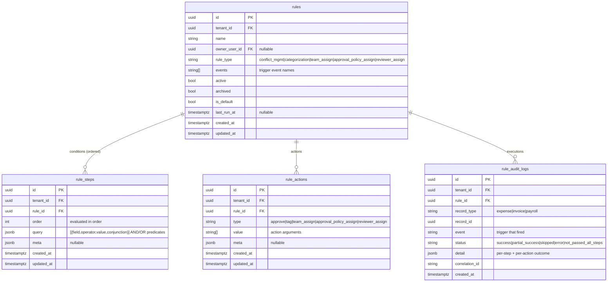
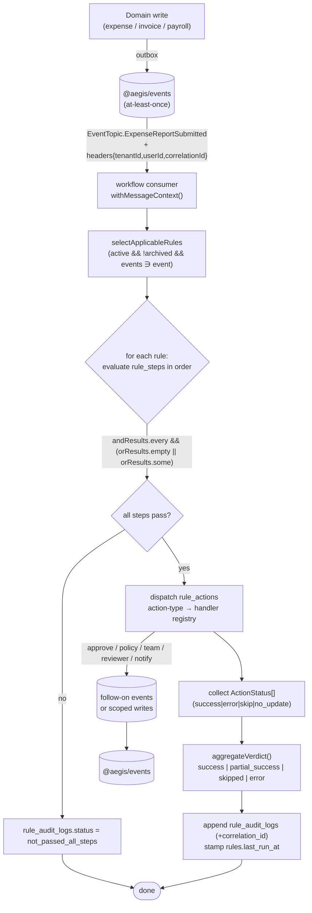

# workflow — rules-as-data engine

> Part of the [Aegis](../../SPEC.md) platform. Sibling docs:
> [user-management](user-management.md) ·
> [expense](expense.md) ·
> [invoice](invoice.md) ·
> [payroll](payroll.md) ·
> [reporting](reporting.md) ·
> [notification](notification.md) ·
> [connectors](connectors.md).
> Foundational reading: [`03-access-control-model`](../03-access-control-model.md) ·
> [`06-service-to-service`](../06-service-to-service.md) ·
> [`07-data-models` §5](../07-data-models.md#5-workflow-rules-as-data) ·
> [`02-patterns` §9](../02-patterns.md) (event bus).

---

## 1. Responsibility

**workflow** is a **rules engine, not a state machine** ([`SPEC.md`](../SPEC.md) §5). Tenants author
**rules** that say *"when this domain event fires, and these conditions hold, take these actions."*
A rule is **data**: a set of ordered **conditions** (`rule_steps`, each carrying a JSONB predicate
array) plus a set of typed **actions** (`rule_actions`). The engine itself is a fixed evaluator with
two extension registries:

- a **field → validator** registry that evaluates each predicate, and
- an **action-type → handler** registry that performs each action.

A new kind of condition or action is added by **registering a function** — never by editing the
engine core. Every rule run writes one append-only verdict to `rule_audit_logs`.

What workflow **owns**:

- The rule catalog (`rules`), its conditions (`rule_steps`), and its actions (`rule_actions`).
- The evaluation engine (predicate AND/OR semantics + numeric operators) and the two registries.
- Per-run auditing (`rule_audit_logs`) and the rule's `last_run_at` watermark.
- A consumer that subscribes to domain events on [`@aegis/events`](../02-patterns.md) and dispatches
  applicable rules.
- The PAP-style HTTP surface for authoring, activating, and dry-running rules.

What workflow **does not** do (scope, [`SPEC.md`](../SPEC.md) §10):

- **No GL-code actions and no line-item conditions.** Invoice is header-level; expense items are
  user-entered, not extracted. Rules operate on **header-level attributes** only (amount, status,
  vendor, category, owner, team, tenant config).
- It never re-derives authority for the records it touches. The event it consumes was published by
  an already-authorized write in expense/invoice/payroll; workflow asserts the propagated tenant and
  acts within it (see §8).
- It does not store the business records themselves — it reads attributes carried on the event (and,
  where needed, fetches them through a context-propagating call) and emits follow-on actions/events.

Typical rules:

| Rule intent | Trigger event | Condition (data) | Action (data) |
|---|---|---|---|
| Auto-approve small expense reports | `expense.report.submitted` | `amount < 5000` (i.e. \$50.00) | `approve` |
| Route high-value invoices to a stricter policy | `invoice.received` | `amount >= 1000000 AND status == 'received'` | `approval_policy_assign` |
| Tag travel expenses for finance review | `expense.report.submitted` | `category == 'travel'` | `tag` |
| Assign an owning team by cost driver | `invoice.received` | `vendor == 'utilities' OR amount > 250000` | `team_assign` |

---

## 2. Data model

Four tables, all tenant-scoped (`tenant_id NOT NULL` + RLS). This mirrors
[`07-data-models` §5](../07-data-models.md#5-workflow-rules-as-data) — that section is authoritative;
this doc adds the execution semantics.



### 2.1 `rules`

The rule header. `events` is a string array of trigger names (members of the `EventTopic` enum, see
§5) — one rule can fire on several events. `active` and `archived` gate selection: only
`active = true AND archived = false` rules are considered for a tenant. `is_default` flags a fallback
rule (e.g. a default `team_assign`) appended when no more specific rule matches. `owner_user_id`
records who authored it. `last_run_at` is a watermark stamped after every execution (§6).

### 2.2 `rule_steps` — conditions as data

Each step carries a JSONB **`query` array**; this is the real predicate carrier. Every entry is:

```ts
// libs/shared/types/src/workflow.shape.ts
export namespace WorkflowShape {
  export type Conjunction = 'AND' | 'OR';

  export type Operator =
    | 'equal' | 'not_equal'
    | 'less_than' | 'less_than_or_equal'
    | 'greater_than' | 'greater_than_or_equal'
    | 'between'
    | 'in' | 'not_in'
    | 'contains';

  export interface Predicate {
    field: string;          // attribute name, resolved by the validator registry (§4.1)
    operator: Operator;     // comparison
    value: unknown;         // scalar, [lo, hi] for `between`, or array for `in`
    conjunction: Conjunction; // how this predicate combines (AND vs OR bucket — §4.2)
  }
}
```

Steps are evaluated in ascending `order`. Money fields (`amount`) are compared in **integer minor
units** ([`SPEC.md`](../SPEC.md) §9) and currency-converted before comparison when the rule and the
record differ in currency. `meta` holds optional, validator-specific configuration.

### 2.3 `rule_actions` — actions as data

A typed action row. `type` is the lookup key into the handler registry (§4.4); `value` is a string
array of arguments (e.g. the tag names, the target team id, the policy id); `meta` carries structured
arguments. Allowed `type` values are **scoped — there is no GL-code action**:

| `type` | Effect | `value` / `meta` |
|---|---|---|
| `approve` | Mark the record auto-approved (subject to gating, §7) | `meta.reason` |
| `tag` | Attach classification tags | `value: string[]` |
| `team_assign` | Set the owning team | `value: [teamId]` |
| `approval_policy_assign` | Bind a stricter/looser approval policy | `value: [policyId]` |
| `reviewer_assign` | Set the record reviewer | `value: [userId]` |

### 2.4 `rule_audit_logs` — per-run verdict

Append-only (no `updated_at`). One row per `(rule, record, event)` execution. `status` is the
aggregated verdict (§4.5); `detail` is a JSONB blob recording each step's pass/fail and each action's
typed status. `correlation_id` is the propagated [`X-Correlation-Id`](../06-service-to-service.md) of
the originating business request, so a rule firing is stitched to the user action that triggered it.
`record_type` (`expense | invoice | payroll`) + `record_id` is a polymorphic reference — the engine
serves every domain without a back-reference FK per service.

---

## 3. Example rule (JSON)

A complete, persisted rule as the API returns it (the join of `rules` + `rule_steps` + `rule_actions`).
*"On invoice receipt, if the header amount is at least \$10,000 **and** the invoice references no PO,
**or** the vendor is on the watchlist, bind the executive approval policy and tag it for review."*

```json
{
  "id": "9f1c2a44-7d3e-4b21-8a0f-2c5e9b7a1d34",
  "tenant_id": "3b7e1c90-1f2a-4c8d-9e44-0a1b2c3d4e5f",
  "name": "High-value or watchlisted invoices → exec policy",
  "owner_user_id": "8c2d1e55-9a0b-4c1d-8e2f-3a4b5c6d7e8f",
  "rule_type": "approval_policy_assign",
  "events": ["invoice.received"],
  "active": true,
  "archived": false,
  "is_default": false,
  "last_run_at": "2026-06-25T22:14:07Z",
  "steps": [
    {
      "order": 0,
      "query": [
        { "field": "amount",            "operator": "greater_than_or_equal", "value": 1000000,        "conjunction": "AND" },
        { "field": "po_reference",      "operator": "equal",                 "value": null,           "conjunction": "AND" },
        { "field": "vendor",            "operator": "in",                    "value": ["acme-utilities", "globex-freight"], "conjunction": "OR" }
      ]
    }
  ],
  "actions": [
    { "type": "approval_policy_assign", "value": ["c0ffee00-1111-2222-3333-444455556666"], "meta": { "reason": "high-value-or-watchlist" } },
    { "type": "tag",                    "value": ["needs-finance-review"],                 "meta": null }
  ]
}
```

Reading the predicate: the two `AND` predicates (`amount >= $10,000` and `po_reference is null`) must
**both** hold; **or** the single `OR` predicate (vendor on the watchlist) holds on its own. The exact
boolean algebra is in §4.2. `amount` is in minor units, so `1000000` is \$10,000.00.

---

## 4. Execution engine

The engine is a fixed pipeline with two pluggable registries. The order of operations for one rule
against one record:

```
selectApplicableRules(tenant, event)
  → for each rule:  evaluateSteps(rule, record)        ── field→validator registry  (§4.1–4.3)
      → if all steps pass:  dispatchActions(rule, record) ── action-type→handler registry (§4.4)
        → aggregateVerdict(actionResults)               ── one rule_audit_logs row    (§4.5)
        → stamp rule.last_run_at
```

### 4.1 Field → validator registry

Each predicate's `field` is resolved to a **validator function** that knows how to read that attribute
off the record and compare it with the requested `operator`/`value`. The registry is a plain map; a
new condition type is one more entry.

```ts
// apps/workflow/src/engine/validators/registry.ts
import { WorkflowShape } from '@aegis/shared-types';

export interface ValidatorContext {
  record: Record<string, unknown>; // header-level attributes carried on the event
  tenantId: string;
}

export type FieldValidator = (
  ctx: ValidatorContext,
  predicate: WorkflowShape.Predicate,
) => Promise<boolean> | boolean;

const validators = new Map<string, FieldValidator>();

/** Register a validator for a condition field. Idempotent per field. */
export function registerValidator(field: string, fn: FieldValidator): void {
  validators.set(field, fn);
}

export function getValidator(field: string): FieldValidator {
  const fn = validators.get(field);
  if (!fn) throw new UnknownConditionFieldError(field); // typed → error envelope
  return fn;
}
```

Built-in validators (all header-level): `amount`, `status`, `vendor`, `category`, `owner_user_id`,
`team_id`, `po_reference`, `currency`, `tenant_config.*`. Numeric operators run through a single
`compareNumeric(operator, lhs, rhs)` helper that works in integer minor units and applies currency
conversion before comparing money across currencies:

```ts
// apps/workflow/src/engine/operators.ts
export function compareNumeric(op: WorkflowShape.Operator, lhs: bigint, rhs: bigint | [bigint, bigint]): boolean {
  switch (op) {
    case 'equal':                 return lhs === (rhs as bigint);
    case 'not_equal':             return lhs !== (rhs as bigint);
    case 'less_than':             return lhs <  (rhs as bigint);
    case 'less_than_or_equal':    return lhs <= (rhs as bigint);
    case 'greater_than':          return lhs >  (rhs as bigint);
    case 'greater_than_or_equal': return lhs >= (rhs as bigint);
    case 'between': { const [lo, hi] = rhs as [bigint, bigint]; return lhs >= lo && lhs <= hi; }
    default: throw new UnsupportedOperatorError(op);
  }
}
```

### 4.2 AND / OR semantics (the load-bearing rule)

For a step, each predicate is bucketed by its `conjunction`: predicates marked `AND` go into
`andResults`, predicates marked `OR` go into `orResults`. The step passes iff:

```ts
const pass =
  andResults.every((r) => r === true) &&
  (orResults.length === 0 || orResults.some((r) => r === true));
```

In words: **every `AND` predicate must hold, and — if any `OR` predicates exist — at least one of them
must hold.** A step with only `AND` predicates is a pure conjunction; adding any `OR` predicate
introduces a disjunctive escape hatch evaluated alongside the conjunction. This is the exact semantics
asserted in [`07-data-models` §5](../07-data-models.md#5-workflow-rules-as-data) and must not drift.

### 4.3 Step evaluation

```ts
// apps/workflow/src/engine/evaluate-step.ts
import { getValidator } from './validators/registry';
import { WorkflowShape } from '@aegis/shared-types';

export async function evaluateStep(ctx: ValidatorContext, query: WorkflowShape.Predicate[]): Promise<boolean> {
  const andResults: boolean[] = [];
  const orResults: boolean[] = [];

  for (const predicate of query) {
    const result = await getValidator(predicate.field)(ctx, predicate);
    (predicate.conjunction === 'OR' ? orResults : andResults).push(result);
  }

  return andResults.every((r) => r) && (orResults.length === 0 || orResults.some((r) => r));
}
```

A rule's **conditions pass** only when **all** of its `rule_steps` (evaluated in ascending `order`)
pass. If any step fails, the engine short-circuits, writes a `not_passed_all_steps` audit row, and
runs no actions.

### 4.4 Action-type → handler registry

The mirror of the validator registry. Each `rule_actions.type` resolves to a handler that performs the
side effect and returns a **typed status**. A new action is one registered function.

```ts
// apps/workflow/src/engine/actions/registry.ts
export type ActionStatus = 'success' | 'error' | 'skip' | 'no_update';

export interface ActionContext {
  tenantId: string;
  record: { type: 'expense' | 'invoice' | 'payroll'; id: string; attributes: Record<string, unknown> };
  rule: { id: string };
}

export type ActionHandler = (
  ctx: ActionContext,
  action: { value: string[]; meta: Record<string, unknown> | null },
) => Promise<ActionStatus>;

const handlers = new Map<string, ActionHandler>();

export function registerAction(type: string, fn: ActionHandler): void {
  handlers.set(type, fn);
}

export function getActionHandler(type: string): ActionHandler {
  const fn = handlers.get(type);
  if (!fn) throw new UnknownActionTypeError(type);
  return fn;
}
```

A handler typically emits a **follow-on event** rather than mutating another service's tables directly
— e.g. `approval_policy_assign` publishes an event the invoice service consumes — which keeps each
service the owner of its own data. `skip`/`no_update` distinguish "intentionally did nothing" from
"nothing changed."

### 4.5 Verdict aggregation

The executor collects the per-action `ActionStatus` values and folds them into one
`rule_audit_logs.status`:

| Condition over action statuses | `rule_audit_logs.status` |
|---|---|
| Steps did not all pass (actions not run) | `not_passed_all_steps` |
| All actions `success` (or `no_update`) | `success` |
| All actions `skip` | `skipped` |
| A mix of `success` and `skip`/`error` | `partial_success` |
| An unhandled exception escaped a handler | `error` |

`detail` records the per-step pass/fail and the per-action status so an operator can see exactly why a
run landed on its verdict.

```ts
// apps/workflow/src/engine/aggregate.ts
export function aggregateVerdict(actionStatuses: ActionStatus[]): RuleAuditStatus {
  if (actionStatuses.length === 0) return 'skipped';
  const allOk   = actionStatuses.every((s) => s === 'success' || s === 'no_update');
  const allSkip = actionStatuses.every((s) => s === 'skip');
  if (allOk)   return 'success';
  if (allSkip) return 'skipped';
  return 'partial_success';
}
```

---

## 5. Trigger wiring — domain events on the bus

workflow is **event-driven**. It does not poll; it subscribes to domain topics on
[`@aegis/events`](../02-patterns.md) and runs the engine when one fires. Topics are members of the
shared `EventTopic` enum (a typed contract, [`06-service-to-service` §10.1](../06-service-to-service.md)),
so producer and consumer share the payload shape.

```ts
// apps/workflow/src/consumers/index.ts
import { consume, EventEnvelope } from '@aegis/events';
import { EventTopic } from '@aegis/shared-enums';
import { runRulesForEvent } from '../engine/run';

// One consumer per domain trigger; all funnel into the engine.
consume(EventTopic.ExpenseReportSubmitted, (env: EventEnvelope) => runRulesForEvent(env));
consume(EventTopic.InvoiceReceived,        (env: EventEnvelope) => runRulesForEvent(env));
consume(EventTopic.ApprovalDecided,        (env: EventEnvelope) => runRulesForEvent(env));
```

Each consumer runs the handler inside a **reconstructed `RequestContext`** via `withMessageContext`
([`02-patterns` §3.4](../02-patterns.md)), so `tenantId`, `userId`, and `correlationId` from the
originating request are present — RLS, audit attribution, and correlation all hold across the async
hop. Delivery is **at-least-once** with **transactional-outbox** producers, so the engine's consumers
are **idempotent**: re-running the same `(rule, record, event)` is safe (a duplicate `approve` returns
`no_update`).

The engine's entry point selects the applicable rules for the event and evaluates each:

```ts
// apps/workflow/src/engine/run.ts
export async function runRulesForEvent(env: EventEnvelope): Promise<void> {
  const { tenantId, correlationId } = env.headers;
  const event = env.topic;
  const record = toRecord(env.payload); // { type, id, attributes } — header-level only

  const rules = await ruleRepo.findApplicable(tenantId, event); // active && !archived && events ∋ event
  for (const rule of rules) {
    await executeRule({ tenantId, correlationId }, rule, event, record);
  }
}
```

> The mapping of business actions to topic names (`expense.report.submitted`, `invoice.received`,
> `approval.decided`, …) is owned by the producing services and listed in
> [`06-service-to-service` §10.1](../06-service-to-service.md). workflow only references the enum
> members, never the literal strings.

---

## 6. Per-run audit and `last_run_at`

Every execution of a rule against a record writes exactly **one** `rule_audit_logs` row and stamps the
rule's `last_run_at`. This is the workflow service's contribution to the platform's
[tamper-evident audit story](../03-access-control-model.md):

- **Append-only.** `rule_audit_logs` has no `updated_at`; rows are never mutated.
- **Correlated.** The row carries `correlation_id` from the triggering request, so a HUD/SIEM can
  stitch "user submitted report → rule fired → policy reassigned → notification sent" into one trace.
- **Self-describing.** `detail` holds the per-step boolean trace and per-action status, so a `skipped`
  or `partial_success` verdict is explainable without re-running the rule.
- **Watermarked.** `last_run_at` lets operators see live rules at a glance and powers
  "stale rule" reporting.

```ts
// inside executeRule, after dispatch
await DatabaseContext.transaction(async (tx) => {
  await this.auditRepo.append(tx, {
    tenantId, ruleId: rule.id,
    recordType: record.type, recordId: record.id,
    event, status: verdict, detail, correlationId,
  });
  await this.ruleRepo.touchLastRun(tx, rule.id, new Date());
});
```

Because the audit append and the `last_run_at` update share the same transaction as the action's
outbox enqueue, an action and its audit row are atomic.

---

## 7. Gating invariants (safe auto-approval)

The `approve` action must never bypass the platform's safety checks. Before an `approve` handler
returns `success`, it asserts:

1. **Tenant matches.** The reconstructed context's `tenantId` equals the record's `tenant_id`; RLS is
   already active, this is belt-and-suspenders.
2. **No blocking status issues.** The record is in an approvable status (e.g. an invoice is `received`
   / `matched`, not `disputed`); otherwise the handler returns `skip`.
3. **Within configured limits.** If the tenant config marks the amount as exceeding an
   approval-required threshold, the rule may bind a policy (`approval_policy_assign`) but must **not**
   silently auto-approve; the handler returns `skip` and routing takes over.
4. **Maker ≠ checker is preserved.** A workflow auto-approval is attributed to the rule (a delegated
   `act` actor), and downstream approval engines still honor segregation-of-duties
   ([`SPEC.md`](../SPEC.md) §2.5).

These mirror the invariants documented for [invoice](invoice.md) and the shared approval engine; the
engine refuses to be the hole in segregation-of-duties.

---

## 8. How to add a condition or an action (TypeScript)

The whole point of rules-as-data: **extending the engine is registering a function, not editing it.**

### 8.1 Add a new condition field

Suppose tenants want to gate on the **day of week** of the triggering event.

```ts
// apps/workflow/src/engine/validators/day-of-week.validator.ts
import { registerValidator } from './registry';
import { WorkflowShape } from '@aegis/shared-types';

const DAYS = ['sun', 'mon', 'tue', 'wed', 'thu', 'fri', 'sat'] as const;

registerValidator('day_of_week', (ctx, predicate: WorkflowShape.Predicate) => {
  const today = DAYS[new Date().getUTCDay()];
  switch (predicate.operator) {
    case 'equal':  return today === predicate.value;
    case 'in':     return Array.isArray(predicate.value) && predicate.value.includes(today);
    case 'not_in': return Array.isArray(predicate.value) && !predicate.value.includes(today);
    default:       return false;
  }
});
```

Authors can now write `{ "field": "day_of_week", "operator": "in", "value": ["mon","fri"], "conjunction": "AND" }`.
No engine, migration, or schema change — the predicate is just data the new validator understands.

### 8.2 Add a new action type

Suppose tenants want a `notify_owner` action that asks the notification service to ping the record
owner.

```ts
// apps/workflow/src/engine/actions/notify-owner.action.ts
import { registerAction, ActionStatus } from './registry';
import { publish } from '@aegis/events';
import { EventTopic } from '@aegis/shared-enums';

registerAction('notify_owner', async (ctx, action): Promise<ActionStatus> => {
  const ownerId = ctx.record.attributes['owner_user_id'] as string | undefined;
  if (!ownerId) return 'skip'; // nothing to do

  await publish(EventTopic.NotificationRequested, {
    recipientUserId: ownerId,
    template: (action.meta?.template as string) ?? 'rule.owner_notice',
    context: { recordType: ctx.record.type, recordId: ctx.record.id, ruleId: ctx.rule.id },
  });
  return 'success';
});
```

The action **emits an event** rather than writing notification's tables — notification consumes the
already-authorized event and never re-derives authority
([`notification.md`](notification.md), [`SPEC.md`](../SPEC.md) §2.5). Registration happens once at
boot (the IoC container loads the `validators/` and `actions/` folders), so the verb `notify_owner`
is immediately usable in any rule.

> **Why this is safe to extend.** Validators are pure-ish predicate evaluators and handlers return a
> typed `ActionStatus`; the executor's aggregation (§4.5) and audit (§6) are unchanged regardless of
> how many validators/actions are registered. The engine's blast radius is fixed.

---

## 9. End-to-end flow



Read it as: a producer's write lands an outbox event → workflow's consumer rebuilds the request
context → applicable rules are selected for the tenant + event → each rule's steps are evaluated with
the AND/OR rule → passing rules dispatch their typed actions through the handler registry → the
per-action statuses fold into one audit verdict and the rule's `last_run_at` is stamped → actions emit
follow-on events that downstream services consume.

---

## 10. Access control

workflow rules are powerful — a bad rule could auto-approve spend or reroute approvals — so authoring
is a privileged, audited capability, and **running** rules is a system capability triggered by events,
not by users. Every HTTP route is wrapped `authenticate → authorize(permission) → handler`
([`AGENTS.md`](../AGENTS.md) §6), backed by the
[`@aegis/access-control`](../03-access-control-model.md) PDP.

### 10.1 Permission vocabulary

Dotted `domain.action[.sub]` permissions ([`03-access-control-model`](../03-access-control-model.md);
`workflow.rule.create` is already in the catalog):

| Permission | Grants |
|---|---|
| `workflow.rule.read` | List/read rules, steps, actions, and `rule_audit_logs` for the tenant. |
| `workflow.rule.create` | Author a new rule (header + steps + actions). |
| `workflow.rule.update` | Edit a rule's conditions/actions; activate/deactivate/archive. |
| `workflow.rule.delete` | Archive (soft-delete) a rule. |
| `workflow.rule.run` | Dry-run / re-run a rule against a record (the manual trigger, §10.3). |
| `workflow.audit.read` | Read the `rule_audit_logs` audit trail (may be split from `rule.read` for SoD). |

### 10.2 Who holds them

| Role | Typical grants | Rationale |
|---|---|---|
| **Workflow Administrator** (tenant-scoped custom role) | `workflow.rule.{read,create,update,delete,run}` | Owns rule authoring for the tenant. |
| **Finance Manager** | `workflow.rule.read`, `workflow.audit.read`, sometimes `workflow.rule.run` | Reviews and dry-runs rules; usually does not author them. |
| **Auditor** | `workflow.audit.read`, `workflow.rule.read` (read-only) | Inspects the audit trail; never edits or runs rules. |
| **System / event consumer** | *(no HTTP permission)* | The event-driven execution path is internal; it authorizes via the **propagated, already-verified context** on the event, not a user permission. |

ABAC refinements layer on top of RBAC ([`03-access-control-model`](../03-access-control-model.md)):

- **Tenant scope (always).** Every rule, step, action, and audit row carries `tenant_id` and is fenced
  by **Postgres RLS** (`SET LOCAL app.current_tenant`), so a rule authored in one tenant is invisible
  and inapplicable to another — defense-in-depth even if a query predicate is wrong.
- **Default-rule protection.** Editing or archiving an `is_default = true` rule requires
  `workflow.rule.update` **plus** an obligation check (PDP obligation), since defaults affect every
  record of a type.
- **Action ceilings.** A tenant policy may cap which `rule_actions.type` values a given role can author
  (e.g. only a Workflow Administrator may author `approve` or `approval_policy_assign`), evaluated by
  the PDP at create/update time.

### 10.3 Running vs. triggering

There are two ways a rule executes, with different access stories:

1. **Triggered (the normal path).** A domain event fires; the engine runs the rule under the
   reconstructed context (§5). There is **no user permission check** here because the *originating*
   write was already authorized by its own service's PEP; workflow trusts the verified propagated
   context and never re-derives authority ([`SPEC.md`](../SPEC.md) §2.5). Tenant isolation is enforced
   by RLS on every table the engine reads/writes.
2. **Manual run / dry-run (the operator path).** An administrator can re-evaluate a rule against a
   specific record or preview it without side effects. This route **does** require `workflow.rule.run`
   and is itself audited (who ran what, against which record, with what verdict) — a dry-run writes a
   `detail`-rich `rule_audit_logs` row with a `meta.dry_run = true` flag and performs no actions.

Every authoring mutation (`create`/`update`/`delete`) emits an audit entry capturing actor, tenant,
intent, and the decision/permissions-at-time-of-action, consistent with the platform's hybrid
tamper-evident audit ([`SPEC.md`](../SPEC.md) §1, audit row).

---

## 11. Relationship to other services

- **Producers** ([expense](expense.md), [invoice](invoice.md), [payroll](payroll.md)) emit the domain
  events workflow consumes; they own their records and apply workflow's follow-on events.
- **[notification](notification.md)** consumes events emitted by workflow actions (e.g. `notify_owner`)
  and never re-derives authority.
- **Shared approval engine** ([invoice](invoice.md) / [`07-data-models`](../07-data-models.md)) is the
  target of `approval_policy_assign` / `reviewer_assign` actions; `rules.assigned_by_rule_id` lineage
  on a per-job policy binding records *which* rule bound it.
- **[user-management](user-management.md)** is the PAP/PIP: it supplies the roles, permissions, and
  team/owner attributes the PDP and the validators rely on.

See [`06-service-to-service`](../06-service-to-service.md) for the propagation contract and
[`02-patterns` §9](../02-patterns.md) for the bus mechanics.
